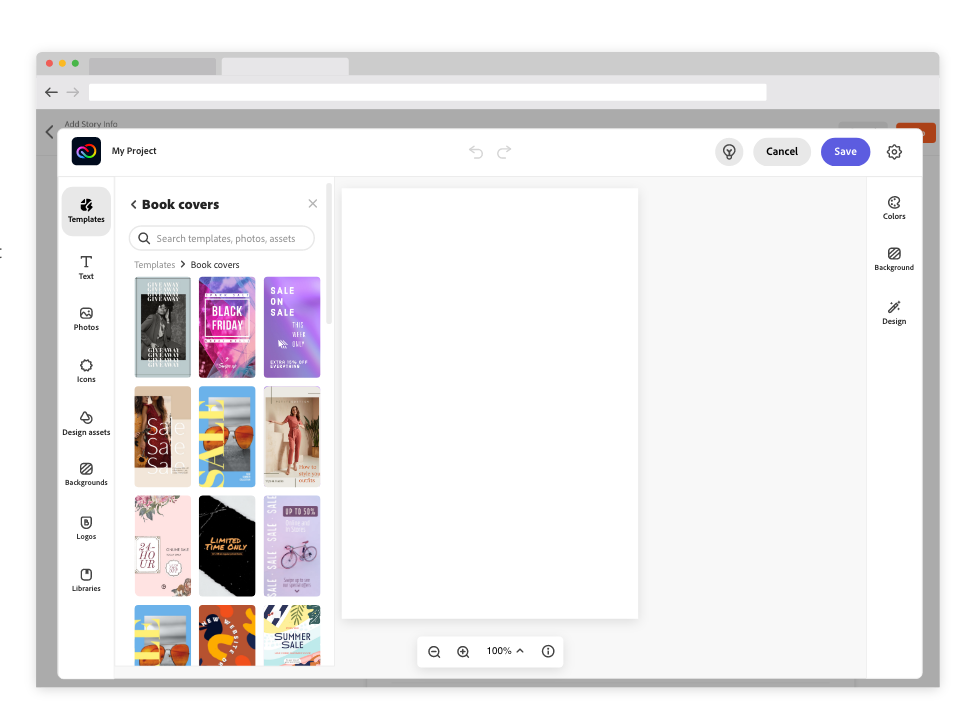

# Adobe Express Editor 

## Create and Edit Projects
Using the editor, developers can give end users an easy way to start a creative design workflow from within their own applications.

The editor component can be embedded in your web application today, by following these guides: 
* [Create a new Express project](create_project/index.md)
* [Edit existing Express project](edit_project/index.md)

If you are more interested in learning about the Quick Actions component, refer to our Quick Action [guides](../quick_actions/index.md).