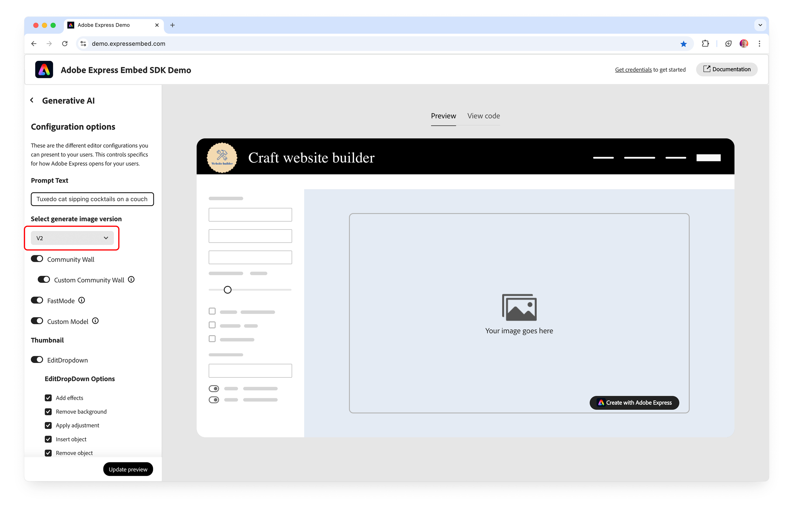

---
keywords:
  - Breaking changes
  - Added
  - Enhancements
  - What's new
  - Known Issues
  - Embed SDK changelog
  - Changelog
title: Changelog
description: All notable changes are documented in this page.
contributors:
  - https://github.com/nimithajalal
  - https://github.com/undavide
---

# Changelog

<InlineAlert variant="error" slots="header, text" />

### SDK v1 and v2 End of Life

Embed SDK v1 and v2 will reach end of life by the **end of April 2025**. After this date, they will no longer be supported. Please upgrade to the latest SDK version to avoid disruption. Refer to our [Migration Guide](../concepts/migration_v3_v4.md) for detailed instructions.

## [4.26.5] 2025-04-11

### Added

- [`CCEverywhere.BaseEditorAppConfig.analyticsData`](../../v4/shared/src/types/module/AppConfig.types/interfaces/TextToImageAppConfig.md#properties): A new optional `analyticsData` property has been added to the `AppConfig` interface. This enables host applications to supply analytics-related information to the module. In particular, clients can specify the `hostAppTrigger` value to indicate the user action within the host application that launched the module (e.g., `add-image`, `replace-image`, `gmail`, etc.).
- Added `clientCtaLocation` and `workflowLoadCompleted` optional property as part of Cancel event from the SDK.
- Various performance improvements and bug fixes.

## Documentation updates

### Added

Added new [Editor Customization](../concepts/appconfig.md) concept guide with comprehensive configuration options, examples, and decision tree.

## [4.22.9] 2025-03-12

### Added

- Added support for [Firefly Custom Models](../concepts/generate-image-v2.md#custom-firefly-models) in the new Generate Image V2 experience (Enterprise users only). When enabled, a Custom Firefly Models dropdown will appear above all other generation options, allowing you to select the desired model.

<!-- - [`CCEverywhere.EditImageAppConfig.disableSaveButtonOnExport`](../../v4/shared/src/types/module/AppConfig.types/interfaces/EditImageAppConfig.md#properties): Added two new intents in the Edit Image module, `INSERT_OBJECT` and `REMOVE_OBJECT`. Either can be preconfigured to run automatically when the module loads.
- Introduced a feature to disable the save button based on the success of the save operation. This feature is controlled by the configuration option -->

## [4.21.17] 2025-02-27

### Added

#### Unlocked new Generate Image V2 experience

- [**`CCEverywhere.TextToImageAppConfig.appVersion`**](../../v4/shared/src/types/module/AppConfig.types/interfaces/text-to-image-app-config.md#properties): Introduced a new enhanced UI in the Generate Image Module, configurable using `appVersion` in `AppConfig`.
  - When set to `"2"`, users can access the updated interface and features.
  - By default, this property is set to `"1"`, displaying the older experience.

**Key Features:**

- **Enhanced User Interface**: Redesigned with a new Carousel and Grid view.
- **Community Wall**: An endless collection of generated images with prompts for users to select from.
- **Fast Mode**: Generates images faster with lesser details, suitable for simple topics, backgrounds, illustrations, and close portraits.
- **Improved Prompt Bar**: Includes prompt suggestions for a better user experience.
- **Rich Previews**: Provides a more interactive and engaging preview experience.
- **And more!**

**Configurations available in `CCEverywhere` after enabling the new UI:**

- [`TextToImageAppConfig.thumbnailOptions`](../../v4/shared/src/types/module/AppConfig.types/interfaces/text-to-image-app-config.md#properties): Options to be displayed on the thumbnail.
- [`TextToImageAppConfig.editDropdownOptions`](../../v4/shared/src/types/module/AppConfig.types/interfaces/text-to-image-app-config.md#properties): Options for the Edit dropdown.
- [`TextToImageAppConfig.publishConfig`](../../v4/shared/src/types/module/AppConfig.types/interfaces/text-to-image-app-config.md#properties): Configuration for the Publish action.
- [`TextToImageAppConfig.fastModeConfig`](../../v4/shared/src/types/module/AppConfig.types/interfaces/text-to-image-app-config.md#properties): Configuration for enabling or disabling fast mode default state.
- [`TextToImageAppConfig.featureConfig`](../../v4/shared/src/types/module/AppConfig.types/interfaces/text-to-image-app-config.md#properties): Configuration for enabling or disabling specific features.

#### Concept guide for Generate Image V2

Added a new [Concept Guide](../concepts/generate-image-v2.md) for Generate Image V2, detailing all the features of the new version and providing examples on how to enable each feature.

#### Demo app updates for Generate Image V2

Updated the [Demo App](https://demo.expressembed.com/) to showcase the Generate Image V2 feature. To use the new feature:

- Navigate to **Generative** -> **Generate image** -> **Next**
- In the Configuration options, Select generate image version as V2.

  

- Select all the options you need and click **Create with Adobe Express**

#### Support for `pdfPrint`

- Added support for `pdfPrint` in `allowedExportFileTypes` to `appConfig` in addition to the existing `allowedFileTypes`.

### Bug Fixes

Fixed loader CSS for frictionless experience.

## [4.20.46] 2025-02-18

### Bug Fixes

- Fixed the support for Video `blob` and `base64` asset inputs for the [`Editor.createWithAsset()`](../../v4/sdk/src/workflows/3p/EditorWorkflow/classes/editor-workflow.md#createwithasset) method.
- **Temporary Revert**: we are temporarily removing support for presigned [`URL`](../../v4/shared/src/types/Asset.types/type-aliases/url-asset.md) as the [`datatype`](../../v4/shared/src/types/Asset.types/enumerations/asset-data-type.md) for a video [`asset`](../../v4/shared/src/types/Asset.types/interfaces/asset-base.md) in `createWithAsset()` due to an internal issue. We will update the changelog once a fix is implemented.

## [4.19.22] 2025-01-31

### Enhancements

- Added a new [Embed SDK Developer Journey](../index.md#embed-sdk-developer-journey) map to help developers navigate the resources available at different stages of their integration.
- Added a new [Troubleshooting](../troubleshooting/express-unavailable-error.md) guide to help developers fix the "Adobe Express is Unavailable" error, also covering the "Missing Referrer Header" error and the proper use of wildcards for domain's allow-listing.
- Various small improvements and fixes across the documentation.

### Added

- [`CCEverywhere.ExportConfig.EditFurtherIntent`](../../v4/shared/src/types/ExportConfig.types/enumerations/edit-further-intent.md): Added two new intents in the Edit Image module, `INSERT_OBJECT` and `REMOVE_OBJECT`. Either can be preconfigured to run automatically when the module loads.
- Added coverage for the [Asset](../../v4/shared/src/types/Asset.types/index.md) type.
- Various performance improvements and bug fixes.

## [4.18.14] 2025-01-09

### Added

- [`CCEverywhere.TextToImagePublishParams.prompt`](../../v4/shared/src/types/PublishParams.types/interfaces/text-to-image-publish-params.md): in a `createImageFromText()` module, the prompt used to generate the image is now available in the `onPublish` callback.

## [4.17.33] 2024-12-16

### Enhancements

- Added a comprehensive [error code guide](../concepts/error-handling.md) for managing errors, ensuring the host application developers and end-users can navigate issues efficiently and effectively.

### Added

- [`CCEverywhere.appConfig.imageDimensions`](../../v4/shared/src/types/module/AppConfig.types/interfaces/text-to-image-app-config.md#properties): in a `createImageFromText()` module, the aspect ratio with which assets are generated and exported can be passed as a parameter via `appConfig`.

## [4.16.11] - 2024-11-18

### Enhancements

- [`CCEverywhere.appConfig.imageStyleReference`](../../v4/shared/src/types/module/AppConfig.types/interfaces/text-to-image-app-config.md#properties): in a `createImageFromText()` module, assets can be passed as style reference from host application via `appConfig`.
- [`CCEverywhere.appConfig.imageCompositionReference`](../../v4/shared/src/types/module/AppConfig.types/interfaces/text-to-image-app-config.md#properties): in a `createImageFromText()` module, assets can be passed as composition reference from host application via `appConfig`.

<!-- ### Added

- Support for Safari on iOS. The SDK will no longer throw an unsupported error when accessed via Safari on iOS. -->

### Bug Fixes

- Video Quick Action: Animate from Audio Iframe was not allowing microphone access.

## [4.15.19] - 2024-10-09

### Enhancements

- Redesigned the entire [SDK Reference](../../v4/index.md) section, providing full APIs coverage.
- Added a V3 to V4 [Migration Guide](../concepts/migration-v3-v4.md).

### Added

- `CCEverywhere.ExportConfig.ENABLED_BUTTON`: Added a new style in export option, any button can be made always enabled from the launch of the iframe by passing `uiType:enabled-button`
- `CCEverywhere.ExportConfig.DOWNLOAD_ALL`: Added Export options target as `"Download_all"` to download all the images, applicable only for text to image.
- `CCEverywhere.createImageFromText.appConfig.imageDimensions`: In the `appConfig` of `createImageFromText`, included `imageDimensions` to define the dimensions for the images users can generate. This parameter accepts the size in pixels and the corresponding aspect ratio. When specified, users will be limited to generating images to the provided aspect ratio.

## [4.14.23] - 2024-09-23

### Enhancements

- Redesigned the Information Architecture, to make it easier for developers to find the information they need.
- Updated the [Submission and Review](../review/index.md) and [Quickstart](../quickstart/index.md) Guides.
- Added a new [Tutorials](../tutorials/index.md) section with two tutorials.

## [4.14.23] - 2024-09-05

### Added

- Added support for Blobs to the list of supported data types for an Asset in `DocConfig`. Clients can now pass a blob or file object in place of `base64` or `url`.

## [4.4.15] - 2024-04-02

### Added

- `CCEverywhere.terminate`: We have added the terminate API to SDK v4. Once it is called, performing any action should fail with error SDK_NOT_INITIALIZED unless SDK is initialized again.
- Added [z-index](../../reference/types/index.md#containerconfig) support for the root container.

## [4.2.30] - 2024-03-14

### Breaking Changes

- `callbacks` are no longer set in the `initialize` method
- Every API now accepts `appConfig`. Callbacks are now part of `appConfig`.

## [4.2.29] - 2024-03-14

### Breaking Changes

- `callbacks` are now set in the `initialize` method
- `ExportOptions` has changed and new "continue editing" buttons are available
- `ccEverywhere.createDesign()` has now been broken into `ccEverywhere.editor.create()` and `ccEverywhere.editor.createWithAsset()`
- `ccEverywhere.editDesign()` is now `ccEverywhere.editor.edit()`
- `ccEverywhere.openQuickAction()` is now `ccEverywhere.quickAction.convertToJPEG()` (each of the different actions has its own API now)

### Added

- We have added modules to the SDK. Modules are contextual mini-editing experiences. We currently offer:
  - Generate Image module: `ccEverywhere.module.createImageFromText()`
  - Edit Image module: `ccEverywhere.module.editImage()`
- Delayed login is now available.

## [3.10.13] - 2023-11-06

### Enhancements

1. [CreateInputParams.canvasSize](../../reference/types/index.md#canvasaspectid): Added support for new layouts.
   - NoteHeaderImage
   - LineAdSmall
   - LineAdSquare
   - LineAdVertical
   - LineRichMenuLarge
   - LineRichMenuSmall
   - LineRichMessage
2. [CreateInputParams.templateType](../../reference/types/index.md#templatetype): Added support for some template types.
   - note-header-image
   - line-ad-small
   - line-ad-square
   - line-ad-vertical
   - line-rich-menu-large
   - line-rich-menu-small
   - line-rich-message

### Added

<!-- - Button component: To assist developers with adhering to brand guidelines, we have introduced a web component (button with icon + configurable label). -->

- Generate QR Code: This new image quick action allows users to create custom QR code for any given URL. The quick action id for this is 'generate-qr-code'. We support Save to Host and Download options for the asset.
- Caption With Video: This new video quick action allows users to add captions to their videos. Users can upload videos with audio tracks and captions will be generated by Adobe Express. Does not work on videos which do not have any voiceover. The quick action id for this is 'caption-video'.

## [3.8.11] - 2023-08-25

### Enhancements

- `ConfigParams.skipBrowserSupportCheck`: By default, this property is set to false and users will encounter an "Unsupported Browser" page when launching a design flow. When this property is configured to true and the browser is not supported, calling `initialize()` will **not** result in an error.

## [3.7.14] - 2023-08-15

### Added

- ExportButton.accent: The variant option 'cta' has been replaced with 'accent'. Both 'cta' and 'accent' work the same but the support for 'cta' is deprecated as per Spectrum guidelines.
- We will not support the following two quick actions: Reverse Video and Change Speed
- Added a new video quick action: Animate From Audio. This allows users to create a character animation by choosing a character from the given list of characters, adding a backdrop and then recording a speech.

### Breaking Changes

- ExportButton.id is now a required property on native buttons

## [3.6.16] - 2023-08-06

### Enhancements

- CreateOutputParams.allowedFileTypes: We now support the following four file types: image/png, image/jpeg, application/pdf and video/mp4. Client apps will now be able to restrict the export options shown to end users by passing the relevant file type in allowedFileTypes property. This is also relevant of mixed media.
- EditOutputParams.allowedFileTypes: We now support the following four file types: image/png, image/jpeg, application/pdf and video/mp4. Client apps will now be able to restrict the export options shown to end users by passing the relevant file type in allowedFileTypes property. This is also relevant of mixed media.

### Added

- Video Export: Users will now be able to export assets as MP4 files. In order to do this, there must be a video asset added in the canvas to see the option in the export options dropdown for custom buttons. Pass video/mp4 option in allowedFileTypes.
- Mixed Media Support: Users will be able to download mixed media assets. In case they have added an image in one page and video in another, they will now be able to see JPG + MP4 or PNG + MP4 in the export options dropdown for custom buttons.Pass image/jpeg, image/png and video/mp4 option in allowedFileTypes.

## [2.0.8] - 2023-02-02

### Added

- Browser compatibility checker: Now the SDK will check for browser compatibility during initialization.
- New default method `terminate()` allows you to terminate an active instance of CCEverywhere. This method will return false if there is no active CCEverywhere instance.
- Google YOLO will work for both the full editor and quick actions. If the user is not signed in, the YOLO prompt will be shown to users. If the user has multiple Google accounts, they can select from a list.
  - If the user has an Adobe account associated with Google ID, the user is signed in.
  - If the user does not have an Adobe account associated with the Google ID, a new Adobe account will be created for the user using their Google ID.
  - User can choose to dismiss the YOLO modal and continue with delayed login.
  - Redirect URI is no longer being used.

### Breaking Changes

- `initialize()` method is now async. This is the main API used for initializing the SDK. It will return a promise with a CCEverywhere object which can be used to call other APIs in the SDK.

## [1.5.4] - 2022-12-16

### Added

- Enabled "Logged Out" experience for image and video quick actions

### Bug Fixes

- Fixed the problem with the editor iFrame not auto-closing post publish (for the scenario when the editor is launched from image quick actions via "Customize in Express" workflow)
- Fixed an issue related to pre-caching of resources for the editor

### Known Issues

- Currently, the "Customize in Express" workflow from the "Remove Background" image quick action is not working. The fix will be deployed in a future version.

## [1.4.10] - 2022-11-14

### Added

- Delayed Login experience in the full editor.
  - With this release of the SDK, we are enabling users to launch the full editor without having to log in first. The user can sign in 1) once the Adobe Express iFrame launches, or 2) continue to work on the document until they decide to publish/save -- at which point they would be prompted to sign in. The delayed login experience is available out-of-the-box with this version of the SDK and developers do not have to make any changes to enable this experience.
- "Create from Image" workflow.
  - Users can now create from an image instead of a blank canvas. This workflow works with the delayed login experience. To use this workflow, partners will need to enable the host application to use it.

## [1.3.11] - 2022-08-24

### Added

- SDK bundled for browsers, hosted on Adobe CDN.
- Welcome Screen before the Single User Sign In screen appears.
- Ability to log out from the full editor loaded in the iFrame.

### Bug Fixes

- Signing-in from the welcome screen, subsequent to a sign-out, successfully launches the full editor iFrame.

### Known Issues

- Opening asset in the full editor, subsequent to performing an image quick action, and saving the asset doesn't close the iFrame automatically. This will be fixed in the next release.
- When a quick action is performed and the resulting asset is opened in a full editor: after the user makes changes and saves it the asset is saved outside of the designated project folder in the user's Adobe Express account.

## [1.1.0] - 2022-04-09

### Enhancements

- Scrim view background color is now configurable.
- Redirect URI can now be provided as input during initialization.
- `appVersion` and `platformCategory` are now optional arguments.
- In dev environments, SDK is now able to read and override the base URL from the client's window object.
- API provided to easily identify the SDK version running in browser or host apps.
- Update Content will now be displayed in 100% of the area of the client div, instead of appearing with scrollbars.
- Adobe IMS related enhancements.

### Bug Fixes

- When `parentElementId` is supplied, the dimensions of the parent container display Scrim view instead of Viewport.
- QA loader screen can be now set to the darkest theme.
- iFrame now loads successfully on Safari even if pop-up blocker settings are enabled.
- Enhanced error handling for failure to launch iFrame for quick action and full editor.
- Full editor iFrame now honoring 0 border radius value.
