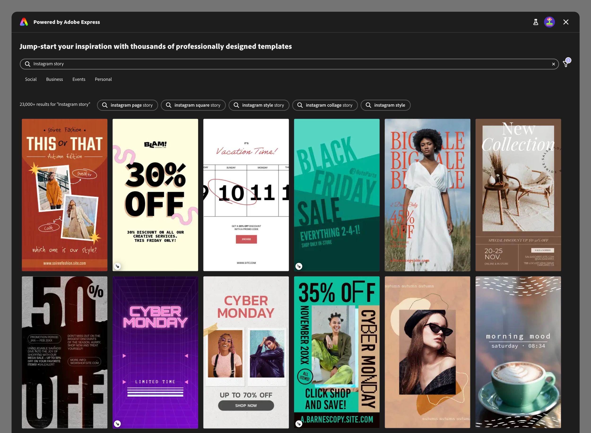
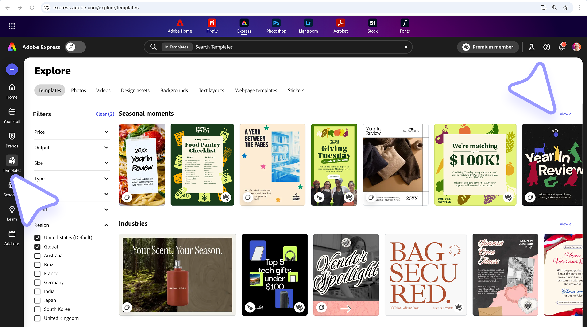
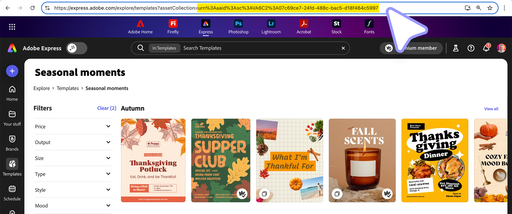
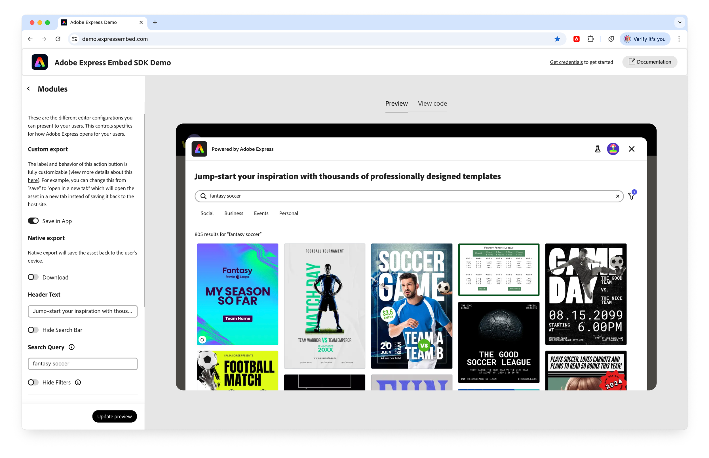

---
keywords:
- Adobe Express
- Embed SDK
- Template Browser
- Template Editor
- Collection ID
- Collection URN
title: Template Browser
description: Template Browser
contributors:
- https://github.com/undavide
---

# Template Browser

The Template Browser is a feature in the Adobe Express Embed SDK designed for template discovery and editing.

It allows users to browse through a wide array of templates, find one that suits their needs, and then open it in the full editor for customization. This workflow is ideal for integrations where users may not have a specific template in mind and need inspiration or guidance.



## How the Template Browser Works

The Template Browser is a [Workflow](../../v4/sdk/src/workflows/3p/module-workflow/classes/module-workflow.md) that launches a customizable browsing experience. Users can explore template _collections_, use search and filtering capabilities to narrow down their options, and select a template to edit. The entry point for this module is the [`startFromContent()`](../../v4/sdk/src/workflows/3p/module-workflow/classes/module-workflow.md#startfromcontent) method.

```js
await import("https://cc-embed.adobe.com/sdk/v4/CCEverywhere.js");

const { module } = await window.CCEverywhere.initialize(
  { clientId: "your-client-id", appName: "your-app-name" },
  {}
);

module.startFromContent({ /* ... */ });
```

## Understanding Collections

Collections are organizational **structures that group related templates together**, forming the foundation of the Template Browser experience. Understanding how collections work is essential to effectively using the Template Browser.

### Collections vs. Templates

A **collection** is a container that holds multiple templates, organized around a theme, use case, or design style. Collections enable curated experiences that guide users toward specific types of content. For example, a "Business Cards" collection might contain templates for different industries, layouts, and color schemes—all unified by the common purpose of creating business cards.

A **template** is an individual design file within a collection. Each template represents a complete, editable design that users can customize. When users select a template from the Template Browser, they're choosing a specific template from within a collection.

<InlineAlert slots="header, text" variant="info" />

Template editing vs. Collection browsing

If you need to **directly open a specific, known template** and not let users browse a collection, use the [`editor.createWithTemplate()`](../../v4/sdk/src/workflows/3p/editor-workflow/classes/editor-workflow.md#createwithtemplate) API instead of the Template Browser experience.

### Collection Identifiers (URNs)

The Collection ID should be provided as a URN, i.e., a long string like the following:

```text
urn:aaid:sc:VA6C2:34756608-9fa0-4fdc-80b0-65e17ffb29c8
```

Collections fed to the Template Browser are those that are publicly available in Adobe Express. To get a Collection ID, follow the instructions below:

1. **Click the Templates button** in the left toolbar.
2. **Find the collection you want** to use—using either Filters or Search.
3. On the righthand side, opposite to the Collection name, **click the "View all" link**.



4. You'll be redirected to the Collection details page.
5. **Copy the last part of the page's URL**; the URN is the string that starts with `urn`.



6. This is the URI-encoded URN; in order to use it, **you need to decode it**. Either **manually replace** all the `%3A` instances with a `:` in the string, or **use the JavaScript function** `decodeURIComponent()`; for example, in the Browser's console.

```js
decodeURIComponent("urn%3Aaaid%3Asc%3AVA6C2%3A34756608-9fa0-4fdc-80b0-65e17ffb29c8");
// "urn:aaid:sc:VA6C2:34756608-9fa0-4fdc-80b0-65e17ffb29c8"
```

### Public and Custom Collections

**Public collections** are those made available by Adobe Express to all users. These collections represent the broad library of templates accessible through the Adobe Express platform.

If you wish to create your own **Custom collections**, to control exactly which templates users see and allowing for brand-specific experiences or industry-focused content, please reach out to your Adobe point of contact. They will be able to help you create the collections and provide you with the respective URNs.

### Hierarchical Collection Structures

Custom collections can have a **parent** (root) collection, which is the **one containing all other collections**. For example, you may have a Business Cards root collection, which contains themed Business Card collections (square, landscape, etc.).

The parent collection is configured in the [`rootCollectionId`](../../v4/shared/src/types/browse-search-config-types/interfaces/browse-search-base-config.md#properties) property.

## Configuring the Template Browser

The Template Browser introduces several new feature configurations to the [`appConfig.contentBrowseConfig`](../../v4/shared/src/types/module/app-config-types/interfaces/content-browse-config.md) object. They can be independently enabled or disabled to customize the module according to your needs.

```js
// ...

const appConfig = {
  contentBrowseConfig: { // 👈 Configure the Template Browser here
    /* ... */
  },
};

module.startFromContent(appConfig);
```

All the features discussed below are properties of the `contentBrowseConfig` object.

### Collection Configuration

The collection to pre-populate the Template Browser with is configured in the [`categoriesConfig`](../../v4/shared/src/types/module/app-config-types/interfaces/content-browse-config.md#properties) array. It contains one object, with a `category` property (always equal to the `"templates"` string) and a `collectionId` with the URN of the collection.

```js
const appConfig = {
  contentBrowseConfig: { // 👈 Configure the Template Browser experience
    categoriesConfig: [
      {
        category: "templates",           // 👈 Always "templates"
        collectionId: "urn:aaid:sc:...", // 👈 The URN of the collection
      },
    ],
  },
};
```

Additionally, a [`collectionItemsSortOrder`](../../v4/shared/src/types/browse-search-config-types/interfaces/browse-search-base-config.md#properties) can be provided to sort the items in the collection.

### Search and Discovery Features

The Template Browser includes search functionality that helps users find templates matching their needs. The [`searchQuery`](../../v4/shared/src/types/module/app-config-types/interfaces/content-browse-config.md#properties) property allows you to pre-populate the search field with terms relevant to your integration's context. For example, if your application focuses on social media content creation, you might pre-populate with "Instagram story" to immediately show relevant templates.

**Search suggestions**, configured via [`shortcutPillTerms`](../../v4/shared/src/types/module/app-config-types/interfaces/content-browse-config.md#properties), provide quick-access buttons below the search bar. These shortcuts enable users to quickly filter templates by common categories or themes without having to type.

Additionally, you can **hide the search bar and filters** via the [`hideSearchBar`](../../v4/shared/src/types/module/app-config-types/interfaces/content-browse-config.md#properties) and [`hideFilters`](../../v4/shared/src/types/module/app-config-types/interfaces/content-browse-config.md#properties) properties.

```js
const appConfig = {
  contentBrowseConfig: {
    searchQuery: "Instagram story",
    shortcutPillTerms: ["Social", "Business", "Events", "Personal"],
    hideSearchBar: false,  // false by default
    hideFilters:   false,  // false by default
  },
};
```

<InlineAlert slots="text" variant="warning" />

When a [Collection ID](#collection-configuration) is used, `shortcutPillTerms` are disabled. When a specific collection is configured, these shortcut pills are disabled because the collection itself already provides focused content, making additional filtering redundant.

### Customization and Branding

Finally, you can customize the text to be displayed in the header of the module via the [`headerText`](../../v4/shared/src/types/module/app-config-types/interfaces/content-browse-config.md#properties) property.

```js
const appConfig = {
  contentBrowseConfig: {
    headerText: "Browse our Business Card templates",
  },
};
```

## When to Use the Template Browser

The Template Browser is best suited for scenarios where content discovery is a primary goal. Use this module when you want to:

- Allow users to explore a wide range of design options without a predetermined choice.
- Provide inspiration and creative starting points for projects.
- Offer curated collections tailored to specific themes, industries, or branding guidelines.

## Related Resources

- [Adobe Express Embed SDK Demo App](https://demo.expressembed.com/)
- [API References](../../v4/sdk/src/workflows/3p/module-workflow/classes/module-workflow.md#startfromcontent)

[](https://demo.expressembed.com/)
