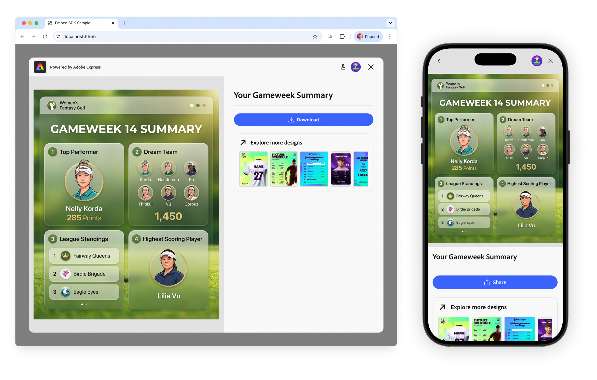
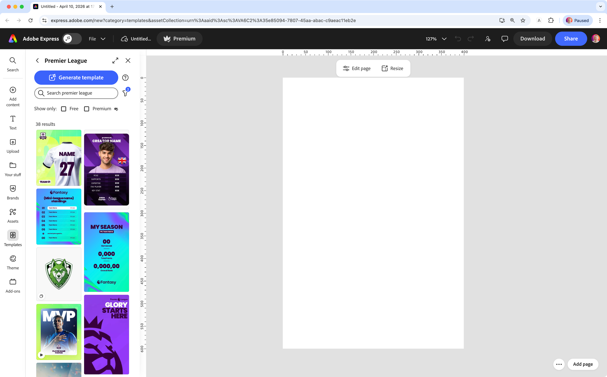
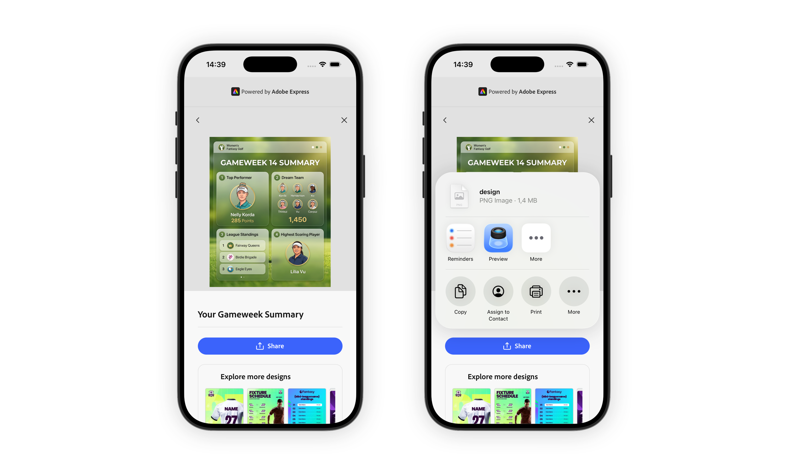

---
keywords:
  - Adobe Express
  - Embed SDK
  - Design Viewer
  - View Design
  - Preview Thumbnails
  - Asset
title: Design Viewer
description: Learn how to use the Design Viewer module to let users preview and edit image-based designs directly within your application.
contributors:
  - https://github.com/undavide
---

# Design Viewer

The Design Viewer module lets users view an image-based design inside an Adobe Express-powered experience embedded in your application.

From the viewer, users can **Download** the design (Desktop) or **Share** it (Mobile) via iOS/Android native widgets. Additionally, users can **select or browse templates** of similar designs from a collection or a list of explicit design IDs. It's a powerful way to engage users with your brand's designs while encouraging them to discover and remix more of your templates.



## How the Design Viewer Works

The Design Viewer is a [Workflow](../../v4/sdk/src/workflows/3p/module-workflow/classes/module-workflow.md) that loads a given image asset into a viewer experience. The entry point is the [`module.viewDesign()`](../../v4/sdk/src/workflows/3p/module-workflow/classes/module-workflow.md) method.

```javascript-data-line="8"
await import("https://cc-embed.adobe.com/sdk/v4/CCEverywhere.js");

const { module } = await window.CCEverywhere.initialize(
  { clientId: "your-client-id", appName: "your-app-name" },
  {}
);

module.viewDesign(docConfig, appConfig, exportConfig, containerConfig);
```

## Configuration options

### The asset to view

The `docConfig` object, of type [`DesignViewerDocConfig`](../../v4/shared/src/types/module/doc-config-types/interfaces/design-viewer-doc-config.md), is the only **required** parameter and contains a single property: the [`Asset`](../../v4/shared/src/types/asset-types/type-aliases/asset.md) to view—a union type supporting three different data representations:

| dataType   | value                            | When to use                         |
| ---------- | -------------------------------- | ----------------------------------- |
| `"base64"` | Base64-encoded string (data URL) | Local images converted client-side  |
| `"url"`    | Presigned URL string             | Images hosted on a remote server    |
| `"blob"`   | `Blob` / `File` object           | Files from an `<input type="file">` |

The `type` property identifies the kind of media—for the Design Viewer—always use `"image"`.

<CodeBlock slots="heading, code" repeat="3" languages="base64, url, blob"/>

#### Base64

```javascript
// Base64 asset (most common for locally-sourced images)
const docConfig = {
  asset: {
    type: "image",
    dataType: "base64", // 👈
    data: "<base64-encoded-string>",
  },
};

module.viewDesign(docConfig);
```

#### URL

```javascript
// URL asset (image hosted on a server)
const docConfig = {
  asset: {
    type: "image",
    dataType: "url", // 👈
    data: "https://your-server.com/path/to/image.png",
  },
};

module.viewDesign(docConfig);
```

#### Blob

```javascript
// Blob asset (file from an `<input type="file">`)
const docConfig = {
  asset: {
    type: "image",
    dataType: "blob", // 👈
    data: new File([], "image.png"),
  },
};
```

If you have a local image URL—for example, resolved by a bundler like Vite—you can use the `FileReader` API to **convert it to a Base64** data URL before passing it to the SDK.

<Details slots="list" repeat="1" summary="Expand to see the code"/>

```javascript
// Convert a local image URL to a Base64 data URL
function readFileAsDataUrl(file) {
  return new Promise((resolve, reject) => {
    const reader = new FileReader();
    reader.onload = () => resolve(reader.result);
    reader.onerror = reject;
    reader.readAsDataURL(file);
  });
}

const dataUrl = await readFileAsDataUrl(file);
```

### Viewer customization

The `appConfig` object, of type [`DesignViewerAppConfig`](../../v4/shared/src/types/module/app-config-types/interfaces/design-viewer-app-config.md), controls the viewer's appearance and the optional preview thumbnails sidebar. All properties are optional.

#### `appConfig.designTitle`

Sets the title text displayed in the viewer header.

- **Type**: `string`
- **Default**: `""` (empty string)
- **Use case**: Identify the design by name so users understand what they are viewing.

```javascript-data-line="2"
const appConfig = {
  designTitle: "Your Gameweek Summary", // 👈
};

module.viewDesign(docConfig, appConfig);
```

#### `appConfig.previewThumbnails`

Configures a sidebar panel showing related design templates. Users can click a thumbnail to load the template in the Full Editor.

- **Type**: [`PreviewThumbnailsConfig`](../../v4/shared/src/types/module/app-config-types/interfaces/preview-thumbnails-config.md)
- **Default**: `undefined` (none)
- **Use case**: Offer a curated gallery of related templates or designs alongside the viewed asset.

There are two ways to populate the thumbnails:

**1. From a collection**: provide a [`CollectionConfig`](../../v4/shared/src/types/module/app-config-types/interfaces/collection-config.md) with a collection URN and an optional count:

```javascript
const appConfig = {
  previewThumbnails: {
    collectionConfig: {
      collectionId: "urn:aaid:sc:VA6C2:e0f161bf-3d73-4ad8-ba20-20722638c625", // 👈
      count: 7, // 👈 defaults to 5; must be greater than 0 or throws an INVALID_SIZE_VALUE error
    },
  },
};
```

The Collection URN is what the **Explore more designs** link on the Design Viewer sidebar will point to, opening Adobe Express in a new Browser tab, with the collection pre-loaded.



**2. From explicit design URNs**: provide an array of known design URNs. When `previewIds` is set, it takes precedence over `collectionConfig`.

```javascript-data-line="4-6"
const appConfig = {
  previewThumbnails: {
    previewIds: [
      "urn:aaid:sc:VA6C2:83b28917-ef22-5771-be35-d4622d72ff4d",
      "urn:aaid:sc:VA6C2:83b28917-ef22-5771-be35-d4622d72ff4d",
      "urn:aaid:sc:VA6C2:ec55e16c-501b-5ee3-953b-68ffef230801"
    ],
  },
};
```

<InlineAlert slots="text" variant="info" />

For instructions on how to obtain a Collection URN, refer to the [Template Browser](./template-browser.md#collection-identifiers-urns) guide.

#### `callbacks`

These are the usual callback functions to respond to viewer events. In particular, `onPublish` is going to be useful to handle the asset's sharing on Mobile devices, as explained in the [Mobile sharing with the Web Share API](#mobile-sharing-with-the-web-share-api) section.

- **Type**: [`Callbacks`](../../v4/shared/src/types/callbacks-types/interfaces/callbacks.md)
- **Default**: `undefined`
- **Use case**: Handle asset publishing, cancellation, and errors in your application's workflow.

```javascript
const appConfig = {
  callbacks: {
    onPublish: (intent, publishParams) => {
      console.log("User published:", publishParams);
    },
    onCancel: () => {
      console.log("User cancelled.");
    },
    onError: (err) => {
      console.error("Error:", err.toString());
    },
  },
};
```

## Desktop and Mobile CTAs

The Design Viewer provides two CTAs for desktop and mobile devices:

- **Download**: allows users to download the design as an image file.
- **Share**: allows users to share the design via iOS/Android native widgets.

While on Desktop the download action is immediate, on Mobile devices you would need to handle the asset's sharing via iOS/Android native widgets.

### Mobile sharing with the Web Share API

On mobile, the Design Viewer **Share** control does not open the system share sheet by itself. Your app should use the browser **[Web Share API](https://developer.mozilla.org/en-US/docs/Web/API/Web_Share_API)** (`navigator.share` / `navigator.canShare`) so the user gets the native iOS or Android share UI (Messages, Mail, installed apps, and so on).



Wire this up in the **`onPublish`** callback from [`callbacks`](#callbacks). The SDK passes publish parameters that include the exported asset; when the asset is image data as a Base64 **data URL** (see `dataType: "base64"` in your document config), convert it to a [`File`](https://developer.mozilla.org/en-US/docs/Web/API/File) and pass it to `navigator.share({ files: [file] })`.

Restrict sharing to the **Share** CTA by checking `publishParams.exportButtonId === "shareToHostApp"` before calling `navigator.share`. In theory this guard is optional: on **desktop**, **Download** does not invoke `onPublish`—the image is saved directly and the Design Viewer **stays open**—so that path never hits your share logic. Keeping the `exportButtonId` check still makes the intent obvious and protects you if other publish flows ever call `onPublish` with a different button id.

```javascript-data-line="19,39"
// Convert a base64 data URL to a File object for the Web Share API
function dataUrlToFile(dataUrl, filename = "gameweek-summary.png") {
  const [header, base64] = dataUrl.split(",");
  const mime = header.match(/:(.*?);/)[1];
  const bytes = atob(base64);
  const buffer = new Uint8Array(bytes.length);
  for (let i = 0; i < bytes.length; i++) {
    buffer[i] = bytes.charCodeAt(i);
  }
  return new File([buffer], filename, { type: mime });
}

// Share the published image using the native Share sheet (Web Share API)
async function shareImage(asset) {
  const file = dataUrlToFile(asset.data);

  if (navigator.canShare && navigator.canShare({ files: [file] })) {
    try {
      await navigator.share({ files: [file] });
      console.log("Shared successfully");
    } catch (err) {
      if (err.name !== "AbortError") {
        console.error("Share failed:", err);
      }
    }
  } else {
    console.warn("Web Share API file sharing not supported");
  }
}

// Callbacks to be used when creating or editing a document
const callbacks = {
  onCancel: () => {},
  onPublish: (intent, publishParams) => {
    console.log("publishParams", publishParams);
    if (publishParams.exportButtonId !== "shareToHostApp") {
      return;
    }
    shareImage(publishParams.asset[0]);
  },
  onError: (err) => {
    console.error("Error!", err.toString());
  },
};
```

## Complete Example

The following example mirrors the pattern from the [Embed SDK View Design sample application](https://github.com/AdobeDocs/embed-sdk-samples). It accepts either a pre-loaded image or a user-uploaded file, converts it to Base64, and launches the Design Viewer. It also includes the [Web Share API](#mobile-sharing-with-the-web-share-api) helpers and an `onPublish` handler that shares only when `publishParams.exportButtonId` is `"shareToHostApp"` (the **Share** control on mobile).

<CodeBlock slots="heading, code" repeat="2" languages="main.js, index.html"/>

#### main.js

```javascript
await import("https://cc-embed.adobe.com/sdk/v4/CCEverywhere.js");

const { module } = await window.CCEverywhere.initialize(
  { clientId: "your-client-id", appName: "your-app-name" },
  { loginMode: "delayed" }
);

function dataUrlToFile(dataUrl, filename = "design.png") {
  const [header, base64] = dataUrl.split(",");
  const mime = header.match(/:(.*?);/)[1];
  const bytes = atob(base64);
  const buffer = new Uint8Array(bytes.length);
  for (let i = 0; i < bytes.length; i++) {
    buffer[i] = bytes.charCodeAt(i);
  }
  return new File([buffer], filename, { type: mime });
}

async function shareImage(asset) {
  const file = dataUrlToFile(asset.data);

  if (navigator.canShare && navigator.canShare({ files: [file] })) {
    try {
      await navigator.share({ files: [file] });
      console.log("Shared successfully");
    } catch (err) {
      if (err.name !== "AbortError") {
        console.error("Share failed:", err);
      }
    }
  } else {
    console.warn("Web Share API file sharing not supported");
  }
}

const appConfig = {
  designTitle: "Your Gameweek Summary",
  previewThumbnails: {
    collectionConfig: {
      collectionId: "urn:aaid:sc:VA6C2:35e85094-7807-45aa-abac-c9aeac11eb2e",
      count: 7,
    },
  },
  callbacks: {
    onPublish: (intent, publishParams) => {
      console.log("Published:", publishParams);
      if (publishParams.exportButtonId !== "shareToHostApp") {
        return;
      }
      shareImage(publishParams.asset[0]);
    },
    onError: (err) => {
      console.error("Error:", err.toString());
    },
  },
};

function launchViewDesign(dataUrl) {
  const docConfig = {
    asset: {
      type: "image",
      dataType: "base64", // 👈 pass the image as a Base64 data URL
      data: dataUrl,
    },
  };
  module.viewDesign(docConfig, appConfig);
}

// --- Pre-loaded image ---
async function loadAndView(imageUrl) {
  const res = await fetch(imageUrl);
  const blob = await res.blob();
  const dataUrl = await new Promise((resolve, reject) => {
    const reader = new FileReader();
    reader.onload = () => resolve(reader.result);
    reader.onerror = reject;
    reader.readAsDataURL(blob);
  });
  launchViewDesign(dataUrl);
}

// --- User-uploaded file ---
document.getElementById("fileInput").onchange = async (event) => {
  const file = event.target.files[0];
  if (!file || !file.type.startsWith("image/")) return;
  const dataUrl = await new Promise((resolve, reject) => {
    const reader = new FileReader();
    reader.onload = () => resolve(reader.result);
    reader.onerror = reject;
    reader.readAsDataURL(file);
  });
  launchViewDesign(dataUrl);
};
```

#### index.html

```html
<!doctype html>
<html lang="en">

<head>
  <meta charset="UTF-8" />
  <meta name="viewport" content="width=device-width, initial-scale=1.0" />
  <title>Embed SDK Sample</title>
</head>

<body>
  <sp-theme scale="medium" color="light" system="express">
    <div class="container">
      <header>
        <h1>Adobe Express Embed SDK</h1>
        <sp-divider size="l"></sp-divider>
        <h2>Design Viewer Sample</h2>
        <p>
          The <b>View Design</b> button launches a design viewer instance.<br />
          Upload your own image using the <b>Upload Image &amp; View Design</b> button.
        </p>
      </header>
      <main>
        
        <sp-button-group>
          <sp-button id="viewBtn">View Design</sp-button>
          <sp-button id="uploadBtn">Upload Image &amp; View Design</sp-button>
        </sp-button-group>
        <input type="file" id="fileInput" accept="image/*" style="display: none;" />
      </main>
    </div>
  </sp-theme>

  <script type="module" src="./main.js"></script>
</body>

</html>
```

## Related Resources

- [`module.viewDesign()` API Reference](../../v4/sdk/src/workflows/3p/module-workflow/classes/module-workflow.md)
- [`DesignViewerDocConfig` API Reference](../../v4/shared/src/types/module/doc-config-types/interfaces/design-viewer-doc-config.md)
- [`DesignViewerAppConfig` API Reference](../../v4/shared/src/types/module/app-config-types/interfaces/design-viewer-app-config.md)
- [`PreviewThumbnailsConfig` API Reference](../../v4/shared/src/types/module/app-config-types/interfaces/preview-thumbnails-config.md)
- [`CollectionConfig` API Reference](../../v4/shared/src/types/module/app-config-types/interfaces/collection-config.md)
- [`Asset` Type Reference](../../v4/shared/src/types/asset-types/type-aliases/asset.md)
- [Web Share API (MDN)](https://developer.mozilla.org/en-US/docs/Web/API/Web_Share_API) — `navigator.share` / `navigator.canShare` for native mobile share sheets
- [Error Handling](./error-handling.md)
