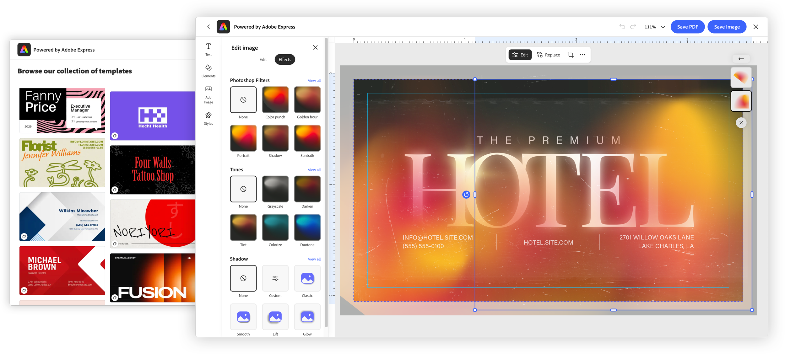

---
keywords:
  - Adobe Express
  - Embed SDK
  - Embedded Design Editor
  - EDE
  - Create Design
  - createDesign
  - Template Browser
  - Experience variant
title: Create Design
description: Understand the EDE Create Design workflow—browse a curated template collection and design from it in a focused editor.
contributors:
  - https://github.com/undavide
---

# Create Design

The Create Design workflow lets users start something new: they can browse a curated set of templates (or begin from a blank canvas), pick one, and design from it in a focused editor. It pairs a _Template Browser_ with a _Design Editor_—choose a template, then remix it into a finished asset.



## How Create Design works

Launch the workflow from the [`module`](./ede.md#how-ede-fits-into-the-embed-sdk) object:

```typescript
module.createDesign(
  appConfig?: FDECreateDesignAppConfig,
  exportConfig?: ExportConfig,
  containerConfig?: ContainerConfig,
): void;
```

All parameters are optional and **positional**—to skip one, pass `undefined` in its place. `exportConfig` and `containerConfig` are covered in [Shared configuration](./ede.md#shared-configuration); the rest of this page is about what's specific to Create Design, configured through `appConfig` (of type [`FDECreateDesignAppConfig`](../../v4/shared/src/types/3p/module/app-config-types/interfaces/fde-create-design-app-config.md)).

## Browsing and choosing content

The heart of Create Design is [`contentBrowseConfig`](../../v4/shared/src/types/module/app-config-types/interfaces/browse-mode-config.md)—it defines the **Template Browser** experience: for example, [`categoriesConfig`](../../v4/shared/src/types/browse-search-config-types/type-aliases/browse-search-config-union.md) specifies which collection users browse, [`templateFilters`](../../v4/shared/src/types/module/app-config-types/interfaces/template-filters.md) controls how templates are filtered, and [`showCreateNew`](../../v4/shared/src/types/module/app-config-types/interfaces/browse-mode-config.md#properties) determines whether to show a CTA that allows users to start from a blank document of the provided size.

```javascript-data-line="2,4,8,14,22"
const appConfig = {
  contentBrowseConfig: {
    // The curated collection to browse
    categoriesConfig: [
      { category: "templates", collectionId: "urn:aaid:sc:VA6C2:..." },
    ],
    // Additional filtering based on number of pages, dimensions, template type
    templateFilters: {
      behaviors: ["still"],
      dimensions: { width: 3.5, height: 2, unit: "in" },
      templateType: "business-card",
    },
    // Offer a "start from a blank canvas" option
    showCreateNew: true,
    // Title shown above the browser
    headerText: "Choose a template",
    // UI configuration options for the Template Browser
    hideSearchBar: true,
    hideFilters: true,
    disablePremiumContent: true,
    // Keep users within the curated set (suppress "more like this")
    hideMoreLikeThis: true,
  },
  // Specify the list of file types that the user can publish
  allowedFileTypes: ["application/pdf", "image/jpeg", "image/png"],
  // EDE variant to tailor the editor experience
  variant: "print",
  callbacks: {
    /* ... */
  },
};

module.createDesign(appConfig, exportConfig, containerConfig);
```

Embedded browsing is deliberately **curated**, not open-ended discovery: standalone Express recommends templates broadly to help users explore, but inside your app the host already supplies the product and intent, so the browser stays within the collection you configure—and a 1-up **preview** lets users confirm a template before a new document is created. `hideMoreLikeThis` reinforces that boundary by suppressing "more like this" recommendations. Content browsing is a capability in its own right, with its own collection, filtering, and layout options—see the [Template Browser](./template-browser.md) concept guide; Create Design surfaces that same experience as the entry point to designing.

## Tailoring the experience with variants

Create Design honors the shared `variant` option (see [Experience variants](./ede.md#experience-variants)). Setting `variant: "print"`, for example, gives users a print-oriented toolset and enables print-friendly defaults automatically, so the experience matches a print workflow end to end; for instance, the Express editor won't surface timeline-dependent tools that are relevant only for video.

<InlineAlert slots="header, text" variant="warning" />

#### In active development

Variants are still being actively developed and improved; expect new tools and refinements to be introduced over time.

## Output configuration today

There's an asymmetry between the two workflows worth understanding. [Edit Design](./ede-edit-design.md) lets you pass explicit **output controls**. For example, including PDF settings such as CMYK color mode and an ICC color profile (its `pdfPrintConfig`) is possible for the `print` variant. **Create Design does not accept those output configs yet.**

Create Design falls back to sensible defaults—CMYK color with a standard coated ICC profile (`Coated GRACoL 2006 (ISO 12647-2:2004)`) and bleed enabled—so output is correct out of the box even though you can't set it explicitly here.

This gap is _expected to close_ in the future through the `onIntentChange` callback: as a user moves from _browsing_ a template into _editing_ it, `onIntentChange` will let you pass configuration—including output settings—into that next step. Until then, if you need precise output control at creation time, plan around these defaults, or route users into [Edit Design](./ede-edit-design.md), where the output controls are available today.

## Handling the result

When the user finishes and exports, EDE behaves like a standard Embed SDK module: the `onPublish` callback fires with the exported asset and its metadata; return a publish status to confirm or deny. See [Shared configuration](./ede.md#shared-configuration).

## Related

- **[Embed SDK Embedded Design Editor tutorial](../tutorials/embedded-design-editor.md)**: build the Create Design workflow step by step
- [Edit Design](./ede-edit-design.md) — the companion workflow, with output controls
- [Embedded Design Editor](./ede.md) — the shared concepts and configuration
- [Template Browser](./template-browser.md) — the content-browsing experience Create Design builds on
- SDK reference: [`FDECreateDesignAppConfig`](../../v4/shared/src/types/3p/module/app-config-types/interfaces/fde-create-design-app-config.md)
