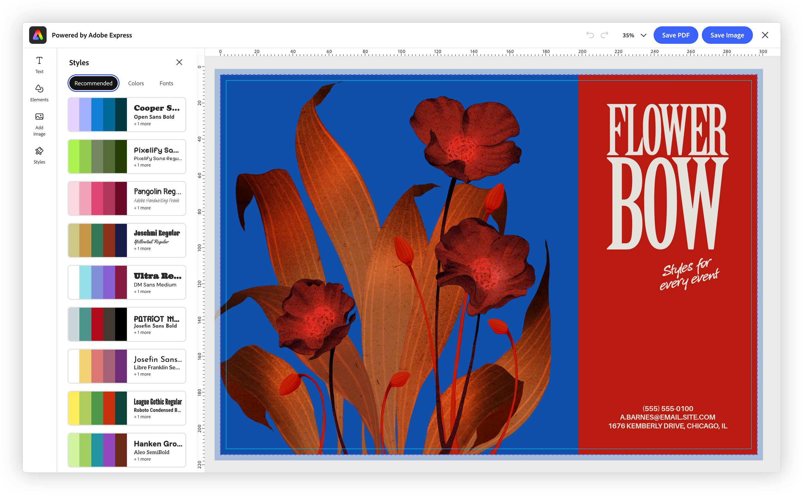

---
keywords:
  - Adobe Express
  - Embed SDK
  - Embedded Design Editor
  - EDE
  - Edit Design
  - editDesign
  - docConfig
  - PDF print
  - CMYK
title: Edit Design
description: Understand the EDE Edit Design workflow—open an existing document in a focused editor and control how it's exported, including print-ready PDF output.
contributors:
  - https://github.com/undavide
---

# Edit Design

The Edit Design workflow opens an _existing document_ in a focused editor, where users can refine the design and, for print workflows, configure how the final document is exported.



## How Edit Design works

Launch the workflow from the [`module`](./ede.md#how-ede-fits-into-the-embed-sdk) object:

```typescript
module.editDesign(
  docConfig: FDEEditDesignDocConfig,
  appConfig?: FDEEditDesignAppConfig,
  exportConfig?: ExportConfig,
  containerConfig?: ContainerConfig,
): void;
```

Unlike [Create Design](./ede-create-design.md), the `docConfig` parameter is **required**—it tells the editor which document to open. The remaining parameters are optional and **positional** (pass `undefined` to skip one). `exportConfig`, `containerConfig`, and the shared `appConfig.callbacks` are covered in [Shared configuration](./ede.md#shared-configuration).

## Choosing what to open

The `docConfig` parameter (of type [ `FDEEditDesignDocConfig` ](../../v4/shared/src/types/module/doc-config-types/interfaces/fde-edit-design-doc-config.md)) identifies the document to load. Provide **exactly one** of the following:

| Property     | Opens                                                                                                              |
| ------------ | ------------------------------------------------------------------------------------------------------------------ |
| `docId`      | an existing saved document—typically the `docId` returned by [Create Design](./ede-create-design.md)'s `onPublish` |
| `templateId` | a specific template                                                                                                |
| `asset`      | an image asset placed onto the canvas                                                                              |

```javascript
const docConfig = { docId: "urn:aaid:sc:VA6C2:..." };

module.editDesign(docConfig, appConfig, exportConfig, containerConfig);
```

Please note that, by using the `templateId`, you can bypass the Template Browser and directly open a specific template in the editor.

## Configuring the editor

Edit Design's `appConfig` ([`FDEEditDesignAppConfig`](../../v4/shared/src/types/3p/module/app-config-types/interfaces/fde-edit-design-app-config.md)) adds **output controls** that Create Design doesn't have _yet_:

```javascript-data-line="5-9,12-17"
const appConfig = {
  variant: "print",

  // On-canvas print guides
  editorGuideConfig: {
    showBleed: true,
    showMargins: true,
    showRulers: true,
  },

  // Print-ready PDF output
  pdfPrintConfig: {
    includeCropMarks: true,
    includeBleed: true,
    colorMode: "cmyk",
    cmykColorProfile: "Coated GRACoL 2006 (ISO 12647-2:2004)",
  },

  allowedFileTypes: ["application/pdf"],
};
```

- **`editorGuideConfig`** shows print guides—bleed, margins, and rulers—on the canvas.
- **`pdfPrintConfig`** controls the exported PDF: crop marks, bleed, and CMYK color with a chosen ICC color profile. The profile is one of the SDK's supported print profiles.

When `variant` is `"print"`, print-oriented guides and defaults can be enabled; this is the key contrast with [Create Design](./ede-create-design.md#output-configuration-today), which cannot pass these output settings _yet_.

## Handling the result

Edit Design uses the same shared `onPublish` callback as Create Design—it fires with the exported asset and metadata, and you return a publish status. See [Shared configuration](./ede.md#shared-configuration).

## Related

- [Create Design](./ede-create-design.md) — the companion workflow, for starting from a template
- [Embedded Design Editor](./ede.md) — the shared concepts and configuration
- SDK reference: [`FDEEditDesignAppConfig`](../../v4/shared/src/types/3p/module/app-config-types/interfaces/fde-edit-design-app-config.md)
