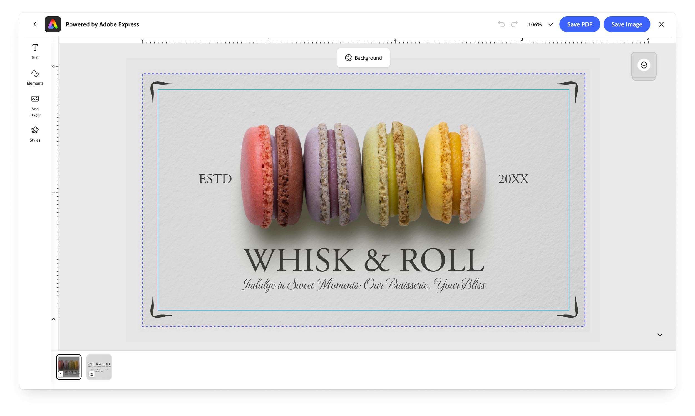

---
keywords:
  - Adobe Express
  - Embed SDK
  - Embedded Design Editor
  - EDE
  - Create Design
  - Edit Design
  - Focused workflows
  - Design creation
  - Experience variant
title: Embedded Design Editor
description: Understand the Embedded Design Editor (EDE)—Adobe's configurable, focused design creation and editing experience embedded through the Embed SDK.
contributors:
  - https://github.com/undavide
---

# Embedded Design Editor

The Embedded Design Editor (EDE) is Adobe's architecture for delivering purpose-built creation experiences inside your application. Instead of embedding the full Adobe Express editor, EDE gives you a _focused, configurable surface_ built around specific workflows.



The shift EDE represents is from **bespoke integrations toward a shared, scalable platform**; it separates the underlying creative capabilities from the experience presented to end users, so the same platform can power very different user journeys through **variants** rather than duplicated engineering. EDE also improves the user experience by means of **faster loading times**, **seamless workflow transitions** (e.g., moving from template selection to design editing without a full app reload), and **better resilience** against Adobe Express feature changes and updates.

<InlineAlert slots="header, text" variant="info" />

#### In active development

EDE is a key development priority for the Embed SDK, with ongoing improvements and new capabilities being added over time. Check back here regularly as the documentation evolves alongside it.

## How EDE fits into the Embed SDK

EDE experiences run as **modules**; so far, there are two entry points:

| Workflow                                | Entry point             | Users start from                                            | Use it to                                                 |
| --------------------------------------- | ----------------------- | ----------------------------------------------------------- | --------------------------------------------------------- |
| [Create Design](./ede-create-design.md) | `module.createDesign()` | A template collection or a blank canvas                     | Let users browse and pick a starting point to design from |
| [Edit Design](./ede-edit-design.md)     | `module.editDesign()`   | An existing document (`docId`, `templateId`, or an `asset`) | Reopen and refine a design                                |

You launch the experiences from the `module` object returned by the SDK's [`initialize()`](../quickstart/index.md) call.

```javascript-data-line="3,8-9"
await import("https://cc-embed.adobe.com/sdk/v4/CCEverywhere.js");

const { module } = await window.CCEverywhere.initialize(
  { clientId: "your-client-id", appName: "your-app-name" },
  { locale: "en-US" },
);

module.createDesign(/* ... */); // start a new design
module.editDesign(/* ... */); // edit an existing one
```

Getting an API key and calling `initialize()` are common to every Embed SDK integration—see the [Quickstart](../quickstart/index.md) and [Get Credentials](../credential/index.md). This guide focuses on what's specific to EDE.

## Experience variants

A **variant** tailors the whole experience to a class of workflow. You set it through the `variant` property on a workflow's `appConfig`, and it determines **which creative tools the editor surfaces**—text, images, shapes, icons, and other design elements—so the UI matches the task instead of exposing everything Express can do. Variants are how you build _experience-focused_ UIs.

| `variant`   | Experience                                                                                                                                                                        |
| ----------- | --------------------------------------------------------------------------------------------------------------------------------------------------------------------------------- |
| `"default"` | A general-purpose focused editor.                                                                                                                                                 |
| `"print"`   | A print-oriented experience: a print-focused toolset with print-friendly defaults (for example, bleed and crop marks enabled by default), tuned for producing print-ready output. |

The set of variants **will grow** as new focused workflows are added. Treat the SDK reference as the authoritative, current list. Set the variant the same way in either workflow:

```javascript-data-line="2"
const appConfig = {
  variant: "print",
  // ...workflow-specific options
};
```

## Shared configuration

Both EDE workflows accept the **same standard Embed SDK configuration objects** that every module uses: `appConfig`, `exportConfig`, and `containerConfig` (while `editDesign()` requires an additional `docConfig` object to pass an existing document to preload onto the Editor)

```ts
ccEverywhere.module.createDesign(
  appConfig?: FDECreateDesignAppConfig,
  exportConfig?: ExportConfig,
  containerConfig?: ContainerConfig,
): void;

ccEverywhere.module.editDesign(
  docConfig: FDEEditDesignDocConfig,
  appConfig?: FDEEditDesignAppConfig,
  exportConfig?: ExportConfig,
  containerConfig?: ContainerConfig,
): void;
```

<InlineAlert slots="header, text" variant="info"/>

#### A note on Type Names

You'll see the prefix `FDE` in some SDK type names such as `FDECreateDesignAppConfig`. It refers to the same Embedded Design Editor described here, and may change in the future to match the current naming convention.

- **`appConfig`**: the per-workflow options; the parts unique to each are covered on the [Create Design](./ede-create-design.md) and [Edit Design](./ede-edit-design.md) pages.
- **`exportConfig`**: the export/publish options (buttons, file types, output shape). See the [`ExportConfig` reference](../../v4/shared/src/types/export-config-types/type-aliases/export-config.md).
- **`containerConfig`**: how the SDK iframe is presented (fill, inline, or modal). See the [`ContainerConfig` reference](../../v4/shared/src/types/container-config-types/type-aliases/container-config.md).
- **`appConfig.callbacks`**: lifecycle and event callbacks such as [`onPublish`](../../v4/shared/src/types/callbacks-types/type-aliases/publish-callback.md), [`onError`](../../v4/shared/src/error/cc-everywhere-error-types/type-aliases/error-callback.md), and [`onCancel`](../../v4/shared/src/types/callbacks-types/type-aliases/cancel-callback.md). See the [`Callbacks` reference](../../v4/shared/src/types/callbacks-types/interfaces/callbacks.md).

<InlineAlert slots="header, text" variant="warning"/>

#### Intent change

The `onIntentChange()` callback is not operational for EDE workflows today. It is expected to become relevant in the future—for example, to carry configuration forward as one workflow _tethers_ into another. See [Create Design → Output configuration today](./ede-create-design.md#output-configuration-today) for where this will matter.

## Related

- **[Embed SDK Embedded Design Editor tutorial](../tutorials/embedded-design-editor.md)**: build a Create Design → Edit Design flow step by step
- [Create Design](./ede-create-design.md) — browse a template and design from it
- [Edit Design](./ede-edit-design.md) — open and refine an existing document
- [Template Browser](./template-browser.md) — the content-browsing experience Create Design builds on
- SDK reference: [`FDECreateDesignAppConfig`](../../v4/shared/src/types/3p/module/app-config-types/interfaces/fde-create-design-app-config.md), [`FDEEditDesignAppConfig`](../../v4/shared/src/types/3p/module/app-config-types/interfaces/fde-edit-design-app-config.md)
