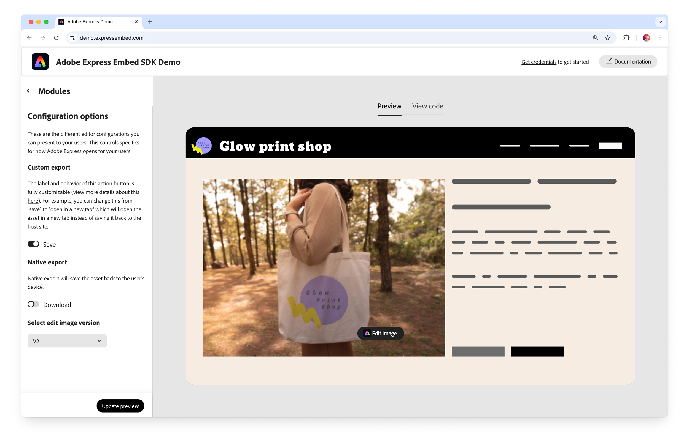

---
keywords:
  - Adobe Express
  - Embed SDK
  - Edit Image
  - Feature configurations
  - Image editing API
  - Adobe Express SDK
  - Image editor integration
  - Photo editing tools
  - Remove background
  - Crop image
  - Image effects
  - Adobe Spectrum 2
  - Performance improvements
  - JavaScript image editor
title: Adobe Express Edit Image V2 - Enhanced Performance & New UI
description: Discover the new Edit Image V2 experience in Adobe Express Embed SDK.
contributors:
  - https://github.com/undavide
---

# Edit Image v2

Welcome to the new and improved Edit Image v2 experience in the Adobe Express Embed SDK!

## Features overview

The new Edit Image experience has been re-architected to deliver significantly improved performance and a better user experience. This update has **reduced load times by 35–50%** and **memory consumption by 35%**.

The UI has been redesigned to provide a more user-friendly experience, with a closer implementation of the new Adobe Spectrum 2 design system among other improvements.


A tabbed interface separates the editing tools (**Crop**, **Remove Background**, **Erase**, **Remove Object**, **Insert Object**) and the other features (**Adjust**, **Corners**, **Flip**, **Opacity**) from the Effects section.


## How to enable the new experience

Edit Image v2 is, at the moment, disabled by default, with the classic interface displayed. To enable the new experience, you need to set the new `appVersion` property to the string `"2"` in the [`appConfig`](../../v4/shared/src/types/module/app-config-types/interfaces/edit-image-app-config.md) object.

```js
await import("https://cc-embed.adobe.com/sdk/v4/CCEverywhere.js");

const { module } = await window.CCEverywhere.initialize(
  { clientId: "your-client-id", appName: "your-app-name" },
  {}
);

const appConfig = {
  appVersion: "2", // 👈 Enable the new experience
  // ...
};

const docConfig = {
  /* ... */
};

module.editImage(docConfig, appConfig);
```

## Try it out in the Demo App

The [Adobe Express Embed SDK Demo App](https://demo.expressembed.com/) has been updated to showcase the new Edit Image v2 experience, and it provides code snippets for the new configuration.

[](https://demo.expressembed.com/)

**Demo Features:**

- Live Edit Image V2 interface
- Complete code examples
- Configuration snippets
- Performance comparisons
- Integration best practices
