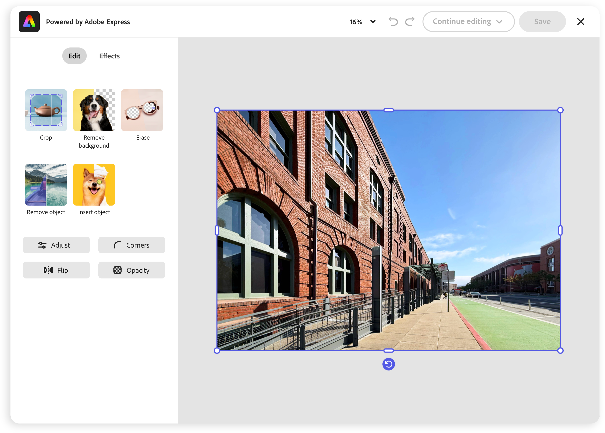
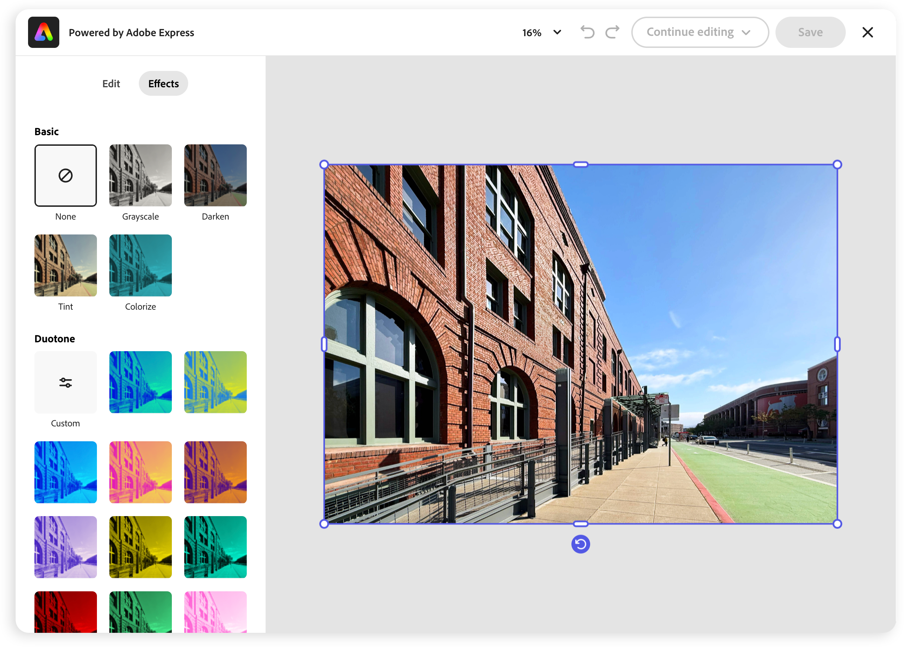

---
keywords:
  - Adobe Express
  - Embed SDK
  - Edit Image
  - Feature configurations
title: Edit Image V2
description: Edit Image V2
contributors:
  - https://github.com/undavide
---

# Edit Image v2

Welcome to the new and improved Edit Image v2 experience in the Adobe Express Embed SDK!

## Features overview

The new Edit Image experience has been re-architected to deliver significantly improved performance and a better user experience. This update has **reduced load times by 35–50%** and **memory consumption by 35%**.

The UI has been redesigned to provide a more user-friendly experience, with a closer implementation of the new Adobe Spectrum 2 design system among other improvements.



A tabbed interface separates the editing tools (**Crop**, **Remove Background**, **Erase**, **Remove Object**, **Insert Object**) and the other features (**Adjust**, **Corners**, **Flip**, **Opacity**) from the Effects section.



## How to enable the new experience

Edit Image v2 is, at the moment, disabled by default, with the classic interface displayed. To activate the new experience, you need to set the new `appVersion` property to the string `"2"` in the [`appConfig`](../../v4/shared/src/types/module/AppConfig.types/interfaces/EditImageAppConfig.md) object.

```js
await import("https://cc-embed.adobe.com/sdk/v4/CCEverywhere.js");

const { module } = await window.CCEverywhere.initialize(
  { clientId: "your-client-id", appName: "your-app-name" },
  {}
);

const appConfig = {
  appVersion: "2", // 👈 Enable the new experience
  // ...
};

const docConfig = {
  /* ... */
};

module.editImage(docConfig, appConfig);
```

## Try it out

You can test the new Edit Image v2 experience in our [Demo app](https://demo.expressembed.com/) now!
