---
keywords:
  - Adobe Express
  - Embed SDK
  - Text to Image
  - Generate Image
  - Carousel
  - Grid view
  - Community Wall
  - Prompt Bar suggestions
  - Rich Previews
  - Fast Mode
  - Custom Firefly Models
  - Feature configurations
title: Generate Image V2
description: Generate Image V2
contributors:
  - https://github.com/undavide
---

# Generate Image V2

Welcome to the new and improved Generate Image V2 experience in the Adobe Express Embed SDK! This upgraded version brings a host of exciting enhancements designed to empower your creative journey.

## Features overview

In redesigning the Generate Image module, we've focused on making the image generation process more engaging, efficient, and inspiring. The **new User Interface** offers a fresh look and feel, with a Carousel and Grid view that make it easier to browse and select images.

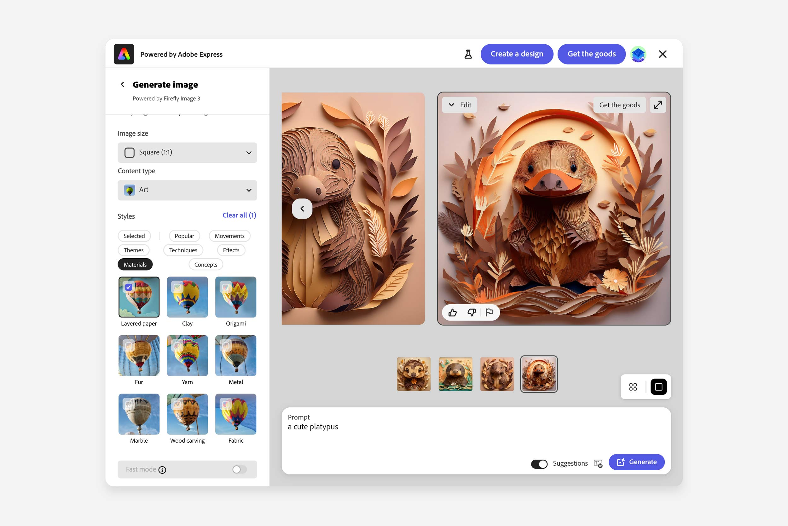

Upon launching the module, you'll be greeted by an endless array of user-generated images on the **Community Wall**, that provide plenty of inspiration for your projects. The **Improved Prompt Bar** helps you with pop-up suggestions to craft the perfect prompt.

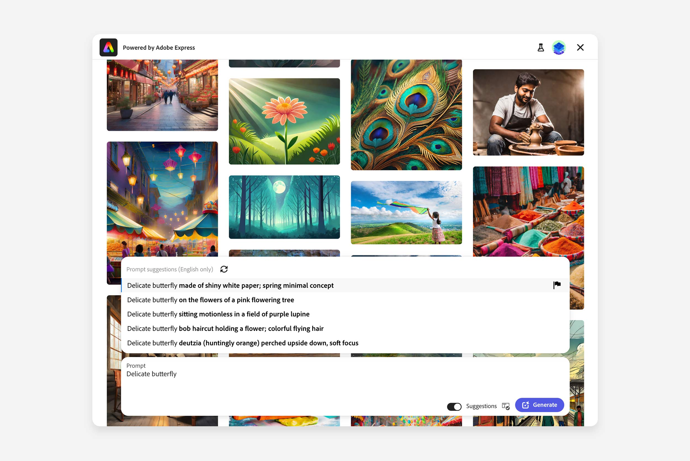

**Rich Previews** offer a more interactive and engaging preview experience, while with **Fast Mode** you can cut the generation time when fewer details and smaller sizes are enough.

Lastly, **Custom Firefly Models** allow enterprise users to tailor outputs to unique brand or project requirements.

## How to enable the new experience

Generate Image v2 is, at the moment, disabled by default, with the classic interface displayed. To activate the new experience, you need to set the new `appVersion` property to the string `"2"` in the [`appConfig`](../../v4/shared/src/types/module/app-config-types/interfaces/text-to-image-app-config.md) object.

```js
await import("https://cc-embed.adobe.com/sdk/v4/CCEverywhere.js");

const { module } = await window.CCEverywhere.initialize(
  { clientId: "your-client-id", appName: "your-app-name" },
  {}
);

const appConfig = {
  appVersion: "2", // 👈 Enable the new experience
  // ...
};

module.createImageFromText(appConfig, {});
```

## Feature configurations

The new experience introduces several new feature configurations to the [`TextToImageAppConfig`](../../v4/shared/src/types/module/app-config-types/interfaces/text-to-image-app-config.md#properties) object. They can be independently enabled or disabled to customize the module according to your needs.

### Community Wall

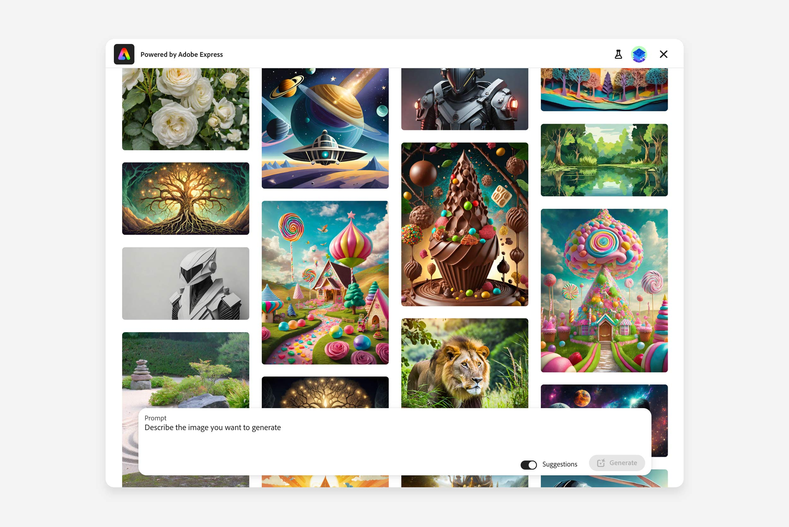

The infinite-scroll collection of user-generated images with prompts is controlled by the boolean `community-wall` property of the [`featureConfig`](../../v4/shared/src/types/module/app-config-types/enumerations/text-to-image-feature.md) object:

```js
const appConfig = {
  appVersion: "2",
  featureConfig: {
    "community-wall": true, // 👈 Enable the Community Wall
  },
};
```

When enabled, the Community Wall will be displayed upon launching the module; each image can be selected to preload the prompt and generate a new image, varying the other settings as needed. It's possible to customize the Community Wall by providing your images; please see [this section](#custom-community-wall) for instructions.

<InlineAlert variant="info" slots="text1" />

Please note, when passing a prompt to the module (via `appConfig.promptText`), the Community Wall will be disabled and the generation will start directly.

### Fast Mode

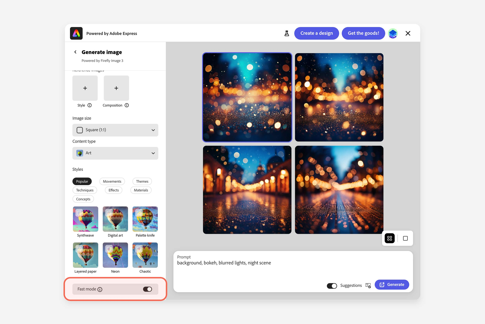

This new option allows for faster generation of smaller images (1K, or 1024x1024 for a 1:1 ratio, compared to the usual 2K, or 2048x2048) with fewer details. It's a great choice when timely generations are needed, and less precision doesn't matter, for example, in backgrounds, or simpler illustrations. The same [`featureConfig`](../../v4/shared/src/types/module/app-config-types/enumerations/text-to-image-feature.md) object allows you to toggle the `fast-mode` boolean:

```js
const appConfig = {
  appVersion: "2",
  featureConfig: {
    "community-wall": true,
    "fast-mode": true, // 👈 Enable Fast Mode
  },
};
```

When enabled, a Fast Mode switch will be visible a the bottom of the generation options. To control its default state there's an additional [`fastModeConfig`](../../v4/shared/src/types/module/app-config-types/interfaces/fast-mode-config.md) object property, whose `defaultFastModeState` can be set to `"on"` or `"off"`:

```js
const appConfig = {
  appVersion: "2",
  featureConfig: {
    "community-wall": true,
    "fast-mode": true, // 👈 Enable Fast Mode
    fastModeConfig: {
      defaultFastModeState: "on", // 👈 Set Fast Mode on by default
    },
  },
};
```

### Rich Preview

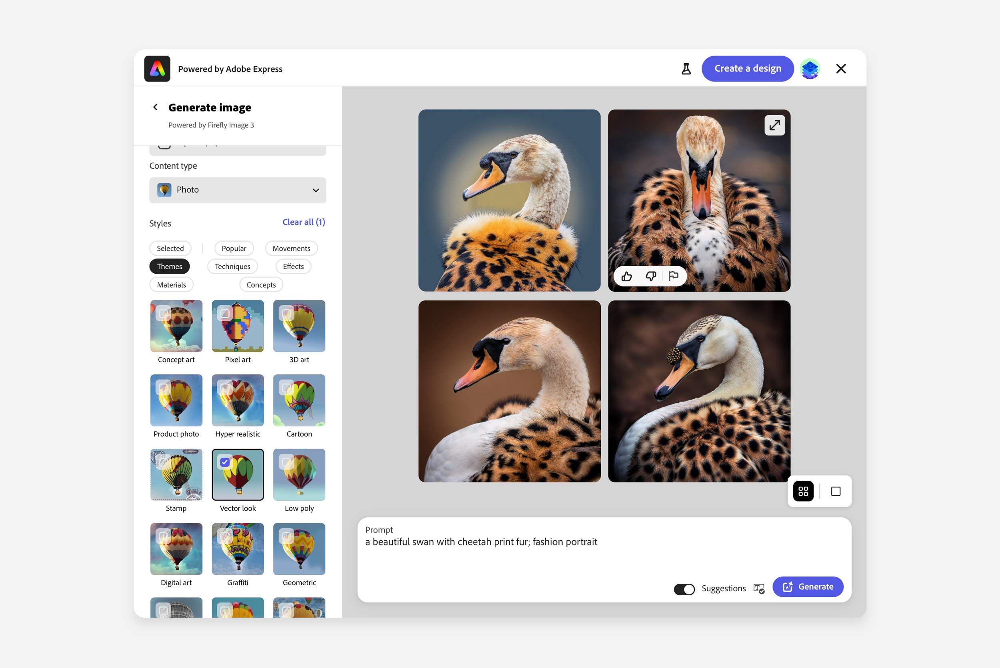

In addition to the Grid and Carousel view, the new experience introduces the possibility to isolate one of the four generated images, and display it in a larger, focused preview. This feature is controlled by the [`thumbnailOptions`](../../v4/shared/src/types/module/app-config-types/enumerations/thumbnail-option.md) property of the `appConfig` object, which array can now include `"rich-preview"`:

```js
const appConfig = {
  appVersion: "2",
  thumbnailOptions: ["rich-preview"],
};
```

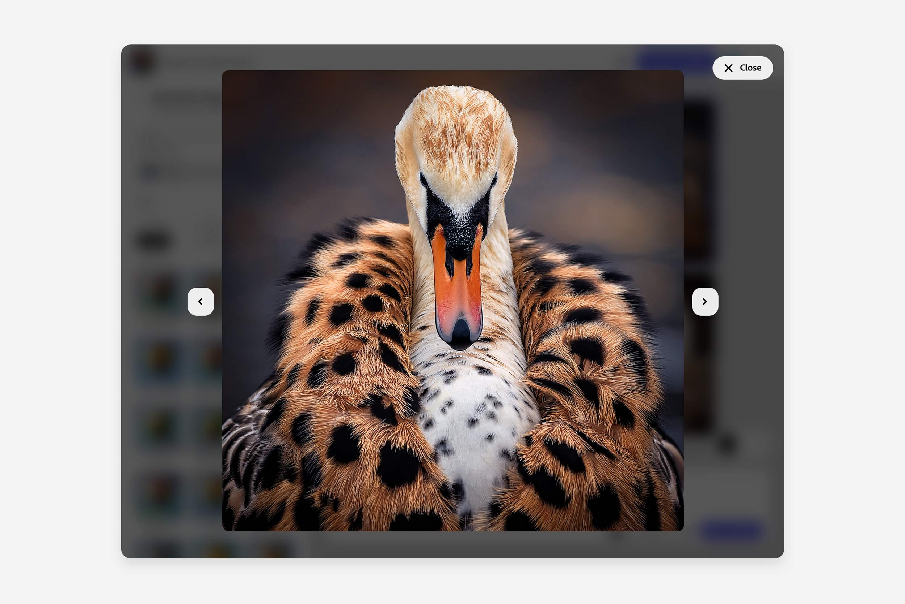

### Thumbnail Actions

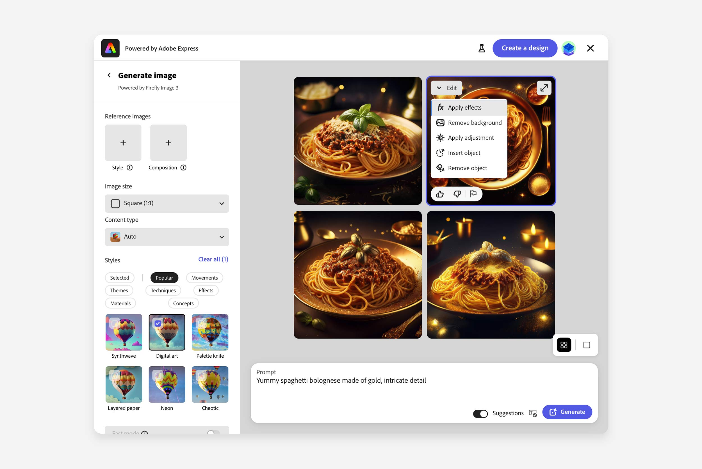

You now have a set of actions you can immediately perform on the generated image. You can allow your user to transfer the image directly to the editor. These actions are collected in a dropdown menu within the thumbnail. They include adding text, cropping, and applying filters. Similar to the Rich Preview, these actions are controlled by the [`thumbnailOptions`](../../v4/shared/src/types/module/app-config-types/enumerations/thumbnail-option.md) property of the `appConfig` object, which array can now include `"edit-dropdown"`. Additionally, the actual options are set in the [`editDropdownOptions`](../../v4/shared/src/types/export-config-types/enumerations/edit-further-intent.md) array, as option objects:

```js
const appConfig = {
  appVersion: "2",
  thumbnailOptions: ["edit-dropdown"], // 👈 Enable the Edit dropdown
  editDropdownOptions: [
    // 👈 Set the options for the Edit dropdown
    { option: "add-effects" },
    { option: "remove-background" },
    { option: "apply-adjustment" },
    { option: "insert-object" },
    { option: "remove-object" },
  ],
};
```

For an updated list of all the available options, refer to the [`EditFurtherIntent`](../../v4/shared/src/types/export-config-types/enumerations/edit-further-intent.md) enumeration.

### Publish

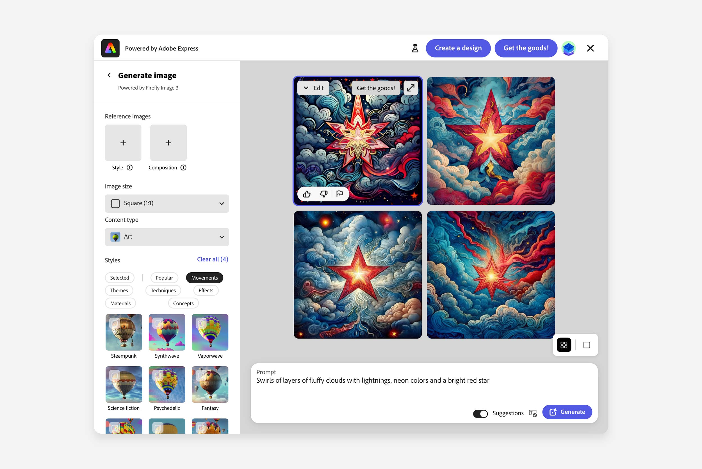

The SDK also introduces the possibility of running a publish callback for the generated image directly from the module. Label and ID of this feature are controlled by the [`publishConfig`](../../v4/shared/src/types/module/app-config-types/interfaces/publish-config.md) property of the `appConfig` object, which can include the following options:

```js
const appConfig = {
  appVersion: "2",
  thumbnailOptions: ["publish"], // 👈 Enable the Publish action
  publishConfig: {
    id: "saveToHostApp",
    label: "Get the goods!",
  },
};
```

The `publishConfig` object should match the same `id` and `label` of the publish callback in the host app.

```js
const exportConfig = [
  {
    action: {
      target: "publish",
      outputType: "base64",
      closeTargetOnExport: true,
    },
    id: "saveToHostApp", // 👈 Match the ID
    label: "Get the goods!", // 👈 Match the label
    style: {
      uiType: "button",
    },
  },
];
```

## Custom Firefly Models

### Before you begin

Ensure that you have the right plan! Firefly custom models are available to organizations that use [Adobe storage for business](https://helpx.adobe.com/in/enterprise/using/storage-for-business.html), a feature that's being rolled out globally in a phased manner.

<InlineAlert variant="warning" slots="header, text1" />

**Available only for enterprise users**

This feature requires users of your organization to have access to the Custom Firefly Models. To train custom models in Adobe Firefly, you must be entitled as a [trainer for Firefly custom models](https://helpx.adobe.com/in/enterprise/using/assign-users-to-firefly-custom-models.html). If you're using Firefly through a company-owned account, [contact your Adobe administrator](https://helpx.adobe.com/in/enterprise/kb/contact-administrator.html) to request access.

### Enable Custom Firefly Models

The new experience let you select fine-tuned Firefly Models, in addition to the standard generation model. This allows enterprise users to tailor the generated images to their unique brand or project requirements.

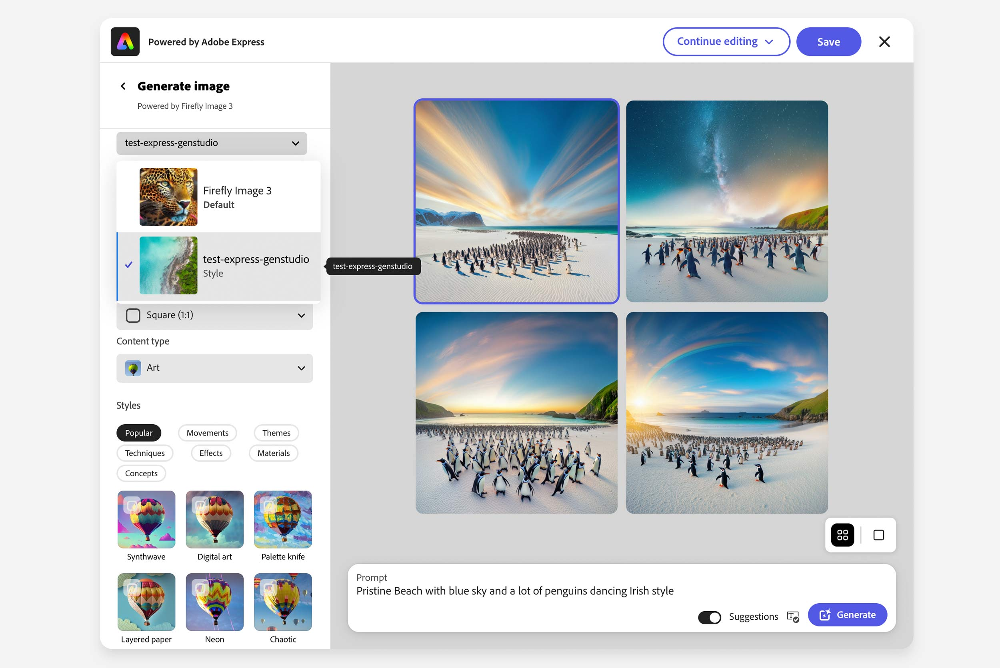

Provided that you have trained and uploaded your custom models, you can enable the Custom Firefly Models feature by setting the `custom-models` boolean property of the [`featureConfig`](../../v4/shared/src/types/module/app-config-types/enumerations/text-to-image-feature.md) object:

```js
const appConfig = {
  appVersion: "2",
  featureConfig: {
    "custom-models": true, // 👈 Enable Custom Firefly Models
  },
};
```

When enabled, the Custom Firefly Models dropdown will appear above all other generation options, allowing you to select the desired model. If your organization does not have a Custom Model enabled, the default model is used and the message "Powered by Firefly Image 3" is displayed in place of the dropdown.

## Custom Community Wall

The Community Wall is now able to showcase **your custom images** instead of Firefly's publicly available gallery.

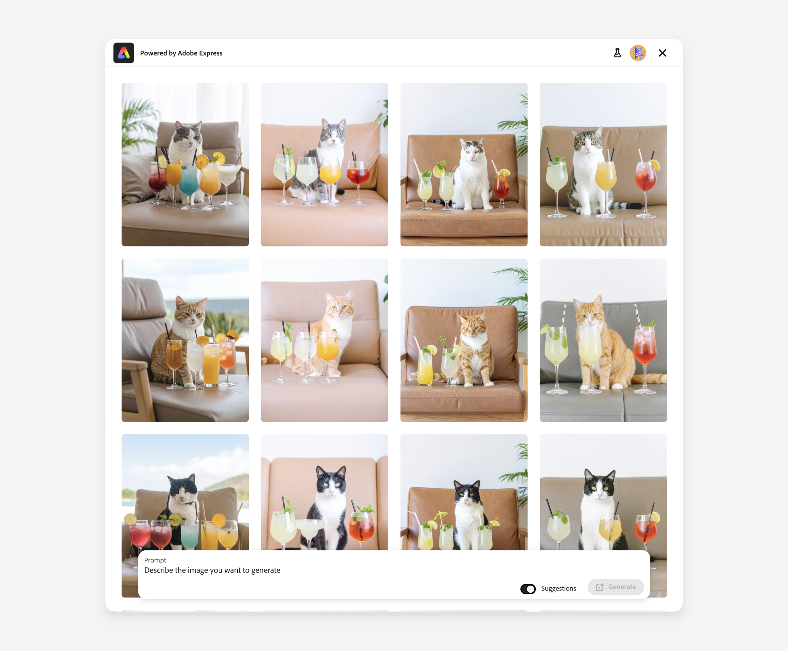

**To enable the Custom Community Wall**, you need to supply a `communityWallConfig` object to `appConfig` when you launch Generate Image v2.

<InlineAlert variant="info" slots="text1" />

If you omit this property, the wall continues to display Firefly assets exactly as before. Please note, `communityWallConfig` is only available in the new, v2 experience.

#### The `communityWallConfig` object

```ts
const appConfig = {
  appVersion: "2",
  featureConfig: {
    "community-wall": true, // 👈 still turn the wall on
  },
  communityWallConfig: {
    // 👇 your own data-loader
    fetchCommunityAssets: myFetchCommunityAssets,
  },
};
```

### The `fetchCommunityAssets` callback

The `fetchCommunityAssets` property is nothing but a **callback function that you need to implement**, designed to fetch a list of your assets in a _paginated way_.

<InlineAlert variant="info" slots="text1" />

**Pagination**, that must be supported on your backend, allows the module to load data in smaller chunks as users scroll, reducing load times and improving the overall experience. As they keep scrolling through the Community Wall, the module will repeatedly invoke `fetchCommunityAssets` to get the next set of images.

The function is called with a `limit` and `cursor` parameters. The `limit` is the number of assets to retrieve at any given time, and the `cursor` is used to keep track of the batch of assets to fetch next.

The `cursor` defaults to `"Start_Page"` on the first call, and you can send `"Last_Page"` when there are no more custom assets to fetch. At that point, the module will stop asking for more data.

#### The `fetchCommunityAssets` callback signature

```ts
async function myFetchCommunityAssets(
  limit: number,
  cursor: string // "Start_Page" on the first call, "Last_Page" on the last call
): Promise<CommunityWallAssetReponse> {
  /* …fetch and return your data… */
}
```

The `fetchCommunityAssets` asynchronous callback should return a Promise that resolves to a `CommunityWallAssetReponse` object.

```ts
interface CommunityWallAssetReponse {
  assets: CommunityWallAssetData[];
  cursor: string; // The cursor for the next page of assets.
}
```

### Asset schema

The `assets` array contains the asset objects to display in the Community Wall.

```ts
interface CommunityWallAssetData {
  assetId: string; // Asset ID for the community asset
  title: string; // Prompt for the thumbnail item
  thumbnailSrc: string; // Source of the thumbnail image as a base64 string
  fullRenditionSrc: string; // Source of the full rendition image for OneUp view as a base64 string
  height: number; // Height of the thumbnail image
  width: number; // Width of the thumbnail image
  ownerInfo?: {
    // Optional: Information about the owner
    name: string; // Owner's display name
    imgSrc: string; // Source URL of the owner's image
  };
}
```

<InlineAlert variant="info" slots="text1" />

The `thumbnailSrc` is the smaller image, used to display in the Community Wall, while the `fullRenditionSrc` is the larger image, used to display in the OneUp view. Both must be **base64 encoded strings**.

We have guardrails in place for the aspect ratio of the assets, to ensure that they are displayed correctly in the Community Wall. Assets outside these ranges are skipped and a console error is logged.

| Shape      | Allowed ratio |
| ---------- | ------------- |
| Square     | 0.9 - 1.1     |
| Portrait   | 0.68 - 0.88   |
| Landscape  | 1.18 - 1.38   |
| Widescreen | 1.65 - 1.85   |

### Example loader

```ts
async function myFetchCommunityAssets(
  limit: number,
  cursor: string
): Promise<CommunityWallAssetReponse> {
  try {
    // In a real implementation, you would likely fetch from an API endpoint
    const response = await fetch(
      `https://your-api.com/community-assets?limit=${limit}&cursor=${cursor}`
    );

    if (!response.ok) {
      throw new Error(`Failed to fetch assets: ${response.status}`);
    }

    const data = await response.json();

    // Transform API response to match expected format if needed
    const assets = data.items.map((item) => ({
      assetId: item.id,
      title: item.prompt,
      thumbnailSrc: item.thumbnail, // base64 encoded string
      fullRenditionSrc: item.fullImage, // base64 encoded string
      height: item.dimensions.height,
      width: item.dimensions.width,
      ownerInfo: item.creator
        ? {
            name: item.creator.displayName,
            imgSrc: item.creator.avatarUrl,
          }
        : undefined,
    }));

    return {
      assets,
      cursor: data.nextCursor || "Last_Page",
    };
  } catch (error) {
    console.error("Error fetching community assets:", error);
    throw error; // Propagate error to be handled by the SDK
  }
}
```

### Error handling

- **The `fetchCommunityAssets` Promise is rejected**: the Community Wall will display a loading skeleton for thumbnails along with the _"Failed to fetch community assets."_ error toast message. If the initial request fails, the module will retry fetching the assets a couple of times again.
- **No assets property returned in the response**: the _"Could not find any community assets"_ toast error message will be shown.
- **An asset doesn't conform to the expected format**: the asset will not be rendered, and _"The asset with the given ID could not be rendered due to the following error."_ will be logged.
- **Error fetching the image data for the Community Wall**: a broken image or missing image icon will be displayed.
- **Error fetching the image data for the OneUp view**: a broken image or missing image icon will be displayed, while the associated prompt text will still be shown in prompt bar.

## Try it out in the Demo App

The [Adobe Express Embed SDK Demo App](https://demo.expressembed.com/) has been updated to showcase the new features, and it provides code snippets for each of the new configurations.

[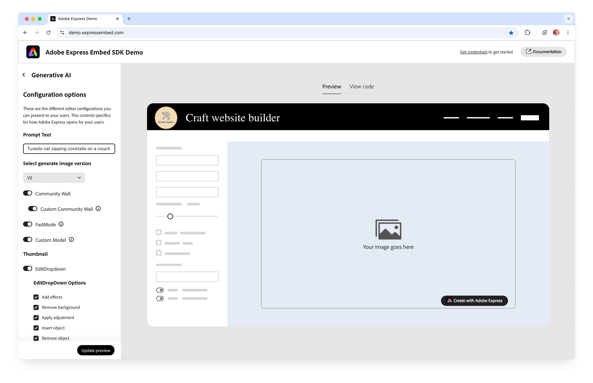](https://demo.expressembed.com/)
