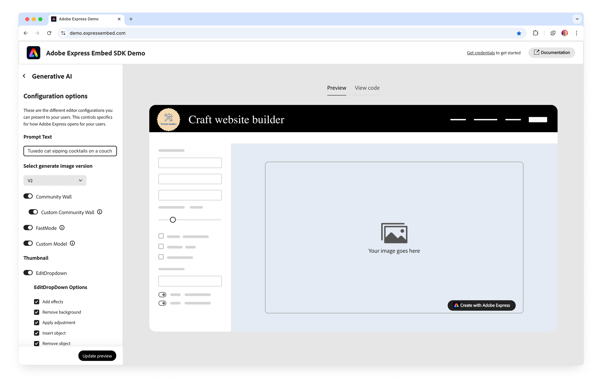
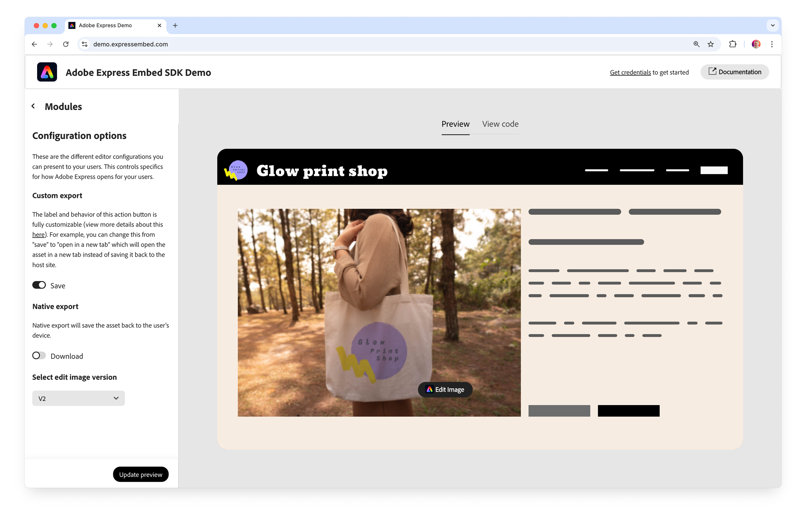

---
keywords:
  - Adobe Express Embed SDK
  - analyticsData
  - hostAppTrigger
  - HostAppTrigger
  - appConfig
title: Analytics
description: Learn how to pass hostAppTrigger in analyticsData when launching an Adobe Express Embed SDK workflow.
contributors:
  - https://github.com/apoos-dev
---

# Analytics

Use `hostAppTrigger` to identify the action in your application that launched an Adobe Express Embed SDK workflow. This gives Adobe consistent launch attribution and gives your team a clear mapping between host-app entry points and Adobe Express workflows when reviewing your own analytics. Add it to `appConfig.analyticsData` before calling the workflow method.

## Add `hostAppTrigger` to your integration

### 1. Choose an example trigger value

The table shows example host-app actions and their corresponding values. Use the value that matches the action in your application:

| Example host-app action | `hostAppTrigger` value |
| --- | --- |
| Add or create an image | `"add-image"` |
| Replace or edit an existing image | `"replace-image"` |
| Launch a workflow from selected text | `"text-selected"` |

These values are defined in the [`HostAppTrigger`](../../v4/shared/src/types/app-config-types/enumerations/host-app-trigger.md) enumeration.

#### Examples

The **Create with Adobe Express** action below is an example of an `"add-image"` entry point:



The **Edit Image** action below is an example of a `"replace-image"` entry point:



### 2. Add the value to `appConfig` and launch the workflow

Set `hostAppTrigger` inside `analyticsData` on the `appConfig` used for the workflow:

```javascript
await import("https://cc-embed.adobe.com/sdk/v4/CCEverywhere.js");

const { module } = await window.CCEverywhere.initialize(
  { clientId: "your-client-id", appName: "your-app-name" },
  {}
);

const appConfig = {
  analyticsData: {
    hostAppTrigger: "add-image",
  },
};

module.createDesign(appConfig, exportConfig, containerConfig);
```

Use the same structure with other workflows and select the appropriate value from the table above.

### TypeScript

If TypeScript reports that `analyticsData` is not part of an `appConfig` type, typecast `appConfig`. JavaScript integrations do not need the cast.

```typescript
const appConfig = {
  analyticsData: {
    hostAppTrigger: "add-image",
  },
} as any;
```

## Troubleshooting

| Symptom | What to check |
| --- | --- |
| The trigger value is missing | Verify the nesting is `appConfig.analyticsData.hostAppTrigger`. |
| The wrong action is attributed | Confirm the value matches the table above for that entry point. |
| TypeScript rejects `analyticsData` | Typecast `appConfig` as shown above. |

## Related resources

- [`HostAppTrigger` enumeration](../../v4/shared/src/types/app-config-types/enumerations/host-app-trigger.md)
- [`BaseAnalyticsData` interface](../../v4/shared/src/types/app-config-types/interfaces/base-analytics-data.md)
- [Third-party `AppConfig` interface](../../v4/shared/src/types/3p/app-config-types/interfaces/app-config.md)
- [`ModuleWorkflow` API reference](../../v4/sdk/src/workflows/3p/module-workflow/classes/module-workflow.md)
- [`EditorWorkflow` API reference](../../v4/sdk/src/workflows/3p/editor-workflow/classes/editor-workflow.md)
