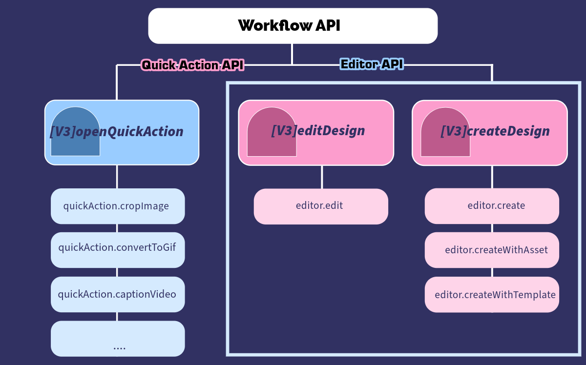
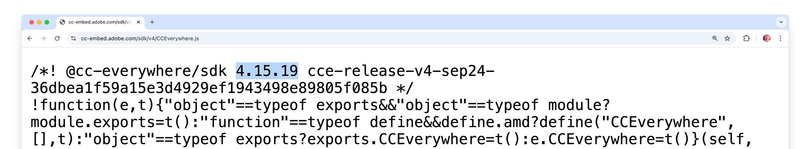
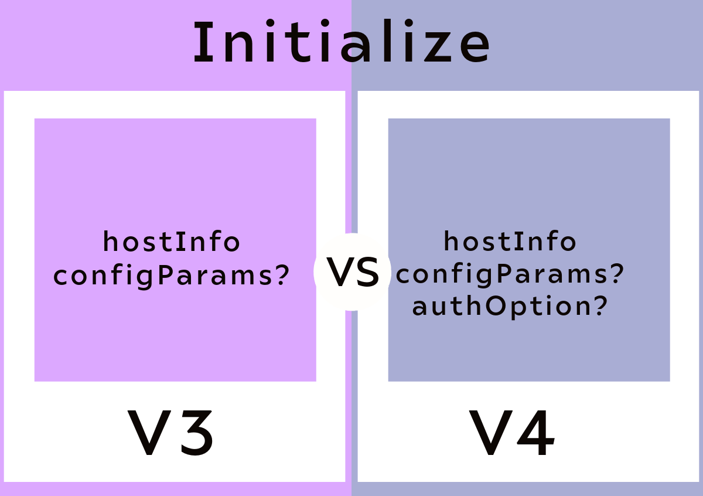

---
keywords:
 - V3
 - Migration Guide
 - V4
 - Adobe Express SDK V3 deprecation
 - V4 Features
 - Adobe Express Embed SDK migration
title: Migration Guide
description: This is a migration guide for V3 to V4.
contributors:
 - https://github.com/nimithajalal
---

# Migration Guide: Adobe Express Embed SDK V3 to V4

This guide will assist you in updating your Adobe Express Embed SDK integration from V3 to v4.

## Overview

Adobe Express Embed SDK V4 introduces a more verbose set of APIs, simplifies parameters, and removes redundancies.

SDK V4 was developed to streamline the existing APIs and create a scalable model to accommodate the expanding range of SDK Target Applications. Accordingly, APIs are categorized into distinct workflows, each corresponding to one of the SDK's supported target applications. This categorization further refines the APIs, making them more detailed and aligned with user intent.

## Introducing workflows

In V3, there were three main APIs: `createDesign`, `EditDesign`, and `openQuickActions`. These APIs differentiated user intent by analyzing parameters provided by partner teams, subsequently initiating the appropriate workflow. However, this approach increased the parameters for each API, as they were designed to cater to multiple user intents.

We have addressed this issue in V4 by segmenting the APIs into ***workflows*** based on user intent and providing more descriptive API names.

The three workflows are as follows:

- Module Workflow
- Editor Workflow
- Quickaction Workflow

Let us see in detail about the V4 changes through these workflows.

## V4 key changes

The following diagram shows how the previous API relates to the current new APIs:



### Module workflow

We are introducing module APIs through module workflow.

#### New APIs

| API Name                                  | Description                                                                                                                                                                                         |
|-------------------------------------------|-----------------------------------------------------------------------------------------------------------------------------------------------------------------------------------------------------|
| `CCEverywhere.module.editImage`           | Start editing an asset using image module.                                                                                                                                                          |
| `CCEverywhere.module.createImageFromText` | Generate images using a text prompt. SDK unlocks a mini editing experience, allowing users to create images from text prompts and then be able to make necessary edits via Embedded Express Editor. |

### Editor workflow

#### New APIs

| API Name             | Description                                                      |
|----------------------|------------------------------------------------------------------|
| `CCEverywhere.editor.create`             | Initiates a workflow using a blank canvas                        |
| `CCEverywhere.editor.createWithAsset`    | Allows an image asset to be preloaded onto the canvas.           |
| `CCEverywhere.editor.createWithTemplate` | Enables starting with a given Adobe Express template ID.         |
| `CCEverywhere.editor.edit`               | Allows modification using an existing Adobe Express Document ID. |

#### Deprecated APIs

- [createDesign](../../v3/reference/cc-everywhere/create-design/index.md)
- [editDesign](../../v3/reference/cc-everywhere/edit-design/index.md)

### Quick action workflow

#### New APIs

| API Name                                 | Description                            |
|------------------------------------------|----------------------------------------|
| `CCEverywhere.quickAction.convertToJPEG` | Convert an image asset to JPEG format. |
| `CCEverywhere.quickAction.convertToPNG`  | Convert an image asset to PNG format.  |
| ... so on                                |                                        |

#### Deprecated API

[openQuickAction](../../v3/reference/cc-everywhere/quick-actions/index.md) has been replaced with individual `quick action-named` APIs such as `cropImage`, eliminating the need for partners to submit a quick action ID.

## Workflow API enhancements

For all the workflow APIs, we will now have four parameters.

The four parameters are:

- `DocConfig` - Describes the starting point of a workflow, for example, canvas size for Express Editor.
- `AppConfig` - properties that configure the target application starting behaviour.
- `ExportConfig` - properties that govern the export behaviour of a workflow.
- `ContainerConfig` - UI properties that customize the SDK container.

**Editor Workflow API example**

**V3**: `ccEverywhere.createDesign(inputParams);`

**V4**: `ccEverywhere.editor.create(docConfig, appConfig, exportConfig, containerConfig);`

## Step-by-Step migration

### 1. Update SDK version

Use this link to get the latest version: [https://cc-embed.adobe.com/sdk/v4/CCEverywhere.js](https://cc-embed.adobe.com/sdk/v4/CCEverywhere.js). You can check it directly in the JavaScript file.



### 2. Update initialization code

Update your initialization code to use the new configuration parameters.

**Notable changes to parameters at Initialize level:**

- Host Info
- Config Params: Login Mode has moved from `configParams` to `AuthInfo` / `AuthProvider`.
- User Info and Auth Info: Both of these params are merged into one, `AuthInfo`.

**Callbacks**

We have moved callbacks from an API-level to a class-level parameter. This enables partners to pass their callbacks once during the lifecycle of SDK. The list of callbacks supported by SDK remains the same as it was in V3.

With all the above changes, the SDK initialization API can be visualized using the following diagram:



**V3:**

```ts
initialize: (hostInfo: HostInfo, configParams?: ConfigParams) => Promise<CCEverywhere>
```

**V4:**

```ts
initialize: ((hostInfo: HostInfoSpecifiedBase, configParams?: ConfigParamsBase, authOption?: AuthOption) => Promise<CCEverywhere>); terminate: (() => boolean)
```

### 3. Adjust API calls

Review and update your API calls to match the new method signatures and parameters in V4.

### 4. Handle deprecated parameters

Identify and replace any deprecated features in your codebase. For alternatives and updated methods, refer to the V4 documentation.

### 5. Test your implementation

After updating your code, thoroughly test your implementation to ensure everything works as expected. Pay particular attention to:

- **Initialization**: Ensure the SDK initializes correctly with the new configuration parameters.
- **API Calls**: Validate that all API calls function as intended with the updated method signatures and parameters.
- **Event Handling**: Verify that events are being handled correctly and that any callbacks are working as expected.
- **User Interactions**: Test all user interactions within the embedded content to ensure they are smooth and error-free.
- **Performance**: Monitor the performance to confirm that the enhancements in V4 are realized in your application.

Here are some specific tests you can perform:

#### Initialization tests

- Ensure the SDK correctly initializes with the `initialize` method.
- Verify that the iframe is appended to the correct parent element.
- Check that the iframe size, padding, border radius, and background color are applied as specified.

#### Full editor API tests

- Test loading a template or design using `create`, `createWithAsset`, and `createWithTemplate`.
- Validate that the editor sets the default category, search text, template type, and titles correctly.
- Ensure that export options, multi-page settings, allowed file types, and image quality settings are applied properly.

#### Quick action API tests

- Test various Quick action APIs such as image and video editing.
- Validate that standard inputs for Quick Actions are working correctly.
- Ensure that API-specific parameters are applied and functioning as expected.

#### Modules API tests

- Test loading an asset in the modules using `editImage` or `createImageFromText`.
- Verify that the asset is displayed and editable.
- Check that export options and allowed file types are correctly configured.

### 6. Review new features

Take advantage of new features introduced in V4. Review the release notes and documentation to explore new functionalities that could enhance your application. Some new features might include:

- Enhanced configuration options for better customization.
- New methods and parameters to provide more control over the SDK.
- Improved performance and security features.

### 7. Update documentation and dependencies

Ensure your internal documentation is updated to reflect the changes made during the migration. Also, update any dependencies interacting with Adobe Express Embed SDK to ensure compatibility. This includes:

- Updating any code samples or snippets in your documentation.
- Modifying any integration guides or setup instructions.
- Ensuring all team members know the changes and how to use the new SDK features.

## Conclusion

Migrating from Adobe Express Embed SDK V3 to V4 involves updating initialization code and API calls and handling deprecated features.

By following this guide, you can ensure a smooth transition and take advantage of V4's new features and improvements.

## API References

<DiscoverBlock slots="heading, link, text"/>

[CCEverywhere](../../v4/sdk/src/3p/cc-everywhere/classes/cc-everywhere.md)

Once you have successfully initialized the SDK, a Promise will be returned containing the `CCEverywhere` object.

<DiscoverBlock slots="link, text"/>

[Editor API](../../v4/sdk/src/workflows/3p/editor-workflow/classes/editor-workflow.md)

Provides API References for /Editor API.

<DiscoverBlock slots="link, text"/>

[Module API](../../v4/sdk/src/workflows/3p/module-workflow/classes/module-workflow.md)

Provides API References for /Module API.

<DiscoverBlock slots="link, text"/>

[Quick Action API](../../v4/sdk/src/workflows/3p/quick-action-workflow/classes/quick-action-workflow.md)

Provides API References for /Quick Action API.
