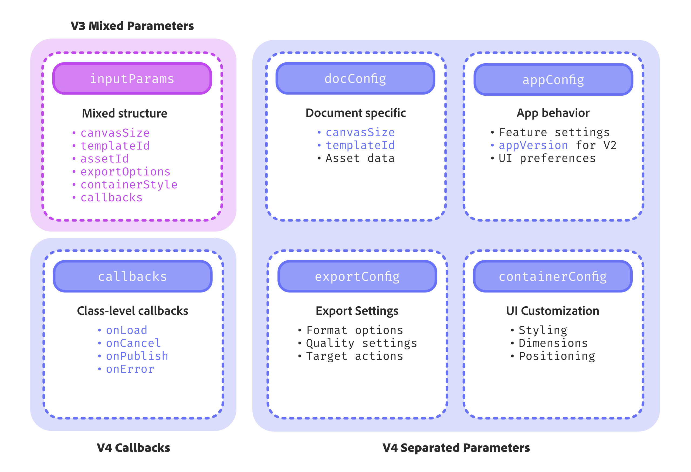

---
keywords:
 - V3
 - Migration Guide
 - V4
 - Adobe Express SDK V3 deprecation
 - V4 Features
 - Adobe Express Embed SDK migration
title: Migration Guide
description: This is a migration guide for V3 to V4.
contributors:
 - https://github.com/nimithajalal
---

# Migration Guide: Adobe Express Embed SDK V3 to V4

This guide will assist you in updating your Adobe Express Embed SDK integration from V3 to v4.

## Overview

Adobe Express Embed SDK V4 introduces a more verbose set of APIs, simplifies parameters, and removes redundancies.

### **Breaking Changes**

- Update SDK version from V3 to V4
- Restructure initialization parameters (3 parameters instead of 2)
- Move callbacks from API-level to class-level
- Replace single APIs with workflow-specific methods
- Update parameter structure (4 new parameter types)

### **API Mapping**

- `createDesign()` → `editor.create()`, `editor.createWithAsset()`, or `editor.createWithTemplate()`
- `editDesign()` → `editor.edit()`
- `openQuickAction()` → specific `quickAction.*()` methods

### **Parameter Changes**

- Separate mixed parameters into: `DocConfig`, `AppConfig`, `ExportConfig`, `ContainerConfig`
- Merge `userInfo` and `authInfo` into single `authOption`
- Remove `quickActionId` (use specific methods instead)

### **Optional Enhancements**

- Enable V2 module features (if using modules)
- Review new workflow capabilities
- Update internal documentation

## Understanding V4 Workflows

In V3, there were three main APIs: `createDesign()`, `EditDesign()`, and `openQuickActions()`. These APIs differentiated user intent by analyzing parameters provided by partner teams, subsequently initiating the appropriate workflow. However, this approach increased the parameters for each API, as they were designed to cater to multiple user intents.

We have addressed this issue in V4 by segmenting the APIs into ***workflows*** based on user intent and providing more descriptive API names.

The three workflows are as follows:

- **Module Workflow** - For focused editing tasks
- **Editor Workflow** - For full design creation and editing
- **Quickaction Workflow** - For quick image/video transformations

## API Migration Overview

The following diagram shows how the previous API relates to the current new APIs:


### Parameter Restructuring

V4 introduces a cleaner parameter structure with four distinct parameter types instead of mixed parameters:



The four parameters are:

- `DocConfig` - Describes the starting point of a workflow, for example, canvas size for Express Editor.
- `AppConfig` - properties that configure the target application starting behaviour.
- `ExportConfig` - properties that govern the export behaviour of a workflow.
- `ContainerConfig` - UI properties that customize the SDK container.

**Example transformation:**

**V3**: `ccEverywhere.createDesign(inputParams);`

**V4**: `ccEverywhere.editor.create(docConfig, appConfig, exportConfig, containerConfig);`

## Complete API Reference

### New V4 APIs by Workflow

#### Module Workflow (New in V4)

| V4 API | Description |
|--------|-------------|
| `CCEverywhere.module.editImage` | Start editing an asset using image module |
| `CCEverywhere.module.createImageFromText` | Generate images using text prompts with mini editing experience |

#### Editor Workflow

| V3 API | V4 API | Description |
|--------|--------|-------------|
| `createDesign()` (blank canvas) | `CCEverywhere.editor.create()` | Initiates workflow using blank canvas |
| `createDesign()` (with asset) | `CCEverywhere.editor.createWithAsset()` | Preloads image asset onto canvas |
| `createDesign()` (with template) | `CCEverywhere.editor.createWithTemplate()` | Starts with Adobe Express template ID |
| `editDesign()` | `CCEverywhere.editor.edit()` | Modifies existing Adobe Express Document |

#### Quick Action Workflow

| V3 API | V4 API Examples | Description |
|--------|-----------------|-------------|
| `openQuickAction()` (with ID) | `CCEverywhere.quickAction.cropImage()` | Individual methods for each action |
| | `CCEverywhere.quickAction.convertToJPEG()` | Convert image to JPEG format |
| | `CCEverywhere.quickAction.convertToPNG()` | Convert image to PNG format |
| | `CCEverywhere.quickAction.resizeImage()` | Resize image dimensions |

### Deprecated Features

- **APIs**: `createDesign()`, `editDesign()`, `openQuickAction()`
- **Parameters**: `quickActionId`, mixed input parameters, API-level callbacks
- **Auth structure**: Separate `userInfo` and `authInfo` (now merged into `authOption`)

## Step-by-Step Migration Guide

Now that you understand the conceptual changes, let's walk through the practical migration steps:

### 1:Update SDK Version

First, update your script tag or import statement to use the V4 SDK.

**Find the latest version:** Check [https://cc-embed.adobe.com/sdk/v4/CCEverywhere.js](https://cc-embed.adobe.com/sdk/v4/CCEverywhere.js) for the current version number.


<CodeBlock slots="heading, code" repeat="3" languages="HTML, JavaScript, JavaScript" />

#### V4 HTML Script Tag

```html
&lt; !-- V4 - Updated version -- &gt;
<script src="https://cc-embed.adobe.com/sdk/v4/CCEverywhere.js"></script>
```

#### V3 HTML Script Tag

```html
&lt; !-- V3 - Previous version -- &gt;
<script src="https://cc-embed.adobe.com/sdk/v3/CCEverywhere.js"></script>
```

#### npm/Bundler Import Update

```javascript

// V4 - Updated import
import CCEverywhere from '@adobe/cc-everywhere-sdk/v4';

// Alternative CDN import for modules
await import("https://cc-embed.adobe.com/sdk/v4/CCEverywhere.js");

// V3 - Previous import
import CCEverywhere from '@adobe/cc-everywhere-sdk/v3';
```

### 2: Update Initialization Code

Update your initialization code to use the new configuration parameters.

**Notable changes to parameters at Initialize level:**

- Host Info
- Config Params: Login Mode has moved from `configParams` to `AuthInfo` / `AuthProvider`.
- User Info and Auth Info: Both of these params are merged into one, `AuthInfo`.

**Callbacks**

We have moved callbacks from an API-level to a class-level parameter. This enables partners to pass their callbacks once during the lifecycle of SDK. The list of callbacks supported by SDK remains the same as it was in V3.

**Key Changes:**

- **3 parameters instead of 2**: Added `authOption` as third parameter
- **Merged auth parameters**: `userInfo` and `authInfo` combined into `authOption`
- **Callbacks moved to class-level**: Set once during initialization instead of per API call

<CodeBlock slots="heading, code" repeat="3" languages="HTML, JavaScript, TypeScript" />

#### V3 HTML Script Tag

```html
<script src="https://cc-embed.adobe.com/sdk/v3/CCEverywhere.js"></script>
<script>
  // V3 Initialization
  const ccEverywhere = await window.CCEverywhere.initialize(
    { clientId: "your-client-id", appName: "your-app-name" },
    { /* configParams */ }
  );
</script>
```

#### V4 HTML Script Tag

```javascript
<script src="https://cc-embed.adobe.com/sdk/v4/CCEverywhere.js"></script>
<script>
  // V4 Initialization with enhanced parameters
  const ccEverywhere = await window.CCEverywhere.initialize(
    { clientId: "your-client-id", appName: "your-app-name" }, // hostInfo
    { /* configParams */ }, // configParams
    { /* merged auth options */ } // authOption
  );
</script>
```

#### V3 vs V4 TypeScript Signatures

```typescript
// V3 - Basic initialization
initialize: (hostInfo: HostInfo, configParams?: ConfigParams) => Promise<CCEverywhere>

// V4 - Enhanced initialization with merged auth
initialize: (
  hostInfo: HostInfoSpecifiedBase, 
  configParams?: ConfigParamsBase, 
  authOption?: AuthOption
) => Promise<CCEverywhere>
```

### 3: Migrate Your API Calls

The most significant change in V4 is the move from single APIs to workflow-specific methods. Here's how to migrate each type:

#### Editor workflow API migration

<CodeBlock slots="heading, code" repeat="3" languages="JavaScript, JavaScript, JavaScript" />

#### V3 createDesign - Single API

```javascript
// V3 - Single API with complex parameters
const result = await ccEverywhere.createDesign({
  callbacks: {
    onCancel: () => console.log('Cancelled'),
    onPublish: (publishParams) => console.log('Published', publishParams),
    onError: (err) => console.log('Error', err)
  },
  inputParams: {
    // Mixed parameters for different intents
    canvasSize: { width: 800, height: 600 },
    templateId: 'some-template-id',
    assetId: 'some-asset-id'
  }
});
```

#### V4 editor.create - Blank Canvas

```javascript
// V4 - Separate method for blank canvas
const result = await ccEverywhere.editor.create(
  { canvasSize: { width: 800, height: 600 } }, // docConfig
  { /* app configuration */ }, // appConfig
  { /* export settings */ }, // exportConfig
  { /* UI customization */ }  // containerConfig
);
```

#### V4 Specific Methods - Templates & Assets

```javascript
// V4 - For templates:
const result = await ccEverywhere.editor.createWithTemplate(
  { templateId: 'some-template-id' }, // docConfig
  { /* app configuration */ }, // appConfig
  { /* export settings */ }, // exportConfig
  { /* UI customization */ }  // containerConfig
);

// V4 - For assets:
await ccEverywhere.editor.createWithAsset(
  { asset: { dataUrl: 'data:image/jpeg;base64,...' } }, // docConfig
  { /* app configuration */ }, // appConfig
  { /* export settings */ }, // exportConfig
  { /* UI customization */ }  // containerConfig
);
```

#### Quick Action workflow API migration

<CodeBlock slots="heading, code" repeat="2" languages="JavaScript, JavaScript" />

#### V3 openQuickAction - Single API with ID

```javascript
// V3 - Single API with action ID
const result = await ccEverywhere.openQuickAction({
  quickActionId: 'crop-image',
  inputParams: {
    asset: { dataUrl: 'data:image/jpeg;base64,...' }
  },
  callbacks: {
    onCancel: () => console.log('Cancelled'),
    onPublish: (publishParams) => console.log('Published', publishParams)
  }
});
```

#### V4 quickAction - Specific Methods

```javascript
// V4 - Specific method for each action (no ID needed)
const result = await ccEverywhere.quickAction.cropImage(
  { asset: { dataUrl: 'data:image/jpeg;base64,...' } }, // docConfig
  { /* app configuration */ }, // appConfig
  { /* export settings */ }, // exportConfig
  { /* UI customization */ }  // containerConfig
);

// Other quick actions available:
await ccEverywhere.quickAction.convertToJPEG(docConfig, appConfig, exportConfig, containerConfig);
await ccEverywhere.quickAction.convertToPNG(docConfig, appConfig, exportConfig, containerConfig);
await ccEverywhere.quickAction.resizeImage(docConfig, appConfig, exportConfig, containerConfig);
```

**For complete API reference and all available methods, see:**

- [V4 Editor API Reference](../../v4/sdk/src/workflows/3p/editor-workflow/classes/editor-workflow.md)
- [V4 Module API Reference](../../v4/sdk/src/workflows/3p/module-workflow/classes/module-workflow.md)
- [V4 Quick Action API Reference](../../v4/sdk/src/workflows/3p/quick-action-workflow/classes/quick-action-workflow.md)

### 4: Update Parameter Structure

V4 uses a consistent four-parameter structure across all APIs. Here's how to restructure your existing parameters:

#### Parameter restructuring:

<CodeBlock slots="heading, code" repeat="2" languages="JavaScript, JavaScript" />

#### V3 Mixed Parameters Structure

```javascript
// V3 - Mixed parameters in single object
const v3Params = {
  callbacks: { /* callbacks */ },
  inputParams: {
    canvasSize: { width: 800, height: 600 },
    exportOptions: { format: 'jpeg' },
    containerStyle: { backgroundColor: 'white' }
  }
};

// Usage
await ccEverywhere.createDesign(v3Params);
```

#### V4 Separated Parameter Structure

```javascript
// V4 - Organized into four distinct parameter objects
const docConfig = { canvasSize: { width: 800, height: 600 } };
const appConfig = { /* application settings */ };
const exportConfig = { format: 'jpeg' };
const containerConfig = { backgroundColor: 'white' };

// Usage (callbacks moved to initialization)
await ccEverywhere.editor.create(docConfig, appConfig, exportConfig, containerConfig);
```

### 5: Enable V2 Module Features (Optional)

If you want to access the latest module features with enhanced capabilities, you need to enable V2 modules by setting `appVersion` to `"2"` in your app configuration:

<CodeBlock slots="heading, code" repeat="2" languages="JavaScript, JavaScript" />

#### V1 Module Configuration (Default)

```javascript
// V1 - Default module experience
const appConfig = {
  // appVersion not specified defaults to V1
  // ... other app configuration
};

// Standard module functionality
const result = await ccEverywhere.module.createImageFromText(
  { prompt: 'A beautiful sunset over mountains' }, // docConfig
  appConfig, // V1 configuration
  exportConfig,
  containerConfig
);
```

#### V2 Module Configuration (Enhanced)

```javascript
// V2 - Enhanced module features
const appConfig = {
  appVersion: "2", // This enables V2 module features
  // Additional V2-specific configurations:
  featureConfig: {
    "community-wall": true,
    "fast-mode": true
  },
  thumbnailOptions: ["rich-preview", "edit-dropdown"]
};

// Enhanced V2 module functionality
const result = await ccEverywhere.module.createImageFromText(
  { prompt: 'A beautiful sunset over mountains' }, // docConfig
  appConfig, // V2 configuration with enhanced features
  exportConfig,
  containerConfig
);
```

**Note:** Setting `appVersion: "2"` is separate from the V3→V4 SDK migration but is required to access the full range of new module capabilities. This step is only relevant if you're using module workflows.

#### V2 Module Enhancements:

**Generate Image V2 features:**

- Community Wall with user-generated inspiration
- Fast Mode for quicker generation
- Rich Preview for better image viewing
- Thumbnail Actions for immediate editing
- Custom Firefly Models (enterprise feature)

**Edit Image V2 features:**

- 35-50% reduced load times
- 35% reduced memory consumption
- Redesigned UI with Adobe Spectrum 2
- Tabbed interface for better organization

<InlineAlert variant="info" slots="text1, text2" />

For detailed information on V2 module features and configuration options:

- **[Generate Image V2 Guide](./generate-image-v2.md)**: Complete guide for the enhanced text-to-image experience
- **[Edit Image V2 Guide](./edit-image-v2.md)**: Complete guide for the improved image editing experience

### 6: Test Your Implementation

After updating your code, thoroughly test your implementation to ensure everything works as expected. Pay particular attention to:

- **Initialization**: Ensure the SDK initializes correctly with the new configuration parameters.
- **API Calls**: Validate that all API calls function as intended with the updated method signatures and parameters.
- **Event Handling**: Verify that events are being handled correctly and that any callbacks are working as expected.
- **User Interactions**: Test all user interactions within the embedded content to ensure they are smooth and error-free.
- **Performance**: Monitor the performance to confirm that the enhancements in V4 are realized in your application.

Here are some specific tests you can perform:

#### Initialization tests

- Ensure the SDK correctly initializes with the `initialize` method.
- Verify that the iframe is appended to the correct parent element.
- Check that the iframe size, padding, border radius, and background color are applied as specified.

#### Full editor API tests

- Test loading a template or design using `create`, `createWithAsset`, and `createWithTemplate`.
- Validate that the editor sets the default category, search text, template type, and titles correctly.
- Ensure that export options, multi-page settings, allowed file types, and image quality settings are applied properly.

#### Quick action API tests

- Test various Quick action APIs such as image and video editing.
- Validate that standard inputs for Quick Actions are working correctly.
- Ensure that API-specific parameters are applied and functioning as expected.

#### Modules API tests

- Test loading an asset in the modules using `editImage` or `createImageFromText`.
- Verify that the asset is displayed and editable.
- Check that export options and allowed file types are correctly configured.

### 7: Explore New V4 Features

Take advantage of new features introduced in V4:

#### New V4 Features:

- **[Module Workflow](../../v4/sdk/src/workflows/3p/module-workflow/classes/module-workflow.md)**: New `editImage` and `createImageFromText` capabilities
- **[Enhanced Editor APIs](../../v4/sdk/src/workflows/3p/editor-workflow/classes/editor-workflow.md)**: More granular control with separate create methods
- **[Individual Quick Actions](../../v4/sdk/src/workflows/3p/quick-action-workflow/classes/quick-action-workflow.md)**: Specific methods for each quick action type
- **Improved Parameter Structure**: Cleaner separation of concerns with four parameter types
- **Class-level Callbacks**: Set callbacks once during initialization instead of per API call

#### Additional Resources:

- **[V4 Release Notes](../changelog/index.md)**: Complete list of changes and improvements
- **[V4 API Reference](../../v4/index.md)**: Full documentation of all V4 APIs
- **[Troubleshooting Guide](../troubleshooting/)**: Common issues and solutions during migration

Some new features might include:

- Enhanced configuration options for better customization.
- New methods and parameters to provide more control over the SDK.
- Improved performance and security features.

### 8: Update Documentation and Dependencies

Ensure your internal documentation is updated to reflect the changes made during the migration. Also, update any dependencies interacting with Adobe Express Embed SDK to ensure compatibility. This includes:

- Updating any code samples or snippets in your documentation.
- Modifying any integration guides or setup instructions.
- Ensuring all team members know the changes and how to use the new SDK features.

## Migration Summary

Congratulations! You've successfully migrated from Adobe Express Embed SDK V3 to V4. Here's what you've accomplished:

### ✅ Core Migration Complete

- **Updated SDK version** from V3 to V4
- **Restructured initialization** with new 3-parameter structure
- **Migrated API calls** to workflow-specific methods
- **Reorganized parameters** into the new 4-parameter structure

### 🎯 Key Benefits Achieved

- **Cleaner API structure** with workflow-based organization
- **Better parameter separation** for easier maintenance
- **Enhanced functionality** with new module capabilities
- **Improved performance** and scalability

### 📚 Next Steps

If you encounter any issues during migration, consult our [Troubleshooting Guide](../troubleshooting/) for common solutions.

For ongoing development, bookmark these essential resources:

- **[V4 API Reference](../../v4/index.md)** - Complete V4 documentation
- **[V4 Release Notes](../changelog/index.md)** - Latest updates and features
- **[Migration Checklist](#migration-summary)** - Review completed items

<DiscoverBlock slots="heading, link, text"/>

## API References

[CCEverywhere](../../v4/sdk/src/3p/cc-everywhere/classes/cc-everywhere.md)

Once you have successfully initialized the SDK, a Promise will be returned containing the `CCEverywhere` object.

<DiscoverBlock slots="link, text"/>

[Editor API](../../v4/sdk/src/workflows/3p/editor-workflow/classes/editor-workflow.md)

Provides API References for /Editor API.

<DiscoverBlock slots="link, text"/>

[Module API](../../v4/sdk/src/workflows/3p/module-workflow/classes/module-workflow.md)

Provides API References for /Module API.

<DiscoverBlock slots="link, text"/>

[Quick Action API](../../v4/sdk/src/workflows/3p/quick-action-workflow/classes/quick-action-workflow.md)

Provides API References for /Quick Action API.
