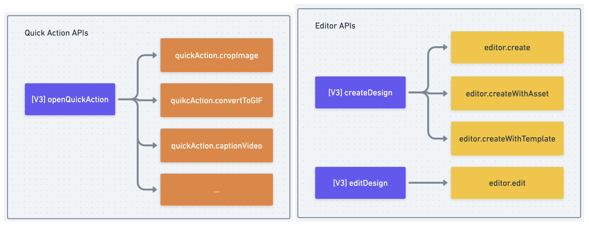
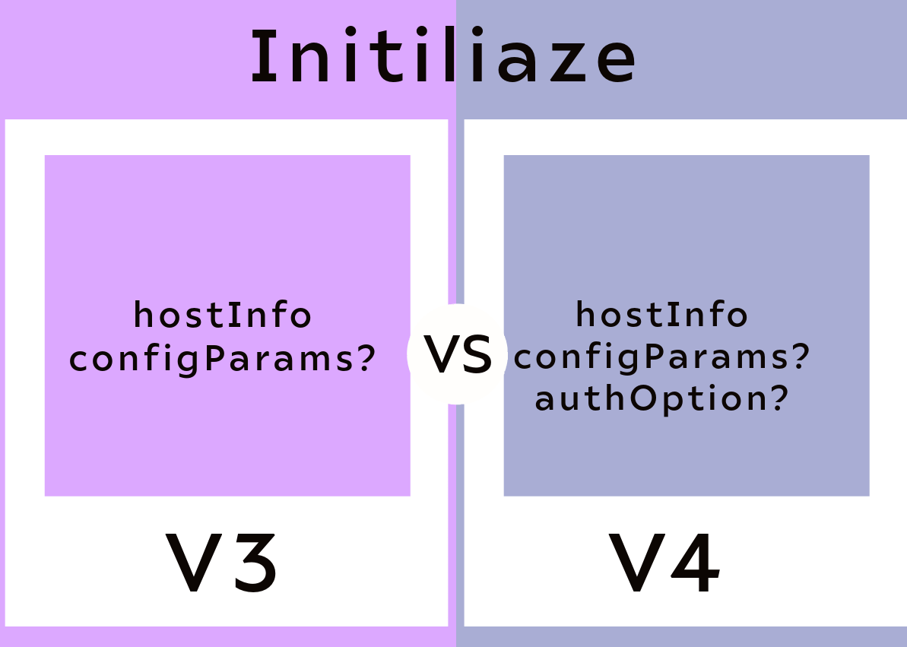

---
keywords:
 - V3
 - AssetType
 - AssetDataType
 - CanvasAspectId
 - EditorPanelView
 - ExportOptions
 - TemplateType
 - Asset
 - Output
 - Modal parameters
 - ModalParams
 - Size
 - PublishParams
 - onPublish
 - Callbacks
 - OutputParams
title: Migration Guide
description: This is a migration guide for V3 to V4.
contributors:
 - https://github.com/nimithajalal
---

# Migration Guide: Adobe Express Embed SDK V3 to V4
 
This guide will assist you in updating your Adobe Express Embed SDK integration from V3 to v4.

## Overview

Adobe Express Embed SDK V4 introduces a more verbose set of APIs, simplifies parameters, and removes redundancies.

SDK V4 was developed to streamline the existing APIs and create a scalable model to accommodate the expanding range of SDK Target Applications. Accordingly, APIs are categorized into three distinct workflows, each corresponding to one of the SDK's supported target applications. This categorization further refines the APIs, making them more detailed and aligned with user intent. The transition from V3 to V4 brought several changes.

## Workflow API changes

In V3, there were three main APIs: `createDesign`, `EditDesign`, and `openQuickActions`.

These APIs differentiated user intent by analyzing parameters provided by partner teams, subsequently initiating the appropriate workflow. However, this approach increased the parameters for each API, as they were designed to cater to multiple user intents. 

V4 addressed this issue by segmenting the APIs into workflows based on user intent and providing more descriptive API names.

### V4 Key changes

#### Introducing `Module` APIs through Module Workflow

The introduction of Module APIs such as `editImage` and `createImageFromText`.

#### Editor workflow

- `create` initiates a workflow using a blank canvas.  
- `createWithAsset` allows an image asset to be preloaded onto the canvas.  
- `createWithTemplate` enables starting with a given Adobe Express template ID.  
- `edit` allows modification using an existing Adobe Express Document ID.  

#### Quick action workflow

`openQuickAction` has been decommissioned and replaced with individual `quick action-named` APIs such as `cropImage`, eliminating the need for partners to submit a quick action ID.

## Workflow API Changes

For all the workflow APIs, we will now have four parameters.

The four parameters are:

- `DocConfig` - Describes the starting point of a workflow, for example, canvas size for Express Editor.
- `AppConfig` - properties that configure the target application starting behaviour. 
- `ExportConfig` - properties that govern the export behaviour of a workflow.
- `ContainerConfig` - UI properties that customize the SDK container.

UserInfo, AuthInfo, and Callbacks have been removed from a workflow API level and added at the `initialize` level.

The following diagram shows how the previous API relates to the current new APIs:



### Workflow API example

**V3**: `Editor create API: ccEverywhere.createDesign(inputParams);`

**V4**: `Editor create API: ccEverywhere.editor.create(docConfig, appConfig, exportConfig, containerConfig);`

## Parameter details

### Base parameters

#### Base Export Config

```ts
{
  /**
 * Desired asset data type for images.
 * For image output types, host can set this property to either base64 or url. The default type for images is base64.
 * For videos, we will always send the output as a URL irrespective of this property.
 * @default base64
 */
  outputType?: AssetDataType;
}
```
#### Base Container Params

``` ts
{
  /** Id of element to which iframe must be appended. By default, it is appended to the body.*/
  parentElementId?: string;
  /** Maximum size boundary of the iframe.*/
  size?: PixelSize;
  /** Minimum size boundary of the iframe.*/
  minSize?: PixelSize;
  /** Padding applied to the iframe in pixels.*/
  padding?: number;
  /** Border Radius applied to the iframe in pixels. */
  borderRadius?: number;
  /** Override the background color of the iframe. By default this is as per theme. */
  backgroundColor?: string;
  /** Show spinner while loading target app. Default is true. */
  showLoader?: boolean;
  /**
 * If target app doesn't open within this time (in ms, same as of setTimeout),
 * the error callback is invoked with error code TARGET_LOAD_TIMED_OUT.
 */
  loadTimeout?: number;
}
```

### Full editor API parameters

The modal params are the same for all editor-specific APIs. We have the inheritance of input and output params, as shown below. 

#### Editor App Params inherit Base App params

```ts
{
  /** Category to show by default */
  defaultCategory?: EditorPanelView;
  /** Search text to pass in the editor for selected panel. */
  categorySearchText?: string;
  /** Canvas template type */
  templateType?: TemplateType;
  /** Properties to configure the Editor and Modal titles */
  editorTitle?: string;
  publishModalTitle?: string;
  publishErrorModalTitle?: string;
}
```

#### Editor Export Params inherit Base Export params

```ts
{
  exportOptions?: ExportOptionsEditor[];
  /**
 * Decides whether the multiple pages can be exported
 * @default true
 */
  multiPage?: boolean;
  /**
 * Specify the list of file types that the user can download.
 * This can be used to limit the download options as per file types for end users.
 * This limitation is applied to both native download and custom download scenarios.
 */
  allowedFileTypes?: FileType[];
  /**
 * Value between 0 and 1 to control the quality of the image.
 * Currently, only supported for ImageFileType.JPEG when exporting.
 * @minimum 0
 * @maximum 1
 */
  imageQuality?: number;
}
```

### Full Editor API-Specific Input Params

#### Create Doc Params inherits Editor Doc Params

```ts
{
  /** Canvas and template size or aspect ratio. */
  canvasSize?: Size | CanvasAspectId;
}
```

#### Create with Asset Doc params inherits Create Doc params 

```ts
{
  /** Asset from the client application to start editing with. */
  asset: AssetInfo;
}

```

#### Create with Template Doc params inherits Editor Doc params

```ts
{
  /** Start the editor workflow with a template */
  templateId: string;
}
```

#### Edit Doc Params inherit Editor Doc Params

```ts
{
  /** Document Id of the Express project */
  documentId: string;
}
```

### Module API parameters

We have the same Modal Params as the base params for Modules.

### Module API-Specific Input Params

#### Image Module

**Image Module Doc Params inherits base doc params**

```ts
{
  /** Asset from the host application to start editing with. */
  asset: Asset;
}

```
**Image Module Export Params inherits base Export params**

```ts
{
  /** Export options to be displayed in Image Module. */
  exportOptions?: ExportOptionsEditor[];
  /**
 * Specify the list of file types that the user can download.
 * This can be used to limit the download options as per file types for end users.
 * This limitation is applied to both native download and custom download scenarios.
 */
  allowedFileTypes?: FileType[];
}
```

#### Text to Image Module

**Image Module App Params inherits base App params**

```ts
{
  /** Text to search the template */
  promptText?: string;
}
```

**Image Module Export Params inherits base Export params**

```ts
{
  /**
 * Export options to configure the header buttons
 * Not used as of now
 */
  exportOptions?: ExportOptions[];
}
```

### Quick Action API parameters

For Quick actions, Container params are the same as base params. We only have changes in the Doc params, App Params, and Container Params. There are a few exceptions where the params have deviated, for example merge videos which have their own set of Doc params.

So, here we have created 3 level hierarchy which is as follows:

- `QuickActionDocParams`: This contains the common inputs for all QA.
- `<Image / Video>QuickActionDocParams extends QuickActionDocParams`: This contains the inputs relevant for a particular QA type (Image/Video/PDF).
- `<API-Specific>QuickActionParams extends Image/VideQuickActionParams`: inputs specific for a particular API.


**Quick Action App Params inherits Base App Params**

```ts
{
  /** Theming options for the Quick Action Editor */
  colorTheme?: ColorTheme;
  spectrumTheme?: SpectrumTheme;
  scale?: Scale;
  /** Boolean that tells whether to receive target application errors or not to client. */
  receiveTargetErrors?: boolean;
}
```

**Quick Action Doc Params inherits Base Doc Params**

```ts
{
  /** Asset from the client application to start editing with. */
  asset?: Asset;
}
```

**Merge Videos Doc Params inherits Base Doc Params**

```ts
{
  /** Asset from the client application to start editing with. */
  asset?: Asset[];
}
```

We have the same output params for all Quick Action APIs as of now: 

**QuickActionExportParams inherits BaseExportParams**

```ts
{
  /** Export options for the asset that is created. These options would be visible in the quick action editor */
  exportOptions?: ExportOptions[];
}
```

## Step-by-Step Migration

### 1. Update SDK Version

Use this link to get the latest version -- [https://cc-embed.adobe.com/docs/v4/release/3p/modules.html](https://cc-embed.adobe.com/docs/v4/release/3p/modules.html)

### 2. Update Initialization Code

Update your initialization code to use the new configuration parameters.

Notable Changes to Parameters at Initialize Level:

- Host Info
- Config Params: Login Mode has moved from `configParams` to `AuthInfo` / `AuthProvider`.
- User Info and Auth Info: Both of these params are merged into one, `AuthInfo`.

**Callbacks**

We have moved callbacks from an API-level to a class-level parameter. This enables partners to pass their callbacks once during the lifecycle of SDK. The list of callbacks supported by SDK remains the same as it was in V3.

With all the above changes, the SDK initialization API can be visualized using the following diagram:



**V3:**

```ts
initialize: (hostInfo: HostInfo, configParams?: ConfigParams) => Promise<CCEverywhere>
```

**V4:**

```ts
initialize: ((hostInfo: HostInfoSpecifiedBase, configParams?: ConfigParamsBase, authOption?: AuthOption) => Promise<CCEverywhere>); terminate: (() => boolean)
```

### 3. Adjust API Calls
 
Review and update your API calls to match the new method signatures and parameters in V4.

### 4. Handle deprecated parameters

Identify and replace any deprecated features in your codebase. For alternatives and updated methods, refer to the V4 documentation.

### 5. Test your implementation

After updating your code, thoroughly test your implementation to ensure everything works as expected. Pay particular attention to:

- **Initialization**: Ensure the SDK initializes correctly with the new configuration parameters.
- **API Calls**: Validate that all API calls function as intended with the updated method signatures and parameters.
- **Event Handling**: Verify that events are being handled correctly and that any callbacks are working as expected.
- **User Interactions**: Test all user interactions within the embedded content to ensure they are smooth and error-free.
- **Performance**: Monitor the performance to confirm that the enhancements in V4 are realized in your application.

Here are some specific tests you can perform:

#### Initialization tests

- Ensure the SDK correctly initializes with the `initialize` method.
- Verify that the iframe is appended to the correct parent element.
- Check that the iframe size, padding, border radius, and background color are applied as specified.

#### Full editor API tests

- Test loading a template or design using `create`, `createWithAsset`, and `createWithTemplate`.
- Validate that the editor sets the default category, search text, template type, and titles correctly.
- Ensure that export options, multi-page settings, allowed file types, and image quality settings are applied properly.

#### Quick Action API tests

- Test various Quick Action APIs such as image and video editing.
- Validate that standard inputs for Quick Actions are working correctly.
- Ensure that API-specific parameters are applied and functioning as expected.

#### Modules API tests

- Test loading an asset in the modules using `editImage` or `createImageFromText`.
- Verify that the asset is displayed and editable.
- Check that export options and allowed file types are correctly configured.

### 6. Review new features

Take advantage of new features introduced in V4. Review the release notes and documentation to explore new functionalities that could enhance your application. Some new features might include:

- Enhanced configuration options for better customization.
- New methods and parameters to provide more control over the SDK.
- Improved performance and security features.

### 7. Update Documentation and Dependencies

Ensure your internal documentation is updated to reflect the changes made during the migration. Also, update any dependencies interacting with Adobe Express Embed SDK to ensure compatibility. This includes:

- Updating any code samples or snippets in your documentation.
- Modifying any integration guides or setup instructions.
- Ensuring all team members know the changes and how to use the new SDK features.

## Conclusion

Migrating from Adobe Express Embed SDK V3 to V4 involves updating initialization code and API calls and handling deprecated features. 

By following this guide, you can ensure a smooth transition and take advantage of V4's new features and improvements.
