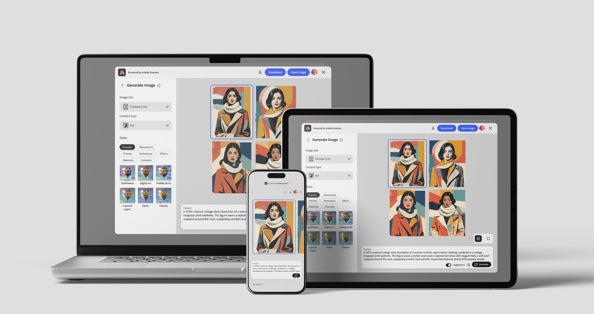

---
keywords:
  - Embed SDK
  - Mobile Web
  - Browser Support
  - Mobile Devices
  - Cross-Platform
  - Responsive Design
  - Mobile SDK
  - WebView
description: Learn how to use the Adobe Express Embed SDK on mobile devices to integrate creative workflows into your applications.
contributors:
  - https://github.com/nimithajalal
  - https://github.com/undavide
---

# Mobile Web Overview

Learn how developers can use the Adobe Express Embed SDK on mobile devices to integrate creative workflows into their apps.

## Devices and Runtimes

The Embed SDK can run on both Desktop and Mobile devices alike. Developers can choose to implement the SDK in different ways:

|     | Device         | Integration type | Runtime | Description                                                |
| --- | -------------- | ---------------- | ------- | ---------------------------------------------------------- |
| 1   | 🖥️ **Desktop** | Web              | Browser | Embed SDK runs in Desktop Browsers.                        |
| 2   | 📱 **Mobile**  | Mobile Web       | Browser | Embed SDK runs in Mobile Browsers.                         |
| 3   | 📱 **Mobile**  | Mobile Web       | WebView | Web experience through iOS/Android Apps (in-app WebViews). |
| 4   | 📱 **Mobile**  | Native           | App     | iOS/Android Apps using Swift/Kotlin Mobile SDKs.           |

A Web experience can be accessed on both Desktop and Mobile devices through a browser (1, 2). The same exact Web experience can also be consumed by iOS/Android Mobile apps (3) when loaded into a WebView. Native iOS/Android Mobile apps can alternatively use the dedicated Mobile SDKs (4), available for [Swift](https://github.com/AdobeDocs/express-embed-mobile-sdk-ios-release/tree/main/) and [Kotlin](https://github.com/AdobeDocs/express-embed-mobile-sdk-android-release).

This set of guides will focus on the **Web experience** (1-3), so that your integration can work seamlessly on smartphones, tablets, and other mobile devices.

## What is Mobile Web?

Mobile Web (**mWeb**) refers to the Embed SDK Web experience on mobile devices, accessed either through a mobile browser or within iOS and Android apps that load the experience in a WebView.

A **WebView** is a native component that renders Web content inside Mobile Apps, allowing users to interact with Web experiences without leaving the application. Think about it as a browser without the browser's UI.

## Mobile Web vs. Mobile SDKs

Both approaches bring Embed SDK workflows to iOS/Android, but they have different trade-offs.

- **Mobile Web**
  - Pros: one web codebase, fast iteration, good for cross-platform parity.
  - Cons: more browser/WebView variability (performance, UX), platform-specific quirks.
- **Mobile SDKs**
  - Pros: best mobile UX and more predictable behavior.
  - Cons: the Mobile SDKs are **currently in beta** and may not cover all Embed SDK features yet.

<InlineAlert slots="header, text" variant="info" />

### Recommendations

For native Mobile apps, we suggest using the [Swift](https://github.com/AdobeDocs/express-embed-mobile-sdk-ios-release/tree/main/) and [Kotlin](https://github.com/AdobeDocs/express-embed-mobile-sdk-android-release) Mobile SDKs when possible. We still support mWeb because many apps are primarily WebView shells around Web experiences, and going end-to-end Web is often the simplest, cheapest, and most pragmatic integration path.

## Known Limitations

Mobile Web on iOS devices **only supports** [Generate Image](./generate-image-v2.md) and [Edit Image](./edit-image-v2.md) modules.

## Read Next

- [Mobile Web in the Browser](./mobile-web-support-browser.md)
- [Mobile Web in a WebView](./mobile-web-support-webview.md)
- [Mobile Web Tutorial](../tutorials/mobile-web.md), an end-to-end tutorial featuring Web, Android, and iOS sample projects.
