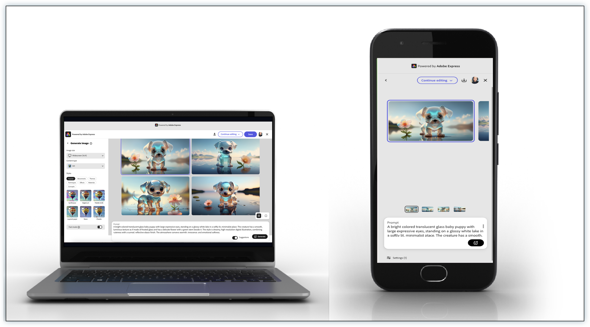

---
keywords:
  - Embed SDK
  - Mobile Web
  - Browser Support
  - skipBrowserSupportCheck
  - Mobile Devices
  - Cross-Platform
  - Responsive Design
description: Enable mobile web support using the Adobe Express Embed SDK and the skipBrowserSupportCheck configuration parameter.
contributors:
  - https://github.com/nimithajalal
---

# Mobile Web Support

The Adobe Express Embed SDK supports mobile web out of the box, allowing developers to implement creative workflows on mobile devices.

## What is Mobile Web Support?

The Adobe Express Embed SDK natively supports mobile web browsers, enabling developers to implement creative workflows across desktop and mobile devices. Mobile web support allows your applications to work seamlessly on smartphones, tablets, and other mobile devices through web browsers.



## When to Use Mobile Web Support

Mobile web support is ideal for applications that need to reach users across all devices. Consider implementing mobile web support when:

- **Building responsive applications**: Your application needs to work seamlessly on both desktop and mobile devices
- **Targeting mobile-first audiences**: Your users primarily access your application through mobile devices
- **Creating cross-platform experiences**: You want consistent creative workflows across different screen sizes and input methods
- **Supporting diverse browser environments**: Your users may be on various mobile browsers with different capabilities
- **Expanding user reach**: You want to make creative tools accessible to users regardless of their device

## Prerequisites

Before implementing mobile web support, you should have a solid understanding of the basic Adobe Express Embed SDK integration. We recommend completing the following resources first:

- **[Quickstart Guide](../quickstart/index.md)**: Learn the fundamentals of SDK integration, including setup, initialization, and basic configuration
- **[Getting Started Tutorial](../tutorials/getting-started.md)**: Follow a hands-on tutorial to build your first integration
- **[SDK Tutorials](../tutorials/index.md)**: Explore additional tutorials for specific workflows like Generate Image and Edit Image modules

Mobile web support builds upon these core concepts, so familiarity with standard SDK integration is essential before adding mobile-specific configurations.

## How to Implement Mobile Web Support

The Adobe Express Embed SDK works on mobile web by default. The [`skipBrowserSupportCheck`](../../v4/shared/src/types/host-info-types/interfaces/config-params-base.md) parameter is specifically designed to bypass browser compatibility checks that might otherwise cause the SDK to fail initialization on mobile browsers.

## Implementation Path

### 🎯 Quick Start

Perfect for getting mobile web support working immediately:

1. Set `skipBrowserSupportCheck: true`
2. Add basic mobile detection
3. Configure container sizing

### 🔧 Standard Implementation

For production-ready mobile experiences:

1. Add dynamic loading with error handling
2. Implement performance optimizations
3. Configure mobile-specific UI elements

### 🚀 Advanced Features 

For optimized, custom mobile experiences:

1. CDN mode for performance
2. Custom UI patterns for mobile
3. PWA integration

### Module Compatibility

While the Adobe Express Embed SDK works well across all workflows on mobile web, this section focuses on the Generate Image and Edit Image modules as they represent the most common use cases for mobile implementations.

#### Generate Image Module

The **[Generate Image module](./generate-image-v2.md#features-overview)** works well on mobile web with full functionality:

- Generate image from text
- Export options
- All standard such as styles, content types, etc.
- **[Rich Preview](./generate-image-v2.md#rich-preview)**: Not available on mobile phones, but available on tablets

#### Edit Image Module

The **[Edit Image module](./edit-image-v2.md)** is possible on mobile web but may have some limitations:

- Basic editing features such as crop, remove background, etc. work
- Some advanced features such as export options may have issues
- Performance may vary based on device capabilities
- Touch interface optimizations may be limited on mobile phones

### Configuration

#### 🚀 Quick Setup (Recommended)

Get mobile web support working in minutes

Use [`skipBrowserSupportCheck: true`](../../v4/shared/src/types/host-info-types/interfaces/config-params-base.md) to bypass browser compatibility checks and prevent SDK initialization failures on mobile browsers:

```javascript
const hostInfo = {
  clientId: "your-client-id", // Your application client ID
  appName: "your-app-name", // Your application name
};

// Skip browser compatibility checks for mobile web
const configParams = { 
  skipBrowserSupportCheck: true // 👈 Skip browser checks to prevent failures
};

// Initialize the Adobe Express Embed SDK
const { editor, module, quickAction } = await window.CCEverywhere.initialize(
  hostInfo,
  configParams
);
```

#### ⚙️ Advanced Configuration

For developers who need custom mobile optimizations

```javascript
const hostInfo = {
  clientId: "your-client-id",
  appName: "your-app-name",
  appVersion: { major: 1, minor: 0 },
  platformCategory: "web" // Required for applications
};

const configParams = { 
  skipBrowserSupportCheck: true, // Skip browser checks for mobile web
  locale: "en_US", // Optional: Set locale
  loginMode: "delayed" // Optional: Delay login until export
};

// Initialize with browser check bypass
const { editor, module, quickAction } = await window.CCEverywhere.initialize(
  hostInfo,
  configParams
);
```

### Understanding Browser Support

#### Standard Browser Requirements

By default, the Adobe Express Embed SDK has specific technical requirements for optimal performance. For complete details on browser versions, hardware requirements, and system specifications, see the [Technical Requirements](../quickstart/technical-requirements.md) guide.

#### Mobile Browser Considerations

Mobile browsers may have limitations that affect SDK functionality:

- **Performance**: Limited processing power and memory
- **WebGL support**: May be limited or unavailable
- **Touch interfaces**: Different interaction patterns
- **Screen size**: Smaller display areas
- **Network conditions**: Variable connectivity

### Implementation Strategies

Choose the approach that best fits your application:

| Strategy | Purpose | Complexity | Mobile Impact | When to Use |
|----------|---------|------------|---------------|-------------|
| [Mobile Detection](#1-mobile-detection-and-ui-configuration--essential) | Apply mobile configs automatically | Low | High | Every mobile implementation |
| [Container Sizing](#3-mobile-ui-container-sizing--essential) | Optimize UI for mobile screens | Low | High | Essential for good UX |
| [Dynamic Loading](#2-dynamic-sdk-loading) | Handle loading failures gracefully | Medium | Medium | Production applications |
| [CDN Mode](#4-cdn-mode-support) | Reduce bundle size | Medium | Medium | Performance optimization |
| [UI Patterns](#5-mobile-ui-implementation-pattern) | Custom touch interfaces | High | High | Advanced customization |

### Essential Strategies (Start Here)

#### Mobile Detection and UI Configuration ⭐ **Essential**

*Necessary to apply mobile-specific configurations only when needed, preventing desktop users from getting suboptimal mobile UI.*

Implement sophisticated mobile detection:

```javascript
// Advanced mobile detection function
function isMobileOrTablet() {
  const viewportWidth = window.innerWidth;
  const userAgent = navigator.userAgent;
  const isMobileDevice = /Android|webOS|iPhone|iPad|iPod|BlackBerry|IEMobile|Opera Mini/i.test(userAgent);
  const MIN_DESKTOP_WIDTH = 768;
  
  return isMobileDevice && viewportWidth < MIN_DESKTOP_WIDTH;
}

// Mobile UI toggle support
const urlParams = new URLSearchParams(window.location.search);
const forceMobileUI = urlParams.get('forceMobileUIOnDesktop') === 'true';
const enableMobileUi = isMobileOrTablet() || forceMobileUI;

const configParams = {
  skipBrowserSupportCheck: enableMobileUi, // Skip browser checks for mobile UI
  locale: "en_US"
};

try {
  const { editor, module, quickAction } = await window.CCEverywhere.initialize(
    hostInfo,
    configParams
  );
  
  // Mobile-specific optimizations
  if (enableMobileUi) {
    configureMobileExperience(editor, module, quickAction);
  }
} catch (error) {
  console.error("SDK initialization failed:", error);
  // Handle initialization failure gracefully
}
```

#### Mobile UI Container Sizing ⭐ **Essential**

*Necessary to ensure the SDK interface fits properly on smaller mobile screens and provides optimal user experience across devices.*

> **Quick Start**: Use `{ width: 390, height: 850, unit: 'px' }` for mobile container sizing

**Complete implementation example:**

```javascript
// Mobile container constants
const DEFAULT_MOBILE_SIZE = { width: 390, height: 850, unit: 'px' };
const MIN_DESKTOP_WIDTH = 768;

const getMobileConfig = () => {
  const isMobile = window.innerWidth < MIN_DESKTOP_WIDTH;
  
  return {
    skipBrowserSupportCheck: true,
    // Mobile-specific optimizations
    ...(isMobile && {
      // Use mobile container sizing
      containerSize: DEFAULT_MOBILE_SIZE,
      // Limit features for mobile
      allowedFileTypes: ['image/png', 'image/jpeg'], // Skip video/PDF on mobile
    })
  };
};

// Platform category detection for applications
const ccEverywhereConfig = {
  hostInfo: {
    ...hostInfo,
    platformCategory: 'web' // applications always use 'web' platform
  },
  configParams: getMobileConfig()
};

const { editor, module, quickAction } = await window.CCEverywhere.initialize(
  ccEverywhereConfig.hostInfo,
  ccEverywhereConfig.configParams
);
```

### Advanced Strategies

#### Dynamic SDK Loading

*Necessary to handle SDK loading failures gracefully and provide feature detection before attempting to use SDK functionality.*

> **Quick Start**: Add try-catch around SDK initialization and check feature availability before use

**Complete implementation example:**

```javascript
// Dynamic SDK import
async function loadSDK() {
  try {
    // Load SDK dynamically for applications
    let CCEverywhere = await import(`cc-everywhere-test-app/3p/CCEverywhere`);
    
    const configParams = {
      skipBrowserSupportCheck: true
    };

    const { editor, module, quickAction } = await CCEverywhere.initialize(
      hostInfo,
      configParams
    );

    // Check if features are available
    if (module && typeof module.createImageFromText === 'function') {
      // Enable text-to-image features in your UI
      document.getElementById('generate-image-btn').style.display = 'block';
      console.log('Text-to-image generation available');
    } else {
      // Provide fallback for limited mobile support
      document.getElementById('generate-image-btn').style.display = 'none';
      document.getElementById('feature-message').textContent = 'Some features are not available on your device';
      console.log('Limited feature set available on this device');
    }
    
    return { editor, module, quickAction };
  } catch (error) {
    console.error("SDK loading failed:", error);
    // Handle SDK loading failure
    return null;
  }
}
```

#### CDN Mode Support

*Necessary to reduce bundle size and improve loading performance, especially important for mobile users with slower connections.*

Implement CDN mode for loading SDK from external URLs:

```javascript
// CDN mode support for mobile web
async function loadSDKFromCDN(sdkLink, enableCdnMode = false) {
  if (enableCdnMode) {
    return new Promise((resolve) => {
      const script = document.createElement('script');
      script.src = sdkLink;
      script.onload = async () => {
        // Initialize SDK after script loads
        const configParams = {
          skipBrowserSupportCheck: true
        };
        
        const { editor, module, quickAction } = await window.CCEverywhere.initialize(
          hostInfo,
          configParams
        );
        
        resolve({ editor, module, quickAction });
      };
      script.onerror = (error) => {
        console.error("CDN SDK loading failed:", error);
        resolve(null);
      };
      document.body.appendChild(script);
    });
  } else {
    // Use local SDK loading
    return loadSDK();
  }
}
```

#### Mobile UI Implementation Pattern

*Necessary to provide different UI layouts and interactions optimized for touch interfaces and smaller screens.*

Implement conditional rendering for mobile UI:

```javascript
// Mobile UI conditional rendering
function renderMobileUI(enableMobileUi) {
  if (enableMobileUi) {
    // Mobile-specific layout
    return {
      containerSize: DEFAULT_MOBILE_SIZE,
      navigation: 'mobile', // Use mobile navigation
      sidebar: 'overlay', // Overlay sidebar on mobile
      layout: 'responsive'
    };
  } else {
    // Desktop layout
    return {
      containerSize: { width: '100%', height: '600px' },
      navigation: 'desktop',
      sidebar: 'persistent',
      layout: 'fixed'
    };
  }
}

// Apply mobile UI configuration
const mobileConfig = renderMobileUI(enableMobileUi);
const appConfig = {
  ...mobileConfig,
  callbacks: {
    onPublish: (intent, publishParams) => {
      // Handle mobile-specific publishing
      handleMobilePublish(publishParams);
    }
  }
};
```

## Best Practices

### 1. Graceful Degradation

Always provide fallback experiences for when mobile web support is limited. Implement proper error handling and alternative experiences when the SDK fails to initialize on mobile devices.

### 2. Performance Optimization

Optimize for mobile performance:

```javascript
const configParams = {
  skipBrowserSupportCheck: true,
  // Mobile-optimized settings
  loginMode: "delayed", // Reduce initial load time
};

// Use lighter configurations for mobile
const mobileAppConfig = {
  allowedFileTypes: ['image/png', 'image/jpeg'], // Skip heavy formats
  multiPage: false, // Disable multi-page for mobile
  showPageMargin: false, // Reduce UI complexity
  showBleedArea: false
};
```

### 3. User Experience Considerations

Design your mobile experience with these considerations:

- **Touch-friendly interfaces**: Ensure buttons and controls are appropriately sized for finger interaction
- **Loading states**: Show clear feedback during SDK initialization and processing
- **Error handling**: Provide helpful, mobile-specific error messages for users
- **Offline considerations**: Handle network connectivity issues gracefully with appropriate messaging
- **Responsive design**: Ensure your interface adapts well to different mobile screen sizes
- **Performance feedback**: Indicate when operations may take longer on mobile devices

## Common Use Cases

### 1. Social Media Content Creation

The Generate Image module works well on mobile web, making it perfect for social media content creation. Key considerations for this use case:

- **Mobile-optimized container sizing**: Use responsive dimensions that work well on mobile screens
- **Touch-friendly export options**: Implement easy-to-tap sharing buttons
- **Prompt handling**: Allow users to easily input text prompts on mobile keyboards

### 2. Mobile Photo Editing

The Edit Image module is possible on mobile web but may have some limitations. Important considerations:

- **Performance expectations**: Basic editing features work well, but advanced features may be slower
- **Touch interface**: Ensure editing controls are optimized for finger interaction
- **File size limits**: Consider limiting input image sizes for better mobile performance
- **Simplified workflows**: Focus on essential editing features rather than complex operations

### 3. Progressive Web App Integration

Integrate with progressive web apps for enhanced mobile experiences:

- **Service worker integration**: Register service workers for offline capabilities
- **App-like experience**: Use standalone display mode detection for PWA-specific optimizations
- **Delayed login**: Implement delayed authentication for better offline scenarios
- **Mobile UI patterns**: Apply mobile-specific layouts when running as a PWA
- **Installation prompts**: Guide users to install your PWA for better mobile access

## Troubleshooting

### Common Issues

#### SDK fails to initialize on mobile

- Ensure [`skipBrowserSupportCheck: true`](../../v4/shared/src/types/host-info-types/interfaces/config-params-base.md) is set
- Check for JavaScript errors in mobile browser console
- Verify network connectivity

#### Poor performance on mobile devices

- Limit file types to lighter formats (PNG/JPEG instead of PDF/MP4)
- Use `loginMode: "delayed"` to reduce initial load
- Implement proper loading states

#### Features not working as expected

- Test feature availability before using
- Implement graceful fallbacks
- Provide user feedback for unsupported features

### Debugging Tips

```javascript
const debugMobileSupport = async () => {
  console.log('User Agent:', navigator.userAgent);
  console.log('Screen Size:', window.innerWidth, 'x', window.innerHeight);
  console.log('WebGL Support:', !!window.WebGL2RenderingContext);
  
  try {
    const { editor, module, quickAction } = await window.CCEverywhere.initialize(
      hostInfo,
      { skipBrowserSupportCheck: true }
    );
    
    console.log('SDK initialized successfully');
    console.log('Available features:', {
      editor: !!editor,
      module: !!module,
      quickAction: !!quickAction
    });
  } catch (error) {
    console.error('SDK initialization failed:', error);
  }
};
```

## Migration from Desktop-Only

If you're adding mobile web support to an existing desktop application:

### 1. Update Configuration

```javascript
// Before: Desktop-only
const configParams = {
  locale: "en_US"
};

// After: Mobile web support
const configParams = {
  skipBrowserSupportCheck: true, // Add this line
  locale: "en_US"
};
```

### 2. Add Mobile Detection

```javascript
const isMobile = /Android|webOS|iPhone|iPad|iPod|BlackBerry|IEMobile|Opera Mini/i.test(navigator.userAgent);

const configParams = {
  skipBrowserSupportCheck: isMobile, // Conditional mobile support
  locale: "en_US"
};
```

### 3. Implement Fallbacks

```javascript
const initializeWithFallback = async () => {
  try {
    const sdk = await window.CCEverywhere.initialize(hostInfo, configParams);
    return sdk;
  } catch (error) {
    if (isMobile) {
      // Show mobile-specific error message
      showMobileErrorMessage();
    } else {
      // Show desktop error message
      showDesktopErrorMessage();
    }
    throw error;
  }
};
```

## Related Resources

- [Getting Started with Adobe Express Embed SDK](../quickstart/index.md)
- [Technical Requirements](../quickstart/technical-requirements.md)
- [Initialize SDK Reference](../../reference/initialize/index.md)
- [Editor Customization](./appconfig.md)
- [Error Handling](./error-handling.md)
