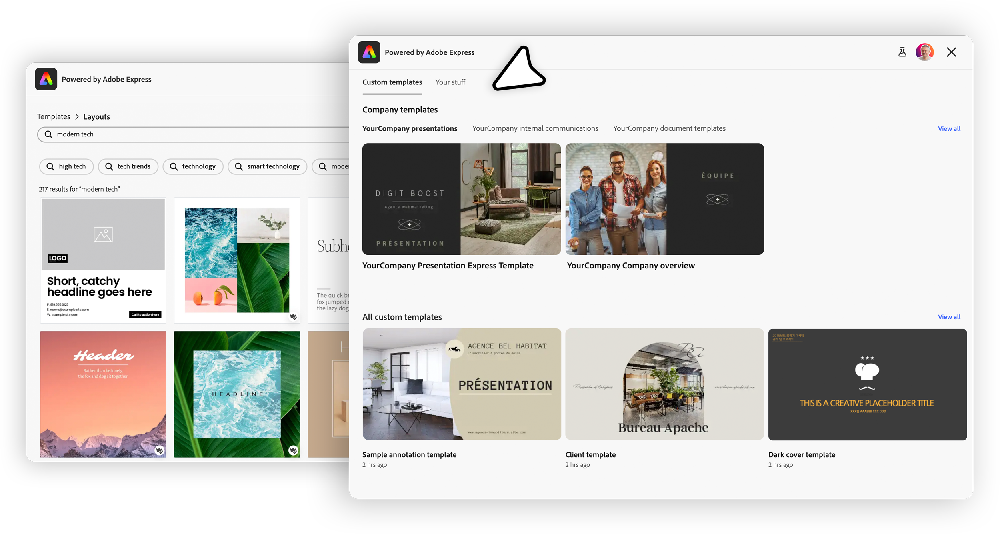
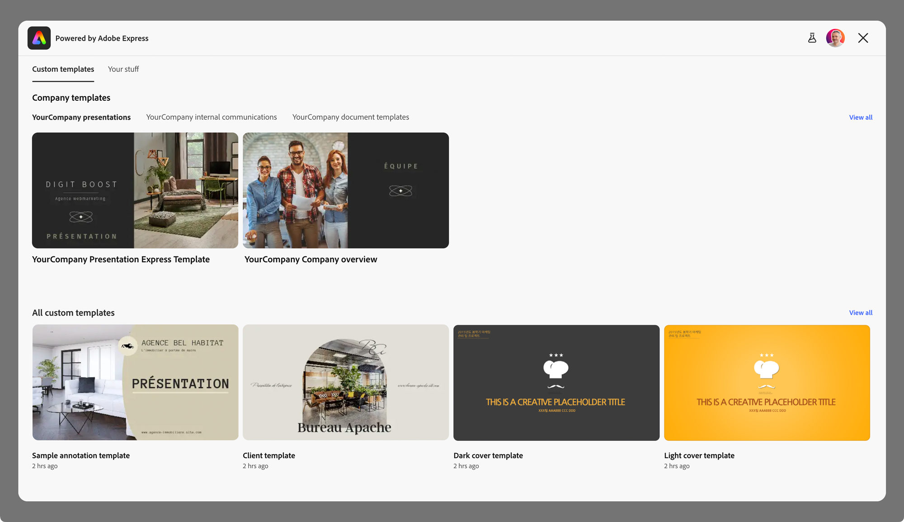
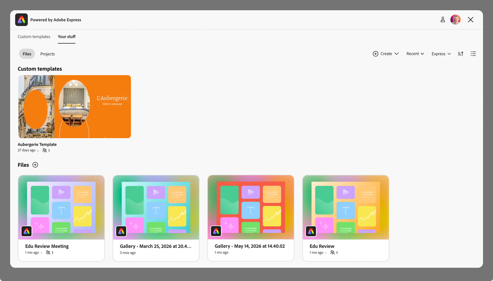
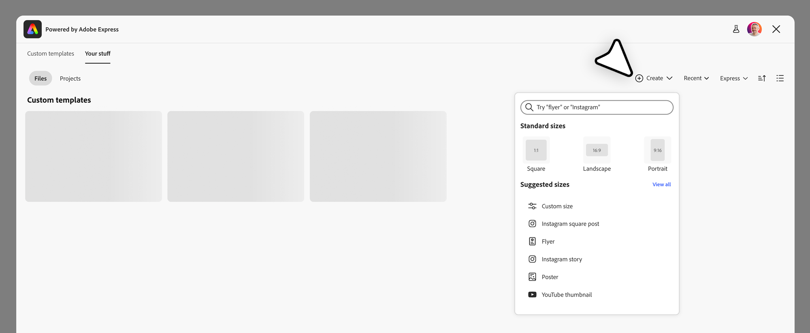

---
keywords:
  - Adobe Express
  - Embed SDK
  - Template Browser
  - Template Browser V2
  - Custom Templates
  - Your Stuff
  - Authenticated users
title: Template Browser V2
description: Template Browser V2
contributors:
  - https://github.com/undavide
---

# Template Browser v2

Welcome to the new Template Browser v2 experience in the Adobe Express Embed SDK.

Template Browser v2 is a _version-gated_ upgrade to the existing [Start From Content](../../v4/sdk/src/workflows/3p/module-workflow/classes/module-workflow.md#startfromcontent) module. It replaces the single-surface browse/preview experience with a **tabbed Template Browser** that surfaces multiple content sources for authenticated end-users: their **Custom Templates** and **Your Stuff** (Files, Projects, etc.). V1 keeps working unchanged, as v2 is opt-in.



<InlineAlert slots="header, text" variant="warning" />

#### Authenticated end-users only

Template Browser v2 requires authenticated end-users: both tabs surface per-user content (their files and organization's templates). If your integration serves anonymous users, stay on [Template Browser v1](./template-browser.md) and its public collection browsing until the Express Templates tab ships in a future release.

## Version comparison

| Capability                                                         | v1                           | v2                                             |
| ------------------------------------------------------------------ | ---------------------------- | ---------------------------------------------- |
| Public Adobe template collections                                  | ✅ via `contentBrowseConfig` | ⏳ not yet, but planned via `expressTemplates` |
| Browsing the user's **Custom Templates** (Admin-approved + others) | ❌                           | ✅                                             |
| Browsing the user's **Your Stuff** (Files, Projects, Recent, etc.) | ❌                           | ✅                                             |
| Brand-safe reuse via **Quick Replace** on custom templates         | ❌                           | ✅                                             |
| Preview mode (`launchMode: 'preview'`)                             | ✅                           | ❌                                             |
| Tabbed surface                                                     | ❌                           | ✅                                             |
| Requires authenticated end-user                                    | ❌                           | ✅                                             |
| Dark Theme                                                         | ✅                           | ✅                                             |

## How to enable v2

Set the new `version` property to `"2"` on the [`StartFromContentAppConfig`](../../v4/shared/src/types/module/app-config-types/interfaces/start-from-content-app-config.md) object. With no further configuration, partners get both tabs in their default order with the standard Create button.

```js-data-line="9"
await import("https://cc-embed.adobe.com/sdk/v4/CCEverywhere.js");

const { module } = await window.CCEverywhere.initialize(
  { clientId: "your-client-id", appName: "your-app-name" },
  {},
);

module.startFromContent({
  version: "2", // 👈 Enable the new experience
  // use "1" for the old experience (the default when omitted)
});
```

That's it for the minimal opt-in. Everything else discussed below is optional customization.

## Tabbed interface

### Custom Templates

The **Custom Templates** tab surfaces the templates available to the authenticated user, with **Admin-approved** organizational templates shown first. Selecting **View all** exposes both the Admin-approved set and the wider set of custom templates available to that user.



When a user selects a custom template they don't own, they land in the Full Editor in **Quick Replace** mode, with the template's **locked elements preserved**—the brand-safe reuse path for Enterprise integrations.

### Your Stuff

The **Your Stuff** tab surfaces the user's own files, projects, and favorites. Selecting a file opens it in the Full Editor.

Defaults in this release:

- **View**: Yours, shared with you, or recent.
- **Filter**: Express files (filters for Images, Video, and Audio are disabled in this release).
- **Sort**: By modified, created, last opened, or name.
- **Layout**: Tile or list view.



The Your Stuff tab also exposes a **Create** button for starting a new design. By default it opens the full Express Create menu (standard sizes, suggested sizes, search, custom size); partners can skip the menu and open directly into a pre-sized canvas via [`createConfig`](#configuring-the-create-button).

## Configuring `templatesHomeConfig`

All v2 customization lives on a new `templatesHomeConfig` object on `StartFromContentAppConfig`. It has two optional fields:

```ts
interface TemplatesHomeConfig {
  tabs?: TemplatesHomeTab[]; // tabs to show, in display order
  createConfig?: CreateConfig; // Create button behavior (Your Stuff tab)
}

type TemplatesHomeTab = "customTemplates" | "yourStuff";

interface CreateConfig {
  defaultCanvasSize?: { width: number; height: number };
  unit?: sizeUnit; // "px" | "in" | "cm" | "mm"
}
```

### Customizing tab order

The `tabs` array controls which tabs appear and the order in which they're displayed. The array's order is the tab display order, and the first tab in the array is selected on load.

```js-data-line="8,16"
// Default: both tabs, Custom Templates selected on load.
module.startFromContent({ version: "2" });

// Your Stuff first and selected on load.
module.startFromContent({
  version: "2",
  templatesHomeConfig: {
    tabs: ["yourStuff", "customTemplates"],
  },
});

// Single-tab mode: Custom Templates only.
module.startFromContent({
  version: "2",
  templatesHomeConfig: {
    tabs: ["customTemplates"],
  },
});
```

### Configuring the Create button

By default the Create button on the Your Stuff tab opens the full Express Create menu (standard sizes, suggested sizes, search, custom size). Pass `createConfig.defaultCanvasSize` to skip the menu and open a blank canvas directly at the given size.

```js-data-line="5-7"
module.startFromContent({
  version: "2",
  templatesHomeConfig: {
    tabs: ["yourStuff", "customTemplates"],
    createConfig: {
      defaultCanvasSize: { width: 1080, height: 1080 },
    },
  },
});
```

Omitting `createConfig` (or omitting `defaultCanvasSize` within it) keeps the standard Express Create menu.



## Validation rules

The SDK validates the v2 configuration at launch time and rejects combinations that mix v1 and v2 surfaces. For example:

| Rule                                                                         | Error                                                 |
| ---------------------------------------------------------------------------- | ----------------------------------------------------- |
| `version: "2"` together with `contentBrowseConfig.launchMode: 'preview'`     | ❌ Preview mode is v1 only.                           |
| `version` absent or `"1"` together with `templatesHomeConfig`                | ❌ `templatesHomeConfig` is v2 only.                  |
| `tabs` array contains values other than `'customTemplates'` or `'yourStuff'` | ❌ Only those two values are allowed in this release. |
| `defaultCanvasSize.width` or `height` ≤ 0                                    | ❌ Dimensions must be positive.                       |

## Differences from v1

There is no in-place migration from v1 to v2: v2 is a different configuration field selected by a different top-level flag. Partners on v1 can take no action. Partners adopting v2 are making a deliberate UX decision—moving from public-collection browsing to user-authenticated tabs.

- `contentBrowseConfig` is **ignored** when `version: "2"` is set. It will be reused for public templates in a future release.
- **Collection IDs (URNs)** and **`shortcutPillTerms`**, **`searchQuery`**, **`hideSearchBar`**, **`hideFilters`**, **`headerText`** are v1 concepts that do not apply to v2 in this release.
- **Preview mode** (`launchMode: 'preview'`) is v1-only.
- **Authentication** is required for v2 and not for v1.

## Related Resources

- [Template Browser (v1)](./template-browser.md) — the original Start From Content surface for public Adobe collections.
- [Start From Content module API](../../v4/sdk/src/workflows/3p/module-workflow/classes/module-workflow.md#startfromcontent)
- [`StartFromContentAppConfig`](../../v4/shared/src/types/module/app-config-types/interfaces/start-from-content-app-config.md)
