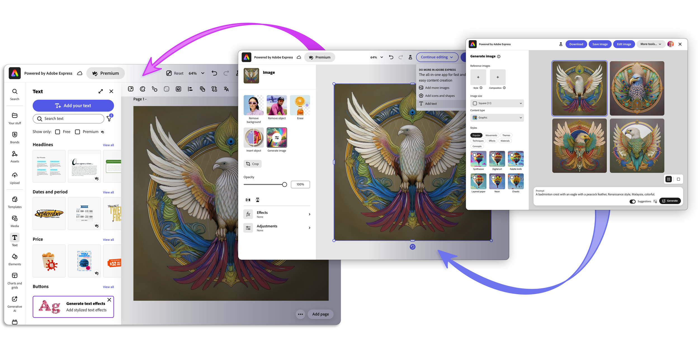

---
keywords:
  - Adobe Express
  - Embed SDK
  - Workflow Tethering
  - Feature configurations
  - onIntentChange callback
  - Intent handling
  - Workflow transitions
  - JavaScript integration
title: Workflow Tethering
description: Workflow Tethering
contributors:
  - https://github.com/undavide
---

# Workflow Tethering

The Adobe Express Embed SDK allows you to tether multiple modules to create a more complex workflow.

## Use Cases

You can surface the Embed SDK across multiple entry points in your application. To keep your users engaged, you can chain different workflows to create more complex experiences tailored to your audience's needs.

Two of the most common use cases are:

- **Generate Image → Edit Image**: Users generate images from a text prompt and seamlessly transition to image editing to refine the output further.
- **Edit Image → Full Editor**: Users start with an existing image with the goal of performing basic edits and can transition to a Full Editor experience to access advanced features (e.g., adding text, shapes, and more).

You can tether more than two modules together to create even more complex experiences, for example, Generate Image → Edit Image → Full Editor.



<InlineAlert variant="info" slots="header, text1" />

Targets

While you can initiate the workflow from any module (for example, Quick Actions), the target module must be either **Edit Image** or **Full Editor**. At the moment, only the Generate Image module can tether to Edit Image.

## How to implement Workflow Tethering

There are two crucial elements to any tethering workflow:

- The **Export Configurations**: set the exporting options for a module.
- The **Intent Change Handler**: sets additional configurations for the next modules in the transition.

Please read along to learn more about each of these elements, or try the [Workflow Tethering tutorial](../../guides/tutorials/workflow-tethering.md) to see them in action.

## Export Configurations

An Export Configuration defines the buttons displayed in the module's interface. These buttons are used to download assets, save them back to the application that initiated the workflow, or **trigger the transition to the next module**.


```javascript
const exportConfig = [
  // Download the asset to the user's device
  {
    id: "download", label: "Download",
    action: { target: "download" }, style: { uiType: "button" },
  },
  // Save the asset back to the application that initiated the workflow
  {
    id: "save", label: "Save",
    action: { target: "publish" }, style: { uiType: "button" },
  },
  // Trigger the transition to a new module
  {
    id: "open-edit-image", label: "Edit image",     // 👈
    action: { target: "image-module" },             // 👈
    style: { uiType: "button" },                    // 👈
  },
  {
    id: "open-full-editor", label: "Full editor",   // 👈
    action: { target: "express" },                  // 👈
    style: { uiType: "button" },                    // 👈
  }
];

// Use the Generate Image workflow to start the tethering workflow
module.createImageFromText(appConfig, exportConfig);
```

<InlineAlert variant="warning" slots="header, text1, text2" />

Default buttons

The `exportConfig` is always an **optional parameter**. If no export configuration is provided, the module will fall back to the default layout options—which usually include tethering options to the Full Editor.

If you need _tighter control_ over what your users can create—for example, prevent adding Text to avoid content moderation—you should always define a custom `exportConfig` that doesn't contain the Full Editor option.

### Export Options explained

The `exportConfig` parameter is an array of [`exportOption`](../../v4/shared/src/types/export-config-types/type-aliases/export-option.md) objects, which can be of four types:

- [`PublishExportOption`](../../v4/shared/src/types/export-config-types/interfaces/publish-export-option.md): save back to the application that initiated the workflow.
- [`DownloadExportOption`](../../v4/shared/src/types/export-config-types/interfaces/download-export-option.md): download the asset to the user's device.
- [`EditFurtherExportOption`](../../v4/shared/src/types/export-config-types/interfaces/edit-further-export-option.md): tether to another module.
- [`ContinueEditingDropdownOption`](../../v4/shared/src/types/export-config-types/interfaces/continue-editing-dropdown-option.md): tether to another module (dropdown-style buttons).

All `exportOption`s can be either of type [`ButtonStyle`](../../v4/shared/src/types/export-config-types/type-aliases/button-style.md) or [`LinkStyle`](../../v4/shared/src/types/export-config-types/interfaces/link-style.md) (additionally, [`EnabledButtonStyle`](../../v4/shared/src/types/export-config-types/type-aliases/enabled-button-style.md) for `EditFurtherExportOption`). They all have the following properties:

- `id`: string
- `label`: string
- `action`: [`ExportAction`](../../v4/shared/src/types/export-config-types/type-aliases/export-action.md), extended by:
  - [`PublishAction`](../../v4/shared/src/types/export-config-types/interfaces/publish-action.md)
  - [`DownloadAction`](../../v4/shared/src/types/export-config-types/interfaces/download-action.md)
  - [`EditFurtherAction`](../../v4/shared/src/types/export-config-types/interfaces/edit-further-action.md)
  - [`ContinueEditingAction`](../../v4/shared/src/types/export-config-types/type-aliases/continue-editing-action.md)
- `style`: [`Style`](../../v4/shared/src/types/export-config-types/interfaces/style.md)

For the **workflow tethering**, we're interested in [`EditFurtherExportOption`](../../v4/shared/src/types/export-config-types/interfaces/edit-further-export-option.md) and [`ContinueEditingDropdownOption`](../../v4/shared/src/types/export-config-types/interfaces/continue-editing-dropdown-option.md), which differ as the latter represents export options specifically for dropdown UI components. Their `action` property is either:

- [`EditFurtherExportOption.action`](../../v4/shared/src/types/export-config-types/interfaces/edit-further-action.md):
  - `target`: [`EditFurtherTarget`](../../v4/shared/src/types/export-config-types/enumerations/edit-further-target.md)—either `"express"` or `"image-module"`.
  - `intent?`: [`EditFurtherIntent`](../../v4/shared/src/types/export-config-types/enumerations/edit-further-intent.md)—the kind of experience to preload in the left-hand panel, for example, `"add-text"`, `"add-icons-and-shapes"`, etc.
  - `context?`: [`ExportContext`](../../v4/shared/src/types/export-config-types/type-aliases/export-context.md)—either `"default"` (tethering to the same iframe) or `"new"` (launching Adobe Express in a new browser tab).
- [`ContinueEditingDropdownOption.action`](../../v4/shared/src/types/export-config-types/type-aliases/continue-editing-action.md): same as `EditFurtherExportOption.action`, but [`intent`](../../v4/shared/src/types/export-config-types/enumerations/edit-further-intent.md) is required.

As follows are a few examples:

```javascript
const exportConfig = [
  // 1️⃣ Tethering to Edit Image
  {
    id: "open-edit-image", label: "Edit image",
    action: { target: "image-module" },
    style: { uiType: "button" },
  },
  // 2️⃣ Tether to Full Editor with a standard button
  {
    id: "open-full-editor", label: "Full editor",
    action: { target: "express" },
    style: { uiType: "button" },
  },
  // 3️⃣ Tether to Full Editor in a new tab preloading the intent
  {
    id: "open-full-editor-add-text", label: "Add Text",
    action: { target: "express", intent: "add-text", context: "new" },
    style: { uiType: "button" },
  },
  // 4️⃣ Tether to Full Editor with a dropdown-style button
  {
    type: "continue-editing",
    label: "Do More",
    style: { uiType: "button", variant: "secondary", treatment: "fill" },
    options: [
      {
        id: "editor-add-text",
        style: { uiType: "dropdown" },
        action: { target: "express", intent: "add-text" },
      },
      {
        id: "editor-add-images",
        style: { uiType: "dropdown" },
        action: { target: "express", intent: "add-images" },
      },
      {
        id: "editor-add-icons-and-shapes",
        style: { uiType: "dropdown" },
        action: { target: "express", intent: "add-icons-and-shapes" },
      },
    ],
  },
];
```

### Caveats

Currently, there are some limitations to the usage of the `exportConfig` parameter that are subject to change in the future:

- When tethering **from Edit Image V2** to the Full Editor module, only Dropdown-style buttons will work.
- When tethering **to the Edit Image module**, you cannot launch the V2 experience; only Edit Image V1 is supported.

```javascript
// ⚠️ Only ⚠️ when tethering from Edit Image V2 to the Full Editor module
const exportConfig = [
  // ❌ Won't work
  {
    id: "open-full-editor-v1", label: "Full editor"
    action: { target: "express" }
    style: { uiType: "button" }
  },
  // ✅ Will work
  {
    type: "continue-editing"
    label: "Do More!"
    style: {
      uiType: "button", variant: "secondary", treatment: "fill"
    },
    options: [
      {
        id: "exportOption1", style: { uiType: "dropdown" },
        action: { target: "express", intent: "add-text" },
      },
      {
        id: "exportOption2",
        style: { uiType: "dropdown" },
        action: {
          target: "express", intent: "add-icons-and-shapes"
        },
      },
    ],
  },
];
```

## Customize the Tethered Experience

In the Embed SDK, every workflow can be customized by setting the `appConfig`, `exportConfig`, and `containerConfig` properties at launch. However, when two or more modules are chained together, **the initial set of configurations may not be ideal for the next experience** in the transition. For example, you may want to use some Export Options in the first module, but not in the second; or the `onPublish()` callback may be different because it needs to communicate with a dedicated backend service—only, say, in the last module.

No matter the use case, it would be great to **set new configurations tailored for each module** in a tethered workflow. Enter the Intent Change Handler.

### The Intent Change Handler

The [`onIntentChange()`](../../v4/shared/src/types/callbacks-types/type-aliases/intent-change-callback.md) is one of the available handlers that belong to the `appConfig.callbacks` object; it automatically runs when the user passes from one module to another. It receives the old and new intent of type [`ActionIntent`](../../v4/shared/src/types/action-intent-types/type-aliases/action-intent.md) as parameters—so you can implement different logic for each transition—and returns an object containing the new [`appConfig`](../../v4/shared/src/types/design-config-types/interfaces/base-app-config.md), [`exportConfig`](../../v4/shared/src/types/export-config-types/type-aliases/export-option.md), or [`containerConfig`](../../v4/shared/src/types/container-config-types/type-aliases/container-config.md) objects.

```typescript
// The Intent Change Handler callback signature
onIntentChange(
  oldIntent: ActionIntent,
  newIntent: ActionIntent
): undefined | IntentChangeConfig;

// The Intent Change Config return object
interface IntentChangeConfig {
  appConfig?: BaseAppConfig;
  exportConfig?: ExportOptions;
  containerConfig?: ContainerConfig;
}
```

<InlineAlert variant="info" slots="header, text1, text2" />

A simpler `appConfig`

If you look closely at the `IntentChangeConfig` interface in the code block above, you'll notice that the `appConfig` is of type [`BaseAppConfig`](../../v4/shared/src/types/design-config-types/interfaces/base-app-config.md), which is the base configuration object for all modules.

It **only contains** the `callbacks` property, which you are free to set as needed for the next module in the transition. Any other properties (for instance, the `appVersion` when tethering to the Edit Image module) cannot be passed.

Thanks to the Intent Change Handler, you can **conditionally return the appropriate configuration** settings, for example, to:

- Implement a different logic for the callbacks.
- Provide users with a new set of Export Options.
- Customize the iframe container to fit the new module better.

### `onIntentChange()` example

Here's an example of how you can use the Intent Change Handler to customize the tethered experience and **serve a different set of Export Options** for each module in a tethered workflow of the kind Generate Image → Edit Image → Full Editor.

```javascript
// Initialize the SDK
await import("https://cc-embed.adobe.com/sdk/v4/CCEverywhere.js");
const { module } = await window.CCEverywhere.initialize(
  { clientId: "your-client-id", appName: "your-app-name" },
  {}
);

// Shared Export Options for all modules
const defaultExportConfig = [
  {
    id: "download", label: "Download",
    action: { target: "download" }, style: { uiType: "button" },
  },
  {
    id: "save-generated-image", label: "Save generated image",
    action: { target: "publish" }, style: { uiType: "button" },
  },
];

// Generate Image custom Export Options
const generateImageExportConfig = [
  ...defaultExportConfig,
  {
    id: "open-edit-image", label: "Edit image",
    action: { target: "image-module" }, style: { uiType: "button" },
  },
];

// Edit Image custom Export Options
const editImageExportConfig = [
  ...defaultExportConfig,
  {
    id: "open-full-editor", label: "Full editor",
    action: { target: "express" }, style: { uiType: "button" },
  },
];

const appConfig = {
  appVersion: "2",
  featureConfig: { "community-wall": true },
  callbacks: {
    onPublish: (intent, publishParams) => {
      console.log("Publish callback", intent, publishParams);
      // Implement your logic for the publish callback here...
    },
    // 👁️👁️ The Intent Change Handler 👁️👁️
    onIntentChange: (oldIntent, newIntent) => {
      console.log("Intent change", oldIntent, "→", newIntent);
      if (newIntent === "edit-image-v2") {
        return {
          // appConfig: { callbacks: { /* ... */ } },
          // containerConfig: { /* ... */ },
          exportConfig: editImageExportConfig,     // 👈
        };
      }
      if (newIntent === "full-editor") {
        return {
          // appConfig: { callbacks: { /* ... */ } },
          // containerConfig: { /* ... */ },
          exportConfig: fullEditorExportConfig,    // 👈
        };
      }
    },
  },
};

const containerConfig = { /* ... */ };

module.createImageFromText(
  appConfig,
  generateImageExportConfig,    // 👈
  containerConfig
);
```

<InlineAlert variant="info" slots="text1" />

In the snippet above, we check the `newIntent` to decide which module to transition to and return the corresponding configuration object. In this simple example, checking the `oldIntent` instead would produce the same result. However, in more complex cases, you may need to consider both `newIntent` and `oldIntent`.

## Try it out in the Tutorial

Congratulations! You've learned how to implement Workflow Tethering in your application.

Please refer to the [Workflow Tethering tutorial](../../guides/tutorials/workflow-tethering.md) for a more comprehensive, real-world example with complete code that covers all the concepts discussed in this guide.
