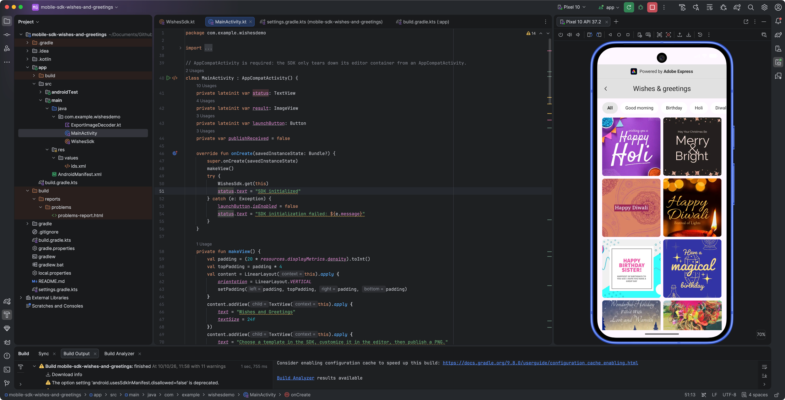
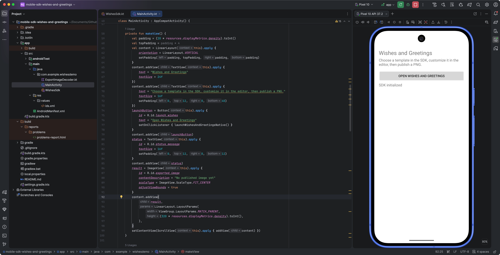
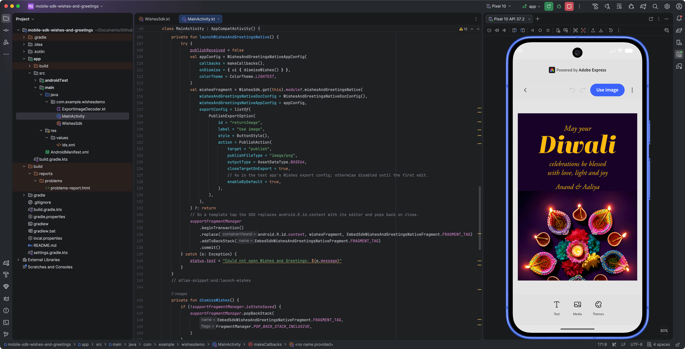
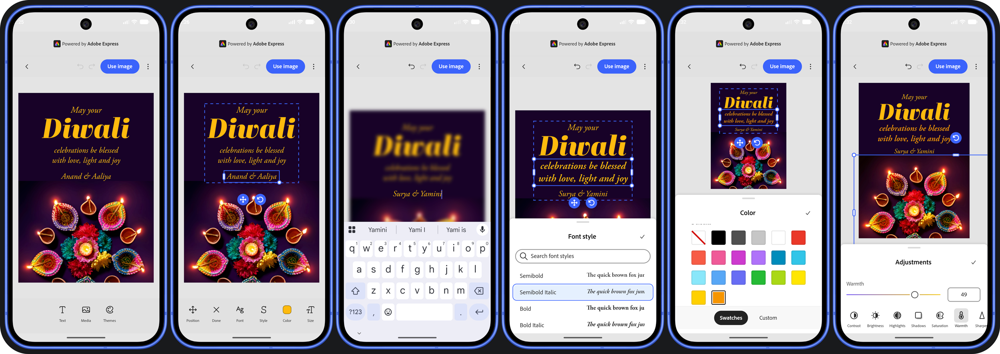
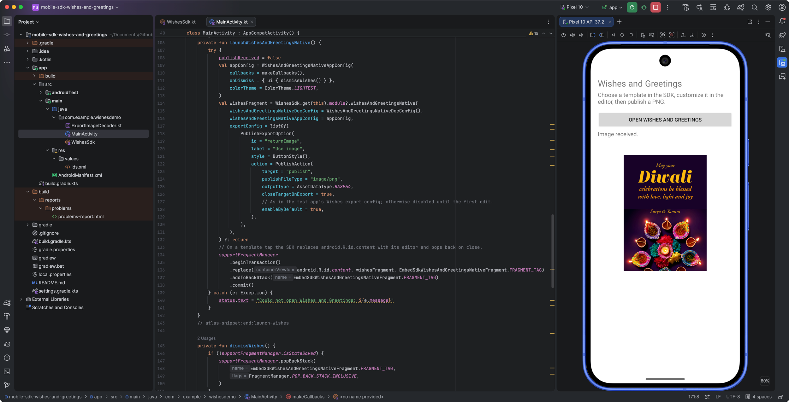

# Build a Wishes and Greetings integration with the Android Mobile SDK

This guide is for Android developers integrating the Wishes and Greetings module from the Embed Mobile SDK, which allows users to browse a collection of available templates, select and personalize one, and export it as an image back to your mobile app for sharing.



## Before you begin

### Prerequisites

This guide assumes you have a **good understanding of Android development and Kotlin programming**. You'll need to build a Kotlin Android app in Android Studio, and have access to the partner-provided SDK Maven distribution alongside a client ID approved for this development integration.

<InlineAlert slots="text" variant="warning" />

Please obtain the SDK distribution details and client provisioning for your integration from your Adobe partner contact. Specifically, make sure you have a valid **client ID** and **application ID**.

### Demo application

We have prepared an **Android demo application** that demonstrates the integration of the Wishes and Greetings module, whose screens and code will be used throughout this guide: you can access it [on GitHub here](https://github.com/AdobeDocs/embed-sdk-samples/tree/devex/airtel/code-samples/tutorials/mobile-sdk-wishes-and-greetings).

Use these settings for the tutorial host:

| Requirement       | Setting or preparation                                                                                                |
| ----------------- | --------------------------------------------------------------------------------------------------------------------- |
| Android runtime   | Android 9 / API 28 or later; set `minSdk` to `28`                                                                     |
| Host Activity     | Extend `androidx.appcompat.app.AppCompatActivity` and use `supportFragmentManager`                                    |
| Compile SDK       | Use `compileSdk = 36`, matching the integration sample; install Android SDK Platform 36                               |
| Android libraries | Include compatible AppCompat, Fragment, and lifecycle coroutine dependencies for the host UI                          |
| WebView           | Ensure an Android WebView provider is available; SDK initialization checks for it                                     |
| Network           | Allow access to the configured Adobe services; the SDK AAR declares `INTERNET` and `ACCESS_NETWORK_STATE` permissions |
| Provisioning      | Obtain the SDK repository location, any repository credentials, and the application client ID separately              |

### Understand the SDK and host boundary

The [Android Mobile SDK](https://github.com/AdobeDocs/express-embed-mobile-sdk-android-release) gives your existing app a Kotlin API for launching the Wishes and Greetings experience. Your host and the SDK have different responsibilities:

| Part of the flow   | SDK responsibility                                        | Your host responsibility                                          |
| ------------------ | --------------------------------------------------------- | ----------------------------------------------------------------- |
| Initialization     | Create the SDK interface from the supplied configuration  | Supply your application identity and retain the returned instance |
| Browse             | Present categories and templates in the returned Fragment | Mount that Fragment in an AppCompat Activity                      |
| Template selection | Open the selected template in the editor                  | Keep the hosting Activity available; don't launch a second editor |
| Publish            | Apply the export configuration and deliver callback data  | Select an asset, validate and decode it, and update your UI       |
| Dismiss            | Notify the host through the workflow callbacks            | Remove the host-mounted browse Fragment at a lifecycle-safe point |

The distinction matters most at the end of the flow, as receiving an image and dismissing a screen are separate operations. You'll handle both without removing the editor from the publish callback.

## 1. Prepare the host screen

For the demo app, we've started with a simple screen that launches the Wishes and Greetings module and receives the result. We've kept the host UI small, although in real world scenarios you'll call the SDK from various points in your app.



1. Use an `AppCompatActivity` for the screen that owns the workflow.
2. Add a launch button, a status `TextView`, and a result `ImageView` to its content view.
3. Keep the launch button disabled until SDK initialization succeeds.
4. Use your application's own package identity. You don't need to copy an engineering test app's package name to integrate the SDK.

The launch helper later in this guide replaces `android.R.id.content` and adds the browser transaction to the back stack. That lets the host screen remain the return destination. The result `ImageView` belongs to your host, not to the SDK Fragment.

**Checkpoint:** you have a host screen with a place to launch the workflow, report failures, and display the returned image. No SDK screen is open yet.

## 2. Install the Android SDK dependency

The [Android SDK installation README](https://github.com/AdobeDocs/express-embed-mobile-sdk-android-release) describes the consumer installation pattern: add the Maven dependency to your app module, choose a version, sync Gradle, and import `ExpressEmbedSdk`. Apply those steps to the version provisioned for this module.

### Configure dependency access

1. Obtain the Maven repository URL and any required credentials through your partner provisioning process.
2. Add that repository to your project's dependency-resolution configuration, normally in `settings.gradle.kts` under `dependencyResolutionManagement.repositories`.
3. Load repository credentials from your approved local or CI secret mechanism rather than committing them in a build file.

Repository values such as `SDK_MAVEN_REPOSITORY_URL`, `SDK_MAVEN_USERNAME`, and `SDK_MAVEN_TOKEN` (in the demo app) represent your provisioned settings, not SDK API parameters or required SDK-defined variable names.

<CodeBlock slots="heading, code" repeat="3" />

#### settings.gradle.kts

```kotlin-data-line="9,15,16"
// ...

dependencyResolutionManagement {
    repositoriesMode.set(RepositoriesMode.FAIL_ON_PROJECT_REPOS)
    repositories {
        google()
        mavenCentral()
        // The SDK and its POM/transitive dependencies must come from an authorized distributor.
        // The URL and optional credentials are operator-local; never commit them to this sample.
        val sdkMavenUrl = providers.gradleProperty("embedSdkMavenUrl").orNull
            ?: System.getenv("EMBED_SDK_MAVEN_URL")
        require(!sdkMavenUrl.isNullOrBlank()) {
            "Set EMBED_SDK_MAVEN_URL to your approved SDK Maven repository."
        }
        maven {
            url = uri(sdkMavenUrl)
            val user = System.getenv("EMBED_SDK_MAVEN_USER")
            val token = System.getenv("EMBED_SDK_MAVEN_TOKEN")
            if (!user.isNullOrBlank() && !token.isNullOrBlank()) {
                credentials {
                    username = user
                    password = token
                }
            }
            content { includeGroup("com.adobe.express.embed") }
        }
    }
}
```

#### app/build.gradle.kts

```kotlin-data-line="9"
// ...

android {
    namespace = "com.example.wishesdemo"
    compileSdk = 36

    defaultConfig {
        // Allow-listed application ID.
        applicationId = "com.embedsdk.testapp"
        minSdk = 28
        targetSdk = 35
        versionCode = 1
        versionName = "1.0"
        testInstrumentationRunner = "androidx.test.runner.AndroidJUnitRunner"
    }
    compileOptions {
        sourceCompatibility = JavaVersion.VERSION_17
        targetCompatibility = JavaVersion.VERSION_17
    }
    testOptions { animationsDisabled = true }
}
```

#### src/main/java/com.example.wishesdemo/WishesSdk.kt

```kotlin-data-line="9"
package com.example.wishesdemo

// ...

internal object WishesSdk {
    // Client ID provided by the Adobe for your integration
    private const val CLIENT_ID = "your-client-id"

    private var instance: CCEverywhereInterface? = null

    // ...
}
```

Keep the two kinds of identity separate:

| Value                        | Used for                                                                  | Not a replacement for                                  |
| ---------------------------- | ------------------------------------------------------------------------- | ------------------------------------------------------ |
| Maven repository credentials | Download the SDK and its dependency metadata during dependency resolution | Your application client ID or a user's sign-in session |
| Application client ID        | Identify the host in `HostInfo` when initializing the SDK                 | Maven credentials, a bearer token, or an SDK version   |

### Add the module dependency and sync

1. Open your app module's `build.gradle.kts`.
2. Add the SDK to its `dependencies` block using the Kotlin DSL entry for this recipe:

```kotlin
dependencies {
    implementation("com.adobe.express.embed:embedsdk:1.0.16")
}
```

1. Sync the project in Android Studio so Gradle resolves the SDK and its transitive dependencies.
2. Confirm that the `com.adobe.express.embedsdk.ExpressEmbedSdk` import resolves in your Kotlin source. The initialization example in Step 3 includes this import.

The dependency is expressed as `com.adobe.express.embed:embedsdk:x.y.z` and directs to [GitHub Releases](https://github.com/AdobeDocs/express-embed-mobile-sdk-android-release/releases) for a release version; it installs a compiled Android library and its dependency model.

**Checkpoint:** Gradle recognizes the SDK dependency, and your source can import `ExpressEmbedSdk`. If dependency resolution fails, address repository access or the supplied coordinate before writing launch code.

## 3. Initialize and retain the SDK

Initialization connects your app's identity and configuration to the SDK interface. The public entry point is `ExpressEmbedSdk.initialize`, which returns a `CCEverywhereInterface` synchronously. It isn't a JavaScript-style SDK loader or an initialization promise.

The helper uses these inputs:

| Input          | What you supply in this recipe                                      |
| -------------- | ------------------------------------------------------------------- |
| `hostInfo`     | Your provisioned client ID, host application name, and host version |
| `configParams` | Explicit `Environment.STAGE` and locale `en_US`                     |
| `authProvider` | An `AuthOption` selecting `AuthMode.DELAYED`                        |
| `appContext`   | The Android application context, not a retained Activity            |

Add the public initialization helper to your host's SDK integration code:

<CodeBlock slots="heading, code" repeat="1" />

#### src/main/java/com.example.wishesdemo/WishesSdk.kt

```kotlin-data-line="4-8"
// ...

fun get(context: Context): CCEverywhereInterface =
    instance ?: ExpressEmbedSdk.initialize(
        hostInfo = HostInfo(CLIENT_ID, "Test-App", Version(1, 1, 1, 40042, "Test", "Beta")),
        configParams = ConfigParams(env = Environment.STAGE, locale = "en_US"),
        authProvider = { AuthOption(mode = AuthMode.DELAYED.value) },
        appContext = context.applicationContext,
    ).also { sdk ->
        // The test app's internalSetup() always turns SDK logging on.
        sdk.internal?.enableLogs(true)
        instance = sdk
    }
```

Pass the client ID approved for your app as `clientId`. `Wishes demo` and `Version(1, 0, 0)` are example host metadata, not the SDK's name or version. `HostInfo` uses the mobile platform category by default.

1. Call the helper through an application-scoped holder during host startup.
2. Store the returned `CCEverywhereInterface` for subsequent launches.
3. Catch initialization exceptions and report them in the host status view.
4. Enable the launch button only after the instance is available.

**Checkpoint:** the host retains one SDK interface and can report initialization failure without opening a broken workflow.

## 4. Connect the workflow callbacks

Before launching, create the `Callbacks` object that connects the SDK session to your host UI. Pass it to the launch helper in Step 5. The existing host wiring implements callback properties on a `Callbacks` object; it doesn't introduce a separate host editor workflow.

Use these hooks for this integration:

| Hook                | Host behavior                                                                                                 |
| ------------------- | ------------------------------------------------------------------------------------------------------------- |
| `onLoadInit`        | Provide the load-initialization callback required by the callback object; a no-op is sufficient for this host |
| `onCancel`          | Report that the session was cancelled rather than treating it as an image export                              |
| `onError`           | Show an actionable failure message and retain useful diagnostic details                                       |
| `onPublish`         | Record receipt of the publish event and start host-side decoding                                              |
| `onSessionFinished` | After a publish event, request dismissal of the browse surface so the host result screen is revealed          |

The sample maintains a host-owned `publishReceived` flag. It resets that flag before launch, sets it when `onPublish` arrives, and uses it in `onSessionFinished` to decide whether to dismiss the browser. This flag records a publish event, not successful image decoding. A missing or invalid image still needs a visible error message.

Dispatch view updates and FragmentManager operations to the main thread. Start decoding through the Activity's lifecycle coroutine scope and move the expensive work to an I/O dispatcher, as described in Step 9.

## 5. Configure and mount Wishes and Greetings

The workflow entry point is `sdk.module.wishesAndGreetingsNative`. It returns an `EmbedSdkWishesAndGreetingsNativeFragment`; your host mounts that Fragment.

The arguments divide the configuration into four concerns:

| Argument                            | Purpose in this flow                                                                      |
| ----------------------------------- | ----------------------------------------------------------------------------------------- |
| `wishesAndGreetingsNativeDocConfig` | Initial browse configuration; the default leaves `initialCategoryId` unset                |
| `wishesAndGreetingsNativeAppConfig` | Your callbacks and required `onDismiss` handler                                           |
| `exportConfig`                      | The editor's **Use image** PNG export action                                              |
| `containerConfig`                   | Editor hosting options; leave it unset for the default editor-over-browser path used here |

You don't need a category identifier to start. The default `WishesAndGreetingsNativeDocConfig()` uses `initialCategoryId = null`. If your integration later needs a preselected category, use an identifier supplied for that catalog rather than inventing one from its display label.

The app configuration also supports `colorTheme`, `metaData`, `analyticsData`, and `appVersion`. They aren't required for the path below. The sample selects `ColorTheme.LIGHTEST`; this public helper leaves the optional theme unset and focuses on the launch, export, and dismiss boundary.

Add the launch helper to your Activity integration code:

```kt-data-line="19,23-25,29,39-42"
import androidx.appcompat.app.AppCompatActivity
import com.adobe.express.embedsdk.AssetDataType
import com.adobe.express.embedsdk.ButtonStyle
import com.adobe.express.embedsdk.CCEverywhereInterface
import com.adobe.express.embedsdk.Callbacks
import com.adobe.express.embedsdk.PublishAction
import com.adobe.express.embedsdk.PublishExportOption
import com.adobe.express.embedsdk.WishesAndGreetingsNativeAppConfig
import com.adobe.express.embedsdk.WishesAndGreetingsNativeDocConfig
import com.adobe.express.embedsdk.wishesandgreetings.ui.EmbedSdkWishesAndGreetingsNativeFragment

// Invoke on the main thread when FragmentManager state is not saved.
fun launchWishes(
    activity: AppCompatActivity,
    sdk: CCEverywhereInterface,
    callbacks: Callbacks,
) {
    val manager = activity.supportFragmentManager
    if (manager.isStateSaved) return
    val tag = EmbedSdkWishesAndGreetingsNativeFragment.FRAGMENT_TAG
    val appConfig = WishesAndGreetingsNativeAppConfig(
        callbacks = callbacks,
        onDismiss = {
            if (!manager.isStateSaved) {
                manager.popBackStack(tag, androidx.fragment.app.FragmentManager.POP_BACK_STACK_INCLUSIVE)
            }
        },
    )
    val fragment = requireNotNull(sdk.module).wishesAndGreetingsNative(
        wishesAndGreetingsNativeDocConfig = WishesAndGreetingsNativeDocConfig(),
        wishesAndGreetingsNativeAppConfig = appConfig,
        exportConfig = listOf(
            PublishExportOption(
                id = "returnImage",
                label = "Use image",
                style = ButtonStyle(),
                action = PublishAction(
                    target = "publish",
                    publishFileType = "image/png",
                    outputType = AssetDataType.BASE64,
                    closeTargetOnExport = true,
                    enableByDefault = true,
                ),
            ),
        ),
    )
    manager.beginTransaction()
        .replace(android.R.id.content, fragment, tag)
        .addToBackStack(tag)
        .commit()
}
```

1. Connect your launch button to this helper, passing the Activity, retained SDK interface, and callback object.
2. Invoke it on the main thread while the Activity can accept FragmentManager transactions.
3. Catch launch exceptions at the host event-handler boundary and report the failure in your status view.
4. Prevent duplicate launches while the workflow is already open.

The saved-state guard intentionally returns without launching if `FragmentManager.isStateSaved` is true. It doesn't queue a launch. Keep a pending user action in host state if you need to retry after the Activity resumes; don't force a transaction after saved state.

<InlineAlert slots="text" variant="success" />

After a successful launch, you should see the Wishes and Greetings template browser in place of the host screen. The host remains its back-stack return destination.

## 6. Open a template in the SDK editor

When users select a template in the browser, the SDK carries the selected template identifier into its editor and forwards the export configuration you supplied at launch—this transition is part of the Wishes and Greetings workflow.



With `containerConfig` unset, the editor opens over the browse surface using the default content container. Keep the hosting Activity alive while the editor is active. The normal close path returns to the browser; your dismiss handling determines when to return from the browser to your own screen.

**Checkpoint:** selecting a template should open that design in the editor. You can personalize it there before returning the image to your host.

## 7. Edit the template

In the editor, your users can remix the template with the power and precision of Adobe Express' editing tools. They can add new text and media, or change text, images, colors, and other design elements provided by the template.



Additional tools may be introduced in future versions of the module. Currently, users can add or modify text and media, as well as customize the template’s color theme. For both new and existing elements, the editor provides a rich set of controls to fine-tune the design, such as font selection, size, format, color and style adjustment, layout, background removal, and much more!

Once they are satisfied with their edits, they can proceed clicking the "Use image" button, which triggers the `onPublish` callback.

## 8. Receive the published PNG

The launch helper defines one export option. Its outer fields identify the UI action, and `PublishAction` defines the returned data:

| Field                 | Value in the helper    | Meaning                                                 |
| --------------------- | ---------------------- | ------------------------------------------------------- |
| `id`                  | `returnImage`          | Identifier for this export option                       |
| `label`               | `Use image`            | Button text shown for the action                        |
| `style`               | `ButtonStyle()`        | Button presentation using the default style             |
| `target`              | `publish`              | Deliver the result through the publish flow             |
| `publishFileType`     | `image/png`            | Request PNG output                                      |
| `outputType`          | `AssetDataType.BASE64` | Request the image data as Base64                        |
| `closeTargetOnExport` | `true`                 | Request editor close after export                       |
| `enableByDefault`     | `true`                 | Enable the export action without requiring a first edit |

When users select **Use image** in the editor, the `onPublish` callback receives the intent and `PublishParams`. The payload contains a nullable `asset` list; it can also include `exportButtonId` and `documentId`. The export event is not itself a `Bitmap`.

Use the public selection helper inside `onPublish` to find a nonempty payload:

```kt-data-line="8-9"
import com.adobe.express.embedsdk.AssetDataType
import com.adobe.express.embedsdk.OutputAsset
import com.adobe.express.embedsdk.PublishParams

// Use inside onPublish; do not remove the editor from this callback.
fun selectPublishedImage(params: PublishParams): OutputAsset? {
    val assets = params.asset.orEmpty()
    return assets.firstOrNull { it.dataType == AssetDataType.BASE64 && !it.getData().isNullOrBlank() }
        ?: assets.firstOrNull { it.dataType == AssetDataType.URL && !it.getData().isNullOrBlank() }
}
```

1. Mark the publish event as received in your host state.
2. Pass its `PublishParams` to `selectPublishedImage`.
3. If it returns `null`, report that the event contains no supported image.
4. Read the selected asset's `getData()` value and use its `dataType` to choose the host decoder input.

The helper prefers a nonempty Base64 asset and then a nonempty URL-typed asset. The sample's callback similarly prefers Base64 over URL and reports missing or blank image data. These helpers select data; they don't validate the image or determine whether a URL is safe to load.

For this flow, route `BASE64` data to the decoder's Base64 input. A `URL` asset is acceptable to the sample decoder only when its data is a local `content://` URI. The SDK's URL data type doesn't mean that every returned value is local, and the host decoder doesn't fetch HTTP or HTTPS images.

## 9. Decode and display the image in your host

Keep image handling in the host rather than embedding it in SDK navigation. The integration sample separates the payload from decoding with an `ExportImageInput` value, whose type is either `BASE64` or `LOCAL_URI`, and passes that value to `ExportImageDecoder`.

Follow its bounded PNG path:

1. Launch the host display operation in `lifecycleScope`.
2. Run decoding with `withContext(Dispatchers.IO)` so Base64 conversion, content-stream reading, and bitmap work don't block view updates.
3. For Base64 input, accept raw encoded data or take the suffix after the literal `base64,` marker used in a data URI.
4. For local URI input, require the `content` scheme and open it with `ContentResolver`. Reject remote URLs instead of silently adding a network fetch.
5. Check the byte limit and PNG signature before bitmap decoding.
6. Read image bounds first, validate the dimensions, and choose a power-of-two sample size before decoding the bitmap.
7. Return to the main-thread coroutine to call `ImageView.setImageBitmap`, set a meaningful content description, and show **Image received.**

The sample applies these limits; they are host safeguards, not SDK export guarantees:

| Check                     | Sample behavior                                                                                        |
| ------------------------- | ------------------------------------------------------------------------------------------------------ |
| Encoded Base64 length     | Reject input longer than 11,000,000 characters, checking both the input and extracted encoded data     |
| Decoded or streamed bytes | Accept no more than 8 MiB and require enough bytes for the PNG signature                               |
| File format               | Require the PNG signature; don't interpret a different format as PNG                                   |
| Source dimensions         | Require positive width and height, each no greater than 32,768 pixels                                  |
| Display sampling          | Increase the sample size by powers of two until the calculated width and height are each at most 2,048 |
| URI scheme                | Accept local `content://` only; reject HTTP and HTTPS                                                  |

The selected asset can therefore still fail to display: its payload might be malformed, exceed a host limit, refer to unavailable local content, or fail bitmap decoding. Show a host-side message such as **Returned image could not be displayed; try publishing again.** Preserve coroutine cancellation by rethrowing `CancellationException` rather than converting it into an image error.



You can start decoding when the publish callback arrives even though the editor still covers the host screen. The image becomes visible when the workflow returns to that screen; decoding and screen dismissal don't have to happen in the same callback.

## 10. Finish the session without racing navigation

Handle the end of the workflow in this order:

1. In `onPublish`, consume the data and start decoding. Don't pop the browser or remove the editor there.
2. Let the SDK process the requested editor close.
3. In `onSessionFinished`, use the host's publish-received state to request dismissal of the browse surface.
4. In the app configuration's `onDismiss` handler, pop the host-mounted browser's tagged back-stack entry when FragmentManager state isn't saved.

`onPublish` precedes SDK teardown. `onSessionFinished` is a session/cleanup notification. Keep the AppCompat host and your own navigation state consistent rather than treating that notification as a universal cleanup guarantee.

The browse context's `close()` also delegates to the host's `onDismiss` handler—which means the host is responsible for handling the dismissal.

The launch helper guards both launch and dismiss transactions with `isStateSaved`. Its dismiss branch skips the pop if state is saved and doesn't implement a deferred retry. For a host that can move to the background during the flow, record pending dismissal and apply it when the Activity can safely transact again. Make that host action idempotent so a repeated notification doesn't pop unrelated navigation entries.

<InlineAlert slots="text" variant="success" />

After a successful publish, decode, and return to the host, you should see the exported PNG in your result `ImageView` with **Image received.** in the status view. Cancellation or invalid image data should produce a status message instead, not a fabricated success image.

## Resolve common integration problems

Use the failing boundary to decide what to inspect:

| Symptom                                                              | What to check                                                                                                                                                                                             |
| -------------------------------------------------------------------- | --------------------------------------------------------------------------------------------------------------------------------------------------------------------------------------------------------- |
| Gradle can't resolve the SDK dependency                              | Confirm the provisioned Maven repository, credentials, and exact coordinate. The generic public README doesn't establish repository access.                                                               |
| `ExpressEmbedSdk` or Wishes configuration types don't resolve        | Confirm that the dependency is in the app module and that the selected SDK version includes this prerelease API. Updating an SDK source checkout isn't a consumer dependency update.                      |
| Initialization reports `WEB_VIEW_NOT_AVAILABLE`                      | Check that the Android environment has an available WebView provider. This check occurs before the SDK interface is returned.                                                                             |
| Initialization reports `SDK_INITIALIZATION_IN_PROGRESS`              | Ensure startup has one initialization owner and that another Activity or event handler isn't initializing concurrently.                                                                                   |
| The launch button doesn't open a screen after a lifecycle transition | Check the host's saved-state guard. A skipped launch needs a host-managed retry at a safe point; it isn't automatically queued by the helper.                                                             |
| A direct editor call reports `UNSUPPORTED_API`                       | Use the Wishes workflow's SDK-owned template transition instead of adding a direct third-party `editDesign` call.                                                                                         |
| Browse opens but editor loading reports a service error              | Capture the actual `onError` details and confirm the provisioned environment and application configuration with your Adobe partner contact. An `AccessDenied` response alone doesn't establish its cause. |
| Publish returns no displayable data                                  | Handle a null or empty asset list, a missing supported data type, and blank `getData()` values before decoding.                                                                                           |
| The host rejects a URL-typed image                                   | Check its scheme. This decoder accepts local `content://` data only and doesn't support remote-image fetching.                                                                                            |
| An image is selected but decoding fails                              | Check PNG format, encoded and byte sizes, dimensions, and local content availability against the host decoder's limits.                                                                                   |
| The browser remains after export                                     | Check your `onSessionFinished` handling, `onDismiss` back-stack tag, and pending-dismiss behavior when state is saved. Don't infer successful UI removal solely from the session notification.            |

When escalating a service failure, provide the SDK version, development environment, failing step, and sanitized callback error details through your approved partner support channel. Don't send Maven passwords, bearer tokens, or exported image payloads as diagnostic logs, and don't substitute another app's client identity to work around an unexplained failure.

## What you integrated

You now have the integration boundaries for one complete Android flow:

1. Your app consumes the provisioned SDK Maven dependency and retains one initialized interface.
2. Your AppCompat Activity mounts the native Wishes and Greetings browser.
3. The SDK opens the selected template in its editor using the same workflow configuration.
4. Your publish callback selects the returned PNG data, and your bounded decoder prepares it for the host `ImageView`.
5. Your session and dismiss handlers return to the host without removing the editor from `onPublish`.

Keep the three public Kotlin helpers separate from your host's UI, callback object, and decoder implementation. They demonstrate SDK calls; the surrounding host wiring owns the complete integration.

For further lookup, use the [Android SDK API reference](https://adobedocs.github.io/express-embed-mobile-sdk-android-release/) for public classes, configuration, and callbacks, and the [Android SDK release list](https://github.com/AdobeDocs/express-embed-mobile-sdk-android-release/releases) for general release information.
