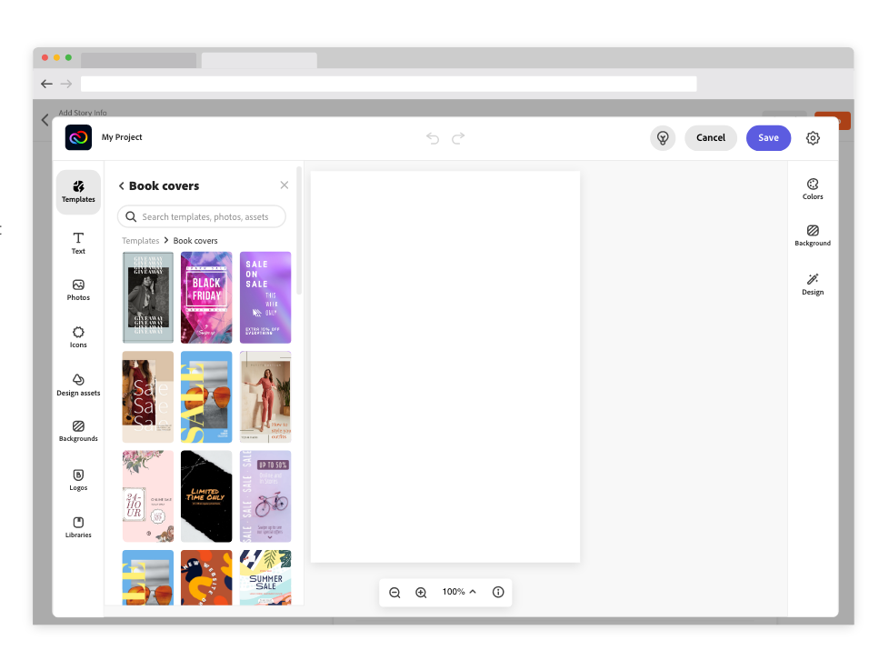

---
keywords:
  - Express Embed SDK
  - Express Editor
  - Adobe Express
  - Embed SDK
  - Quick Actions
  - SDK
  - JavaScript
  - Embed
  - SDK Reference
  - Embed editor component
title: Embed full editor
description: This is the overview page for the full editor component.
contributors:
  - https://github.com/amandahuarng
  - https://github.com/pklaschka
---

<InlineAlert variant="warning" slots="header, text1, text2" />

IMPORTANT: Deprecation Warning

This version of the docs and SDK will be sunsetted later this year. As a result, we are no longer approving new submissions that integrate with v2.

Instead, we would love for you to start integrating the new version of the SDK. To join the private beta and get early access to documentation, please fill out [this form](https://airtable.com/shryiOk1VwoWxUCZs?prefill_Platform=Adobe%20Express%20Embed%20SDK&hide_Platform=true).

# Full editor

Using the full editor, developers can give end-users an easy way to start a creative design workflow from within their own applications.

## What is the full editor?

The full editor component allows you to embed Adobe Express as an iframe in their own applications. Users can work within this modal editor as they would in Adobe Express, and their designs can be saved back to the integrating application as images. Each project created using the full editor is automatically saved into the user's Adobe Express account.

## Get started

Users can access Adobe Express's huge template and asset library when starting with a blank new project in the editor. The editor component allows you to pass a starting image asset to be pre-loaded. The editor can also load previous projects (created using your integration) by taking an existing project ID as input.

__Read our guides__:

* [Creating new projects](create_project/index.md)
* [Edit existing projects](edit_project/index.md)

If you are more interested in learning about the quick actions component, refer to our quick action [guides](../quick_actions/index.md).
