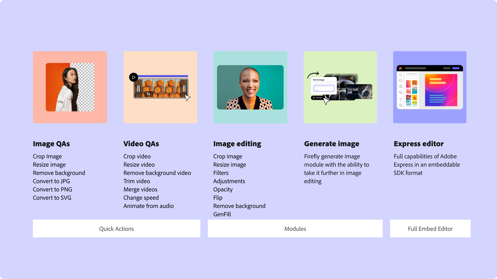

---
keywords:
- Adobe Express Embed SDK
- online design tools
- photo editing features
- video editing options
- AI-powered content generation
- embed Adobe Express
- professional design capabilities
- customizable templates
- stock photos
- AI-powered image generation
- project management
- quick actions
- media edits
- resizing tools
- cropping tools
- trimming tools
- background removal
- file compression
- export options
- focused editing experiences
- generate image
- edit image
- developer journey
- API key
- code sample
- demo app
- integration review
title: Overview
description: This is the documentation for Adobe Express Embed SDK
contributors:
  - https://github.com/nimithajalal
  - https://github.com/undavide
  - https://github.com/amandahuarng
---

import "./landing-styles.css";

<Superhero slots="image, heading, text" background="linear-gradient(180deg, #c946eb, #6372f5)" variant="default" textColor="white"/>

# Adobe Express Embed SDK

Seamlessly embed Adobe Express on your website with our SDK.

<Announcement slots="heading, text, button" className="closing-gates-announcement" variant="secondary" borderColor="#c148ed" hasborder="true" />

### Access to the Embed SDK Now Requires Business Approval

This change ensures high-value integrations for users and strong partner support. Existing integrations stay active until Dec 2027, then must be approved. Thank you to developers for shaping the SDK, your contributions are invaluable. For details, see the [FAQ](troubleshooting/faq/index.md#sdk-access--approval-1).

- [Apply now](https://www.adobe.com/go/embed-access)

&lt;br/ &gt;

## Overview

The Adobe Express Embed SDK lets you integrate powerful online design tools, photo editing features, video editing options, and AI-powered content generation into your platform.

## Why Choose Adobe Express Embed SDK?

With just a few lines of code, you can embed [Adobe Express editor](https://www.adobe.com/in/express/) tools and provide your users with seamless access to professional design capabilities.

## Embed SDK Developer Journey

This journey map will give you guidance on which resources to use at different stages of your integration with the Adobe Express Embed SDK. Click on the image below to download the PDF version of the developer journey with active links.

## First Steps

To quickly integrate the Adobe Express Embed SDK, follow these initial steps:

- **Quickstart Guide**: Begin with the [Quickstart guide](./quickstart/index.md) for a streamlined integration process.
- **Demo App**: Explore the [Demo App](https://demo.expressembed.com/) to see example integrations in action.
- **Sample Code**: Check out the [Sample Code](https://github.com/AdobeDocs/cc-everywhere/tree/main/v4-sample) for integrating the V4 SDK into your project, or follow our [Tutorials](./tutorials/index.md).
- **Community Support**: If you have any questions, post them in the [community](https://community.adobe.com/t5/adobe-express-embed-sdk/ct-p/ct-express-embed-sdk?page=1&sort=latest_replies&lang=all&tabid=all) for assistance.

## What Can Adobe Express Embed SDK Do?

Explore our tools:

- **Quick Actions**: Use ready-to-use tools for resizing, cropping, trimming, and background removal.
- **Modules**: Enable focused editing experiences, such as AI-powered image generation and enhancements.
- **Full Editor**: Access the complete Adobe Express editor with thousands of templates and assets.

### Quick actions: Edit with One click

[Quick actions](https://www.adobe.com/express/feature/quick-actions) are fast editing tools for images and videos. This API lets you embed quick actions on your website with just a few lines of code. Ideal for quick touch-ups or adjustments for social media and marketing content, these tools include:

- Resizing, cropping, and trimming tools.
- Background removal and file compression.
- Customizable export options to download content, save it to your app, or continue editing with the full editor.

### Modules: Focused Editing Experiences

[Modules](modules/index.md) are mini-editing experiences that you can offer to your users. They are perfect for focused creative tasks without loading the full editor.

**Available modules:**

- Edit image: Tools for photo retouching, applying filters, and adjusting backgrounds.
- Generate image: AI-powered tools to create unique visuals instantly.

### Full Editor: Get Started in the All-in-One Editor

[Adobe Express](https://adobe.com/express) makes it easy to create with thousands of beautiful templates and assets for social media content, logos, and more. Even without design experience, users can create standout content from anywhere. The SDK lets you embed the full Adobe Express editor on your website. Whether creating logos, banners, flyers, or other marketing assets, the full editor empowers users with:

- Thousands of customizable templates.
- Access to Adobe’s stock photos and design elements.
- AI-powered image generation features.
- Flexible project management options to save designs within your platform or download them.

## Additional resources

<DiscoverBlock slots="link, text"/>

[Quickstart Guide](./quickstart/index.md)

Learn how to get started with the Adobe Express Embed SDK.

<DiscoverBlock slots="link, text"/>

[Tutorials](./tutorials/index.md)

Explore the collection of tutorials.

<DiscoverBlock slots="link, text"/>

[Sample Code](https://github.com/AdobeDocs/cc-everywhere/tree/main/v4-sample)

Adobe Express Embed SDK Sample using V4 SDK.

<DiscoverBlock slots="link, text"/>

[Community](https://developer.adobe.com/express/community)

If you need assistance or have questions about the Adobe Express Embed SDK, visit the community section for access to community forums.

<DiscoverBlock slots="link, text"/>

[Frequently Asked Questions](./troubleshooting/faq/index.md)

Read our FAQ.
