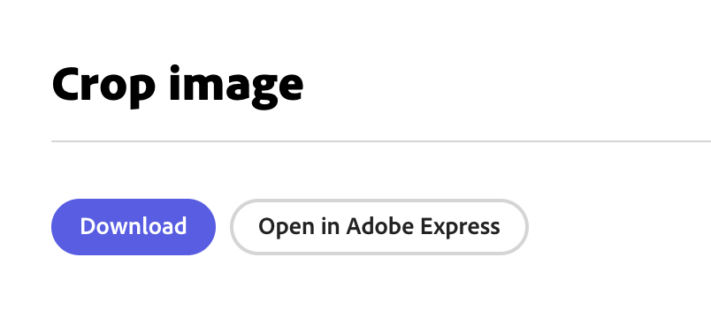
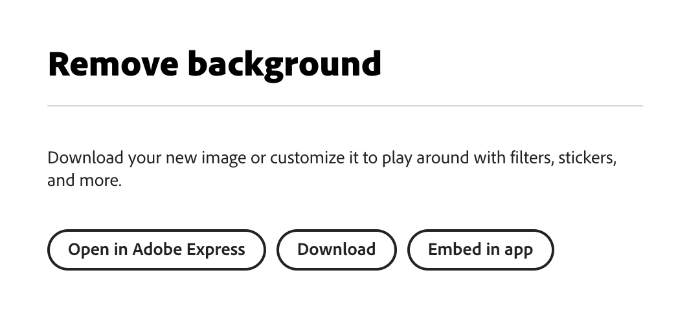

---
keywords:
  - Image Quick Actions
  - Video Quick Actions
  - Crop image
  - Convert to JPG
  - Convert to PNG
  - Resize image
  - Remove background
  - Convert to GIF
  - Convert to MP4
  - Crop video 
  - Merge videos
  - Resize video
  - Trim video
  - Animate from audio
title: Embed quick actions
description: This is the overview page for the quick actions component.
contributors:
  - https://github.com/amandahuarng
  - https://github.com/pklaschka
---

# Quick actions

<InlineAlert variant="error" slots="header, text1, text2" />

IMPORTANT: Deprecation Warning

We are no longer approving integrations using v1 or v2 of the SDK - both versions will be deprecated later this year.

While we are in beta, all v3 clients are disabled by default. **Please share your API key with amandah@adobe.com to begin development.**

Quick actions gives your users access to powerful, one-click image and video editing tools. Try them for yourself in our [demo app](https://demo.expressembed.com).

## What are quick actions?

Adobe-powered quick actions take the most complex tasks from our flagship apps -- like remove background -- and turns them into one-click tasks. The quick actions component is embedded onto your application as an iframe.

Once the desired action is complete, the SDK provides two native export buttons to surface to users: 1) download the modified asset or 2) edit further in the full editor component. You can also configure your own custom export button to perform tasks such as saving the asset back into the application.

## openQuickAction()

This API is responsible for embedding and launching the quick actions component in your application as an iframe.

```js
ccEverywhere.openQuickAction(
    // QuickActionsParams
    {
        id: 'crop-image', 
        inputParams: {
            exportOptions: []
        },
        callbacks: {
            onCancel: () => {},
            onError: (err) => {},
            onLoadStart: () => {},
            onLoad: () => {},
            onPublishStart: () => {},
            onPublish: (publishParams) => {},
        },
        modalParams: {},
    }
)
```

## QuickActionParams

`openQuickAction()` takes an object `QuickActionParams` with 4 parameters:

| Property | Description | Type
| :-- | :-- | :--
| id | ID of quick action| [QuickActionId](../../reference/CCEverywhere/quick_actions/index.md#quickactionid)
| inputParams | [Launch with asset](../../reference/types/index.md#asset) and [export options](../../reference/types/index.md#exportoptions) | [QuickActionInputParams](../../reference/CCEverywhere/quick_actions/index.md#quickactioninputparams)
| callbacks | Callback functions | [Callbacks](../../reference/types/index.md#callbacks)
| modalParams | Define size of modal |  [ModalParams](../../reference/types/index.md#modalparams)
| outputParams | [CCXOutputParams](../../reference/types/index.md#ccxoutputparams) | Desired output options when exporting assets from a quick action.

**Note**: `inputParams.exportOptions` determines which export buttons are exposed to the user once the action is complete, and must be defined with at least an empty array. If given an empty array, the "Download" button will be surfaced as an export option.

### QuickActionId

Identifies which image quick action component should be loaded into the iframe.

| Quick Action | QuickActionId | Type
| :-- | :-- | :--
| Crop image | 'crop-image' | Image
| Convert to JPG | 'convert-to-jpg' | Image
| Convert to PNG | 'convert-to-png' | Image
| Resize image | 'resize-image' | Image
| Remove background | 'remove-background' | Image
| Convert to GIF | 'convert-to-gif' | Video
| Convert to MP4 | 'convert-to-mp4' | Video
| Crop video | 'crop-video' | Video
| Merge videos | 'merge-videos' | Video
| Resize video | 'resize-video' | Video
| Trim video | 'trim-video' | Video
| Animate from audio | 'animate-from-audio' | Video

### QuickActionInputParams

Input parameters for quick actions. All the properties are optional.

| Property | Type | Description
| :-- | :-- | :--
| exportOptions | [ExportOptions](../../reference/types/index.md#exportoptions)[] | Export options for the asset that is created. These options will be visible in the quick action editor.
| asset | [Asset](../../reference/types/index.md#asset) or [Asset](../../reference/types/index.md#asset)[] | Asset from the host application to start editing with. Array of assets only accepted for merge video quick action.
| receiveTargetErrors | boolean | Boolean that tells client whether or not to receive target application errors.

## Example: Default export options

When no asset is passed as an input when a quick action is invoked, the user will be asked to browse/upload an image once the modal is open. Default export options will be surfaced to the user.

``` ts title="crop-image.js" hl_lines="15"
ccEverywhere.openQuickAction({
    id: 'crop-image', 
});
```

The screenshot below illustrates how the default export buttons look. **Open in Adobe Express** will open the user's design to the full editor modal. **Download** will download the resulting asset to the user's machine.



## Example: Input asset, custom export options

The `openQuickAction` API can take an image asset and custom export options as input. When you define custom export options, you must define how the export behavior should be handled in the `onPublish` callback. Here, it saves the image data in some image container `appImage`.

``` ts title="remove-background.js" hl_lines="5 29 40"
ccEverywhere.openQuickAction({
    id: 'remove-background', 
    inputParams: {
        asset: {
            data: "<base64-encoded starting image>", 
            dataType: 'base64', 
            type: 'image'
        }, 
        exportOptions: exportOptions
    },
    callbacks: imageCallbacks
});

const exportOptions = [
    /* This native button renders label "Open in Adobe Express" */
    {
        target: 'Editor',
        id: 'edit-in-express',
        buttonType: 'native',
        optionType: 'button'
    },
    /* This native button renders label "Download" */
    {
        target: 'Download',
        id: 'download-button',
        optionType: 'button',
        buttonType: 'native'
    },
    {
        target: 'Host',
        id: 'my-custom-button',
        label: 'Embed in app',
        closeTargetOnExport: true,
        optionType: 'button',
        buttonType: 'custom'
    },
];

const imageCallbacks = {
    onPublish: (publishParams) => {
        // Handle custom export button behavior here
        if(publishParams.exportButtonId=="my-custom-button"){
            const localData = { asset: publishParams.asset[0].data}
            appImage.src = localData.asset;
        }
    },
}
```

The screenshot below illustrates how the custom export buttons look. **Open in Adobe Express** will open the user's design to the full editor modal. **Download** will download the resulting asset to the user's machine. The buttons render in order of the `exportOptions` array, with our custom button rendering last.


