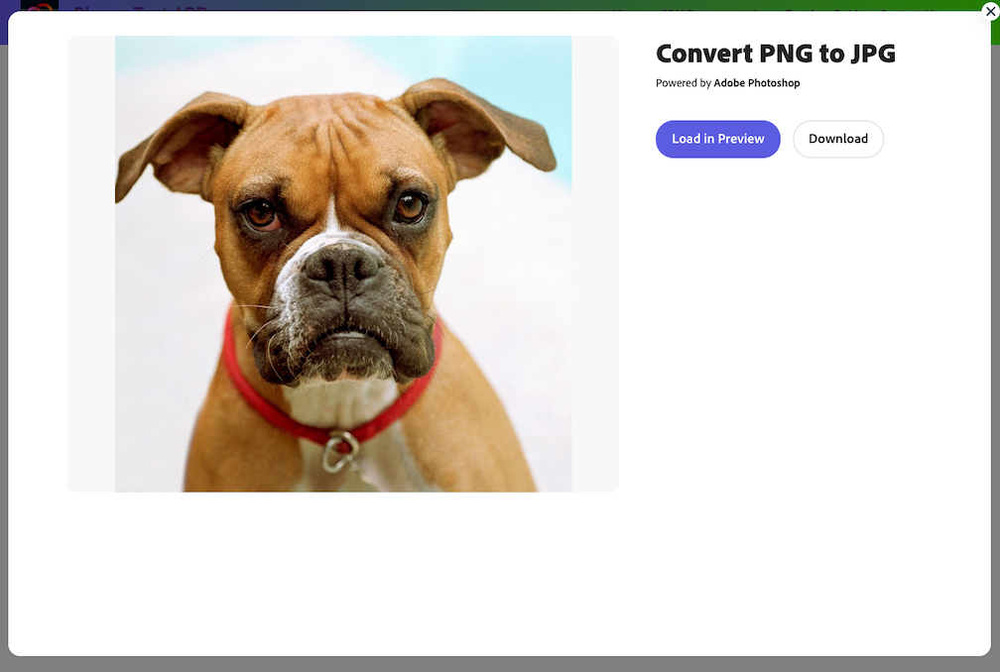

# Quick Actions

## Image and Video
With Quick Actions, developers have access to image and video editing tools powered by Adobe Photoshop and Premiere. 

The Quick Actions component can be embedded in your web application today, by following these guides: 
* [Image Quick Actions](image/index.md)
* [Video Quick Actions](video/index.md)