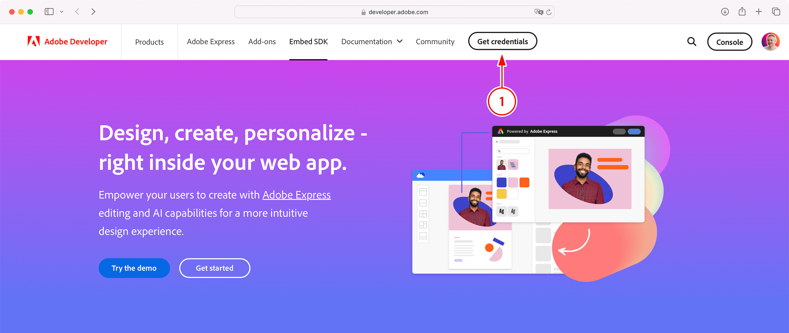
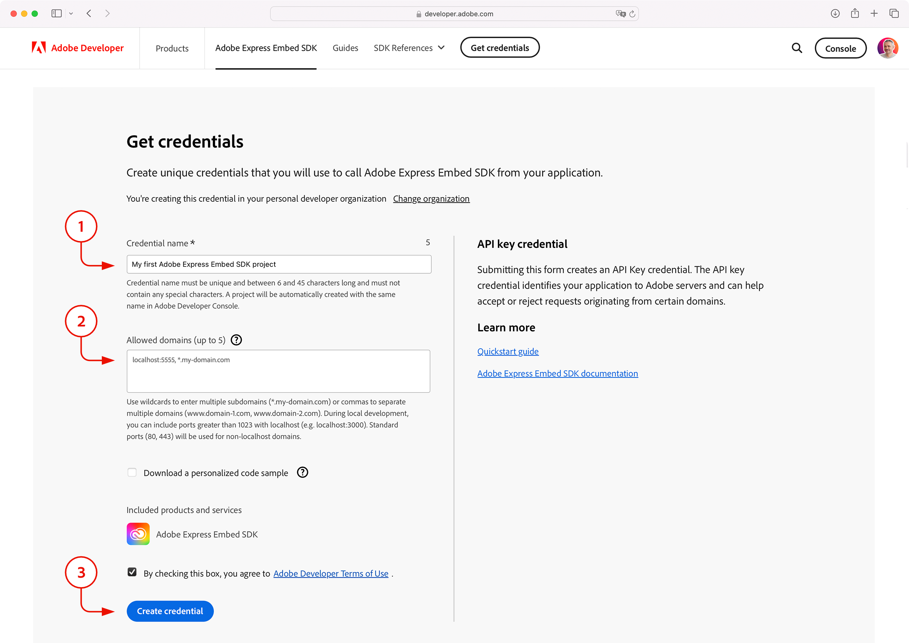
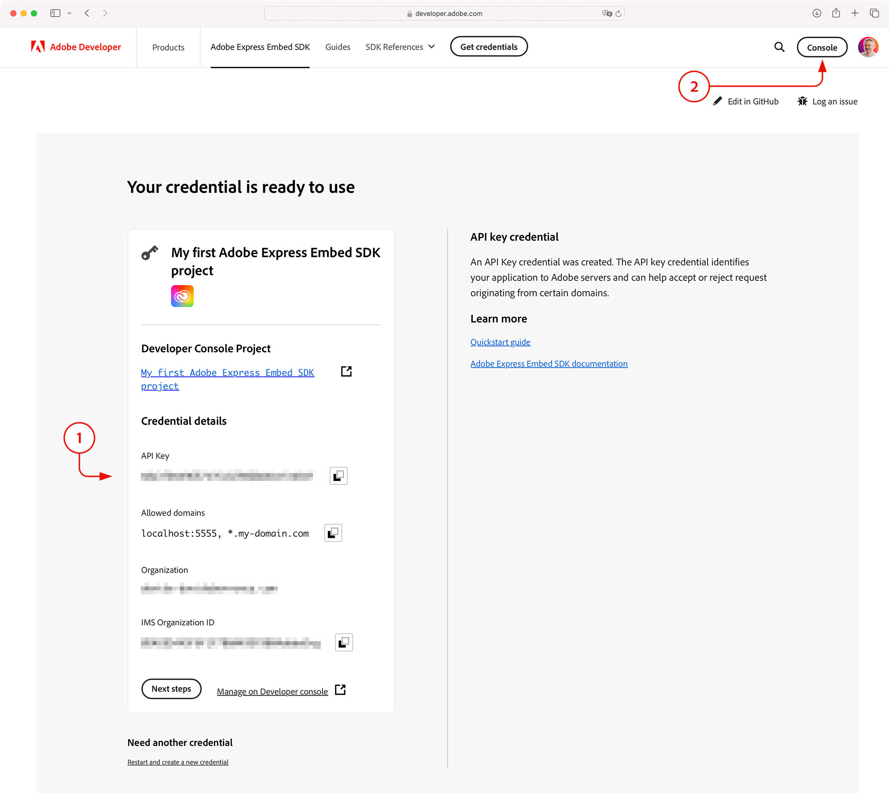
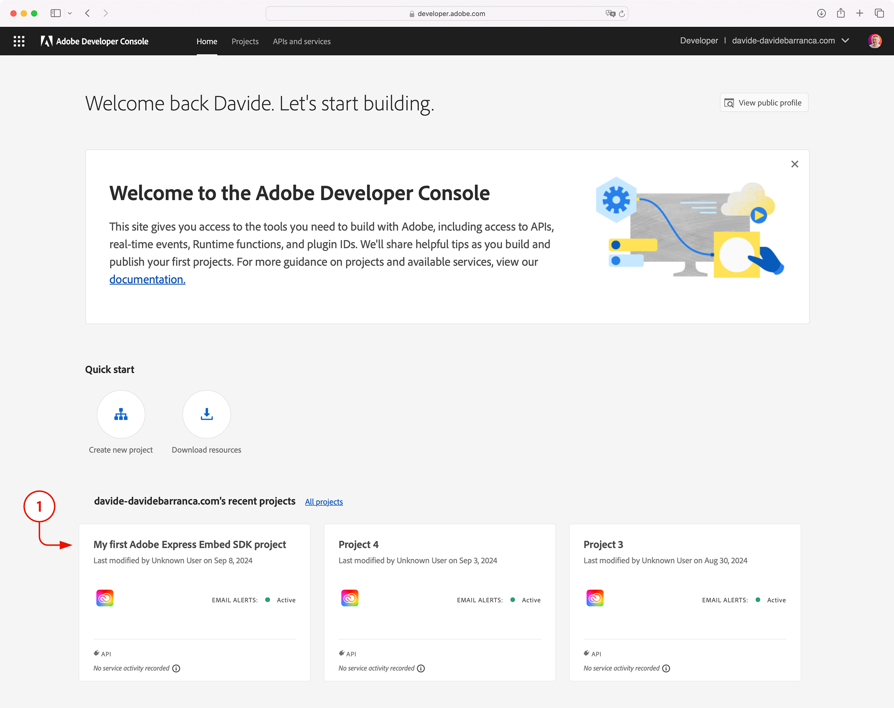
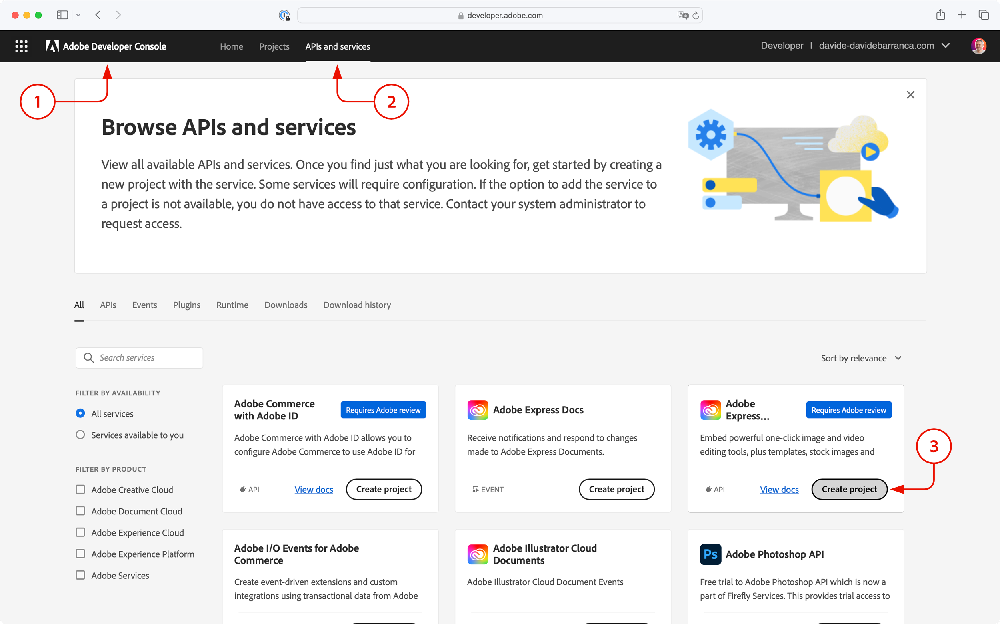
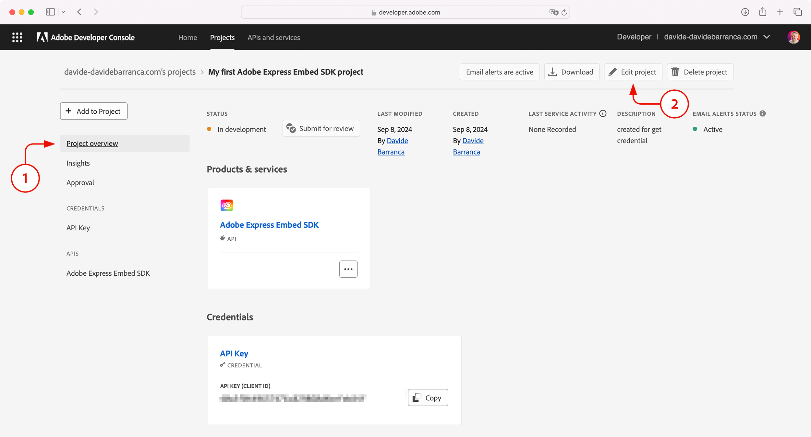
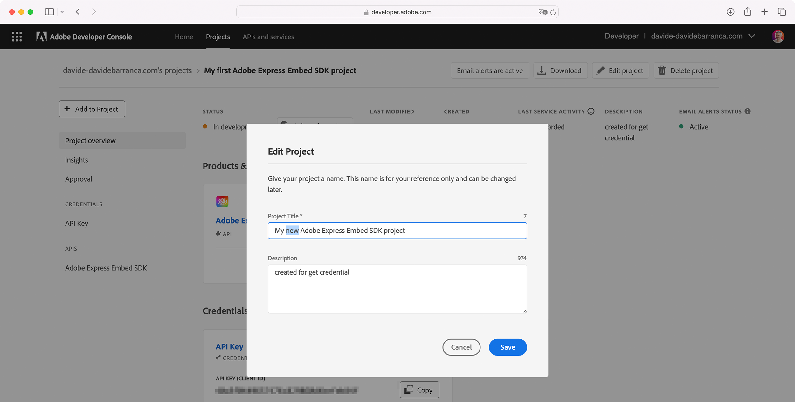
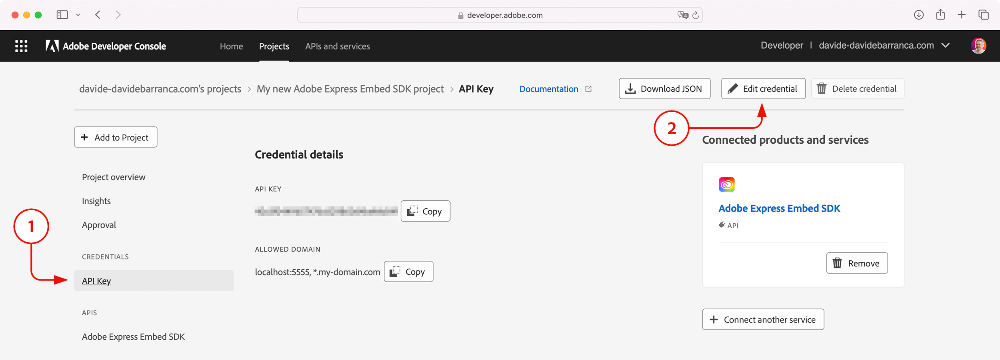
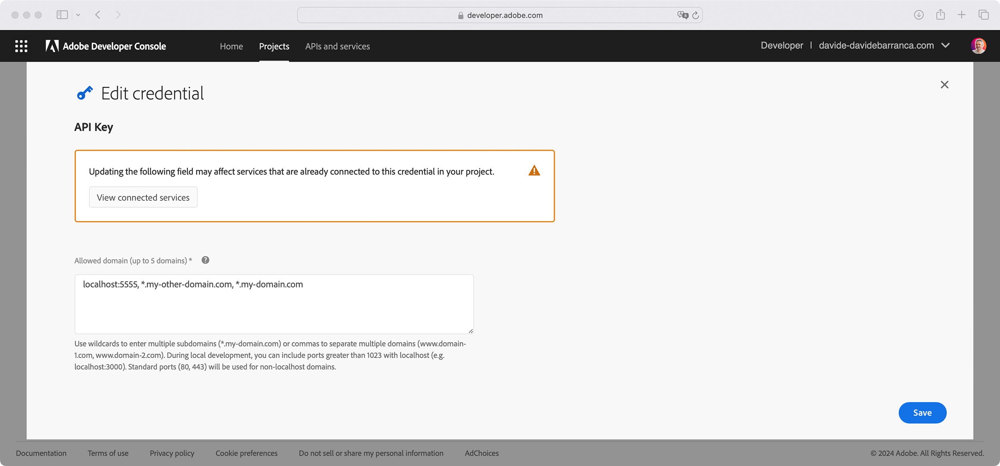

---
keywords:
  - Express Embed SDK
  - Express Editor
  - Adobe Express
  - Embed SDK
  - Quick Actions
  - SDK
  - JavaScript
  - Embed
  - SDK Reference
  - Quickstart
  - Register project
  - Initialize SDK
  - Getting started
  - Browser support
  - Howto
title: Quickstart Guide
description: This is the Quickstart Guide for Adobe Express Embed SDK
contributors:
  - https://github.com/amandahuarng
  - https://github.com/nimithajalal
  - https://github.com/undavide
---

# Quickstart Guide

In this guide, you will learn how to get started with the Adobe Express Embed SDK.

## Step 1: Get an API Key

API keys—one for each project—are required to use the Adobe Express Embed SDK. There are two ways to get one, either via the **Get credential** flow (recommended) or directly from the **Developer Console**.

### Using the Get Credentials feature

From this very Quickstart Guide—or any other child page of the [Adobe Express Embed SDK](https://developer.adobe.com/express/embed-sdk/) documentation—look in the top-navbar for the **Get credentials** button and click it.



Log in with your Adobe ID if requested, or create a new account if you don't have one. You'll be then presented this screen:



1. In the **Credential name** field, add a unique title. It will correspond with the project folder created for your end users in Adobe Express, and must match what's later referred to as `appName` in the SDK initialization.
2. In the **Allowed domains** field, you must insert up to five domains that will be allowed to use your API key. This is a security measure to prevent unauthorized use of your client ID on another website, restricting usage to the domains you have authorized.

<InlineAlert variant="info" slots="text1" />

For local development, you can use `localhost` specifying the port with the colon `:` syntax—in the screenshot above, it's 5555. Please note that all connections must be secure (HTTPS) for both production and development environments.

3. Agree to the Terms of Use, and click the **Create credential** button; your API key will be displayed on the screen under the Credential details (see 1 below).



If you find yourself needing to change the project name or the list of allowed domains, click the **Console** button in the top-right corner, as shown in the screenshot above. You will be taken to the [Adobe Developer Console](https://developer.adobe.com/developer-console/docs/guides/getting-started/), where all your projects are listed; click on the one you want to edit.



You can skip the next step and get directly to [Edit the Project's settings](#edit-the-projects-settings).

### Using the Developer Console

The **Get credentials** button is a convenient shortcut for creating a new Embed SDK project. You can do the same directly from the Developer Console:

1. Navigate to the [Developer Console](https://developer.adobe.com/console).
2. Select **APIs and services**.
3. Search for **Adobe Express Embed SDK** card.
4. Click **Create project** button.



Follow the instructions; you'll find that the same steps are required as described above.

### Edit the Project's settings

The API cannot be modified once it's created. To edit the project name, make sure you are in the **Project overview** (link on the left column) and click on the **Edit project** button (top-right navbar).



Enter the name and click **Save**.



### Edit the list of allowed domains

Similarly, you're can edit the list of domains that are able to use the Embed SDK. Select the **API Key** link in the left column, and click on the **Edit credential** button (top-right navbar) to add or remove domains as needed.



Remember to **Save** your changes each time you edit the project's settings.



## Step 2: Embed the SDK

You can embed the SDK in your projects using one of the following methods:

- [Load via `<script>` tag](#load-via-script-tag)
- [Using `import()`](#using-import)
- [Dynamic script](#dynamic-script)

The latest [version](https://cc-embed.adobe.com/sdk/v4/version.json) of the SDK is available on Adobe's CDN:

```js
var CDN_URL = "https://cc-embed.adobe.com/sdk/v4/CCEverywhere.js";
```

You can check the [changelog](../changelog/index.md) to read about known issues as well as what changes have been made.

### Load via script tag

```html
<script src="https://cc-embed.adobe.com/sdk/v4/CCEverywhere.js"></script>
<script>
  (async () => {
    const ccEverywhere = await window.CCEverywhere.initialize(
      initializeParams, configParams
      );
  })();
</script>
```

### Using import

```js
await import(CDN_URL);
const ccEverywhere = await window.CCEverywhere.initialize(
  initializeParams, configParams
);
```

### Dynamic script

```js
((document, url) => {
    const script = document.createElement("script");
    script.src = url;
    script.onload = async () => {
      if (!window.CCEverywhere) {
          return;
        }
        const ccEverywhere = await window.CCEverywhere.initialize(
          initializeParams, configParams
        );
    };
    document.body.appendChild(script);
  })(document, CDN_URL);
```

## Step 3: Initialize the SDK

<InlineAlert variant="info" slots="text1" />

The SDK should only be initialized **once on each page**.

To initialize the SDK, pass the following objects: `HostInfo` and `ConfigParams`.

### HostInfo

- `CLIENT_ID` (string): API key from Developer Console
- `APP_NAME` (string): Name of your integration/app. This name corresponds with the project folder created for your end users in Adobe Express.

```js
(async () => {
    const ccEverywhere = await window.CCEverywhere.initialize({
      clientId: <CLIENT_ID>,
      appName: <APP_NAME>,
    });
})();
```

<InlineAlert variant="info" slots="text1" />

The SDK can be launched with a delayed login: users won't be asked to sign in until they export a document. Read more about the initialize API [here](../../reference/initialize/index.md).

Successful initialization returns a `CCEverywhere` Class object, with three properties:

1. `editor`
2. `module`
3. `quickAction`

## Next Steps: Explore the SDK

Our guides along with the [SDK references](../../reference/index.md) can help you start working with the SDK in a way that best suits your needs.

### [Full editor](../../guides/full-editor/index.md)

With the full editor component, your users are able to:

- How to [create new projects](../../guides/full-editor/create-project/)
- How to [edit existing projects](../../guides/full-editor/edit-project/)

Users can access Adobe Express's huge template and asset library when starting with a blank new project in the editor. Pre-selected images can also be loaded into the editor for further designing. The editor can also load previous projects (created using your integration) by taking an existing project ID as input.

### [Quick actions](../../guides/quick-actions/index.md)

Once the selected quick action loads in the iframe, users can browse their filesystem for an asset. At this time, only image quick actions can pass a pre-selected asset as input. After the quick action is completed, a download button will appear. You can configure other export options such as taking the user into a full editor component to further customize the modified asset, or saving it back onto your application.

### [Modules](../../guides/modules/index.md)

Once the selected quick action loads in the iframe, users can browse their filesystem for an asset. At this time, only image quick actions can pass a pre-selected asset as input. After the quick action is completed, a download button will appear. You can configure other export options such as taking the user into a full editor component to further customize the modified asset, or saving it back onto your application.

## Browser support

Here are the minimum browser requirements for the SDK:

| Browser name   | Minimum version |
| -------------- | --------------- |
| Safari         | 16 and onwards  |
| Google Chrome  | 100 and onwards |
| Microsoft Edge | 107 and onwards |
| Firefox        | 117 and onwards |

<DiscoverBlock width="100%" slots="heading, link, text"/>

## Next Steps

[Sample Project](https://github.com/AdobeDocs/cc-everywhere/tree/main/v4-sample)

Are you ready to start playing with some code? Check out our sample project to see the latest SDK version in action!
