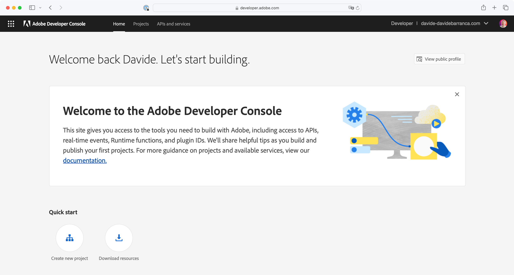
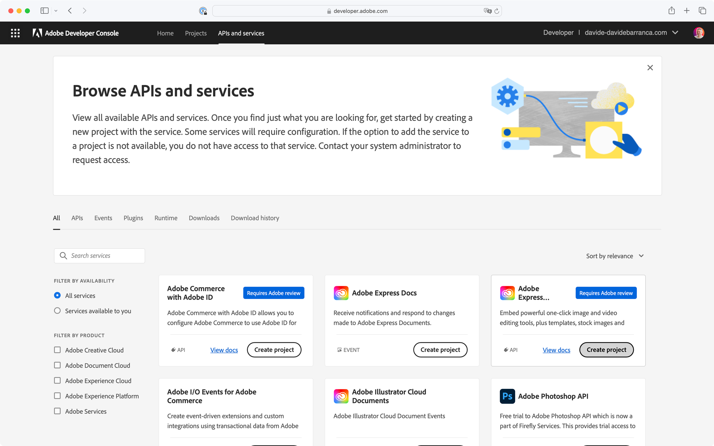
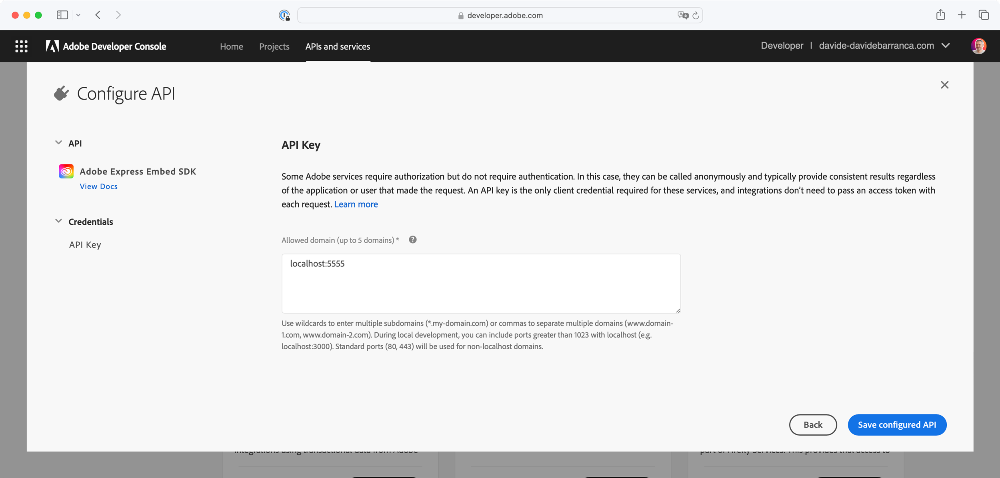
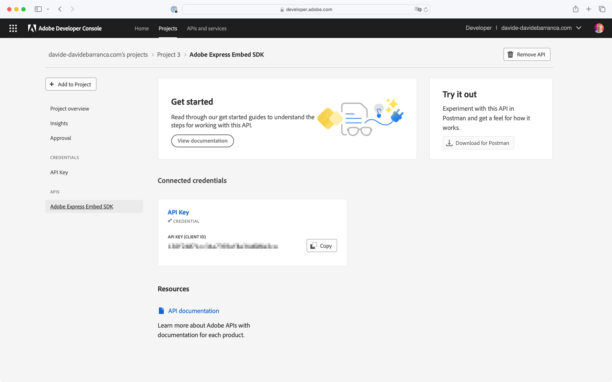
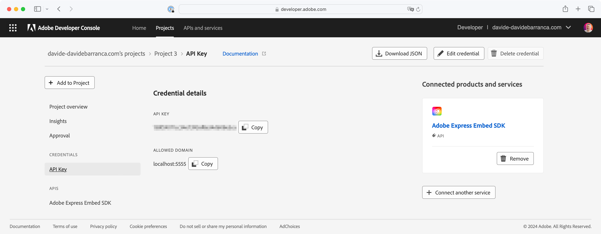
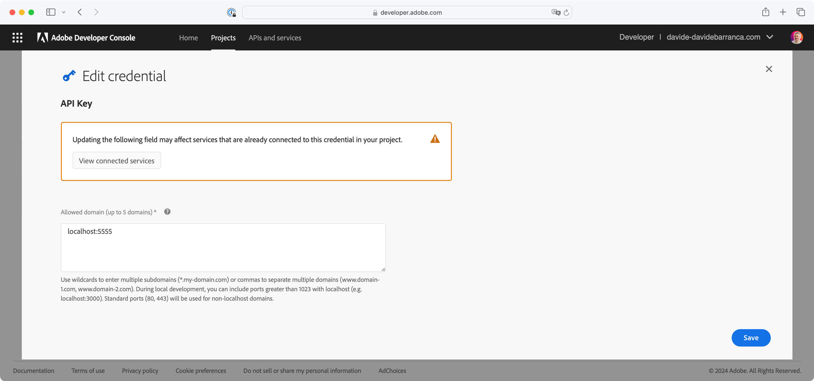

---
keywords:
  - Express Embed SDK
  - Express Editor
  - Adobe Express
  - Embed SDK
  - Quick Actions
  - SDK
  - JavaScript
  - Embed
  - SDK Reference
  - Quickstart
  - Register project
  - Initialize SDK
  - Getting started
  - Browser support
title: Quickstart Guide
description: This is the Quickstart Guide for Adobe Express Embed SDK
contributors:
  - https://github.com/amandahuarng
  - https://github.com/nimithajalal
  - https://github.com/undavide
---
# Quickstart Guide

In this guide, you will learn how to get started with the Adobe Express Embed SDK.

## Step 1: Get an API Key

API keys—one for each project—are required to use the Adobe Express Embed SDK. You can get one logging to your [Adobe Developer Console](https://developer.adobe.com/console); if you need a refresher on the Console, you can read more about it [here](https://developer.adobe.com/developer-console/docs/guides/getting-started/).



Select **APIs and services** from the top navigation bar; you'll see there a list of the available ones. Find the **Adobe Express Embed SDK** card and click the **Create project** button.
 


On the **Configure API** section, you must insert up to five domains that will be allowed to use your API key. This is a security measure to prevent unauthorized use of your client ID on another website, restricting usage to the domains you have authorized.



For local development, you can use `localhost` specifying the port with the colon `:` syntax—in the screenshot above, it's 5555. Please note that all connections must be secure (HTTPS) for both production and development environments. 

Once you have added all the domains, click **Save configured API**. The API key will be displayed on the screen.



Copy the API key and save it in a secure location. You will need it to initialize the SDK in your project. The API cannot be modified once it's created, but you can always edit the list of domains. Click on the **API key** link under the **Credentials** section on the left column:



There's an **Edit credential** button on the top right corner of the screen. Click on it to edit the list of domains. **Save** your changes when you're done.



## Step 2: Embed the SDK

The latest [version](https://cc-embed.adobe.com/sdk/v4/version.json) of the SDK is available on Adobe's CDN:

```js
var CDN_URL = "https://cc-embed.adobe.com/sdk/v4/CCEverywhere.js"";
```

You can check the [changelog](/src/pages/guides/changelog/index.md) to read about known issues as well as what changes have been made.

### Load via script tag

```html
<script src="https://cc-embed.adobe.com/sdk/v4/CCEverywhere.js""></script>
<script>
  (async () => {
    const ccEverywhere = await window.CCEverywhere.initialize(initializeParams, configParams);
  })();
</script>
```

### Using import

```js
await import(CDN_URL);
const ccEverywhere = await window.CCEverywhere.initialize(initializeParams, configParams);
```

### Dynamic script

```js
((document, url) => {
    const script = document.createElement("script");
    script.src = url;
    script.onload = async () => {
      if (!window.CCEverywhere) {
          return;
        }
        const ccEverywhere = await window.CCEverywhere.initialize(initializeParams, configParams);
    };
    document.body.appendChild(script);
  })(document, CDN_URL);
```

## Step 3: Initialize the SDK

The SDK should only be initialized once each page. To initialize the SDK, pass the following objects: `HostInfo` and `ConfigParams`.

### HostInfo

* `CLIENT_ID` (string): API key from Developer Console
* `APP_NAME` (string): Name of your integration/app. This name corresponds with the project folder created for your end users in Adobe Express.

```js
(async () => {
    const ccEverywhere = await window.CCEverywhere.initialize({
      clientId: <CLIENT_ID>,
      appName: <APP_NAME>,
    });
})();
```

The SDK can be launched with a delayed login: users won't be asked to sign in until they export a document. Read more about the initialize API [here](../../reference/initialize/index.md).

Successful initialization returns a `CCEverywhere` Class object, with three properties:

1. `editor`
2. `module`
3. `quickAction`

## Next Steps: Explore the SDK

Our guides along with the [SDK references](../../reference/index.md) can help you start working with the SDK in a way that best suits your needs.

### [Full editor](../guides/full_editor/index.md)

With the full editor component, your users are able to:

* How to [create new projects](../guides/full_editor/create_project/)
* How to [edit existing projects](../guides/full_editor/edit_project/)

Users can access Adobe Express's huge template and asset library when starting with a blank new project in the editor. Pre-selected images can also be loaded into the editor for further designing. The editor can also load previous projects (created using your integration) by taking an existing project ID as input.

### [Quick actions](../guides/quick_actions/index.md)

Once the selected quick action loads in the iframe, users can browse their filesystem for an asset. At this time, only image quick actions can pass a pre-selected asset as input. After the quick action is completed, a download button will appear. You can configure other export options such as taking the user into a full editor component to further customize the modified asset, or saving it back onto your application.

### [Modules](../guides/modules/index.md)

Once the selected quick action loads in the iframe, users can browse their filesystem for an asset. At this time, only image quick actions can pass a pre-selected asset as input. After the quick action is completed, a download button will appear. You can configure other export options such as taking the user into a full editor component to further customize the modified asset, or saving it back onto your application.

## Browser support

Here are the minimum browser requirements for the SDK:

| Browser name | Minimum version
| :-- | : --
| Safari  | 16 and onwards
| Google Chrome | 100 and onwards
| Microsoft Edge | 107 and onwards
| Firefox | 117 and onwards

**Notes:**

* JavaScript must be enabled
* The SDK will *not* work in incognito windows.
* HTTPS connections are required for all environments.
