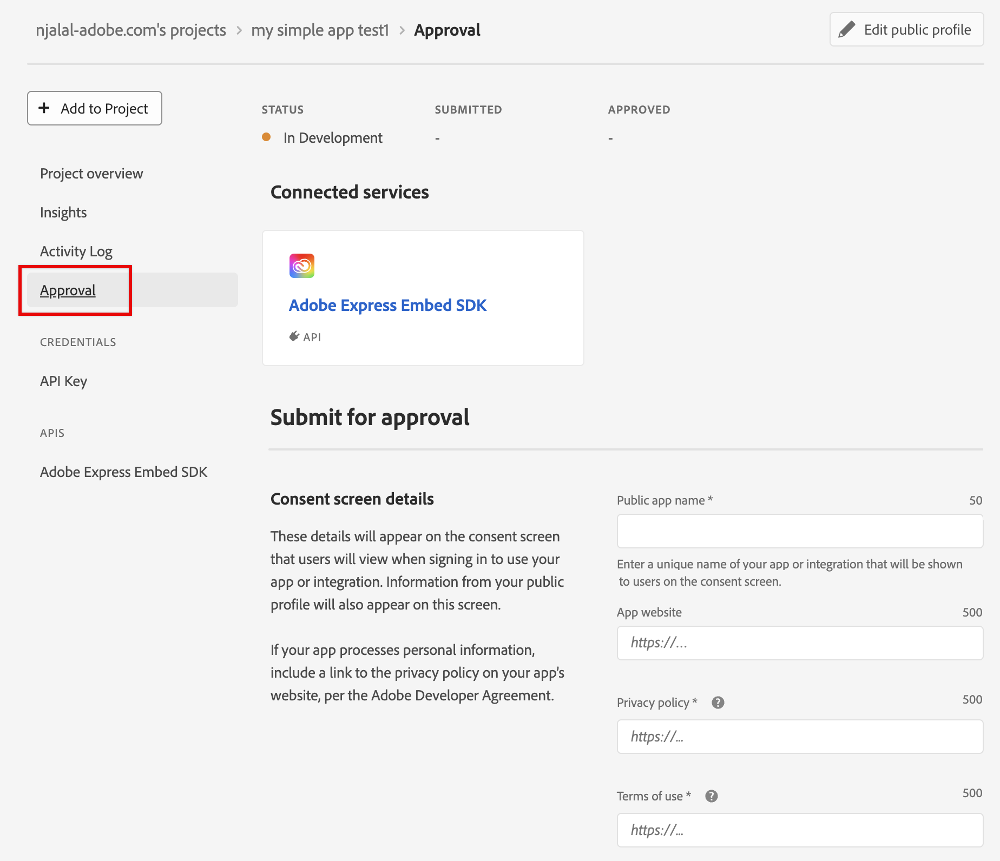

---
keywords:
  - Developer submission guidelines
  - Review process
  - Review
  - Approval
  - Rejection
title: Submission and Review
description: This page explains the submission and review process.
contributors:
  - https://github.com/amandahuarng
  - https://github.com/nimithajalal
---

# Submission and review

Adobe reviews all applications that integrate Adobe Express Embed SDK before enabling it for public use.

## Requesting access

<InlineAlert variant="info" slots="text" />

Access to the Adobe Express Embed SDK now requires a business approval process. Before you can submit your integration for review, you must first request and receive access to the SDK.

### Access requirements

Access is focused on use cases with clear business or user impact. We prioritize:

- Enterprise or strategic partner integrations
- Well-defined user base
- Clear business impact and meaningful user engagement
- Strong alignment with Adobe Express goals
- Clear plans to implement the SDK effectively

### How to request access

Use [this form](https://www.adobe.com/go/embed-access) to submit your use case. Our team will review and follow up with you regarding your access request.

### Existing integrations

Approved integrations will remain active until December 2027. After that, they'll need to go through the new business approval process.

If you have any questions about the access process, please contact [ccintrev@adobe.com](mailto:ccintrev@adobe.com). For more information, see the [Embed SDK access FAQ](../troubleshooting/faq/index.md#embed-sdk-access).

## Overview

This guideline outlines the process for reviewing and submitting an integration using the Adobe Express Embed SDK. Whether you're embedding the Full Editor, Quick Actions, or Modules, adhering to these guidelines will ensure a seamless experience for users and maintain consistency across all implementations.

<InlineAlert variant="help" slots="text" />

Please note that until your integration is approved, it will display a red banner indicating, the experience powred by Adobe Express has not been approved yet. Once we review and approve your app, we will remove this banner.

This process is valuable, as gaining approval enhances the credibility of your integration and fosters trust among your users.

<InlineAlert slots="text" />

We aim to review your integration within 10 business days of submission, and will let you know if it is accepted, or if any changes need to be made.

## Review criteria

Our reviewers will assess your submission based on a variety of factors, including:

- Branding
- Performance
- Accessibility
- Harmful or unacceptable content
- User Experience
- Transparency
- Presence of bugs or harmful code

## Pre-Submission checklist

### Correct namespace usage

Verify that you're using the appropriate namespace (Full Editor, Quick Actions, or Modules) based on your integration’s functionality.

### Appropriate brand usage

Read our brand guidelines. Before you submit your integration for review, please read our [brand guidelines](../../assets/Adobe_Express_Partner_Program_brand_guide.pdf). To adhere to our brand requirements, you can [download the assets here](https://developer.adobe.com/distribute/cc-brand-assets).

### Inappropriate content

Any application embedding an Adobe product is a reflection on Adobe and our developer community and is accessible by all users. We encourage you to use your best judgment when submitting content for review and to ensure that your submitted content is reflective of your brand.

- **No adult content.**
No integrations may contain intense violence, blood, gore, sexual content, nudity or strong language.
- **No malicious content of any kind.**
Integrations may not contain or promote (for example) phishing, spamming, hacking, password trafficking, spyware, or contain malware, trojans, or viruses.
- **No illegal or questionable content.**
Integrations may not contain or promote illegal or highly-regulated activities. For example, pharmaceutical sales, promotions or sweepstakes, alcohol or tobacco sales. Integrations may not violate intellectual property rights. For example, applications may not promote DRM circumvention, or contain copyrighted or trademarked content belonging to someone else. Integrations may not promote hatred, violence, or bullying. For example, applications may not contain hate speech, or promote or enable cruel behavior towards others.

### Legal

By creating a project using the SDK in Adobe Developer Console, you are agreeing to the Adobe Developer Terms of Use. Adobe reserves the right to disable your integration if your app does not adhere to the terms.

Additionally, your integration must not violate the trademarks and copyrights of Adobe, Inc., or those of any other party. Please adhere to all trademark guidelines as noted [here](https://www.adobe.com/legal/permissions/trademarks.html).

## Submission guidelines

You have to submit your app for approval in the [Adobe Developer Console](https://developer.adobe.com/console).

<InlineAlert variant="help" slots="text" />

If you started your developement by clicking the [Get Credentials](https://developer.adobe.com/express/embed-sdk/docs/get-credential/) button, you'll need to identify your project before proceeding. Alternatively, you can click on the [Get Credentials](https://developer.adobe.com/express/embed-sdk/docs/get-credential/) button, which should provide a link to any previously created projects. This link will take you to the developer console.

Follow the steps below, in the Developer console.

- Navigate to your project in [Adobe Developer Console](https://developer.adobe.com/console).
- Select **Submit for review** from the **Project overview** tab or select the **Approval** tab on the left panel.

<InlineAlert variant="help" slots="text1, text2, text3" />

  Confirm that the `appName` used to initialize the SDK in your application code reflects your app's name.

  Note any projects created through your integration will be saved in the user's Express account, inside an Express folder with this name.

  Confirm that the SDK is never initialized more than once per page load.

To make sure your review process goes smoothly, check off the tasks in this list before submitting.

### 1. Set up your public profile

If this is your first Adobe integration, set up your public profile. If your app processes personal information, include a link to the privacy policy on your app’s website, per the Adobe Developer Agreement.

### 2. Details for approval

Describe what your app does, to help Adobe review it for approval.

### 3. Notes to reviewer

Make sure you’ve included the following in the **Notes to reviewer** feild.

1. **Test credentials** for your integration.
2. **Workflow** of your integration within your product (URL, step-by-step instructions, and more.)
3. **Version** of the SDK you are using.
4. List the intended behavior of any custom export buttons you use with the full editor, modules, or quick actions.

### 4. Provide screenshots

Complete the **Screenshots for approval** section.

Include screenshots that show the full experience of your app or integration, as well as any usage of Adobe branded elements.
Any usage of [Adobe branding](https://partners.adobe.com/exchangeprogram/creativecloud/marketing/brand-assets.html) must be approved before you submit for approval. These screenshots will only be seen by Adobe during the review process.

Screenshots must be in `JPG` or `PNG` file format, be no larger than `5 MB` and `1360px x 800px` dimensions.

## Submission process

Congratulations! You're on your way to getting your integration into the hands of your users. Our teams are working on new submissions every day. Depending on volume, it can be up to 10 business days before you hear a response from us. On average, we approve integrations within 3 business days.

If you have any questions, feel free to contact us at [ccintrev@adobe.com](mailto:ccintrev@adobe.com) or reach out on our [Adobe Express Embed SDK community forum](https://community.adobe.com/t5/express-embed-sdk/ct-p/ct-express-embed-sdk?page=1&sort=latest_replies&lang=all&tabid=all).

### Submit to Adobe

Once you think you're good to go, click the **Submit for Review** button in the Developer console. Our review team will ensure your integration fulfills all the guidelines and passes all the [test cases](#test-cases) before approving it for public usage.

### Initial review

Adobe’s team will perform an initial review, focusing on technical correctness, design, and user experience. This process may take up to 10 business days.

### Feedback and revisions

If any changes or improvements are required, you will receive feedback with detailed instructions. You can resubmit after addressing the feedback.

### Approval

Once your integration passes all stages of review, you will receive an approval notification, and your integration will be published or distributed as required.
If it was rejected, we will include the reasons for rejection along with any next steps. If you'd like to back and edit your submission, you can do so in the Developer Console.

## Test cases

- Public profile content (name) adheres to Adobe brand guidelines.
- The public profile logo must not include Adobe icons or dummy icons.
- The app description is not ill-formatted, garbled, or improperly exposing character encoding.
- The app description is clear in conveying the integration's functionality.
- The integration is able to perform all advertised features.
- Any website links that are provided successfully open and are safe (check with [https://urlvoid.com](https://urlvoid.com)).
- Proper contact details or a contact form is provided on the GitHub/website link.
- The privacy policy and terms of use URLs (if any) link to the right content.
- Only developers should create projects in the Adobe Developer Console. Users should not be asked to create projects in the Console just to use an integration.
- The project is only asking for access to Adobe APIs/services needed by the integration.
- All details are shown on the iFrame correctly; no truncation or overlapping of a button.
- The editor launches accurately when customized input parameters are defined.
- The editor launches with the right project when passed a valid (existing) Adobe Express project's ID.
- `edit()` is not invoked until after a `create()` or `createWithAsset()` API call is made, and a corresponding project ID is saved.
- If the integration lets users start with an existing asset, the iFrame should load with the user-selected image.
- The export buttons appear as the developer declared (in the "Notes for reviewers" section) during submission. Custom buttons should behave as defined.

## Common rejection reasons

- Your app or integration is **not accessible via free user sign-up** and **test credentials are not provided** to our review team for testing purposes.
- Your app is built on a **deprecated version of the SDK**. We currently do not accept versions V3 and below.
- Your **website is not functioning**.
- You have deployed your app in a **staging environment**. Our review team only reviews apps in a production environment.
- Your app **description is not complete** in the **Notes to reviewer** section, and our review team **cannot test all the entrypoints**. Make sure you are clear about what your app integrates (full editor, modules, and/or quick actions) and where/how to invoke them.
- Your **app name** should correspond with the **public app name** in Adobe Developer Console. This `appName` should also be consistent throughout your application. We use this property in our analytics checks so if there are any discrepancies, we will ask that you make that change before you are able to release the integration to your users.

## Marketing

To learn more, see the [Adobe Creative Cloud Developer Brand Guide](https://partners.adobe.com/content/dam/tep_assets/public/public_1/documents/Adobe-Creative-Cloud-Developer-Brand-Guide.pdf). This guide includes best practices for brand assets in marketing, press releases and social media guidance. It's the best spot to get our most up to date assets. Here you'll also find information for how to publicize and promote your application once it's approved.

During the submission process, we're available to answer any direct questions you may have at [CCIntegrationsReview@adobe.com](mailto:CCIntegrationsReview@adobe.com). Please note that this inbox may have delayed responses depending on the number of queries.

We look forward to seeing your creative solutions!
