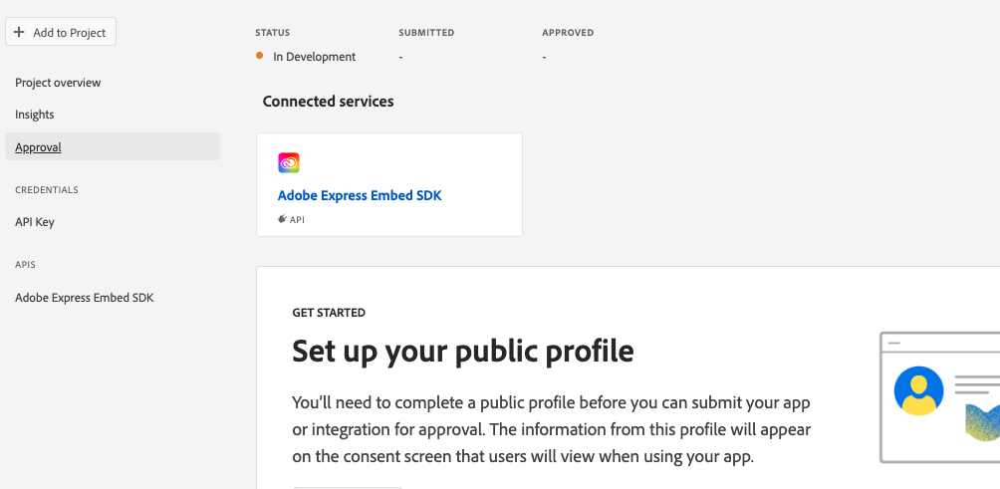

---
keywords:
  - Developer submission guidelines
  - Review process
title: Submission and Review
description: This page explains the submission and review process.
contributors:
  - https://github.com/amandahuarng
---

# Submission and Review

<InlineAlert variant="warning" slots="header, text1, text2" />

IMPORTANT: Deprecation Warning

We are no longer approving integrations using v1 or v2 of the SDK - both versions will be deprecated later this year.

While we are in beta, all v3 clients are disabled by default. **Please share your API key with amandah@adobe.com to begin development.**

Adobe reviews all applications that integrate Adobe Express Embed SDK before enabling it for public use.

## Before you submit

### Appropriate brand usage

* Your integration must not violate the trademarks and copyrights of Adobe, Inc., or those of any other party. Please adhere to all trademark guidelines as noted here: <https://www.adobe.com/legal/permissions/trademarks.html>
* **Brand guidelines are in the process of being finalized.** In the interim, please make sure you have received branding approval from your partner manager.

### Inappropriate content

Any application embedding an Adobe product is a reflection on Adobe and our developer community and is accessible by all users. We encourage you to use your best judgment when submitting content for review and to ensure that your submitted content is reflective of your brand.

* __No adult content.__
No integrations may contain intense violence, blood, gore, sexual content, nudity or strong language.
* __No malicious content of any kind.__
Integrations may not contain or promote (for example) phishing, spamming, hacking, password trafficking, spyware, or contain malware, trojans, or viruses.
* __No illegal or questionable content.__
Integrations may not contain or promote illegal or highly-regulated activities. For example, pharmaceutical sales, promotions or sweepstakes, alcohol or tobacco sales. Integrations may not violate intellectual property rights. For example, applications may not promote DRM circumvention, or contain copyrighted or trademarked content belonging to someone else. Integrations may not promote hatred, violence, or bullying. For example, applications may not contain hate speech, or promote or enable cruel behavior towards others.

### Legal

By creating a project using the SDK in Adobe Developer Console, you are agreeing to the Adobe Developer Terms of Use. Adobe reserves the right to disable your integration if your app does not adhere to the terms.

## Submit your app

1. Navigate to your project in Adobe Developer Console -- select "Submit for review" from the __Project overview__ tab or select the __Approval__ tab on the left panel. 
   
2. If this is your first Adobe integration, set up your public profile - note that the information that appears on your public profile will appear in the consent screen displayed to users.

3. Fill out the fields in the __Consent Screen Details__ section.

4. Fill out the fields in the __Approval Details__ section. In the __Notes to reviewer__ field, make sure to:
   * Provide steps for our review team to test the integration on your platform. If free sign-up is not available, please provide a set of working test credentials for our review team.
   * Please note whether your app uses the full editor, quick actions, or both.
   * Please list which quick actions(s), if any, you use in your application.
   * Please list the intended behavior of any custom export buttons you use with the full editor or quick actions.
   * Confirm that the `appName` used to initialize the SDK in your application code reflects your app's name. Note any projects created through your integration will be saved in the user's Express account, inside an Express folder with this name.
   * Confirm that the SDK is never initialized more than once per page load.

5. Complete the __Screenshots for approval__ section.
6. Once you think you're good to go, click the "Submit for Review" button. Our review team will ensure your integration fulfills all the guidelines and passes all the [test cases](#test-cases) before approving it for public usage.

### Test cases

* Public profile content (name) adheres to Adobe brand guidelines.
* The public profile logo must not include Adobe icons or dummy icons.
* The app description is not ill-formatted, garbled, or improperly exposing character encoding.
* The app description is clear in conveying the integration's functionality.
* The integration is able to perform all advertised features.
* Any website links that are provided successfully open and are safe (check with <https://urlvoid.com>).
* Proper contact details or a contact form is provided on the GitHub/website link.
* The privacy policy and terms of use URLs (if any) link to the right content.
* The `appName` used to initialize the SDK (shared by the developer in the "Notes to reviewer" section) is consistent with the "Public app name" registered for this project.
* Only developers should create projects in the Adobe Developer Console. Users should not be asked to create projects in the Console just to use an integration.
* The project is only asking for access to Adobe APIs/services needed by the integration.
* All details are shown on the iFrame correctly; no truncation or overlapping of a button.
* The editor launches accurately when customized input parameters are defined.
* The editor launches with the right project when passed a valid (existing) Adobe Express project's ID.
* `editDesign()` is not invoked until after a `createDesign()` API call is made, and a corresponding project ID is saved.
* [Image quick actions only] If the integration lets users start with an existing asset, the iFrame should load with the user-selected image.
* The export buttons appear as the developer declared (in the "Notes for reviewers" section) during submission. Custom buttons should behave as defined.

### Common rejection reasons

1. Your app or integration is not accessible via free user sign-up and test credentials are not provided to our review team for testing purposes.
2. Your app description is not complete in the __Notes to reviewer__ section, and our review team cannot test all the entrypoints. Make sure you are clear about what your app integrates (full editor and/or quick actions) and where/how to invoke them.

## After you submit

Congratulations! You're on your way to getting your integration into the hands of your users. Our teams are working on new submissions every day. Depending on volume, it can be up to 10 business days before you hear a response from us. Thank you for your patience as we review your submission.

Once your submission has been reviewed, we will email you letting you know whether your submission was approved or rejected. If it was rejected, we will include the reasons for rejection along with any next steps. If you'd like to back and edit your submission, you can do so in the Developer Console.

## Marketing

To learn more, see the [Adobe Creative Cloud Developer Brand Guide](https://partners.adobe.com/content/dam/tep_assets/public/public_1/documents/Adobe-Creative-Cloud-Developer-Brand-Guide.pdf). This guide includes best practices for brand assets in marketing, press releases and social media guidance. It's the best spot to get our most up to date assets. Here you'll also find information for how to publicize and promote your application once it's approved.

During the submission process, we're available to answer any direct questions you may have at CCIntegrationsReview@adobe.com. Please note that this inbox may have delayed responses depending on the number of queries. We look forward to seeing what you create!
