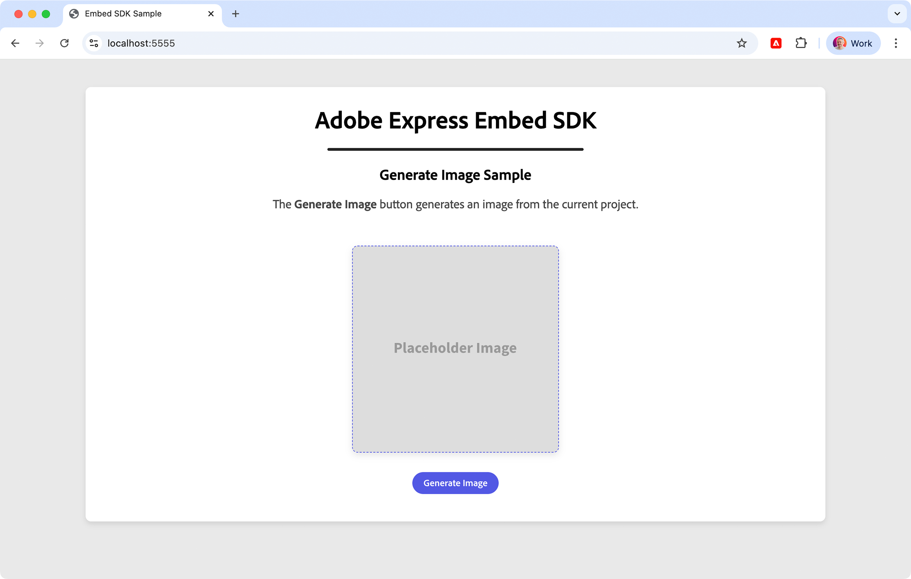

---
keywords:
  - Adobe Express
  - Embed SDK
  - SDK v4
  - CCEverywhere
  - Edit Image
  - Edit Image v2
  - Tutorial
  - Module workflow
  - onPublish callback
  - onIntentChange callback
title: Embed SDK Edit Image tutorial
description: Step-by-step guide for implementing the Edit Image module with Adobe Express Embed SDK
contributors:
  - https://github.com/undavide
---

# Embed SDK Edit Image tutorial

Learn how to implement the Edit Image module using the Adobe Express Embed SDK.

## Introduction

Welcome to this hands-on tutorial! We'll walk you through implementing the new Edit Image module of the Adobe Express Embed SDK. By the end, your integration will be able to use all its new [V2 features](../concepts/edit-image-v2.md), from the tabbed interface to the significant performance improvements.

### What you'll learn

By completing this tutorial, you'll gain practical skills in:

- Implementing the **Edit Image module** with the Adobe Express Embed SDK.
- Applying the various settings and best practices.

### What you'll build

You'll build a simple, JavaScript-based web application that allows users to edit images using the Edit Image v2 module of the Adobe Express Embed SDK.

<!--  -->

## Prerequisites

Before you start, make sure you have:

- An **Adobe account** (use your existing Adobe ID or [create one for free](https://account.adobe.com/))
- **API credentials** from the Adobe Developer Console ([Get credentials](../quickstart/index.md#step-1-get-an-api-key))
- Basic knowledge of **HTML, CSS, and JavaScript**
- **Node.js** installed on your development machine (v20.19.0 or higher)
- A **text editor or IDE** of your choice

## 1. Set up the project

### 1.1 Clone the sample

You can start by cloning the [Embed SDK Edit Image sample](https://github.com/AdobeDocs/embed-sdk-samples/tree/main/code-samples/tutorials/embed-sdk-edit-image) from GitHub and navigating to the project directory.

```bash
git clone https://github.com/AdobeDocs/embed-sdk-samples.git
cd embed-sdk-samples/code-samples/tutorials/embed-sdk-edit-image
```

The project will have a structure like this:

```txt
.
├── package.json             📦 Project configuration
├── vite.config.js           🔧 Build configuration
└── src
    ├── images               📷 Images
    │   └── ...
    ├── index.html           🌐 UI container
    ├── main.js              💻 Embed SDK logic
    └── style.css            🎨 CSS styles

```

### 1.2 Set up the API key

Locate the `src/.env` file and replace the placeholder string in the `VITE_API_KEY` with your Embed SDK API Key:

```bash
VITE_API_KEY="your-api-key-here!"
```

<!-- Inline Alert -->
<InlineAlert variant="info" slots="text1" />

📖 Instructions on how to obtain an API Key can be found on the [Quickstart Guide](../quickstart/index.md). Make sure your API Key is set to allow the `localhost:5555` domain and port.

### 1.3 Install dependencies

Install the dependencies by running the following commands:

```bash
npm install
npm run start
```

The web application will be served at `localhost:5555` on a secure HTTPS connection; HTTPS is always required for any Embed SDK integration. Open your browser and navigate to this address to see it in action.

<!--  -->

When clicking the **Edit Image** button, the Adobe Express Edit Image module will launch, showing the new tabbed interface.

<!--  -->

When the users click the Save button—you need to actually edit the image before the button is enabled—the sample project will handle the file transfer between Adobe Express and the web page hosting it, and the edited image will be displayed in lieu of the original.

<!--  -->

<!-- Inline Alert -->
<InlineAlert variant="error" slots="header, text1" />

Error: "Adobe Express is not available"

In case you get a popup when trying to launch the Adobe Express integration with the following message: _"You do not have access to this service. Contact your IT administrator to gain access"_, please check to have entered the correct API Key in the `src/.env` file as described [here](#12-set-up-the-api-key).

You can additionally load a different image by clicking the **Load Image** button; there is a set of three demo images in the `src/images` folder, all generated by Adobe Firefly.

## 2. Load the Edit Image v2 module

You can just read the existing code in the sample, but it's always best to **learn by doing!** We suggest following along and typing the code in—even small mistakes can lead to important discoveries.

The [sample project](https://github.com/AdobeDocs/embed-sdk-samples/tree/main/code-samples/tutorials/embed-sdk-edit-image) is a simple web application built with [Vite](https://vitejs.dev/), which takes care of the entire local HTTPS setup and hot reloading.

### 2.1 Import the Embed SDK

In this tutorial, you'll focus on the JavaScript side of things first—the HTML content is not overly important. Open the project the code editor of your choice. In `main.js`, remove everything below the Spectrum `import` statements—you'll rebuild it from scratch.

```js
// main.js

// Import theme and typography styles from Spectrum Web Components
import "@spectrum-web-components/styles/typography.css";
import "@spectrum-web-components/theme/express/theme-light.js";
import "@spectrum-web-components/theme/express/scale-medium.js";
import "@spectrum-web-components/theme/sp-theme.js";

// Import Spectrum Web Components
import "@spectrum-web-components/button/sp-button.js";
import "@spectrum-web-components/button-group/sp-button-group.js";
import "@spectrum-web-components/divider/sp-divider.js";
import "./style.css";
```

The imports above allow us to style our web application with [Spectrum Web Components](https://opensource.adobe.com/spectrum-web-components/index.html) and the [Adobe Express theme](https://spectrum.adobe.com/page/theming/). Let's begin working in `main.js` by importing the Embed SDK:

```js
// main.js
//... previous imports ...

// Import the Adobe Express Embed SDK
await import("https://cc-embed.adobe.com/sdk/v4/CCEverywhere.js");
console.log("CCEverywhere loaded", window.CCEverywhere);
```

<!-- Inline Alert -->
<InlineAlert variant="info" slots="text1" />

There are several ways to import `CCEverywhere.js`: for more information, please refer to the [Quickstart Guide](../quickstart/).

### 2.2 Initialize the Embed SDK

When the Embed SDK is imported, a `CCEverywhere` object is globally available and must be **initialized**. There are two sets of parameters that you can pass as option objects:

- **Host Information**: containing the API key, Application name, etc.
- **Configuration**: optional settings, like locale, delayed sign-in, etc.

```javascript
// main.js
//... previous imports ...

// 👀 Required parameters to initialize the Embed SDK
const hostInfo = {
  clientId: import.meta.env.VITE_API_KEY,
  appName: "Embed SDK Sample",
};

// Optional parameters
const configParams = { /* ... */ };

// Initialize the Adobe Express Embed SDK
// Destructure the `module` property only
const { module } = await window.CCEverywhere.initialize(
  hostInfo,
  configParams
);
```

The [`hostInfo`](../../v4/index.md) object is required: the `clientId` contains your API Key (here, retrieved by Vite from the `.env` file) and the `appName`.

<!-- Inline Alert -->
<InlineAlert variant="warning" slots="text1" />

The `appName` must match the name of your application, and it will be displayed in the Adobe Express UI as a folder where users can store their documents. All [`configParams`](../../reference/initialize/index.md#configparams) are optional.

### 2.3 Load the `module`

The asynchronous [`CCEverywhere.initialize()`](../../v4/sdk/src/3p/cc-everywhere/variables/default.md#initialize) method returns an object with three properties. Here, we destructure the `module` only, because it is the entry point to the [`editImage()`](../../v4/sdk/src/workflows/3p/module-workflow/classes/module-workflow.md#editimage) method. In the next section, we'll learn how to use it to launch the Edit Image experience.

```javascript
module.editImage({ /* ... */ });
```

## 3. Launch the Edit Image experience

### 3.1 Build the HTML user interface

Before tackling the code needed to run the Edit Image experience, let's have a look at the very simple HTML in our example project.

<CodeBlock slots="heading, code" repeat="1" languages="index.html"/>

#### index.html

```html
<body>
  <sp-theme scale="medium" color="light" system="express">
    <div class="container">

      <header>
        <h1>Adobe Express Embed SDK</h1>
        <sp-divider size="l"></sp-divider>
        <h2>Edit Image Sample</h2>
        <p>
          The <b>Edit Image</b> button launches an image editor instance.
        </p>
      </header>

      <main>
        
        <sp-divider size="l"></sp-divider>
        <sp-button-group>
          <sp-button id="uploadBtn">Choose Image</sp-button>
          <sp-button id="editBtn">Edit Image</sp-button>
        </sp-button-group>
        <input type="file" id="fileInput" accept="image/*" style="display: none;" />
      </main>
    </div>
  </sp-theme>

  <script type="module" src="./main.js"></script>

</body>
```

Besides the `<sp-theme>` wrapper, which styles the entire page with the Adobe Express Spectrum theme, the parts we're interested in are:

- The `` element, prepopulated with the (local) image to edit.
- The `<sp-button-group>`, which contains the **Choose Image** and **Edit Image** buttons.
- The `<input>` element, which is hidden and used to upload an alternative image.
- The `<script>` tag, which loads the Embed SDK logic.

### 3.2 Learn the `editImage()` method signature

The [`editImage()`](../../v4/sdk/src/workflows/3p/module-workflow/classes/module-workflow.md#editimage) method expects four parameters, three of which are optional:

```javascript
// module.editImage() function signature

const docConfig       = { /* ... */ }; // Image to edit
const appConfig       = { /* ... */ }; // Edit Image experience
const exportConfig    = { /* ... */ }; // Export options
const containerConfig = { /* ... */ }; // SDK container

module.editImage(docConfig, appConfig, exportConfig, containerConfig);
```

In this tutorial, we'll focus on the [`appConfig`](../../v4/shared/src/types/module/app-config-types/interfaces/edit-image-app-config.md) and [`docConfig`](../../v4/shared/src/types/module/doc-config-types/interfaces/edit-image-doc-config.md) objects; you can look at the [Full Editor tutorial](../tutorials/full-editor.md) for more details on the other two parameters.

### 3.3 Enable the v2 experience in `appConfig`

First, let's enable the v2 experience by setting the `appVersion` property to `"2"` in the [`appConfig`](../../v4/shared/src/types/module/app-config-types/interfaces/edit-image-app-config.md) object.

```javascript
// main.js
//... previous code ...

const appConfig = {
  appVersion: "2",
  // ...
};
```

### 3.4 Familiarize with the `docConfig` object

The [`docConfig`](../../v4/shared/src/types/module/doc-config-types/interfaces/edit-image-doc-config.md) object, that implements the [`EditImageDocConfig`](../../v4/shared/src/types/module/doc-config-types/interfaces/edit-image-doc-config.md) interface, is used for two purposes:

1. To pass the image to edit.
2. To pass the intent to perform on the image; that is, the preselected action to perform on the image, among the available options.

```ts
interface EditImageDocConfig {
  asset?: Asset;
  intent?: EditImageIntent;
}
```

### 3.5 Build an Asset object

The `docConfig.asset` property needs to be an object of type [`Asset`](../../v4/shared/src/types/asset-types/type-aliases/asset.md)—this, as you'd expect, is the image to edit.

There are three kinds of assets:

- [UrlAsset](../../v4/shared/src/types/asset-types/type-aliases/url-asset.md): Asset containing data from a _presigned URL_ (see below).
- [Base64Asset](../../v4/shared/src/types/asset-types/type-aliases/base64-asset.md): Asset containing Base64 encoded data.
- [BlobAsset](../../v4/shared/src/types/asset-types/type-aliases/blob-asset.md): Asset containing [Blob](https://developer.mozilla.org/en-US/docs/Web/API/Blob) data.

Regardless of the kind of asset, they share the following interface:

```ts
interface Asset {
  name?: string;
  type: "image";
  dataType: "url" | "base64" | "blob";
  data: string | Blob;
}
```

#### 3.5.1 Build a URL type Asset

To pass an image from a URL, you need to build a [`UrlAsset`](../../v4/shared/src/types/asset-types/type-aliases/url-asset.md) object, like this:

```javascript
const docConfig = {
    asset: {
      name: "Demo Image",
      type: "image",
      dataType: "url",
      data: "https://ucf44fba496cfec9066caed2...", // Your presigned URL
    },
};
```

<InlineAlert variant="info" slots="header,  text1, text2" />

Presigned URLs

A presigned URL for an image is a secure, time-limited link that grants temporary access to a private image stored on a cloud service like Amazon S3. It allows users to view or download the image without exposing authentication credentials or making the file public.

These URLs are typically generated on the server using a cloud SDK and sent to the frontend, where they can be used like any regular image URL. Since they expire after a set time, they provide a balance between accessibility and security.

In this tutorial, you can make the local URL work—with a caveat.

```javascript
// main.js
//... previous code ...

const expressImage = document.getElementById("image");

const docConfig = {
    asset: {
      name: "Demo Image",
      type: "image",
      dataType: "url",
      data: expressImage.src // 👈 the  element's src attribute
    },
};

const appConfig    = { appVersion: "2" };
const exportConfig = [ /* ... */ ];

module.editImage(docConfig, appConfig, exportConfig);
```

As is, this code would log the following error.


This is because when passing an image by URL, the Edit Image module (served from `https://quick-actions.express.adobe.com`) needs to fetch that file from your development server (`https://localhost:5555`). Because the two origins differ, the browser blocks the request unless your server explicitly says, _"other sites may read this."_ This safeguard prevents a malicious site from poking around your network.

During development you can loosen the restriction by adding CORS headers in `vite.config.js`, either by setting the `cors.origin` property to the Adobe Express URL, or to `*` to allow all origins.

<CodeBlock slots="heading, code" repeat="1" languages="vite.config.js"/>

#### vite.config.js

```javascript
import { defineConfig } from "vite";
import mkcert from "vite-plugin-mkcert";

export default defineConfig({
  root: "src",
  server: {
    https: true,
    port: 5555,
    cors: {
      // 👇 origin is needed if you want to use asset of type "url"
      origin: "https://quick-actions.express.adobe.com", // 👈 add this
      credentials: true,
    },
  },
  build: {
    outDir: "../dist",
  },
  plugins: [mkcert()],
});
```

<InlineAlert variant="warning" slots="text1" />

This is just a workaround to make the local URL work. In production, you'll need to use presigned URLs.

#### 3.5.2 Build a Blob type Asset

The other common way to edit an image is by passing a [`BlobAsset`](../../v4/shared/src/types/asset-types/type-aliases/blob-asset.md) object. In our tutorial, we'll cache the default image as a blob fetching the local resource with the `cacheDefaultImageBlob()` helper function, and using it as the asset's `data` property.

```javascript
// main.js
//... previous code ...

let currentImageBlob = null; // 👈 will hold the blob content

// Cache the default image as a blob
async function cacheDefaultImageBlob() {
  const response = await fetch(expressImage.src);
  currentImageBlob = await response.blob();
}
await cacheDefaultImageBlob();

const docConfig = {
    asset: {
      name: "Demo Image",
      type: "image",
      dataType: "blob",
      data: currentImageBlob // 👈 the blob content
    },
};

const appConfig    = { appVersion: "2" };
const exportConfig = [ /* ... */ ];

module.editImage(docConfig, appConfig, exportConfig);
```

### 3.6 Pass the intent to perform on the image

The `docConfig.intent` property is used to pass the intent to perform on the image—that is to say, the preselected action to perform on the image, among the available options. When it makes sense, the action is automatically triggered when the experience is launched, for instance in case of Remove Background.

```javascript
const docConfig = {
  asset: { /* ... */ },
  intent: "crop-image", // 👈 the intent to perform on the image
};
```

The `intent` property is an object of type [`EditImageIntent`](../../v4/shared/src/types/module/doc-config-types/type-aliases/edit-image-intent.md), which is a subset of the [`EditFurtherIntent`](../../v4/shared/src/types/export-config-types/enumerations/edit-further-intent.md) enumeration, and includes only the following options:

```ts
type EditImageIntent = "add-effects"       |
                       "remove-background" |
                       "resize-image"      |
                       "crop-image"        |
                       "apply-adjustment"  |
                       "gen-fill"          |
                       "remove-object"     |
                       "insert-object"     |
                       "no-intent";
```

TODO: add image

<InlineAlert variant="warning" slots="text1" />

The `intent` property may lead to different results in the Edit Image v1 and v2 experiences.

## Troubleshooting

### Common issues

| Issue                                   | Solution                                                                                                      |
| --------------------------------------- | ------------------------------------------------------------------------------------------------------------- |
| Error: "Adobe Express is not available" | Check to have entered the correct API Key in the `src/.env` file as described [here](#12-set-up-the-api-key). |
| The Community Wall is not showing       | Make sure you've set the `fetchCommunityAssets` function in the `appConfig`                                   |

## Complete working example

<CodeBlock slots="heading, code" repeat="3" languages="index.html, main.js, community-wall.js"/>

#### index.html

```html
<!doctype html>
<html lang="en">

<head>
  <meta charset="UTF-8" />
  <meta name="viewport" content="width=device-width, initial-scale=1.0" />
  <title>Embed SDK Sample</title>
</head>

<body>
  <sp-theme scale="medium" color="light" system="express">
    <div class="container">
      <header>
        <h1>Adobe Express Embed SDK</h1>
        <sp-divider size="l"></sp-divider>
        <h2>Generate Image Sample</h2>
        <p>
          The <b>Generate Image</b> button generates an image from the current project.
        </p>
      </header>

      <main>
        
        <sp-button-group>
          <sp-button id="generateBtn">Generate Image</sp-button>
        </sp-button-group>
      </main>
    </div>
  </sp-theme>

  <script type="module" src="./main.js"></script>

</body>

</html>
```

#### main.js

```javascript
import "./style.css";

// Importing theme and typography styles from Spectrum Web Components
import "@spectrum-web-components/styles/typography.css";
import "@spectrum-web-components/theme/express/theme-light.js";
import "@spectrum-web-components/theme/express/scale-medium.js";
import "@spectrum-web-components/theme/sp-theme.js";

// Importing Spectrum Web Components
import "@spectrum-web-components/button/sp-button.js";
import "@spectrum-web-components/button-group/sp-button-group.js";
import "@spectrum-web-components/divider/sp-divider.js";

import { fetchCommunityAssets } from "./community-wall.js";

// Importing the Adobe Express Embed SDK
await import("https://cc-embed.adobe.com/sdk/v4/CCEverywhere.js");
console.log("CCEverywhere loaded", window.CCEverywhere);

// Parameters for initializing the Adobe Express Embed SDK
const hostInfo = {
  clientId: import.meta.env.VITE_API_KEY,
  appName: "Embed SDK Sample",
};

// Prompts the user to login only when exporting/saving the document
const configParams = {
  loginMode: "delayed",
};

// Initializing the Adobe Express Embed SDK
const { module } = await window.CCEverywhere.initialize(hostInfo, configParams);

// Will hold the project ID when a document is saved on Adobe Express
var existingProjectId = null;
var expressImage = document.getElementById("savedImage");

// Callbacks to be used when creating or editing a document
const callbacks = {
  onCancel: () => {},
  onPublish: (intent, publishParams) => {
    existingProjectId = publishParams.projectId;
    console.log("Project ID", existingProjectId);
    expressImage.src = publishParams.asset[0].data;
    console.log("Image data", publishParams.asset[0].data);
  },
  onError: (err) => {
    console.error("Error!", err.toString());
  },
  // onIntentChange: (oldIntent, newIntent) => {
  //   console.log("Intent changed from", oldIntent, "to", newIntent);
  //   return {
  //     appConfig: {},
  //     exportConfig: [],
  //     containerConfig: {},
  //   };
  // },
};

// Configuration for the app, shared by both Create and Edit flows
const appConfig = {
  appVersion: "2",
  featureConfig: {
    "community-wall": true,
    "fast-mode": false,
    "custom-models": false,
  },
  thumbnailOptions: ["rich-preview", "edit-dropdown"],
  editDropdownOptions: [
    { option: "add-effects" },
    { option: "remove-background" },
    { option: "apply-adjustment" },
    { option: "insert-object" },
    { option: "remove-object" },
  ],
  communityWallConfig: {
    fetchCommunityAssets,
  },
  callbacks,
};

// Configuration for the export options made available to the user
// when creating or editing a document
const exportConfig = [
  {
    id: "download",
    label: "Download",
    action: { target: "download" },
    style: { uiType: "button" },
  },
  {
    id: "save-modified-asset",
    label: "Save image",
    action: { target: "publish" },
    style: { uiType: "button" },
  },
];

// Click handler for the Create Design button
document.getElementById("generateBtn").onclick = async () => {
  module.createImageFromText(appConfig, exportConfig);
};
```

#### community-wall.js

```javascript
import { v4 as uuidv4 } from "uuid";

/** Read images/images.json and return its raw data */
const fetchImages = async () => {
  const resp = await fetch("images/images.json");
  if (!resp.ok) {
    throw new Error(
      `Could not load images.json - ${resp.status} ${resp.statusText}`
    );
  }
  return resp.json(); // [{file, prompt}, …]
};

/** Convert a single file in /images to a data-URL */
const fileToBase64 = async (fileName) => {
  const resp = await fetch(`images/${fileName}`);
  const blob = await resp.blob();

  return new Promise((resolve, reject) => {
    const reader = new FileReader();
    reader.onloadend = () => resolve(reader.result); // “data:image/jpeg;base64,…”
    reader.onerror = reject;
    reader.readAsDataURL(blob);
  });
};

/* ------------------------------------------------------------------
 * one-time cache (so we only hit the network once)
 * ------------------------------------------------------------------ */

let _cache = null; // [{ prompt, base64 }, …]
let _cursor = 0; // how far we have already served
const PAGE_SIZE = 12; // Firefly’s community wall default

const hydrateCache = async () => {
  if (_cache) return _cache; // already loaded

  const meta = await fetchImages(); // images.json
  const base64List = await Promise.all(
    meta.map((item) => fileToBase64(item.file))
  );

  _cache = base64List.map((b64, idx) => ({
    prompt: meta[idx].prompt,
    base64: b64,
  }));

  return _cache;
};

/* ------------------------------------------------------------------
 * public API
 * ------------------------------------------------------------------ */

/**
 * Mimics Adobe Express Community-Wall pagination.
 *
 * @returns {Promise<{assets: Array, cursor: 'Interim_Page'|'Last_Page'}>}
 *
 * The very first call returns items 0-11, cursor = 'Interim_Page'
 * The second call returns items 12-23, etc.
 * When the last chunk is served, cursor = 'Last_Page'
 */
export const fetchCommunityAssets = async () => {
  console.log("fetchCommunityAssets called!");

  // Implement your logic here to fetch the assets from the database
  const data = await hydrateCache();
  console.log("data", data);

  // If we have already served all available assets (cursor at or past end),
  // start over so that a fresh Embed SDK session can see the community wall.
  if (_cursor >= data.length) {
    _cursor = 0;
  }
  console.log("cursor", _cursor);

  // slice next PAGE_SIZE elements
  const slice = data.slice(_cursor, _cursor + PAGE_SIZE);

  const assets = slice.map((item) => ({
    assetId: uuidv4(),
    title: item.prompt,
    thumbnailSrc: item.base64,
    fullRenditionSrc: item.base64,
    width: 467, // hard-coded, or swap for real metadata if you like
    height: 600,
  }));

  _cursor += slice.length;

  const cursor = _cursor >= data.length ? "Last_Page" : "Interim_Page";

  return { assets, cursor };
};
```

## Next steps

Congratulations, you've completed the Generate Image tutorial! You can now explore the [Generate Image v2 Concepts guide](../concepts/generate-image-v2.md) and learn about all its features.

## Need help?

Have questions or running into issues? Join our [Community Forum](https://community.adobe.com/t5/adobe-express-developers/ct-p/ct-adobe-express-developers) to get help and connect with other developers working with the Adobe Express Embed SDK.

## Related resources

- **[API Reference](../../v4/index.md)** - Complete SDK documentation
- **[Adobe Express Embed SDK Overview](../index.md)** - High-level introduction
- **[Demo Application](https://demo.expressembed.com/)** - Interactive demo showcasing SDK capabilities
- **[Sample Applications](https://github.com/AdobeDocs/embed-sdk-samples/tree/main/code-samples/tutorials)** - Working code examples and tutorials
- **[Changelog](../changelog/index.md)** - Latest updates and improvements
