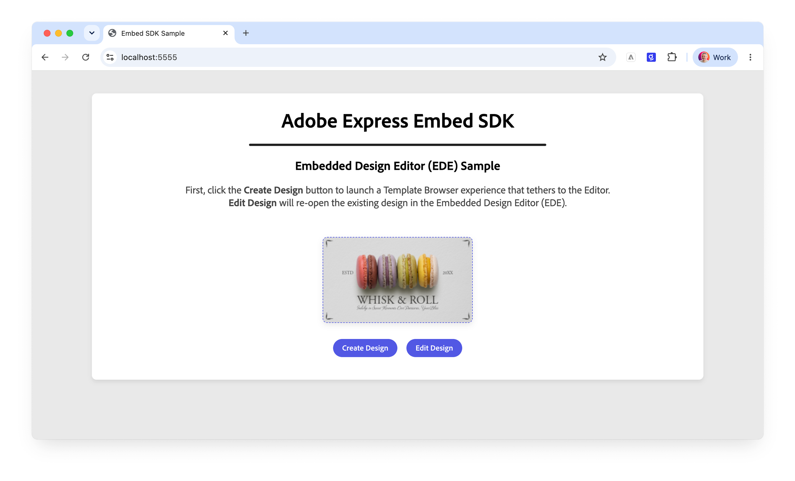
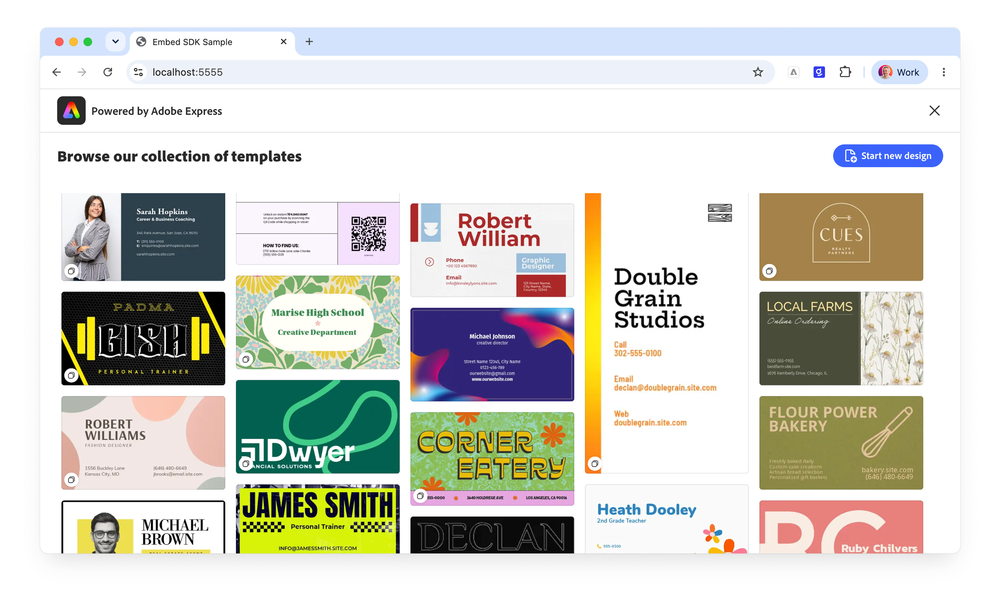
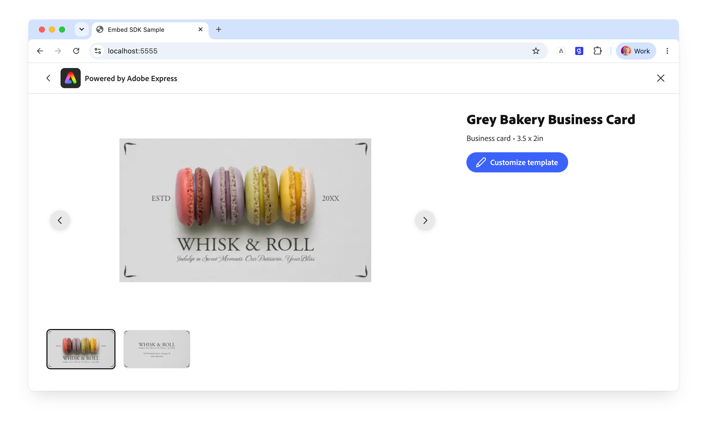
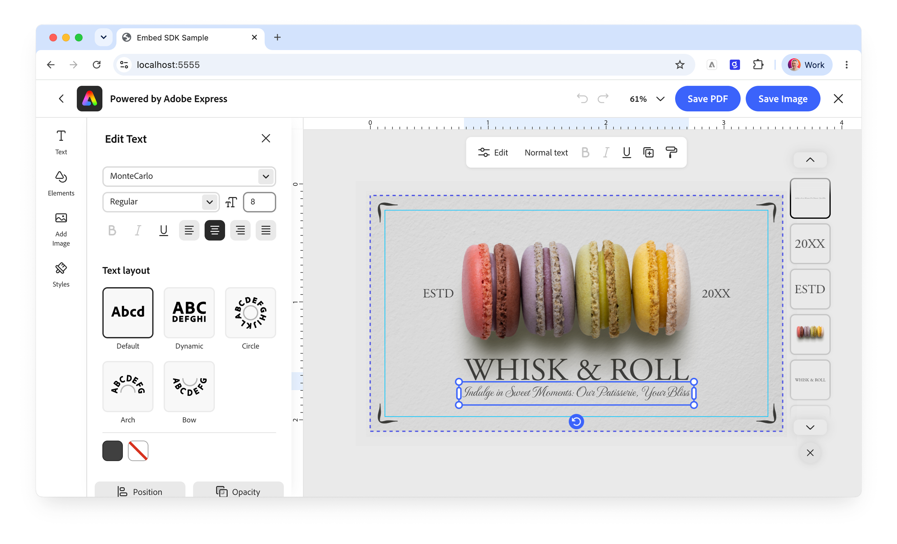

---
keywords:
  - Adobe Express
  - Embed SDK
  - SDK v4
  - CCEverywhere
  - Embedded Design Editor
  - EDE
  - Create Design
  - Edit Design
  - createDesign
  - editDesign
  - Template Browser
  - Tutorial
  - onPublish callback
  - Print
  - PDF
title: Embed SDK Embedded Design Editor tutorial
description: Build a Create Design to Edit Design flow with the Embedded Design Editor (EDE) using the Adobe Express Embed SDK.
contributors:
  - https://github.com/undavide
---

# Embed SDK Embedded Design Editor tutorial

Learn how to build a focused Create Design to Edit Design flow with the Embedded Design Editor (EDE) using the Adobe Express Embed SDK.

## Introduction

Welcome! In this hands-on tutorial, we'll build a small web application around the **Embedded Design Editor (EDE)**—Adobe's new focused, configurable design surface. Instead of launching the full Adobe Express editor, we'll wire up two purpose-built workflows:

- **Create Design** launches a curated **Template Browser** that flows straight into a focused editor. The user picks a template, previews it, remixes it in the new EDE experience, and saves/exports.
- **Edit Design** re-opens that saved design later, so the user can keep refining it—complete with print-ready output options.



### What you'll learn

By completing this tutorial, you'll gain practical skills in:

- Launching the EDE **Create Design** workflow with `module.createDesign()` and a curated Template Browser.
- Configuring a focused editor with an **experience variant** (`print`) and print-ready PDF output.
- Handling the export result in the **`onPublish`** callback—capturing the document ID and a preview image.
- Launching the EDE **Edit Design** workflow with **`module.createDesign()`**.

### What you'll build

A single-page web app with a placeholder image and two buttons—**Create Design** and **Edit Design**. Create Design opens a print-oriented template browser tethered to the editor; saving brings the design's preview back into the page and unlocks Edit Design, which reopens the same document for further editing.

## Prerequisites

<InlineAlert variant="info" slots="text1" />

This tutorial builds on the EDE concepts. Before starting, we recommend reading the **[Embedded Design Editor guide](../concepts/ede.md)** and its two workflow pages—**[Create Design](../concepts/ede-create-design.md)** and **[Edit Design](../concepts/ede-edit-design.md)**—so the configuration objects below feel familiar.

Additionally, make sure you have:

- An **Adobe account**: use your existing Adobe ID or [create one for free](https://account.adobe.com/).
- **Embed SDK credentials** (an API key) from the Adobe Developer Console; see the [Quickstart Guide](../quickstart/index.md#step-1-get-an-api-key).
- Basic knowledge of **HTML, CSS, and JavaScript**.
- **Node.js** installed on your development machine.
- A **text editor or IDE** of your choice.

## 1. Run the sample project

Let's start from the finished result and work backwards into the code.

### 1.1 Clone the sample

Clone the [embed-sdk-ede](https://github.com/AdobeDocs/embed-sdk-samples/tree/main/code-samples/tutorials/embed-sdk-ede) sample from GitHub and navigate to the project directory.

```bash
git clone https://github.com/AdobeDocs/embed-sdk-samples.git
cd embed-sdk-samples/code-samples/tutorials/embed-sdk-ede
```

<InlineAlert variant="info" slots="text1" />

The sample is a plain [Vite](https://vitejs.dev/) project that takes care of the HTTPS setup and hot reloading for you. As customary, we'll work in the `src` folder with the simplest possible setup: HTML, JS, and CSS, one file each.

### 1.2 Set up the API key

Locate the `src/.env.example` file, rename it to `.env`, and replace the placeholder string in `VITE_API_KEY` with your Embed SDK API Key:

```bash
VITE_API_KEY="your-api-key-here!"
```

<InlineAlert variant="info" slots="text1" />

📖 Instructions on how to obtain an API Key can be found in the [Quickstart Guide](../quickstart/index.md#step-1-get-an-api-key). Make sure your API Key is set to allow the `localhost:5555` [domain and port](../quickstart/index.md#edit-the-list-of-allowed-domains).

### 1.3 Install dependencies and run

Install the dependencies and start the development server:

```bash
npm install
npm run dev
```

The web application will be served at `localhost:5555` on a secure HTTPS connection; HTTPS is always required for any Embed SDK integration. Open your browser and navigate to this address to see it in action.

Here's the flow you'll build:

1. Click **Create Design**. A **Template Browser** opens with a curated collection of print templates.



2.  Pick one—you can preview it 1-up before committing.



3. Customize the template in the EDE print-configured experience (with bleed, margins, and rulers on the canvas), then use the export buttons (**Save PDF** / **Save Image**) to save it.



4. The design's preview replaces the placeholder image on the page, and the **Edit Design** button—disabled until now—becomes enabled. Click **Edit Design**. The same document re-opens in the editor like it was before.


<InlineAlert variant="error" slots="header, text1" />

#### Error: "Adobe Express is not available"

In case you get a popup when trying to launch the Adobe Express integration with the message _"You do not have access to this service. Contact your IT administrator to gain access"_, please check that you've entered the **correct API Key** in the `src/.env` file as described [here](#12-set-up-the-api-key).

## 2. Import and initialize the SDK

Open the project in your code editor of choice. The HTML is a simple Spectrum Web Components page (we'll list it in full [at the end](#complete-working-example)); let's focus on `main.js`.

At the top, we import the Spectrum styles and components used by the page, then the Embed SDK itself:

```javascript
import "./style.css";

// Importing theme and typography styles from Spectrum Web Components
import "@spectrum-web-components/styles/typography.css";
import "@spectrum-web-components/theme/express/theme-light.js";
import "@spectrum-web-components/theme/express/scale-medium.js";
import "@spectrum-web-components/theme/sp-theme.js";

// Importing Spectrum Web Components
import "@spectrum-web-components/button/sp-button.js";
import "@spectrum-web-components/button-group/sp-button-group.js";
import "@spectrum-web-components/divider/sp-divider.js";

// Importing the Adobe Express Embed SDK
await import("https://cc-embed.adobe.com/sdk/v4/CCEverywhere.js");
console.log("CCEverywhere loaded", window.CCEverywhere);
```

<InlineAlert variant="info" slots="text1" />

There are several ways to import `CCEverywhere.js`; for more information, please refer to the [Quickstart Guide](../quickstart/index.md). Note the `await`—the dynamic `import()` must complete before the global `CCEverywhere` object is available.

Now we initialize the SDK. EDE experiences run as **modules**, so we destructure the [`module`](../concepts/ede.md#how-ede-fits-into-the-embed-sdk) object from the `initialize()` call (unlike the [Full Editor tutorial](./full-editor.md), which uses `editor`):

```javascript
// Parameters for initializing the Adobe Express Embed SDK
const hostInfo = {
  clientId: import.meta.env.VITE_API_KEY,
  // The appName must match the Public App Name in the Developer Console
  appName: "Embed SDK Sample",
};

const configParams = { locale: "en-US" };

// Initializing the Adobe Express Embed SDK
const { module } = await window.CCEverywhere.initialize(hostInfo, configParams);
```

The [`hostInfo`](../../v4/shared/src/types/host-info-types/interfaces/host-info-specified-base.md) object is required: `clientId` holds your API Key (retrieved by Vite from the `.env` file) and `appName` must match the Public App Name in the Developer Console. The `module` object is the entry point for both EDE workflows—`module.createDesign()` and `module.editDesign()`.

We'll also keep two small pieces of state at the top of the file: a reference to the placeholder ``, and a variable to remember the saved document's ID (we'll see why in [Section 4](#4-handle-the-result-with-onpublish)).

```javascript
// Will hold the project ID when a document is saved on Adobe Express
let existingDocumentId = null;
const expressImage = document.getElementById("savedImage");
```

## 3. Launch Create Design

The [Create Design](../concepts/ede-create-design.md) workflow pairs a **Template Browser** with a focused editor: the user browses a curated collection, picks a starting point, and designs from it. We launch it with:

```typescript
module.createDesign(
  appConfig?,    // what to browse + how the editor behaves
  exportConfig?, // the export/save buttons
  containerConfig?, // how the SDK iframe is presented
);
```

All three parameters are optional and **positional**—to skip one, pass `undefined` in its place. Let's build them up one at a time.

### 3.1 Configure the Template Browser

The heart of Create Design is [`contentBrowseConfig`](../concepts/ede-create-design.md#browsing-and-choosing-content), which defines the Template Browser experience. Here we point it at a curated print collection, constrain it to business-card dimensions, and keep the UI focused:

```javascript
const createDesignAppConfig = {
  contentBrowseConfig: {
    // The curated collection to browse
    categoriesConfig: [
      {
        category: "templates",
        rootCollectionId:
          "urn:aaid:sc:VA6C2:e21f90d3-cc15-4a43-8cfc-afb80f17c1a6", // 👈 your collection's URN
      },
    ],
    // Filter by page behavior, dimensions, and template type
    templateFilters: {
      behaviors: ["still"],
      dimensions: { width: 3.5, height: 2, unit: "in" },
      templateType: "business-card",
    },
    // Offer a "start from a blank canvas" option
    showCreateNew: true,
    // Title shown above the browser
    headerText: "Browse our collection of templates",
    // Keep the browser focused on the curated set
    hideSearchBar: true,
    hideFilters: true,
    disablePremiumContent: true,
  },
  // File types the user is allowed to publish
  allowedFileTypes: ["application/pdf", "image/jpeg", "image/png"],
  // Tailor the editor to a print workflow
  variant: "print", // 👈 or "default"
  callbacks, // 👈 defined in Section 4
};
```

A couple of properties of [`appConfig`](../../v4/shared/src/types/3p/module/app-config-types/interfaces/fde-create-design-app-config.md) worth calling out:

- **`variant: "print"`** tailors the focused editor to a print workflow—a print-oriented toolset with print-friendly defaults. See [Experience variants](../concepts/ede.md#experience-variants) for the full list; setting `"default"` gives a general-purpose editor instead.
- **`categoriesConfig`** points the browser at the collection you want users to design from. Swap in your own collection's URN.

<InlineAlert variant="info" slots="text1" />

Embedded browsing is deliberately **curated**, not open-ended discovery. Everything in `contentBrowseConfig` is documented on the [Template Browser](../concepts/template-browser.md) concept page, which Create Design builds on.

### 3.2 Configure export and container

The `exportConfig` array defines the **save buttons** the user sees in the editor. We offer two—one for a print-ready PDF, one for a PNG image—and both request a small **base64 preview** alongside the full-resolution asset (that preview is what we'll display on the page):

```javascript
const sharedExportConfig = [
  {
    id: "save-asset-pdf",
    label: "Save PDF",
    action: {
      target: "publish",
      publishFileType: "application/pdf",
      outputType: "url", // the full-res PDF comes back as a URL
      subFileType: "pdfPrint",
      enableByDefault: true,
      previewConfig: {
        enabled: true,
        fileType: "image/png",
        outputType: "base64", // 👈 a small preview we can show inline
        scale: 0.25,
      },
    },
    style: { uiType: "button" },
  },
  {
    id: "save-asset-img",
    label: "Save Image",
    action: {
      target: "publish",
      publishFileType: "image/png",
      outputType: "blob", // the full-res PNG comes back as a blob
      enableByDefault: true,
      previewConfig: {
        enabled: true,
        fileType: "image/png",
        outputType: "base64", // 👈 same inline preview
        scale: 0.25,
      },
    },
    style: { uiType: "button" },
  },
];
```

The `containerConfig` controls how the SDK surface is presented. We'll let it fill the viewport:

```javascript
const sharedContainerConfig = {
  mode: "fill", // 👈 or "inline", "modal"
  hideCloseButton: false,
};
```

Both objects are shared by Create Design and Edit Design—see [Shared configuration](../concepts/ede.md#shared-configuration) for the full `ExportConfig` and `ContainerConfig` references.

### 3.3 Wire up the Create Design button

Finally, launch the workflow when the user clicks **Create Design**:

```javascript
document.getElementById("createBtn").onclick = async () => {
  module.createDesign(
    createDesignAppConfig,
    sharedExportConfig,
    sharedContainerConfig,
  );
};
```

## 4. Handle the result

When the user saves, EDE behaves like any Embed SDK module: the [`onPublish`](../../v4/shared/src/types/callbacks-types/type-aliases/publish-callback.md) callback fires with the export `intent` and a `publishParams` object. This is where the two halves of the flow connect. We need to:

1. **Remember the document** so Edit Design can reopen it—`publishParams.documentId`.
2. **Show the preview** on the page—`publishParams.assetPreview[0].data` is the base64 string we requested in `previewConfig`.
3. **Enable the Edit Design button**.
4. **Return a publish status** so Adobe Express knows the save was accepted.

```javascript
const callbacks = {
  onCancel: () => {
    console.log("Process canceled");
  },
  onPublish: (intent, publishParams) => {
    // 1. Store the document ID for later editing
    existingDocumentId = publishParams.documentId; // 👈
    // 2. Show the returned base64 preview in place of the placeholder
    expressImage.src = publishParams.assetPreview[0].data; // 👈
    // 3. Enable the Edit Design button
    document.getElementById("editBtn").disabled = false; // 👈
    // 4. Always return a status object to confirm (or deny) the publish
    return { status: "SUCCESS" }; // 👈 or "DENIED"
  },
  onError: (err) => {
    console.error("Error!", err.toString());
  },
};
```

<InlineAlert variant="info" slots="text1" />

`publishParams` carries **both** a full-resolution asset (the PDF URL or PNG blob you configured in `exportConfig`, under `publishParams.asset`) **and** the small base64 [`assetPreview`](../../v4/shared/src/types/publish-params-types/interfaces/publish-params.md#properties). Here we only need the lightweight preview to update the page; you'd use `asset` to download or upload the final file. Note both are **arrays**—we take the first item.

## 5. Reopen the design with Edit Design

The [Edit Design](../concepts/ede-edit-design.md) workflow opens an _existing_ document in a focused editor. Its signature adds a **required** first parameter, `docConfig`, that tells the editor which document to open:

```typescript
module.editDesign(
  docConfig,     // required: which document to open
  appConfig?,
  exportConfig?,
  containerConfig?,
);
```

### 5.1 Configure the print editor

Unlike Create Design, Edit Design accepts explicit **output controls**. Because this is a print workflow, we turn on the on-canvas print guides and configure a print-ready PDF export:

```javascript
const editDesignAppConfig = {
  variant: "print",

  // On-canvas print guides
  editorGuideConfig: {
    showBleed: true,
    showMargins: true,
    showRulers: true,
  },

  // Print-ready PDF output
  pdfPrintConfig: {
    includeCropMarks: true,
    includeBleed: true,
    colorMode: "cmyk",
    cmykColorProfile: "Coated GRACoL 2006 (ISO 12647-2:2004)",
  },

  allowedFileTypes: ["application/pdf", "image/jpeg", "image/png"],
  contentConfig: { hidePremiumContent: true },
  callbacks, // 👈 the same callbacks from Section 4
};
```

<InlineAlert variant="info" slots="text1" />

`editorGuideConfig` and `pdfPrintConfig` are available to Edit Design but **not** to Create Design yet—Create Design falls back to sensible print defaults (CMYK, a standard coated ICC profile, and bleed). This asymmetry is explained in the [Create Design → Output configuration today](../concepts/ede-create-design.md#output-configuration-today) concept section.

### 5.2 Wire up the Edit Design button

We pass the `documentId` we stored in `onPublish` as the `docConfig.docId`. That's what tells Adobe Express to reopen the exact document the user created:

```javascript
document.getElementById("editBtn").onclick = async () => {
  const docConfig = { docId: existingDocumentId }; // 👈 the saved document
  module.editDesign(
    docConfig,
    editDesignAppConfig,
    sharedExportConfig,
    sharedContainerConfig,
  );
};
```

Because the **Edit Design** button starts out `disabled` and is only enabled inside `onPublish`, `existingDocumentId` is guaranteed to hold a real ID by the time this handler can run. Edit Design reuses the same `onPublish` callback, so saving again updates the preview just as before.

## Troubleshooting

### Common issues

| Issue                                     | Solution                                                                                                                        |
| ----------------------------------------- | ------------------------------------------------------------------------------------------------------------------------------- |
| Error: "Adobe Express is not available"   | Check that you've entered the correct API Key in the `src/.env` file as described [here](#12-set-up-the-api-key).               |
| The **Edit Design** button stays disabled | It's enabled only inside `onPublish`. Save a design at least once (Save PDF / Save Image) before Edit Design becomes available. |
| Nothing happens on **Edit Design**        | Confirm `existingDocumentId` was set—log `publishParams.documentId` in `onPublish` to verify the save returned a document ID.   |

## Complete working example

The complete implementation demonstrates everything covered above. You can find it in the [embed-sdk-ede sample](https://github.com/AdobeDocs/embed-sdk-samples/tree/main/code-samples/tutorials/embed-sdk-ede), or below for reference.

<CodeBlock slots="heading, code" repeat="2" languages="HTML, JavaScript" />

#### index.html

```html
<!doctype html>
<html lang="en">
  <head>
    <meta charset="UTF-8" />
    <meta
      name="viewport"
      content="width=device-width, initial-scale=1.0"
    />
    <title>Embed SDK Sample</title>
  </head>

  <body>
    <sp-theme
      scale="medium"
      color="light"
      system="express"
    >
      <div class="container">
        <header>
          <h1>Adobe Express Embed SDK</h1>
          <sp-divider size="l"></sp-divider>
          <h2>Embedded Design Editor (EDE) Sample</h2>
          <p>
            First, click the <b>Create Design</b> button to launch a Template
            Browser experience that tethers to the Editor. <br />
            <b>Edit Design</b> will re-open the existing design in the Embedded
            Design Editor (EDE).
          </p>
        </header>

        <main>
          
          <sp-button-group>
            <sp-button id="createBtn">Create Design</sp-button>
            <sp-button
              id="editBtn"
              disabled
              >Edit Design</sp-button
            >
          </sp-button-group>
        </main>
      </div>
    </sp-theme>

    <script
      type="module"
      src="./main.js"
    ></script>
  </body>
</html>
```

#### main.js

```javascript
import "./style.css";

// Importing theme and typography styles from Spectrum Web Components
import "@spectrum-web-components/styles/typography.css";
import "@spectrum-web-components/theme/express/theme-light.js";
import "@spectrum-web-components/theme/express/scale-medium.js";
import "@spectrum-web-components/theme/sp-theme.js";

// Importing Spectrum Web Components
import "@spectrum-web-components/button/sp-button.js";
import "@spectrum-web-components/button-group/sp-button-group.js";
import "@spectrum-web-components/divider/sp-divider.js";

// Importing the Adobe Express Embed SDK
await import("https://cc-embed.adobe.com/sdk/v4/CCEverywhere.js");
console.log("CCEverywhere loaded", window.CCEverywhere);

// Parameters for initializing the Adobe Express Embed SDK
const hostInfo = {
  clientId: import.meta.env.VITE_API_KEY,
  appName: "Embed SDK Sample",
};

const configParams = { locale: "en-US" };

// Initializing the Adobe Express Embed SDK
const { module } = await window.CCEverywhere.initialize(hostInfo, configParams);

// Will hold the project ID when a document is saved on Adobe Express
let existingDocumentId = null;
const expressImage = document.getElementById("savedImage");

// Callbacks used when creating or editing a document
const callbacks = {
  onCancel: () => {
    console.log("Process canceled");
  },
  onPublish: (intent, publishParams) => {
    existingDocumentId = publishParams.documentId;
    expressImage.src = publishParams.assetPreview[0].data;
    // enable the editDesign button
    document.getElementById("editBtn").disabled = false;
    // Always return a status object to indicate the result of the publish action
    return { status: "SUCCESS" }; // or "DENIED"
  },
  onError: (err) => {
    console.error("Error!", err.toString());
  },
};

// Create Design: browse a curated collection, then design in a focused editor
const createDesignAppConfig = {
  contentBrowseConfig: {
    categoriesConfig: [
      {
        category: "templates",
        rootCollectionId:
          "urn:aaid:sc:VA6C2:e21f90d3-cc15-4a43-8cfc-afb80f17c1a6",
      },
    ],
    templateFilters: {
      behaviors: ["still"],
      dimensions: { width: 3.5, height: 2, unit: "in" },
      templateType: "business-card",
    },
    showCreateNew: true,
    headerText: "Browse our collection of templates",
    hideSearchBar: true,
    hideFilters: true,
    disablePremiumContent: true,
  },
  allowedFileTypes: ["application/pdf", "image/jpeg", "image/png"],
  variant: "print", // or "default"
  callbacks,
};

// Edit Design: reopen an existing document with print output controls
const editDesignAppConfig = {
  variant: "print",
  editorGuideConfig: {
    showBleed: true,
    showMargins: true,
    showRulers: true,
  },
  pdfPrintConfig: {
    includeCropMarks: true,
    includeBleed: true,
    colorMode: "cmyk",
    cmykColorProfile: "Coated GRACoL 2006 (ISO 12647-2:2004)",
  },
  allowedFileTypes: ["application/pdf", "image/jpeg", "image/png"],
  contentConfig: { hidePremiumContent: true },
  callbacks,
};

// Shared export buttons (used by both workflows)
const sharedExportConfig = [
  {
    id: "save-asset-pdf",
    label: "Save PDF",
    action: {
      target: "publish",
      publishFileType: "application/pdf",
      outputType: "url",
      subFileType: "pdfPrint",
      enableByDefault: true,
      previewConfig: {
        enabled: true,
        fileType: "image/png",
        outputType: "base64",
        scale: 0.25,
      },
    },
    style: { uiType: "button" },
  },
  {
    id: "save-asset-img",
    label: "Save Image",
    action: {
      target: "publish",
      publishFileType: "image/png",
      outputType: "blob",
      enableByDefault: true,
      previewConfig: {
        enabled: true,
        fileType: "image/png",
        outputType: "base64",
        scale: 0.25,
      },
    },
    style: { uiType: "button" },
  },
];

// Shared container (how the SDK surface is presented)
const sharedContainerConfig = {
  mode: "fill", // or "inline", "modal"
  hideCloseButton: false,
};

// Click handler for the Create Design button
document.getElementById("createBtn").onclick = async () => {
  module.createDesign(
    createDesignAppConfig,
    sharedExportConfig,
    sharedContainerConfig,
  );
};

// Click handler for the Edit Design button
document.getElementById("editBtn").onclick = async () => {
  const docConfig = { docId: existingDocumentId };
  module.editDesign(
    docConfig,
    editDesignAppConfig,
    sharedExportConfig,
    sharedContainerConfig,
  );
};
```

## Next steps

Congratulations! You've built an **Embedded Design Editor integration** that tethers a curated Template Browser to a focused, print-configured editor, and reopens saved designs with Edit Design. What's next?

- Try the `"default"` variant, or point `categoriesConfig` at your own template collection.
- Explore the full configuration surface in the [Embedded Design Editor guide](../concepts/ede.md) and the [API Reference](../../v4/index.md).
- Visit the [changelog](../changelog/index.md) to keep up with EDE improvements—it's in active development.
- Before going live, submit your integration for approval; see [Submission and Review](../review/index.md).

## Need help?

Have questions or running into issues? Join our [Community Forum](https://community.adobe.com/t5/adobe-express-developers/ct-p/ct-adobe-express-developers) to get help and connect with other developers working with the Adobe Express Embed SDK.

## Related resources

- **[Embedded Design Editor guide](../concepts/ede.md)**: the shared EDE concepts and configuration.
- **[Create Design](../concepts/ede-create-design.md)**: browse a template and design from it.
- **[Edit Design](../concepts/ede-edit-design.md)**: open and refine an existing document, with output controls.
- **[Template Browser](../concepts/template-browser.md)**: the content-browsing experience Create Design builds on.
- **[Full Editor tutorial](./full-editor.md)**: the companion tutorial for the full Adobe Express editor.
- **[API Reference](../../v4/index.md)**: complete SDK documentation.
- **[Changelog](../changelog/index.md)**: latest updates and improvements.
