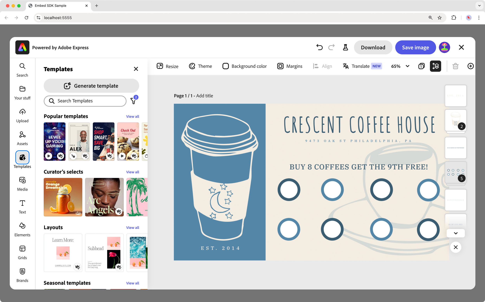
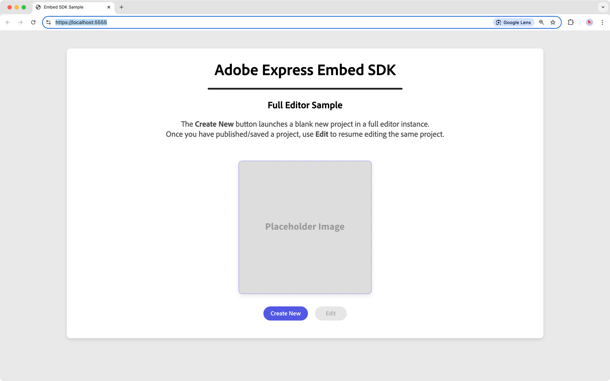
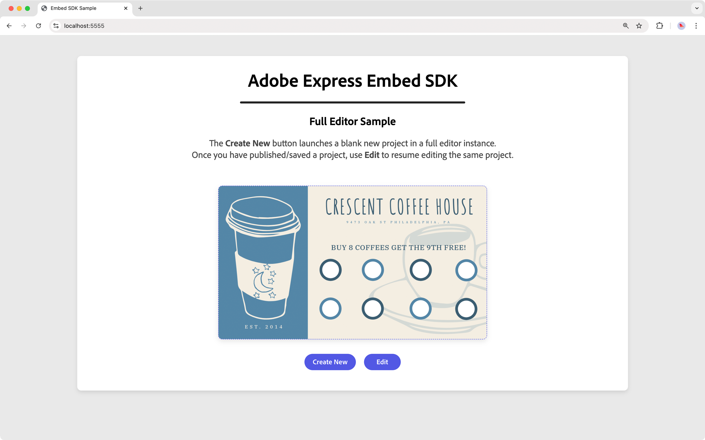
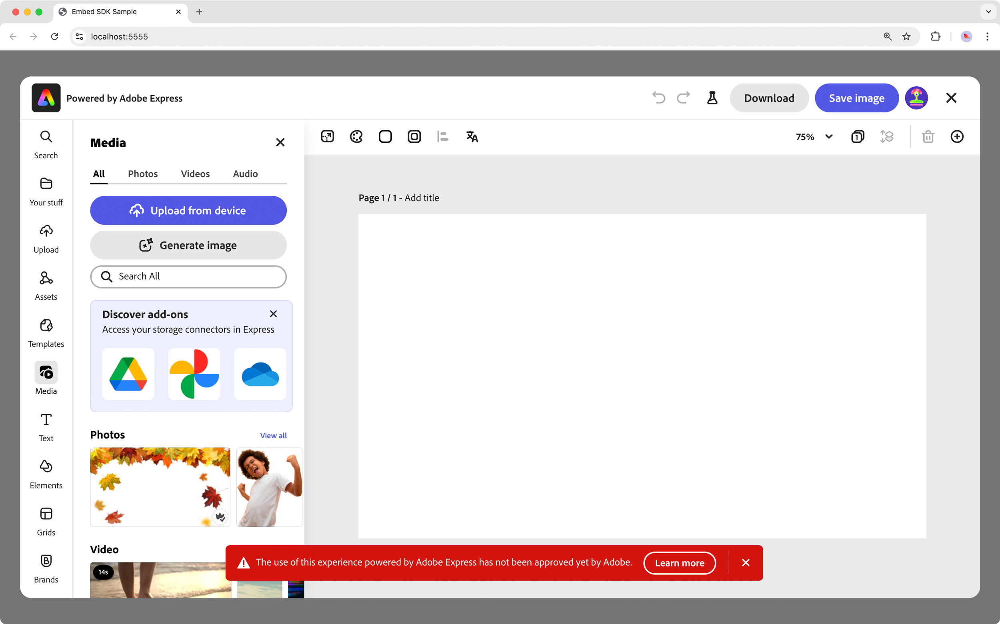
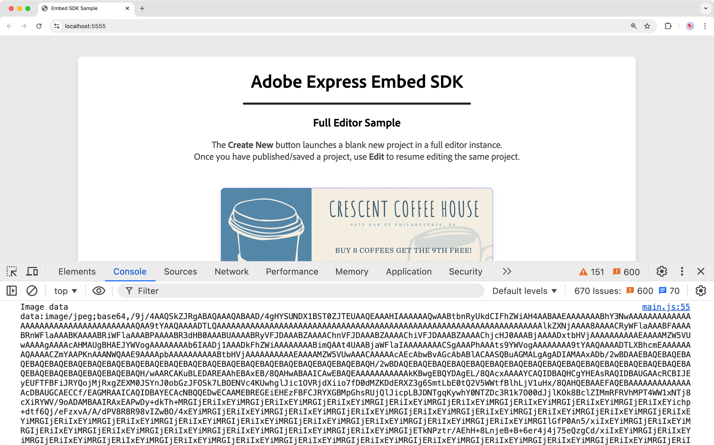
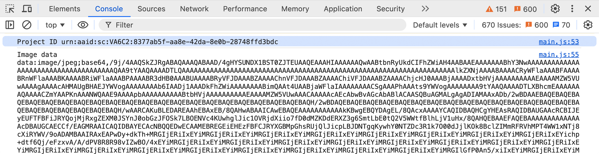

---
keywords:
  - Adobe Express
  - Embed SDK
  - Tutorial
  - Editor
  - V4
  - CCEverywhere
title: Embed SDK Full Editor tutorial
description: A step-by-step guide to setting up and integrating the SDK into your web application.
contributors:
  - https://github.com/undavide
---

# Embed SDK Full Editor tutorial

Learn how to integrate the Adobe Express Embed SDK into your web applications.

&lt; !-- **TODO**: add a video, Davide-style. -- &gt;

## Introduction

Hi, developers! In this tutorial, we'll create an Embed SDK integration that leverages the Adobe Express full editor experience. Users will be able to create, edit, and export documents directly from your web application.

We'll look at a few **configuration parameters**, as well as the way to **handle events**, **callbacks** and **manage files** between your application and Adobe Express. Let's get started!



### Prerequisites

Before we begin, make sure you have the following:

- An **Adobe account**: use your existing Adobe ID or create one for free.
- **Embed SDK Credentials** from the Adobe Developer Console; see the [Quickstart Guide](..\quickstart\index.md) for more information.
- Familiarity with **HTML, CSS, JavaScript**.
- **Node.js** is installed on your development machine.

## Running the sample project

Let's have a look at what we're going to build. First off, clone the [embed-sdk-full-editor-tutorial](https://github.com/AdobeDocs/embed-sdk-samples/tree/main/code-samples/tutorials/embed-sdk-full-editor) sample from GitHub and navigate to the project directory. Locate the `src/.env` file and replace the placeholder string in the `VITE_API_KEY` with your Embed SDK API Key:

```bash
VITE_API_KEY="your-api-key-here!"
```


<InlineAlert variant="info" slots="text1" />

📖 Instructions on how to obtain an API Key can be found on the [Quickstart Guide](..\quickstart\index.md#step-1-get-an-api-key). Make sure your API Key is set to allow the `localhost:5555` [domain and port](..\quickstart\index.md#edit-the-list-of-allowed-domains).

Now, you can install the dependencies and run the sample with the following two simple commands:

```bash
npm install
npm run start
```

The web application will be served at `localhost:5555` on a secure HTTPS connection; HTTPS is always required for any Embed SDK integration. Open your browser and navigate to this address to see it in action.



When clicking the **Create New** button, the Adobe Express full editor will launch with a predefined document size; users have the entire set of tools available to create their designs. Once they're done, they can Download the document, or Save it as an Image.

The sample project will handle the file transfer between Adobe Express and the web page hosting it, and the image will be displayed in lieu of the placeholder.



The **Edit** button (previously disabled) will open the Editor with the same document size and content as the one just created: the Project ID has been stored as part of the `onPublish` callback, as we'll see in due course. Users can modify the design and download or save it again.


<InlineAlert variant="error" slots="header, text1" />

### Error: "Adobe Express is not available"

In case you get a popup when trying to launch the Adobe Express integration with the following message: _"You do not have access to this service. Contact your IT administrator to gain access"_, please check to have entered the correct API Key in the `src/.env` file as described [here](#running-the-sample-project).

## Coding the Integration

You can just read the existing code in the sample, but it's always best to **learn by doing!** We suggest following along and typing the code in—even small mistakes can lead to important discoveries.

The [sample project](https://github.com/AdobeDocs/embed-sdk-samples/tree/main/code-samples/tutorials/embed-sdk-full-editor) is a simple web application built with [Vite](https://vitejs.dev/), which takes care of the entire HTTPS setup and hot reloading.[^1] As customary, we'll work in the `src` folder with the simplest setup possible: HTML, JS, and CSS, one file each.

[^1]: A Webpack setup is entirely possible, but it requires manual (or semi-automated) steps to integrate the `mkcert` CLI and ensure proper HTTPS handling. We've chosen Vite to keep that out of the way and focus on the actual integration code.

### 1. Importing and Initializing

The HTML content is not overly important; let's focus on the JavaScript side of things first. Open the project in your code editor of choice. In `main.js`, remove everything below the Spectrum `import` statements—we'll rebuild it from scratch.

```js
import "./style.css";

// Importing theme and typography styles from Spectrum Web Components
import "@spectrum-web-components/styles/typography.css";
import "@spectrum-web-components/theme/express/theme-light.js";
import "@spectrum-web-components/theme/express/scale-medium.js";
import "@spectrum-web-components/theme/sp-theme.js";

// Importing Spectrum Web Components
import "@spectrum-web-components/button/sp-button.js";
import "@spectrum-web-components/button-group/sp-button-group.js";
import "@spectrum-web-components/divider/sp-divider.js";
```

The imports above allow us to style our web application with [Spectrum Web Components](https://opensource.adobe.com/spectrum-web-components/index.html) and the [Adobe Express theme](https://spectrum.adobe.com/page/theming/). Let's begin by importing the Embed SDK:

```js
// Importing the Adobe Express Embed SDK
await import("https://cc-embed.adobe.com/sdk/v4/CCEverywhere.js");
console.log("CCEverywhere loaded", window.CCEverywhere);
```


<InlineAlert variant="info" slots="text1" />

There are several ways to import `CCEverywhere.js`: for more information, please refer to the [Quickstart Guide](..\quickstart\index.md).

When the Embed SDK is imported, a `CCEverywhere` object is globally available and must be **initialized**. There are two sets of parameters that you can pass as option objects:

- **Host Information**: containing the API key, Application name, etc.
- **Configuration**: optional settings, like locale, delayed sign-in, etc.

```javascript
// 👀 Required parameters for initializing the Embed SDK
const hostInfo = {
  clientId: import.meta.env.VITE_API_KEY,
  // The appName must match the Public App Name in the Developer Console
  appName: "Embed SDK Sample",
};

// Optional parameters
const configParams = {
  // Users can log in only when exporting/saving the document
  loginMode: "delayed",
};

// Initializing the Adobe Express Embed SDK
const { editor } = await window.CCEverywhere.initialize(
  hostInfo,
  configParams
);
```

We're using the asynchronous [`initialize()`](..\..\v4\sdk\src\3p\cc-everywhere\variables\default.md#initialize) method, that returns a promise resolving to an object with three properties. Here, we want to implement the full editor; hence, among them, we destructure just the [`editor`](..\..\v4\sdk\src\workflows\3p\editor-workflow\classes\editor-workflow.md).

The [`hostInfo`](..\..\v4\shared\src\types\host-info-types\interfaces\host-info-specified-base.md) object is required: the `clientId` contains your API Key (here, retrieved by Vite from the `.env` file) and the `appName`.


<InlineAlert variant="warning" slots="text1" />

The `appName` must match the Public App Name in the Developer Console, and it will be displayed in the Adobe Express UI as a folder where users can store their documents.

All [`configParams`](..\..\v4\shared\src\types\host-info-types\interfaces\config-params-base.md) are optional, instead: here, `loginMode` tells Adobe Express to delay the login until artworks are exported.

### 2. Creating the Editor

Excellent! We have this `editor`: now what? We'll use it to spawn a new Adobe Express instance via the [`editor.create()`](..\..\v4\sdk\src\workflows\3p\editor-workflow\classes\editor-workflow.md#create) method—which, in turn, accepts four option objects able to configure:

- The [Document](..\..\v4\sdk\src\workflows\3p\editor-workflow\classes\editor-workflow.md#) that will be created (e.g., its size).
- The Adobe Express [Application](..\..\v4\sdk\src\workflows\3p\editor-workflow\classes\editor-workflow.md) itself (e.g., the callbacks).
- The allowed [Export Options](..\..\v4\shared\src\types\export-config-types\type-aliases\export-option.md).
- The [Container](..\..\v4\shared\src\types\container-config-types\interfaces\base-container-config.md) (modal dialog) of the Adobe Express application.

The links above point to the respective SDK Reference pages. They are all optional—our sample makes use of the first three of them:

```js
// Document
const docConfig = { canvasSize: "BusinessCard" };
// Application
const appConfig = {
  selectedCategory: "media",
  callbacks: {
    onCancel: () => {},
    onPublish: (intent, publishParams) => { /* ... */ },
    onError: (err) => { /* ... */ }
};
// Export Options
const exportConfig = [
  {
    id: "download",
    label: "Download",
    action: { target: "download" },
    style: { uiType: "button" },
  },
  {
    id: "save-modified-asset",
    label: "Save image",
    action: { target: "publish" },
    style: { uiType: "button" },
  },
];
```

As you can see, we are:

- Creating by default a document using the `"BusinessCard"` template.
- Launching Adobe Express with the Media panel open on the left.
- Setting a series of Callbacks that will fire when the user Cancels, Saves (that would be [`onPublish`](..\..\v4\shared\src\types\callbacks-types\type-aliases\publish-callback.md)), or when something goes wrong.
- Defining two ways for users to export content: download the file locally and save it in the user's Adobe Express folder and pass it back to the web application.

On the **Create New** button click, Adobe Express is launched:

```js
document.getElementById("createDesign").onclick = async () => {
  editor.create(docConfig, appConfig, exportConfig);
};
```



&lt; !-- Info Alert -- &gt;
<InlineAlert variant="info" slots="text1" />

Please don't be scared by the red warning toast at the bottom of the screen: it is just a reminder that the Embed SDK is providing access via your credentials, but you must **submit the integration and request approval** from Adobe before you can go live. Please check the [Submission and Review](..\review\index.md) section to learn more.

As you can see, integrating the full editor doesn't take much time! You can customize it to a great extent; even using all the default options, the result is brilliant.

### 3. Managing images

The `exportConfig` array we've just written adds a **Save image** button to Adobe Express, allowing users to store their image; we'd like our web application to capture and display it on the HTML page.

We need to write a simple function in the `callbacks` to implement this feature, precisely the [`onPublish`](..\..\v4\shared\src\types\callbacks-types\type-aliases\publish-callback.md). It is triggered when the user clicks the **Save image** button, and it receives a [`PublishParams`](..\..\v4\shared\src\types\publish-params-types\interfaces\publish-params.md) argument, with three crucial properties:

- `documentId`: a unique identifier for the asset that has been created or modified.
- `exportButtonId`: the identifier of the export button that has been clicked.
- `asset`: an [`OutputAsset`](..\..\v4\shared\src\types\asset-types\interfaces\output-asset.md) object, with several interesting properties like `data`—a Base64 string representation of the saved image.

The `data` property sounds promising! The plan is to have an `` element (in this example, it starts as a placeholder), which `src` attribute will be filled with the Base64 string coming from Adobe Express.

&lt; !-- CodeBlock -- &gt;
<CodeBlock slots="heading, code" repeat="2" languages="JavaScript, HTML" />

#### main.js

```js
// Storing the image element
var expressImage = document.getElementById("savedImage");

// Callbacks to be used when creating or editing a document
const callbacks = {
  // ... other callbacks
  onPublish: (intent, publishParams) => {                   // 👈
    expressImage.src = publishParams.asset[0].data;         // 👈
    console.log("Image data", publishParams.asset[0].data); // 👈
  }
};
```

#### index.html

```html
&lt; !-- ... rest of the page -- &gt;

&lt; !-- ... rest of the page -- &gt;
```

Please note that `asset` is an array; we're getting just the first item here. If you open the Console, you'll see the Base64 string logged.



### 4. Editing projects

The last step is implementing the **Edit** button feature, which should launch Adobe Express and open the project that was saved before. As we've seen [earlier](#3-managing-images), when a document is saved, we receive a [`PublishParams`](..\..\v4\shared\src\types\publish-params-types\interfaces\publish-params.md) that contains `documentId`. We can store it for reference and use in the `docConfig` option object to open it again:

```js
// Will hold the project ID when a document is saved
var existingProjectId = null; // 👈

// Callbacks to be used when creating or editing a document
const callbacks = {
  // ... other callbacks
  onPublish: (intent, publishParams) => {
    existingProjectId = publishParams.projectId;  // 👈
    console.log("Project ID", existingProjectId); // 👈
    expressImage.src = publishParams.asset[0].data;
    console.log("Image data", publishParams.asset[0].data);
  }
};

// Click handler for the Edit Design button
document.getElementById("editBtn").onclick = async () => {
  // Opening the existing project by ID
  let docConfig = { documentId: existingProjectId };
  // ...
  editor.edit(docConfig, appConfig, exportConfig);
};
```

Above, we're using `existingProjectId` to hold the project reference, collected in the `onPublish` callback every time the document is saved. Later, in the `editBtn` click handler, we're creating a new `docConfig` object passing the ID in the `documentId` property. This tells Adobe Express to look for an existing project and open it right away.



## Final project

We have all the required bits in place, but some simple refactoring is needed to keep the code clean.

- The `appConfig` and `exportConfig` option objects are stored in constants, as they're shared in both the **Create new** and **Edit** buttons.
- The `callbacks` follow suit; we've added a simple `onError` that logs a message, and now `onPublish` also enables the **Edit** button—that starts disabled.

You can check the entire [`embed-sdk-full-editor-tutorial`](https://github.com/AdobeDocs/embed-sdk-samples/tree/main/code-samples/tutorials/embed-sdk-full-editor) project code as part of the dedicated [`embed-sdk-samples`](https://github.com/AdobeDocs/embed-sdk-samples) repository. Find the most relevant files below for reference.

&lt; !-- CodeBlock -- &gt;
<CodeBlock slots="heading, code" repeat="2" languages="JavaScript, HTML" />

#### main.js

```js
import "./style.css";

// Importing theme and typography styles from Spectrum Web Components
import "@spectrum-web-components/styles/typography.css";
import "@spectrum-web-components/theme/express/theme-light.js";
import "@spectrum-web-components/theme/express/scale-medium.js";
import "@spectrum-web-components/theme/sp-theme.js";

// Importing Spectrum Web Components
import "@spectrum-web-components/button/sp-button.js";
import "@spectrum-web-components/button-group/sp-button-group.js";
import "@spectrum-web-components/divider/sp-divider.js";

// Importing the Adobe Express Embed SDK
await import("https://cc-embed.adobe.com/sdk/v4/CCEverywhere.js");
console.log("CCEverywhere loaded", window.CCEverywhere);

// Parameters for initializing the Adobe Express Embed SDK
const hostInfo = {
  clientId: import.meta.env.VITE_API_KEY,
  appName: "Embed SDK Sample",
};

// Prompts the user to log in only when exporting/saving the document
const configParams = {
  loginMode: "delayed",
};

// Initializing the Adobe Express Embed SDK
const { editor } = await window.CCEverywhere.initialize(
  hostInfo, configParams
);

// Will hold the project ID when a document is saved on Adobe Express
var existingProjectId = null;
var expressImage = document.getElementById("savedImage");

// Callbacks to be used when creating or editing a document
const callbacks = {
  onCancel: () => {},
  onPublish: (intent, publishParams) => {
    existingProjectId = publishParams.projectId;
    console.log("Project ID", existingProjectId);
    expressImage.src = publishParams.asset[0].data;
    console.log("Image data", publishParams.asset[0].data);
    // enable the editDesign button
    document.getElementById("editBtn").disabled = false;
  },
  onError: (err) => {
    console.error("Error!", err.toString());
  },
};

// Configuration for the app, shared by both Create and Edit flows
const appConfig = { selectedCategory: "media", callbacks };

// Configuration for the export options made available
// to the user when creating or editing a document
const exportConfig = [
  {
    id: "download",
    label: "Download",
    action: { target: "download" },
    style: { uiType: "button" },
  },
  {
    id: "save-modified-asset",
    label: "Save image",
    action: { target: "publish" },
    style: { uiType: "button" },
  },
];

// Click handler for the Create Design button
document.getElementById("createBtn").onclick = async () => {
  // Presetting the canvas size
  let docConfig = { canvasSize: "BusinessCard" };
  // Using the global appConfig and exportConfig
  editor.create(docConfig, appConfig, exportConfig);
};

// Click handler for the Edit Design button
document.getElementById("editBtn").onclick = async () => {
  // Opening the existing project by ID
  let docConfig = { documentId: existingProjectId };
  // Using the global appConfig and exportConfig
  editor.edit(docConfig, appConfig, exportConfig);
};
```

#### index.html

```html
<body>
  <sp-theme scale="medium" color="light" system="express">
    <div class="container">
      <header>
        <h1>Adobe Express Embed SDK</h1>
        <sp-divider size="l"></sp-divider>
        <h2>Full Editor Sample</h2>
        <p>
          The <b>Create New</b> button launches a blank
          new project in a full editor instance. <br />
          Once you have published/saved a project, use the
          <b>Edit</b> button to resume editing the same project.
        </p>
      </header>

      <main>
        
        <sp-button-group>
          <sp-button id="createBtn">Create New</sp-button>
          <sp-button id="editBtn" disabled>Edit</sp-button>
        </sp-button-group>
      </main>
    </div>
  </sp-theme>

  <script type="module" src="./main.js"></script>

</body>
```

## Next steps

Congratulations! You've implemented a **Full Editor integration** with the Adobe Express Embed SDK. You've learned how to create, edit, and let users export documents, as well as how to manage images between Adobe Express and your web application. What's next for you?

- The Embed SDK offers a **wide range of features and customization options**; you can explore them in the [API Reference](..\..\v4\index.md).
- Visit the [changelog](..\changelog\index.md) page to keep up with the **latest updates** and improvements.
- If you're looking for **more tutorials**, check out [here](index.md).
- Finally, if you get stuck or you just want to **share your experience**, visit the [Adobe Express Embed SDK Community Forum](https://community.adobe.com/t5/adobe-express-embed-sdk/ct-p/ct-express-embed-sdk?page=1&sort=latest_replies&lang=all&tabid=all).
