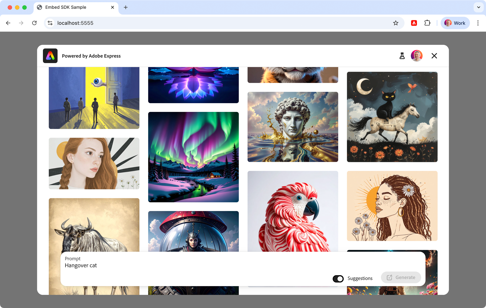
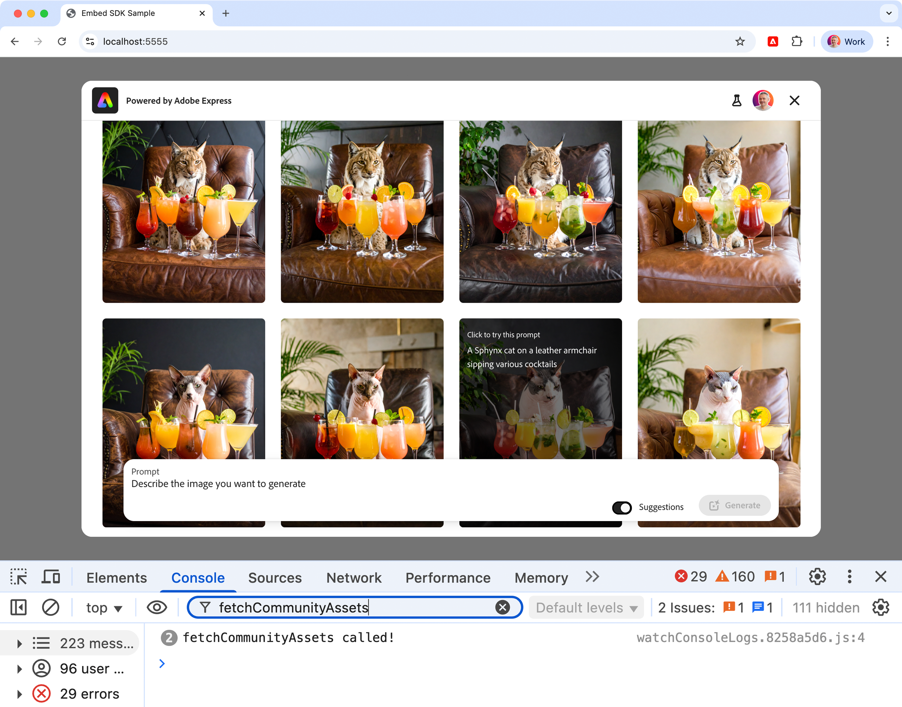

---
keywords:
  - Adobe Express
  - Embed SDK
  - SDK v4
  - CCEverywhere
  - Generate Image
  - Generate Image v2
  - Tutorial
  - Firefly
  - Module workflow
  - Text to image
  - text-to-image
  - Community Wall
  - Custom Community Wall
  - Rich Preview
  - Thumbnail actions
  - onPublish callback
  - onIntentChange callback
  - Intent handling
title: Embed SDK Generate Image tutorial
description: Step-by-step guide for implementing the Generate Image module with Adobe Express Embed SDK
contributors:
  - https://github.com/undavide
---

# Embed SDK Generate Image tutorial

Learn how to implement the Generate Image module using the Adobe Express Embed SDK.

## Introduction

Welcome to this hands-on tutorial! We'll walk you through implementing the powerful Generate Image module of the Adobe Express Embed SDK. By the end, your integration will be able to use all its new V2 features, from the [Community Wall](../concepts/generate-image-v2.md#community-wall) to [Rich Preview](../concepts/generate-image-v2.md#rich-preview) and [Thumbnail actions](../concepts/generate-image-v2.md#thumbnail-actions). As a bonus, we'll implement a [Custom version](../concepts/generate-image-v2.md#custom-community-wall) of the Community Wall, so that you can showcase your own images instead of Firefly's publicly available gallery.

### What you'll learn

By completing this tutorial, you'll gain practical skills in:

- Implementing the **Generate Image module** with the Adobe Express Embed SDK.
- Using several of the **new V2 features** of the Generate Image module.
- Implementing the **Custom Community Wall**.

### What you'll build

You'll build a simple, JavaScript-based web application that allows users to generate images from text prompts using the Generate Image v2 module of the Adobe Express Embed SDK.


## Prerequisites

Before you start, make sure you have:

- An **Adobe account** (use your existing Adobe ID or [create one for free](https://account.adobe.com/))
- **API credentials** from the Adobe Developer Console ([Get credentials](../quickstart/index.md#step-1-get-an-api-key))
- Basic knowledge of **HTML, CSS, and JavaScript**
- **Node.js** installed on your development machine (v20.19.0 or higher)
- A **text editor or IDE** of your choice

## 1. Set up the project

### 1.1 Clone the sample

You can start by cloning the [Embed SDK Generate Image sample](https://github.com/AdobeDocs/embed-sdk-samples/tree/main/code-samples/tutorials/embed-sdk-generate-image) from GitHub and navigating to the project directory.

```bash
git clone https://github.com/AdobeDocs/embed-sdk-samples.git
cd embed-sdk-samples/code-samples/tutorials/embed-sdk-generate-image
```

The project will have a structure like this:

```txt
.
├── package.json             📦 Project configuration
├── vite.config.js           🔧 Build configuration
└── src
    ├── images               📷 Images for the Custom Community Wall
    │   └── ...
    ├── index.html           🌐 UI container
    ├── main.js              💻 Embed SDK logic
    ├── community-wall.js    🖼️ Custom Community Wall logic
    └── style.css            🎨 CSS styles

```

### 1.2 Set up the API key

Locate the `src/.env` file and replace the placeholder string in the `VITE_API_KEY` with your Embed SDK API Key:

```bash
VITE_API_KEY="your-api-key-here!"
```


<InlineAlert variant="info" slots="text1" />

📖 Instructions on how to obtain an API Key can be found on the [Quickstart Guide](../quickstart/index.md#step-1-get-an-api-key). Make sure your API Key is set to allow the `localhost:5555` [domain and port](../quickstart/index.md#edit-the-list-of-allowed-domains).

### 1.3 Install dependencies

Install the dependencies by running the following commands:

```bash
npm install
npm run start
```

The web application will be served at `localhost:5555` on a secure HTTPS connection; HTTPS is always required for any Embed SDK integration. Open your browser and navigate to this address to see it in action.


When clicking the **Generate Image** button, the Adobe Express Generate Image module will launch, showing the [Community Wall](../concepts/generate-image-v2.md#community-wall)—optionally, populated with your own pictures. Users can browse the gallery, select an image, and use its prompt as a starting point for their own generation.



When the users click the Save button, the sample project will handle the file transfer between Adobe Express and the web page hosting it, and the generated image will be displayed in lieu of the placeholder.


<InlineAlert variant="error" slots="header, text1" />

### Error: "Adobe Express is not available"

In case you get a popup when trying to launch the Adobe Express integration with the following message: _"You do not have access to this service. Contact your IT administrator to gain access"_, please check to have entered the correct API Key in the `src/.env` file as described [here](#12-set-up-the-api-key).

## 2. Load the Generate Image v2 module

You can just read the existing code in the sample, but it's always best to **learn by doing!** We suggest following along and typing the code in—even small mistakes can lead to important discoveries.

The [sample project](https://github.com/AdobeDocs/embed-sdk-samples/tree/main/code-samples/tutorials/embed-sdk-generate-image) is a simple web application built with [Vite](https://vitejs.dev/), which takes care of the entire local HTTPS setup and hot reloading.

### 2.1 Import the Embed SDK

In this tutorial, you'll focus on the JavaScript side of things first—the HTML content is not overly important. Open the project the code editor of your choice. In `main.js`, remove everything below the Spectrum `import` statements—you'll rebuild it from scratch.

```javascript
// main.js

// Import theme and typography styles from Spectrum Web Components
import "@spectrum-web-components/styles/typography.css";
import "@spectrum-web-components/theme/express/theme-light.js";
import "@spectrum-web-components/theme/express/scale-medium.js";
import "@spectrum-web-components/theme/sp-theme.js";

// Import Spectrum Web Components
import "@spectrum-web-components/button/sp-button.js";
import "@spectrum-web-components/button-group/sp-button-group.js";
import "@spectrum-web-components/divider/sp-divider.js";
import "./style.css";
```

The imports above allow us to style our web application with [Spectrum Web Components](https://opensource.adobe.com/spectrum-web-components/index.html) and the [Adobe Express theme](https://spectrum.adobe.com/page/theming/). Let's begin working in `main.js` by importing the Embed SDK:

```javascript
// main.js
//... previous imports ...

// Import the Adobe Express Embed SDK
await import("https://cc-embed.adobe.com/sdk/v4/CCEverywhere.js");
console.log("CCEverywhere loaded", window.CCEverywhere);
```


<InlineAlert variant="info" slots="text1" />

There are several ways to import `CCEverywhere.js`: for more information, please refer to the [Quickstart Guide](../quickstart/index.md).

### 2.2 Initialize the Embed SDK

When the Embed SDK is imported, a `CCEverywhere` object is globally available and must be **initialized**. There are two sets of parameters that you can pass as option objects:

- **Host Information**: containing the API key, Application name, etc.
- **Configuration**: optional settings, like locale, delayed sign-in, etc.

```javascript
// main.js
//... previous imports ...

// 👀 Required parameters to initialize the Embed SDK
const hostInfo = {
  clientId: import.meta.env.VITE_API_KEY,
  // The appName must match the Public App Name in the Developer Console
  appName: "Embed SDK Sample",
};

// Optional parameters
const configParams = { /* ... */ };

// Initialize the Adobe Express Embed SDK
// Destructure the `module` property only
const { module } = await window.CCEverywhere.initialize(
  hostInfo,
  configParams
);
```

The [`hostInfo`](../../v4/index.md) object is required: the `clientId` contains your API Key (here, retrieved by Vite from the `.env` file) and the `appName`.


<InlineAlert variant="warning" slots="text1" />

The `appName` must match the `Public App Name` in the Developer Console, and it will be displayed in the Adobe Express UI as a folder where users can store their documents. All [`configParams`](../../reference/initialize/index.md#configparams) are optional.

### 2.3 Load the `module`

The asynchronous [`CCEverywhere.initialize()`](../../v4/sdk/src/3p/cc-everywhere/variables/default.md#initialize) method returns an object with three properties. Here, we destructure the `module` only, because it is the entry point to the [`createImageFromText()`](../../v4/sdk/src/workflows/3p/module-workflow/classes/module-workflow.md#createimagefromtext) method. In the next section, we'll learn how to use it to launch the Generate Image experience.

```javascript
module.createImageFromText({ /* ... */ });
```

## 3. Launch the Generate Image experience

The [`createImageFromText()`](../../v4/sdk/src/workflows/3p/module-workflow/classes/module-workflow.md#createimagefromtext) method expects three optional parameters:

```javascript
// module.createImageFromText() function signature

const appConfig       = { /* ... */ }; // Text to Image experience
const exportConfig    = { /* ... */ }; // Export options
const containerConfig = { /* ... */ }; // SDK container

module.createImageFromText(appConfig, exportConfig, containerConfig);
```

In this tutorial, we'll focus on the [`appConfig`](../../v4/shared/src/types/module/app-config-types/interfaces/text-to-image-app-config.md) object; you can look at the [Full Editor tutorial](full-editor.md) for more details on the other two parameters.

### 3.1 Enable the v2 experience

First, let's enable the v2 experience.

```javascript
// main.js
//... previous code ...

const appConfig = {
  appVersion: "2",
  // ...
};
```

<InlineAlert variant="info" slots="text1" />

You can find a comprehensive list of all the new features of the Generate Image v2 experience in this [Concepts guide](../concepts/generate-image-v2.md).

### 3.2 Toggle selected v2 features

Among all the new features, you'll focus on these:

- [Community Wall](../concepts/generate-image-v2.md#community-wall), the endless gallery of images generated by other users that are displayed when the experience is launched.
- [Rich Preview](../concepts/generate-image-v2.md#rich-preview), a larger preview of the generated image in the thumbnail.
- [Thumbnail actions](../concepts/generate-image-v2.md#thumbnail-actions), a dropdown menu in the thumbnail to allow users to further edit the generated image.
- [Prompt Placeholder](../concepts/generate-image-v2.md#prompt-placeholder), a custom string that can be useful to guide your users with a specific instruction.

```javascript
// main.js
//... previous code ...

const appConfig = {
  appVersion: "2",
  featureConfig: {
    "community-wall": true, // 👈 Enable the Community Wall
  },
  thumbnailOptions: [
    "rich-preview",         // 👈 Enable the Rich Preview
    "edit-dropdown",        // 👈 Enable the Edit dropdown
  ],
  editDropdownOptions: [    // 👇 Set the options for the Edit dropdown
    { option: "add-effects" },
    { option: "remove-background" },
    { option: "apply-adjustment" },
    { option: "insert-object" },
    { option: "remove-object" },
  ],
  promptInputPlaceholder: "Hangover cat", // 👈 input prompt placeholder
};
```


<InlineAlert variant="warning" slots="header, text1" />

### Prompt and Community Wall are mutually exclusive.

In the `appConfig` object, you can pass a `promptText` string property to start generating images right away, as the experience is launched. Please note that adding a prompt will disable the Community Wall—it's either one or the other.

### 3.3 Customize the Styles

It's possible to guide users toward a specific look and feel, by preselecting the Content Type (Photo, Graphic, or Art) and Styles (Movements, Themes, Materials, and so on) in the lefthand panel—via the [`panelSettings`](../../v4/shared/src/types/panel-settings-types/interfaces/panel-settings.md) object, respectively the [`contentType`](../../v4/shared/src/types/panel-settings-types/interfaces/content-type-setting.md) and [`styles`](../../v4/shared/src/types/panel-settings-types/interfaces/style-setting.md) properties.

```javascript
// main.js
//... previous code ...

const appConfig = {
  appVersion: "2",
  // 👇 Set the Content Type and Styles
  panelSettings: {
    contentType: { value: "graphic" },   // 👈 Preselect the dropdown
    styles: {
      value: ["vector_look", "pop_art"], // 👈 Set the Styles
    },
},
  // ... rest of the settings ...
};
```


You can even use images as Style and Composition references, respectively by passing a [`imageStyleReference`](../../v4/shared/src/types/module/app-config-types/interfaces/text-to-image-app-config.md#properties) or [`imageCompositionReference`](../../v4/shared/src/types/module/app-config-types/interfaces/text-to-image-app-config.md#properties) properties of type [`Asset`](../../v4/shared/src/types/asset-types/type-aliases/asset.md) directly to the `appConfig` object.

### 3.4 Prompt moderation

Firefly models have built-in moderation to detect and filter out harmful content. However, you can further enhance the moderation process by passing a [`isPromptSafe`](../../v4/shared/src/types/module/app-config-types/interfaces/text-to-image-app-config.md#properties) property to `appConfig`.

In there, you can implement your own moderation logic, or use a third-party service like [OpenAI's Moderation API](https://platform.openai.com/docs/api-reference/moderations). The asynchronous callback receives a `prompt` string and returns a promise that resolves to a [`PromptSafetyCheckResponse`](../../v4/shared/src/types/module/app-config-types/interfaces/prompt-safety-check-response.md) object.

```javascript
// main.js
//... previous code ...

const appConfig = {
  appVersion: "2",
  // ... rest of the settings ...
  isPromptSafe: async (prompt) => {
    // 👇 Implement your own moderation logic...
    return {
      isSafe: false,
      reason: "Prompt is unsafe",
      category: "NSFW",
      confidence: 0.95,
    };
  },
};
```


### 3.5 Connect your UI to the SDK

Now let's connect the UI in `index.html`, a simple button and an image placeholder, with the Embed SDK logic in `main.js`.

In the UI:

- Use the `generateBtn` button to launch the Generate Image experience.
- Use an `` element to display the generated image when it's ready.

In `main.js`:

- Call the `module.createImageFromText()` method when users click the `generateBtn` button.
- Use a [`callbacks`](../../v4/shared/src/types/callbacks-types/interfaces/callbacks.md) object to handle the experience lifecycle.
  - [`onPublish()`](../../v4/shared/src/types/callbacks-types/type-aliases/publish-callback.md) runs when users publish the generated image. The [`publishParams`](../../v4/shared/src/types/publish-params-types/interfaces/text-to-image-publish-params.md) object contains a `projectId` and an `asset` object with the generated image data, which you'll use to set the `src` attribute of the `` element.
- Use the [`exportConfig`](../../v4/shared/src/types/export-config-types/type-aliases/export-option.md) array to set the export options available to users. Here, you'll add two buttons:
  - `download`: allows users to download the generated image.
  - `save-modified-asset`: saves the generated image and passes it to the `onPublish()` callback.

<CodeBlock slots="heading, code" repeat="2" />

#### main.js

```javascript
// Import theme and typography styles from Spectrum Web Components
import "@spectrum-web-components/styles/typography.css";
import "@spectrum-web-components/theme/express/theme-light.js";
import "@spectrum-web-components/theme/express/scale-medium.js";
import "@spectrum-web-components/theme/sp-theme.js";

// Import Spectrum Web Components
import "@spectrum-web-components/button/sp-button.js";
import "@spectrum-web-components/button-group/sp-button-group.js";
import "@spectrum-web-components/divider/sp-divider.js";
import "./style.css";

// Import the Adobe Express Embed SDK
await import("https://cc-embed.adobe.com/sdk/v4/CCEverywhere.js");
console.log("CCEverywhere loaded", window.CCEverywhere);

// Parameters for initializing the Adobe Express Embed SDK
const hostInfo = {
  clientId: import.meta.env.VITE_API_KEY,
  appName: "Embed SDK Sample",
};

// Initializing the Adobe Express Embed SDK
const { module } = await window.CCEverywhere.initialize(hostInfo, {});

// Will hold the project ID when a document is saved on Adobe Express
var existingProjectId = null;
var expressImage = document.getElementById("savedImage");

// Callbacks to be used when creating or editing a document
const callbacks = {
  onCancel: () => {},
  onPublish: (intent, publishParams) => {
    existingProjectId = publishParams.projectId;
    console.log("Project ID", existingProjectId);
    expressImage.src = publishParams.asset[0].data;
    console.log("Image data", publishParams.asset[0].data);
  },
  onError: (err) => {
    console.error("Error!", err.toString());
  },
};

// Configuration for the app, shared by both Create and Edit flows
const appConfig = {
  appVersion: "2",
  featureConfig: { "community-wall": true },
  thumbnailOptions: ["rich-preview","edit-dropdown"],
  editDropdownOptions: [
    { option: "add-effects" },
    { option: "remove-background" },
    { option: "apply-adjustment" },
    { option: "insert-object" },
    { option: "remove-object" },
  ],
  callbacks,
};

// Configuration for the export options made available to the user
// when creating or editing a document
const exportConfig = [
  {
    id: "download",
    label: "Download",
    action: { target: "download" },
    style: { uiType: "button" },
  },
  {
    id: "save-modified-asset",
    label: "Save image",
    action: { target: "publish" },
    style: { uiType: "button" },
  },
];

// Click handler for the Create Design button
document.getElementById("generateBtn").onclick = async () => {
  module.createImageFromText(appConfig, exportConfig);
};
```

#### index.html

```html
<!doctype html>
<html lang="en">

<head>
  <meta charset="UTF-8" />
  <meta name="viewport" content="width=device-width, initial-scale=1.0" />
  <title>Embed SDK Sample</title>
</head>

<body>
  <sp-theme scale="medium" color="light" system="express">
    <div class="container">
      <header>
        <h1>Adobe Express Embed SDK</h1>
        <sp-divider size="l"></sp-divider>
        <h2>Generate Image Sample</h2>
        <p>
          The <b>Generate Image</b> button generates an image from the current project.
        </p>
      </header>

      <main>
        
        <sp-button-group>
          <sp-button id="generateBtn">Generate Image</sp-button>
        </sp-button-group>
      </main>
    </div>
  </sp-theme>

  <script type="module" src="./main.js"></script>

</body>

</html>
```

### 3.6 Deal with new Intents

When you add the Edit dropdown menu to each generated image (via the `"edit-dropdown"` option in the `thumbnailOptions` array, and selecting specific `editDropdownOptions`), users can further edit the image. Technically, they jump from the Generate Image to the Edit Image experience.


Whenever your users move from one workflow to another, the Embed SDK calls the [`onIntentChange()`](../../v4/shared/src/types/callbacks-types/type-aliases/intent-change-callback.md) callback to let you know about the change. You can use this opportunity to configure the new intent by passing `appConfig`, `exportConfig`, or any other relevant settings. These configurations apply when launching the new intent. If you don't provide them, the SDK uses default settings.

The callback receives two parameters, the `oldIntent` and the `newIntent`, both of type [`ActionIntent`](../../v4/shared/src/types/action-intent-types/index.md). In our specific case, the `oldIntent` will be [`ModuleIntent.CREATE_IMAGE_FROM_TEXT`](../../v4/shared/src/types/action-intent-types/enumerations/module-intent.md) and the `newIntent` will be a [`ModuleIntent.EDIT_IMAGE`](../../v4/shared/src/types/action-intent-types/enumerations/module-intent.md).

```javascript
// main.js
//... previous code ...

const callbacks = {
  onCancel:  ()                          => { /* ... */ },
  onPublish: (intent, publishParams)     => { /* ... */ },
  onError:   (err)                       => { /* ... */ },
  // 👇
  onIntentChange: (oldIntent, newIntent) => {
    console.log("Intent changed from", oldIntent, "to", newIntent);
    return {
      appConfig:       { /* ... */ },
      exportConfig:    [ /* ... */ ],
      containerConfig: { /* ... */ }
    }
  },
};
```


You can use the `onIntentChange()` callback to configure different Export buttons that better suit the new intent. Subscribing to the callback is totally optional.

## 4. Customize the Community Wall

The Community Wall can showcase custom images instead of Firefly's publicly available gallery. This is ideal if your users need to generate specific subjects (say, sports team's crests, logos, etc.), and would appreciate a more relevant starting point.

### 4.1 Enable the Custom Community Wall

To enable the Custom Community Wall, supply a `communityWallConfig` object to `appConfig` when you launch Generate Image v2.

```javascript
const appConfig = {
  appVersion: "2",
  featureConfig: {
    "community-wall": true, // 👈 turn the wall on
  },
  communityWallConfig: {
    // 👇 your own data-loader
    fetchCommunityAssets: myFetchCommunityAssets,
  },
};
```

### 4.2 Provide your own data-loader

The `fetchCommunityAssets` property is just a **callback function you need to implement**, designed to fetch a list of your assets in a _paginated way_.

<InlineAlert variant="info" slots="text1" />

**Pagination** loads data in smaller chunks as users scroll, reducing load times and improving the overall experience. Your backend needs to support this. As users keep scrolling through the Community Wall, the module will repeatedly call `fetchCommunityAssets` to get the next set of images.

The function gets called with `limit` and `cursor` parameters. The `limit` is the number of assets to retrieve at any given time, and the `cursor` keeps track of the batch of assets to fetch next.

The `cursor` defaults to `"Start_Page"` on the first call, and you can send `"Last_Page"` when there are no more custom assets to fetch. At that point, the module will stop asking for more data.

#### The `fetchCommunityAssets` callback signature

```ts
async function myFetchCommunityAssets(
  limit: number,
  cursor: string // "Start_Page" on the first call, "Last_Page" on the last call
): Promise<CommunityWallAssetReponse> {
  /* …fetch and return your data… */
}
```

The `fetchCommunityAssets` asynchronous callback should return a Promise that resolves to a `CommunityWallAssetReponse` object.

```ts
interface CommunityWallAssetReponse {
  assets: CommunityWallAssetData[];
  cursor: string; // The cursor for the next page of assets.
}
```

#### The Asset schema

The `assets` array contains the asset objects to display in the Community Wall.

```ts
interface CommunityWallAssetData {
  assetId: string;          // Asset ID for the community asset
  title: string;            // Prompt for the thumbnail item
  height: number;           // Height of the thumbnail image
  width: number;            // Width of the thumbnail image
  thumbnailSrc: string;     // Source of the thumbnail image (base64 string)
  fullRenditionSrc: string; // Source of the full rendition image
                            // for one-up view (base64 string)
  ownerInfo?: {             // Optional: Information about the owner
    name: string;           // Owner's display name
    imgSrc: string;         // Source URL of the owner's image
  };
}
```

<InlineAlert variant="info" slots="text1" />

The `thumbnailSrc` is the smaller image, used to display in the Community Wall, while the `fullRenditionSrc` is the larger image, used to display in the OneUp view. Both must be **base64 encoded strings**.

For more information about the aspect ratio of the assets, please refer to the [Generate Image v2 Concepts guide](../concepts/generate-image-v2.md#asset-schema).

### 4.3 Implement the `fetchCommunityAssets` callback

Now that you know how to provide assets for the Custom Community Wall, let's implement it in the sample project.

<InlineAlert variant="info" slots="header, text1, text2" />

### Real World implementation

In this tutorial we keep things deliberately simple: the `fetchCommunityAssets` callback runs **entirely in the browser**, reads a tiny `images.json` manifest that lives in your `/src/images` folder, converts each JPEG to Base-64 on the fly, and serves it straight to the Community Wall.

That works great for a demo, but in a production app you would swap that self-contained hack for a thin **HTTP call to your own back-end**. In practice the callback would `fetch('/community-assets?limit=12&cursor=…')`, your API (Node, Python, Go—anything that speaks JSON) would pull the next batch of thumbnails from object storage such as **Amazon S3, Cloudflare R2, Azure Blob,** etc., Base-64-encode them once, and respond with the exact shape the SDK expects. This keeps large image files off the client, lets you paginate efficiently, and opens the door to any business logic you need—all while the callback itself stays a few lines of front-end JavaScript.

Here's the final result of this tutorial's implementation.


In the `src/images` folder, you'll find 24 images of cats enjoying some comfy day-drinking leisure time that have been generated with Adobe Firefly, alongside with an `images.json` file.

```javascripton
// images/images.json
[
  {
    "file": "Firefly_A cat on a leather armchair sipping various cocktails 232431.jpg",
    "prompt": "A cat on a leather armchair sipping various cocktails"
  },
  {
    "file": "Firefly_A cat on a leather armchair sipping various cocktails 349610.jpg",
    "prompt": "A cat on a leather armchair sipping various cocktails"
  },
  ...
]
```

The `file` property is the name of the image file, and the `prompt` is the prompt used to generate it. We'll use this file to fetch the assets for the Custom Community Wall.

We've created a separate `community-wall.js` module to handle everything.

- The `"uuid"` module (the only external dependency) is a handy helper to assign a unique `assetId` to every thumbnail we feed to the Community Wall.
- `fetchImages()`: grabs `images/images.json`, the tiny manifest that pairs each cat photo with the prompt that generated it. The function returns the parsed JSON or throws if the file can’t be reached.
- `fileToBase64()`: fetches an individual image file, converts it to a Base-64 data URL with `FileReader`, and resolves a promise once the conversion is done. This is the heavy-lifting step that turns our static JPGs into strings the Community Wall, can digest.
- We implemented a one-time memory cache to avoid hitting the network twice for the same file.
  - `_cache`: stores `{ prompt, base64 }` pairs so we never hit the network twice for the same file.
  - `_cursor`: remembers how many images we’ve already served to enable simple, stateless pagination.
  - `PAGE_SIZE`: set to `12`, mirroring Firefly’s default number of wall tiles per “page.”
  - `hydrateCache()`: lazily builds the cache on first use. It reads the manifest, converts every file to Base-64, then stashes the result in `_cache`. Subsequent calls return the already-hydrated data immediately.
- `fetchCommunityAssets()` is the core function that the Embed SDK actually invokes.
  - It first ensures the cache is loaded (`hydrateCache`).
  - It resets `_cursor` when it reaches the end so a fresh Embed SDK session can still show the wall (otherwise it will try to load non-existing images).
  - It slices the next `PAGE_SIZE` items out of the cache.
  - It maps each slice entry into the schema the SDK expects, adding a freshly minted `uuidv4()` as `assetId`. Thumbnail dimensions are hard coded for simplicity.
  - It advances `_cursor`, then returns `{ assets, cursor }` where `cursor` is `"Interim_Page"` until we exhaust the list, after which it switches to `"Last_Page"` to tell the SDK there’s nothing more to fetch.
- Generous `console.log` statements are sprinkled throughout to make it easy to trace the pagination flow and verify that assets are loaded and served as expected.

<CodeBlock slots="heading, code" repeat="1"/>

#### community-wall.js

```javascript
import { v4 as uuidv4 } from "uuid";

// Read images/images.json and return its raw data
const fetchImages = async () => {
  const resp = await fetch("images/images.json");
  if (!resp.ok) {
    throw new Error(
      `Could not load images.json - ${resp.status} ${resp.statusText}`
    );
  }
  return resp.json(); // [ {file, prompt}, …]
};

// Convert a single file in /images to a data-URL
const fileToBase64 = async (fileName) => {
  const resp = await fetch(`images/${fileName}`);
  const blob = await resp.blob();

  return new Promise((resolve, reject) => {
    const reader = new FileReader();
    reader.onloadend = () => resolve(reader.result); // "data:image/jpeg;base64,…"
    reader.onerror = reject;
    reader.readAsDataURL(blob);
  });
};

// ------------------------------------------------------------------
// one-time cache (so we only hit the network once)
// ------------------------------------------------------------------
let _cache = null; // [{ prompt, base64 }, …]
let _cursor = 0; // how far we have already served
const PAGE_SIZE = 12; // Firefly’s community wall default

const hydrateCache = async () => {
  if (_cache) return _cache; // already loaded

  const meta = await fetchImages(); // from images.json
  const base64List = await Promise.all(
    meta.map((item) => fileToBase64(item.file))
  );
  _cache = base64List.map((b64, idx) => ({
    prompt: meta[idx].prompt,
    base64: b64,
  }));

  return _cache;
};

/**
 * The very first call returns items 0-11, cursor = 'Interim_Page'
 * The second call returns items 12-23, etc.
 * When the last chunk is served, cursor = 'Last_Page'
 * @returns {Promise<{assets: Array, cursor: 'Interim_Page'|'Last_Page'}>}
 */
export const fetchCommunityAssets = async () => {
  console.log("fetchCommunityAssets called!");

  // Implement your logic here to fetch the assets from the database
  const data = await hydrateCache();
  console.log("data", data);

  // If we have already served all available assets (cursor at or past end),
  // start over so that a fresh Embed SDK session can see the community wall.
  if (_cursor >= data.length) { _cursor = 0 }
  console.log("cursor", _cursor);

  // slice next PAGE_SIZE elements
  const slice = data.slice(_cursor, _cursor + PAGE_SIZE);

  const assets = slice.map((item) => ({
    assetId: uuidv4(),
    title: item.prompt,
    thumbnailSrc: item.base64,     // 👈 for simplicity, we're using the
    fullRenditionSrc: item.base64, //    same image for both high/low res
    width: 467,                    // 👈 hard-coded, or swap with
    height: 600,                   //    real metadata if you like
  }));

  _cursor += slice.length;

  const cursor = _cursor >= data.length ? "Last_Page" : "Interim_Page";

  return { assets, cursor };
};
```

The last thing you need to do is to import the `fetchCommunityAssets` function in your `main.js` file.

```javascript
// main.js

import { fetchCommunityAssets } from "./community-wall.js";

//... rest of the code ...

const appConfig = {
  appVersion: "2",
  featureConfig: { "community-wall": true },
  communityWallConfig: { fetchCommunityAssets }, // 👈 set the function
  //... rest of the appConfig ...
};

//... rest of the main.js ...
```



## Troubleshooting

### Common issues

| Issue                                   | Solution                                                                                                      |
| --------------------------------------- | ------------------------------------------------------------------------------------------------------------- |
| Error: "Adobe Express is not available" | Check to have entered the correct API Key in the `src/.env` file as described [here](#12-set-up-the-api-key). |
| The Community Wall is not showing       | Make sure you've set the `fetchCommunityAssets` function in the `appConfig`                                   |

## Complete working example

<CodeBlock slots="heading, code" repeat="3"/>

#### index.html

```html
<!doctype html>
<html lang="en">

<head>
  <meta charset="UTF-8" />
  <meta name="viewport" content="width=device-width, initial-scale=1.0" />
  <title>Embed SDK Sample</title>
</head>

<body>
  <sp-theme scale="medium" color="light" system="express">
    <div class="container">
      <header>
        <h1>Adobe Express Embed SDK</h1>
        <sp-divider size="l"></sp-divider>
        <h2>Generate Image Sample</h2>
        <p>
          The <b>Generate Image</b> button generates an image from the current project.
        </p>
      </header>

      <main>
        
        <sp-button-group>
          <sp-button id="generateBtn">Generate Image</sp-button>
        </sp-button-group>
      </main>
    </div>
  </sp-theme>

  <script type="module" src="./main.js"></script>

</body>

</html>
```

#### main.js

```javascript
import "./style.css";

// Importing theme and typography styles from Spectrum Web Components
import "@spectrum-web-components/styles/typography.css";
import "@spectrum-web-components/theme/express/theme-light.js";
import "@spectrum-web-components/theme/express/scale-medium.js";
import "@spectrum-web-components/theme/sp-theme.js";

// Importing Spectrum Web Components
import "@spectrum-web-components/button/sp-button.js";
import "@spectrum-web-components/button-group/sp-button-group.js";
import "@spectrum-web-components/divider/sp-divider.js";

import { fetchCommunityAssets } from "./community-wall.js";

// Importing the Adobe Express Embed SDK
await import("https://cc-embed.adobe.com/sdk/v4/CCEverywhere.js");
console.log("CCEverywhere loaded", window.CCEverywhere);

// Parameters for initializing the Adobe Express Embed SDK
const hostInfo = {
  clientId: import.meta.env.VITE_API_KEY,
  appName: "Embed SDK Sample",
};

// Prompts the user to login only when exporting/saving the document
const configParams = {
  loginMode: "delayed",
};

// Initializing the Adobe Express Embed SDK
const { module } = await window.CCEverywhere.initialize(hostInfo, configParams);

// Will hold the project ID when a document is saved on Adobe Express
var existingProjectId = null;
var expressImage = document.getElementById("savedImage");

// Callbacks to be used when creating or editing a document
const callbacks = {
  onCancel: () => {},
  onPublish: (intent, publishParams) => {
    existingProjectId = publishParams.projectId;
    console.log("Project ID", existingProjectId);
    expressImage.src = publishParams.asset[0].data;
    console.log("Image data", publishParams.asset[0].data);
  },
  onError: (err) => {
    console.error("Error!", err.toString());
  },
  // onIntentChange: (oldIntent, newIntent) => {
  //   console.log("Intent changed from", oldIntent, "to", newIntent);
  //   return {
  //     appConfig: {},
  //     exportConfig: [],
  //     containerConfig: {},
  //   };
  // },
};

// Configuration for the app, shared by both Create and Edit flows
const appConfig = {
  appVersion: "2",
  featureConfig: {
    "community-wall": true,
    "fast-mode": false,
    "custom-models": false,
  },
  thumbnailOptions: ["rich-preview", "edit-dropdown"],
  editDropdownOptions: [
    { option: "add-effects" },
    { option: "remove-background" },
    { option: "apply-adjustment" },
    { option: "insert-object" },
    { option: "remove-object" },
  ],
  communityWallConfig: {
    fetchCommunityAssets,
  },
  promptInputPlaceholder: "Hangover cat",
  panelSettings: {
    contentType: { value: "graphic" },
    styles: {
      value: ["vector_look", "pop_art", "divine"],
    },
  },
  // isPromptSafe: async (prompt) => { /* ... */ },
  callbacks,
};

// Configuration for the export options made available to the user
// when creating or editing a document
const exportConfig = [
  {
    id: "download",
    label: "Download",
    action: { target: "download" },
    style: { uiType: "button" },
  },
  {
    id: "save-modified-asset",
    label: "Save image",
    action: { target: "publish" },
    style: { uiType: "button" },
  },
];

// Click handler for the Create Design button
document.getElementById("generateBtn").onclick = async () => {
  module.createImageFromText(appConfig, exportConfig);
};
```

#### community-wall.js

```javascript
import { v4 as uuidv4 } from "uuid";

/** Read images/images.json and return its raw data */
const fetchImages = async () => {
  const resp = await fetch("images/images.json");
  if (!resp.ok) {
    throw new Error(
      `Could not load images.json - ${resp.status} ${resp.statusText}`
    );
  }
  return resp.json(); // [{file, prompt}, …]
};

/** Convert a single file in /images to a data-URL */
const fileToBase64 = async (fileName) => {
  const resp = await fetch(`images/${fileName}`);
  const blob = await resp.blob();

  return new Promise((resolve, reject) => {
    const reader = new FileReader();
    reader.onloadend = () => resolve(reader.result); // “data:image/jpeg;base64,…”
    reader.onerror = reject;
    reader.readAsDataURL(blob);
  });
};

/* ------------------------------------------------------------------
 * one-time cache (so we only hit the network once)
 * ------------------------------------------------------------------ */

let _cache = null; // [{ prompt, base64 }, …]
let _cursor = 0; // how far we have already served
const PAGE_SIZE = 12; // Firefly’s community wall default

const hydrateCache = async () => {
  if (_cache) return _cache; // already loaded

  const meta = await fetchImages(); // images.json
  const base64List = await Promise.all(
    meta.map((item) => fileToBase64(item.file))
  );

  _cache = base64List.map((b64, idx) => ({
    prompt: meta[idx].prompt,
    base64: b64,
  }));

  return _cache;
};

/* ------------------------------------------------------------------
 * public API
 * ------------------------------------------------------------------ */

/**
 * Mimics Adobe Express Community-Wall pagination.
 *
 * @returns {Promise<{assets: Array, cursor: 'Interim_Page'|'Last_Page'}>}
 *
 * The very first call returns items 0-11, cursor = 'Interim_Page'
 * The second call returns items 12-23, etc.
 * When the last chunk is served, cursor = 'Last_Page'
 */
export const fetchCommunityAssets = async () => {
  console.log("fetchCommunityAssets called!");

  // Implement your logic here to fetch the assets from the database
  const data = await hydrateCache();
  console.log("data", data);

  // If we have already served all available assets (cursor at or past end),
  // start over so that a fresh Embed SDK session can see the community wall.
  if (_cursor >= data.length) {
    _cursor = 0;
  }
  console.log("cursor", _cursor);

  // slice next PAGE_SIZE elements
  const slice = data.slice(_cursor, _cursor + PAGE_SIZE);

  const assets = slice.map((item) => ({
    assetId: uuidv4(),
    title: item.prompt,
    thumbnailSrc: item.base64,
    fullRenditionSrc: item.base64,
    width: 467, // hard-coded, or swap for real metadata if you like
    height: 600,
  }));

  _cursor += slice.length;

  const cursor = _cursor >= data.length ? "Last_Page" : "Interim_Page";

  return { assets, cursor };
};
```

## Next steps

Congratulations, you've completed the Generate Image tutorial! You can now explore the [Generate Image v2 Concepts guide](../concepts/generate-image-v2.md) and learn about all its features.

## Need help?

Have questions or running into issues? Join our [Community Forum](https://community.adobe.com/t5/adobe-express-developers/ct-p/ct-adobe-express-developers) to get help and connect with other developers working with the Adobe Express Embed SDK.

## Related resources

- **[API Reference](../../v4/index.md)** - Complete SDK documentation
- **[Adobe Express Embed SDK Overview](../index.md)** - High-level introduction
- **[Demo Application](https://demo.expressembed.com/)** - Interactive demo showcasing SDK capabilities
- **[Sample Applications](https://github.com/AdobeDocs/embed-sdk-samples/tree/main/code-samples/tutorials)** - Working code examples and tutorials
- **[Changelog](../changelog/index.md)** - Latest updates and improvements
