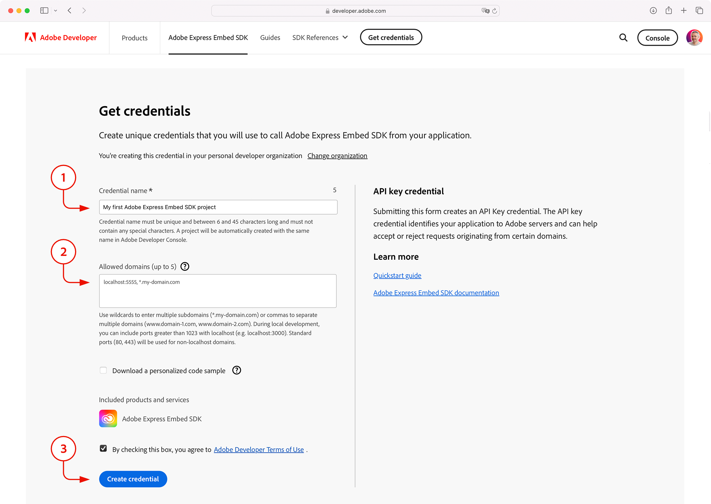
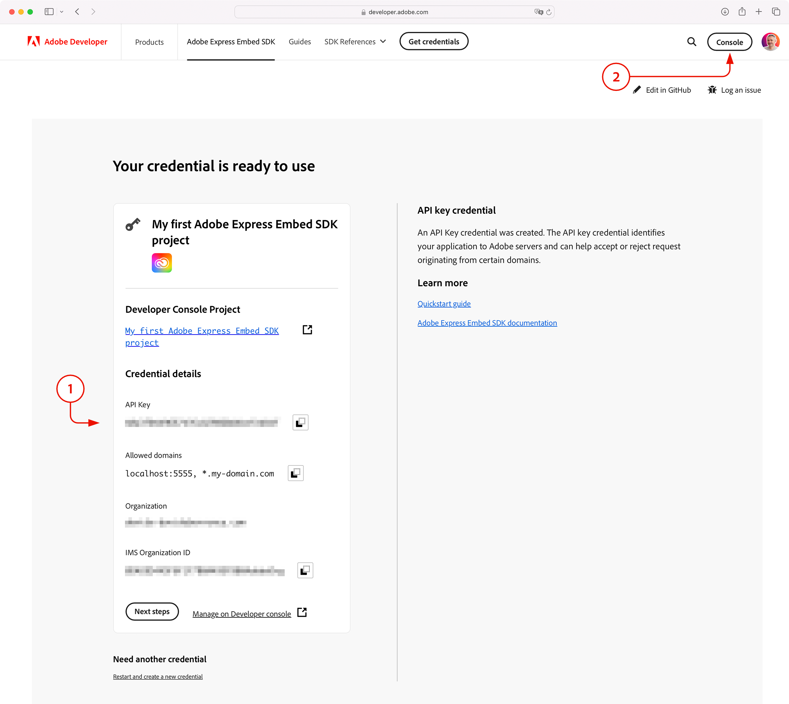

---
keywords:
  - Adobe Express
  - Embed SDK
  - Tutorial
title: Building your first Adobe Express Embed SDK integration
description: A step-by-step guide to setting up and integrating the SDK into your web application.
contributors:
  - https://github.com/undavide
---

# Getting Started with the Adobe Express Embed SDK

A step-by-step guide to setting up and integrating the Embed SDK into your web applications.

<!-- **TODO**: add a video, Hamza-style. -->

## Introduction

Hi developers, and welcome to this tutorial! The Embed SDK is an amazing opportunity for any project, allowing you to **launch Adobe Express directly from your web applications.** This guide will walk you through setting up the credentials and starting to implement the SDK.

### Prerequisites

Before you start, make sure you have the following:

- An **Adobe account**: use your existing Adobe ID or create one for free.
- Familiarity with **HTML, CSS, JavaScript**.
- **Node.js** is installed on your development machine.

## Getting the credentials

The first crucial step is to acquire an **API Key** from the Adobe Developer Console; these credentials are required to authenticate your application with the Adobe Express Embed SDK. The process is discussed in great detail in the [Quickstart](../quickstart/index.md) guide, and we'll summarize it here.

Visit the [Adobe Express Embed SDK](https://developer.adobe.com/express/embed-sdk/) page on the Adobe Developer website, and click the **Get credentials** button.


Log in with your Adobe ID if requested, or create a new account if you don't have one. You'll be then presented this screen:



1. In the **Credential name** field, add a unique title. It will correspond with the project folder created for your end users in Adobe Express, and must match what's later referred to as `appName` in the SDK initialization.
2. We'll test the Embed SDK locally: type `localhost:5555` in the **Allowed domain** field—this is where you would add a list of the domains through which your application is served.

<!-- Warning Alert -->
<InlineAlert variant="warning" slots="text1" />

Please note that **all connections must be secure (HTTPS)** for both production and development environments. The sample project will take care of this for you.

3. Agree to the Terms of Use, and click the **Create credential** button; your API key will be displayed on the screen under the Credential details (see 1 below).



The list of domains can be edited anytime, as well as the project name, clicking the **Console** button in the top-right corner. Please refer to the [Quickstart](../quickstart/index.md#step-1-get-an-api-key) guide for more information.

<InlineAlert variant="info" slots="text1" />

The **API key cannot be modified.** Please keep it safe and away from prying eyes!

## Running the sample project

Now that you have the API key let's set up the sample project to test the Embed SDK locally. Clone the [embed-sdk-getting-started](https://github.com/AdobeDocs/embed-sdk-samples/tree/main/code-samples/tutorials/embed-sdk-getting-started) sample from GitHub and navigate to the project directory. Locate the `.env` file and replace your API Key there:

```bash
VITE_API_KEY="your-api-key-here!"
```

Now, you can install the dependencies and run the sample with the following two simple commands:

```bash
npm install
npm run start
```

The web application will be served at `localhost:5555`; open your browser and navigate to this address to see it in action.


It is just a simple web page with one button: click it, and the Adobe Express logo will whirl its rainbow gradient to signal that the magic is about to happen. And then, voilà!


The **full Adobe Express application** has been integrated! Your users can now create new documents directly from this page and download them locally.

<!-- Info Alert -->
<InlineAlert variant="info" slots="text1, text2" />

Please don't be scared by the red warning toast at the bottom of the screen saying _"The use of this experience powered by Adobe Express has not been approved yet by Adobe"_.

It is just a reminder that the Embed SDK is providing access via your credentials, but you must **submit the integration and request approval** from Adobe before you can go live. Please check the [Submission and Review](../review/) section to learn more.

### Inspecting the code

The [sample project](https://github.com/AdobeDocs/embed-sdk-samples/tree/main/code-samples/tutorials/embed-sdk-getting-started) is a simple web application built with [Vite](https://vitejs.dev/) that takes care of the entire HTTPS setup and hot reloading. The main code is in the `main.js` file, where the SDK is imported and initialized:

```javascript
// Load the Adobe SDK
await import("https://cc-embed.adobe.com/sdk/v4/CCEverywhere.js");
console.log("CCEverywhere loaded", window.CCEverywhere);
```

Please note that the dynamic `import()` requires `await`, to ensure the code is fully loaded before proceeding. Now, the `CCEverywhere` object is available in the global scope: it is the [entry point](/reference/CCEverywhere/) to the SDK and provides all the necessary methods to create the Adobe Express integration.

```javascript
// Host information for the Adobe SDK
const hostInfo = {
  clientId: import.meta.env.VITE_API_KEY,
  appName: "Embed SDK Sample",
};

// Optional configuration parameters (locale, login, etc.)
const configParams = {};
```

You must link your integration with the API Key set up [earlier](#getting-the-credentials) to initialize the SDK properly. The `hostInfo` object holds it in the `clientId` property, while `appName` should match your application name. The `configParams` object is optional and can be used to set additional parameters, such as the locale. You pass those objects to the initialization method:

```javascript
const { editor } = await window.CCEverywhere.initialize(
  hostInfo, configParams
);
```

The [`editor`](/reference/CCEverywhere/editor/) class contains all the APIs we need. In the sample, we use it to spawn the full Adobe Express experience on the button click:

```javascript
document.getElementById("launchExpress").onclick = async () => {
  // Optional document settings (canvas size)
  let docConfig = {};
  // Optional application settings (allowed files, template, etc.)
  let appConfig = {};
  // Optional export settings (label, action type, style, etc.)
  let exportConfig = [];

  editor.create(docConfig, appConfig, exportConfig);
};
```

The `create()` method accepts three options objects, that are optionally used to deal with the document, application, and export settings. We'll cover these in more detail in a future tutorial, but you can check the [API reference](/reference/CCEverywhere/editor.md#create) now for more information.

## Next steps

<!-- Congratulations! You've implemented a **Full Editor integration** with the Adobe Express Embed SDK. You've learned how to create, edit, and let users export documents, as well as how to manage images between Adobe Express and your web application. What's next for you? -->

Congratulations! You have successfully **set up the Adobe Express Embed SDK in your web application**. You've learned how to get the credentials, initialize the SDK, and integrate the full Adobe Express experience into your web page.


What's next for you? Here are a few suggestions:

- Feel free to use this [sample project](https://github.com/AdobeDocs/embed-sdk-samples/tree/main/code-samples/tutorials/embed-sdk-getting-started) as a starting point for your experiments.
- Check out more [tutorials](../tutorials/) to learn about the Embed SDK's many features.
- The Embed SDK offers a **wide range of customization options**; you can explore them in the [API Reference](../../reference/).
- Visit the [changelog](../changelog/) page to keep up with the **latest updates** and improvements.
- Finally, if you get stuck or you just want to **share your experience**, visit the [Adobe Express Embed SDK Community Forum](https://community.adobe.com/t5/adobe-express-embed-sdk/ct-p/ct-express-embed-sdk?page=1&sort=latest_replies&lang=all&tabid=all).
