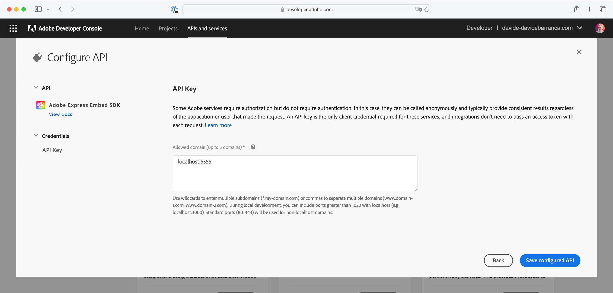
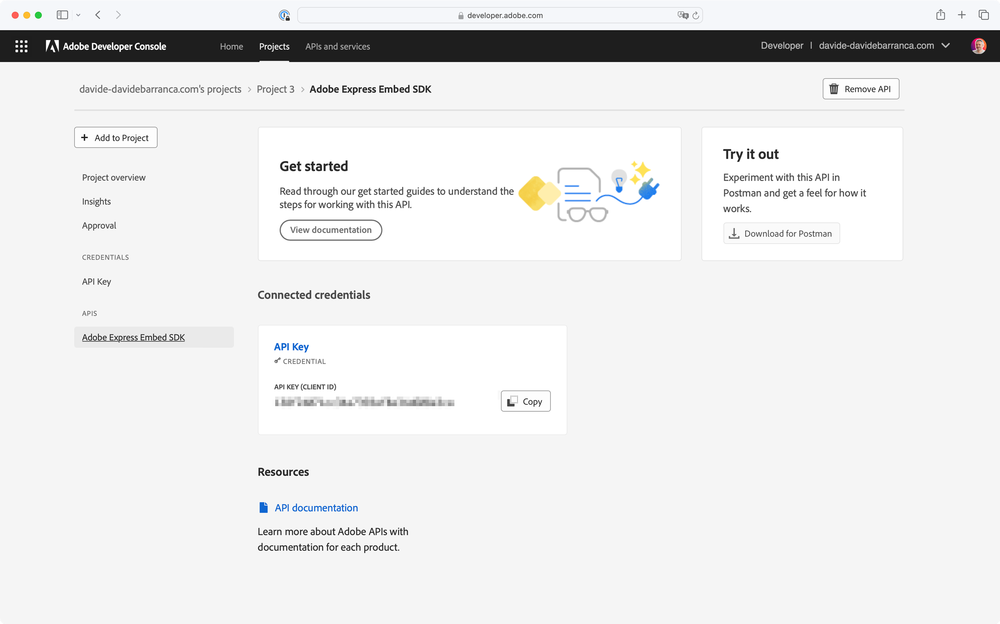

---
keywords:
  - Adobe Express
  - Embed SDK
  - Tutorial
title: Building your first Adobe Express Embed SDK integration
description: A step-by-step guide to setting up and integrating the SDK into your web application.
contributors:
  - https://github.com/undavide
---

# Getting Started with the Adobe Express Embed SDK

A step-by-step guide to setting up and integrating the Embed SDK into your web application.

**TODO**: add a video, Hamza-style.

## Introduction

Hello, and welcome to this tutorial! The Adobe Express Embed SDK is an amazing integration opportunity for any project, allowing you to launch Adobe Express directly from your web applications. This guide will walk you through setting up the credentials and starting to implement the SDK.

### Prerequisites

Before you start, make sure you have the following:

- An Adobe account: use your existing Adobe ID or create one for free.
- Familiarity with HTML, CSS, JavaScript.
- Node.js installed on your development machine.

## Getting the credentials

The first crucial step is to acquire an API key from the Adobe Developer Console; these credentials are required to authenticate your application with the Adobe Express Embed SDK. The process is discussed in great detail in the [Quickstart](../quickstart/index.md) guide, and we'll summarize it here.

Visit the [Adobe Developer Console](https://developer.adobe.com/console). In the **APIs and services** section, find the **Adobe Express Embed SDK** card and click the **Create project** button.


On the **Configure API** section, you must insert up to five domains that will be allowed to use your API key. This security measure prevents the unauthorized use of your client ID on another website by restricting usage to the domains you have authorized.



We'll test the Embed SDK locally: type `localhost:5555` in the "Allowed domain" field—this is where you would add a list of the domains through which your application is served.

<!-- Warning Alert -->
<InlineAlert variant="warning" slots="text1" />

Please note that all connections must be secure (HTTPS) for both production and development environments. The sample project will take care of this for you.

Once you have added all the domains, click **Save configured API**. The API key will be displayed on the screen. Please take note, we'll need it in a minute.



The list of domains can be edited anytime, as well as the project name—refer to the [Quickstart](../quickstart/index.md#step-1-get-an-api-key) guide for more information—although the API key cannot be modified. Please keep it safe and away from prying eyes!

## Running the sample project

Now that you have the API key let's set up the sample project to test the Embed SDK locally. Clone the [embed-sdk-getting-started](#) sample from GitHub and navigate to the project directory. Locate the `.env` file and replace your API Key there:

```bash
VITE_API_KEY="your-api-key-here!"
```

Now, you can install the dependencies and run the sample with the following two simple commands:

```bash
npm install
npm run start
```

The web application will be served at `localhost:5555`; open your browser and navigate to this address to see it in action. 


It is just a simple web page with one button: click it, and the Adobe Express logo will whirl its rainbow gradient to signal that the magic is about to happen. And then, voilà!


The full Adobe Express application has been integrated! Your users can now create new documents directly from this page and download them locally

<!-- Info Alert -->
<InlineAlert variant="info" slots="text1, text2" />

Please note the red warning toast at the bottom of the screen, stating: _"The use of this experience powered by Adobe Express has not been approved yet by Adobe"_. 

The key is the word "yet": this is a reminder that the Embed SDK is providing access via your credentials, but you must submit the integration and request approval from Adobe before you can go live. Please check the [Submission and Review](../review/) section to learn more.

### Inspecting the code

The [sample project](#) is a simple web application built with [Vite](https://vitejs.dev/) that takes care of the entire HTTPS setup and hot reloading. The main code is in the `main.js` file, where the SDK is imported and initialized:

```javascript
// Load the Adobe SDK
await import("https://cc-embed.adobe.com/sdk/v4/CCEverywhere.js");
console.log("CCEverywhere loaded", window.CCEverywhere);
```

Please note that the dynamic `import()` requires `await`, to ensure the code is fully loaded before proceeding. Now, the `CCEverywhere` object is available in the global scope: it is the [entry point](/reference/CCEverywhere/) to the SDK and provides all the necessary methods to create the Adobe Express integration.

```javascript
// Host information for the Adobe SDK
const hostInfo = {
  clientId: import.meta.env.VITE_API_KEY,
  appName: "Embed SDK Sample",
};

// Optional configuration parameters (locale, login, etc.)
const configParams = {};
```

You must link your integration with the API Key set up [earlier](#getting-the-credentials) to initialize the SDK properly. The `hostInfo` object holds it in the `clientId` property, while `appName` should match your application name. The `configParams` object is optional and can be used to set additional parameters, such as the locale. You pass those objects to the initialization method:

```javascript
const { editor } = await window.CCEverywhere.initialize(hostInfo, configParams);
```

The [`editor`](/reference/CCEverywhere/editor/) class contains all the APIs we need. In the sample, we use it to spawn the full Adobe Express experience on the button click:

```javascript
document.getElementById("launchExpress").onclick = async () => {
  // Optional document settings (canvas size)
  let docConfig = {};
  // Optional application settings (allowed files, template, etc.)
  let appConfig = {};
  // Optional export settings (label, action type, style, etc.)
  let exportConfig = [];

  editor.create(docConfig, appConfig, exportConfig);
};
```

The `create()` method accepts three options objects, that are optionally used to deal with the document, application, and export settings. We'll cover these in more detail in a future tutorial, but you can check the [API reference](/reference/CCEverywhere/editor.md#create) now for more information.

## Conclusion

Congratulations! You have successfully set up the Adobe Express Embed SDK in your web application—that was easy, hopefully. There's much more to explore, from the available customizations to how to manage files created by your users in your application. We'll cover that in future tutorials, so stay tuned!


In the meantime, feel free to use the [sample project](#) as a starting point for your experiments. If you have any questions or need help, please don't hesitate to reach out to us on the [Adobe Express Embed SDK forum](https://community.adobe.com/t5/adobe-express-embed-sdk/ct-p/ct-express-embed-sdk?page=1&sort=latest_replies&lang=all&tabid=all).