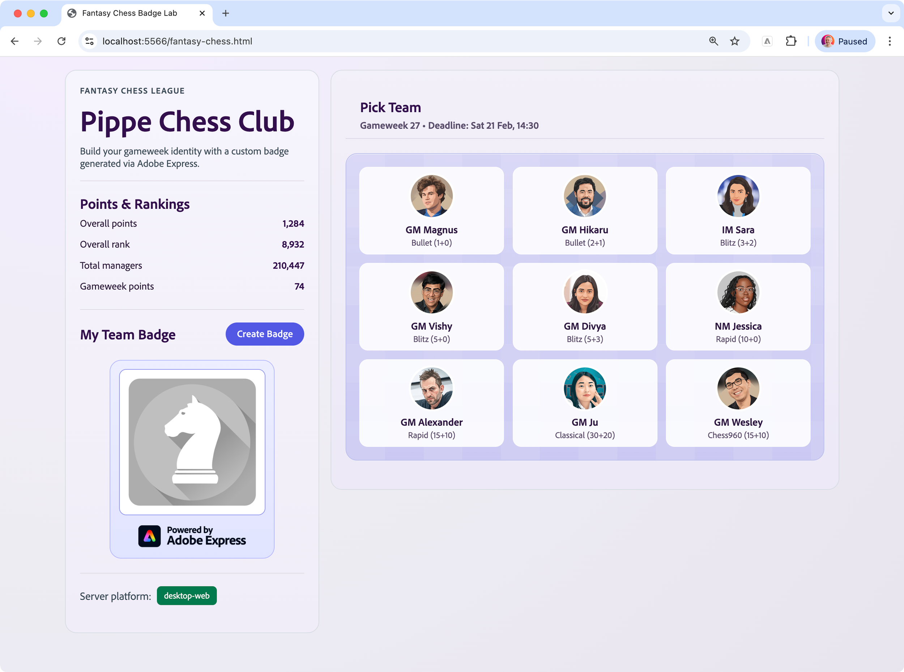
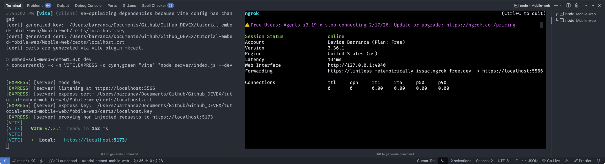
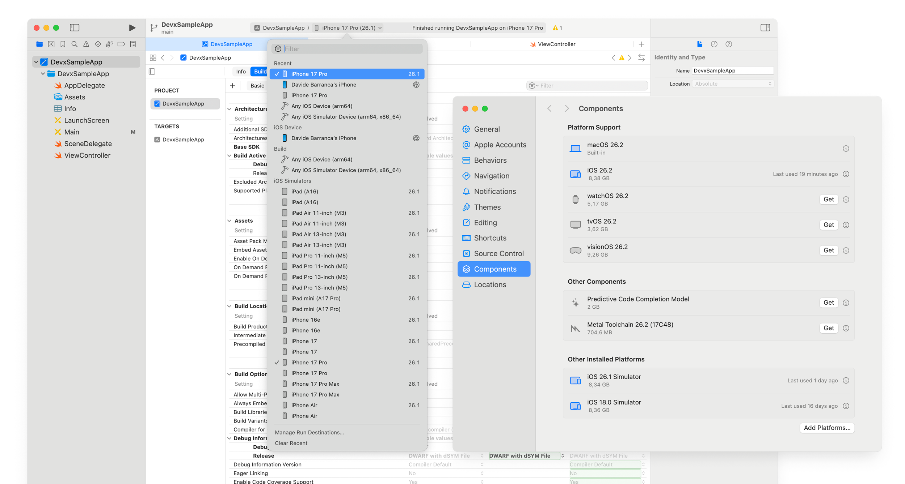
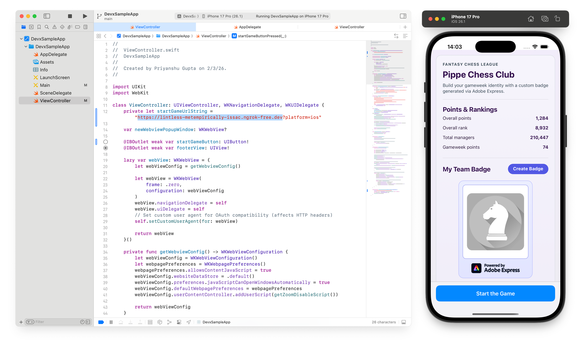
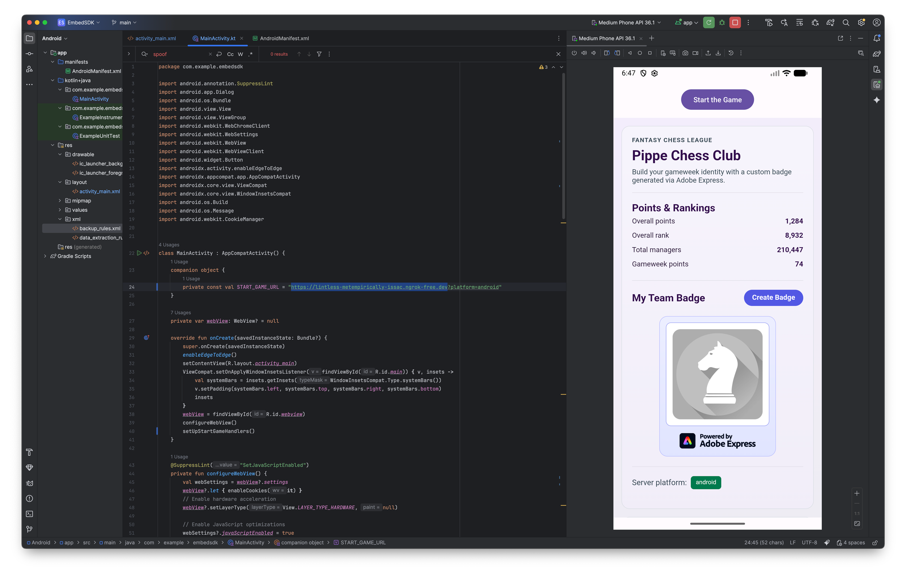

---
keywords:
  - Adobe Express
  - Embed SDK
  - Tutorial
  - CCEverywhere
  - Mobile Web
  - mWeb
  - Android
  - iOS
title: Embed SDK Mobile Web tutorial
description: A step-by-step guide to setting up and integrating the SDK into your web application.
contributors:
  - https://github.com/undavide
---

# Embed SDK Mobile Web tutorial

Learn how to integrate the Adobe Express Embed SDK into Web, Mobile Web and WebView experiences.

## Introduction

Hi, developers! In this tutorial, we'll create a mock Fantasy Game Embed SDK integration that can be served through Desktop and Mobile Web Browsers, as well as iOS and Android applications (through WebViews).

### What you'll learn

By completing this tutorial, you'll gain practical skills in:

- Creating a responsive, **Web-based Embed SDK experience** that follows the Mobile Web best practices.
- Implementing **iOS and Android native applications** that consume the Mobile Web integration.
- Setting up and **configuring the WebViews in both Kotlin and Swift**.

### What you'll build

We'll build a mock **Fantasy Chess Game**, where users can **generate their own team's Badge** and use it in the game. This project includes three main components:

- A **Web-based Embed SDK experience** that can be consumed by Desktop and Mobile Browsers. We'll use [Express.js](https://expressjs.com/) (a minimalist web framework for Node.js) to create and serve the content.
- An **iOS native application** developed in [Swift](https://developer.apple.com/swift/) that loads the Web-based Embed SDK experience into a WebView.
- An **Android native application** developed in [Kotlin](https://kotlinlang.org/) that does the same thing.

You will develop locally on your machine, and run the mobile applications through simulators in Apple Xcode and Android Studio. The table below (reproduced for convenience from the [Mobile Web Overview](./mobile-web-support--overview.md)) shows the available ways to integrate the Embed SDK into multiple surfaces. This tutorial covers **the first three use cases**.

|     | Device          | Integration type | Runtime | Description                                                |
| --- | --------------- | ---------------- | ------- | ---------------------------------------------------------- |
| 1   | 🖥️ **Desktop**  | Web              | Browser | Embed SDK runs in Desktop Browsers.                        |
| 2   | 📱 **Mobile**   | Mobile Web       | Browser | Embed SDK runs in Mobile Browsers.                         |
| 3   | 📱 **Mobile**   | Mobile Web       | WebView | Web experience through iOS/Android Apps (in-app WebViews). |
| ~4~ | ~📱 **Mobile**~ | ~Native~         | ~App~   | ~iOS/Android Apps using Swift/Kotlin Mobile SDKs~          |

### Prerequisites

Before we begin, make sure you have the following:

- An **Adobe account**: use your existing Adobe ID or create one for free.
- **Embed SDK Credentials** from the Adobe Developer Console; see the [Quickstart Guide](../quickstart/index.md) for more information.
- Familiarity with **HTML, CSS, JavaScript, Swift, and Kotlin**.
- **Node.js, Xcode, and Android Studio** are installed on your development machine.

We also recommend reviewing the following resources first:

- **[Mobile Web Overview](./mobile-web-support--overview.md)**: The different ways to implement mobile web support.
- **[Mobile Web in the Browser](./mobile-web-support--browser.md)**: The Mobile Web approach in the Browser.
- **[Mobile Web in a WebView](./mobile-web-support--webview.md)**: The Mobile Web approach in iOS and Android WebViews.

Given the complexity of the project, for the sake of brevity and clarity, we will focus on the parts that are most relevant to the main goal of the tutorial. The complete code is available in the [embed-sdk-mobile-web-tutorial](https://github.com/AdobeDocs/embed-sdk-samples/tree/main/code-samples/tutorials/embed-sdk-mobile-web) repository on GitHub, if you want to check the entire implementation.

## 1. Set up the project

### 1.1 Clone the sample

Clone the [Embed SDK Mobile Web sample](https://github.com/AdobeDocs/embed-sdk-samples/tree/main/code-samples/tutorials/embed-sdk-mobile-web) from GitHub and navigate to the project directory.

```bash
git clone https://github.com/AdobeDocs/embed-sdk-samples.git
cd embed-sdk-samples/code-samples/tutorials/embed-sdk-mobile-web
```

These are the three main directories of the project:

```txt
.
├── Android                      🤖 Android native application
│   └── ...
│
├── iOS                          🍎 iOS native application
│   ├── DevxSampleApp
│   └── DevxSampleApp.xcodeproj
│
└── Mobile-web
    ├── certs                    🔐 Certificate for local HTTPS server
    ├── scripts                  📜 Certificate generation scripts
    ├── server                   🖥️ Express.js server
    ├── src                      📂 Web experience content
    └── ...                      📄 Other files (HTML, Vite + ngrok configs, etc.)
```

### 1.2 Set up the API key

Locate the `Mobile-web/.env` file and replace the placeholder string in the `VITE_API_KEY` with your Embed SDK API Key:

```bash
VITE_API_KEY="your-api-key-here!"
```

<InlineAlert variant="info" slots="text1, text2" />

📖 Instructions on how to obtain an API Key can be found on the [Quickstart Guide](../quickstart/index.md#step-1-get-an-api-key). Make sure your API Key is set to allow the `localhost:5566` [domain and port](../quickstart/index.md#edit-the-list-of-allowed-domains), as well as the `*.ngrok-free.dev` wildcard domain—[read here](#allow-list-ngrok) for more information.

Please note that **the port is set to `5566` instead of the default `5555`** we've been using in other tutorials to avoid conflicts with Android Studio.

### 1.3 Run the Web experience

#### 1.3.1 Install dependencies and run the development server

Install the dependencies in the `Mobile-web` directory and start the development server:

```bash
npm install
npm run gen:cert
npm run dev
```

The `gen:cert` command will generate a self-signed certificate and key pair for the local development server. The `dev` command will start the development server and the web application will be available at **`localhost:5566`** on a secure HTTPS connection (don't use any other port, even if the Vite output mentions it, it's reserved for the development server). Open your browser and navigate to this address to see the Web experience in action.



<InlineAlert variant="error" slots="header, text1" />

#### Error: "Adobe Express is not available"

In case you get a popup when trying to launch the Adobe Express integration with the following message: _"You do not have access to this service. Contact your IT administrator to gain access"_, please check to have entered the **correct API Key** in the `src/.env` file as described [here](#12-set-up-the-api-key).

#### 1.3.2 Tunnel the development server

The development server is now accessible from your local machine. To avoid conflicts with the mobile development environments and properly simulate the experience in Android Studio and Xcode, it's advisable **to tunnel the development server through a public URL**, which the mobile applications will then consume.

For this purpose, we'll use **ngrok**, a tool that builds a secure tunnel to your local server. Visit [their site](https://ngrok.com/) and create an account—the free tier is enough to follow this tutorial. Follow [the instructions](https://ngrok.com/download/mac-os) to install and authenticate the `ngrok` CLI on your machine.

While the local server is running, start a new Terminal instance in the `Mobile-web` root and run the following command:

```bash
npm run ngrok
```

This will start the ngrok tunnel and provide you with a public URL that you can use to access the development server.



**Note down the public URL provided by ngrok** (in the screenshot above, it's `https://lintless-metempirically-issac.ngrok-free.dev`), as you'll need it to configure the mobile applications.

<InlineAlert variant="info" slots="header, text1, text2" />

#### Allow-list ngrok

In the [Allowed domains](../quickstart/index.md#edit-the-list-of-allowed-domains) section of your Project in the Adobe Developer Console, make sure to **allow-list the ngrok public URL** (you can use `*.ngrok-free.dev` as a wildcard). This is necessary to avoid the "Adobe Express is not available" error when trying to launch the Adobe Express integration from the mobile applications. Both the ngrok public URL and the `localhost:5566` domain must be added to the list.

To be clear, `localhost:5566` is the domain of the local development server and it's used to serve the Web experience consumed by the browser locally, while the ngrok public URL is the domain of the ngrok tunnel and it's used to access the development server from the mobile applications. Both need allow-listing for the Adobe Express integration to work during development.

### 1.4 Run the iOS application

Open the `iOS/DevxSampleApp.xcodeproj` project in Xcode; ensure to have selected a virtual device in the simulator with an iOS version that is compatible with this project (anything above iOS 18 should work). From Xcode's menu, select **Settings... > Components** and ensure to have installed an iOS simulator that matches the version of the virtual device you have selected.



In the `ViewController.swift` file (line 146),replace the existing ngrok public URL with the one you noted down earlier. Build and run the project by clicking the ▶️ button in Xcode, or selecting **Product > Run** from the menu. The iOS application should now be able to access the development server, run the iOS simulator and display the Web experience. Click **Start the Game** to see the Adobe Express integration in action.



### 1.5 Run the Android application

Open the `Android` folder as a project in Android Studio. In the `MainActivity.kt` file, replace the existing ngrok public URL with the one you noted down earlier, as you did for the iOS application. Build and run the project by clicking the ▶️ button in Android Studio, or selecting **Run > Run 'app'** from the menu. The Android application should now be able to access the development server, run the Android simulator and display the Web experience. Click **Start the Game** to see the Adobe Express integration in action.



## 2. Build the Web experience

### 2.1 The Server

The Web experience is **served by an HTTPS [Express.js](https://expressjs.com/) server running locally**. It lives in `Mobile-web/server/index.js` and uses the self-signed certificate and key pair generated by `npm run gen:cert` (stored in `Mobile-web/certs`).

#### 2.1.1 Overview

This server does one critical thing: it **resolves the platform and injects it into the HTML as a global**, and only then sends HTML to the Browser or WebView.

This matters because later, when we initialize the Embed SDK, we should pass **platform metadata** (via `metaData: { platform: ... }`) so the SDK can properly attribute and track analytics across surfaces. For that reason, the root URL (which serves `fantasy-chess.html`) relies on the **User-Agent** to decide between `desktop-web` and `mobile-web`, while the iOS and Android apps **hardwire** `?platform=ios` or `?platform=android` when they load the same experience inside their WebViews.

#### 2.1.2 How platform is resolved and injected

For each request to an injected route, the server reads:

- **Query param**: `?platform=...`
- **User-Agent header**: `User-Agent: ...`

Normalization logic is:

- `platform=ios` → `iOS`
- `platform=android` → `android`
- If `platform` is omitted:
  - Mobile User-Agent → `mobile-web`
  - Non-mobile User-Agent → `desktop-web`

After normalization, the server builds an inline script that sets two globals:

- `window.__PLATFORM__ = "<normalized-value>"`
- `window.PLATFORM = window.__PLATFORM__` (compat alias)

Then it **injects that script into the HTML before the first** `<script type="module" ...>` **tag**. This guarantees your client entrypoint (`/src/main.js`) runs only after the platform global already exists.

As a result, **the client does not need to parse the URL or User-Agent itself**. It can safely read the platform from global space and use it to initialize the Embed SDK appropriately for **Desktop Web**, **Mobile Web**, **iOS** (WebView), or **Android** (WebView).

### 2.2 The Client

The client implementation is in `Mobile-web/src/main.js` and `Mobile-web/src/fantasy-chess.html`. Crucially, the platform is **read from the global space**; it's used first to display the platform in the UI via the `<sp-badge>` element.

```js
// main.js
//...
const serverPlatform = String(window.__PLATFORM__ || "desktop-web");
window.PLATFORM = serverPlatform;
platformPill.textContent = serverPlatform; // Used to display the platform in the UI
```

Later, the platform is used to initialize the Embed SDK appropriately, passing it to the `appConfig.metadata.platform` property. This allows proper attribution and tracking of analytics across surfaces.

```js-data-line="10"
await import("https://cc-embed.adobe.com/sdk/v4/CCEverywhere.js");

const hostInfo = {
  clientId: import.meta.env.VITE_API_KEY,
  appName: "Embed SDK mWeb Demo",
};

const appConfig = {
  loginMode: "delayed",
  metaData: { platform: window.PLATFORM }, // Pass the platform to the SDK
};

const initResult = await window.CCEverywhere.initialize(
  hostInfo,
  appConfig,
);
```
