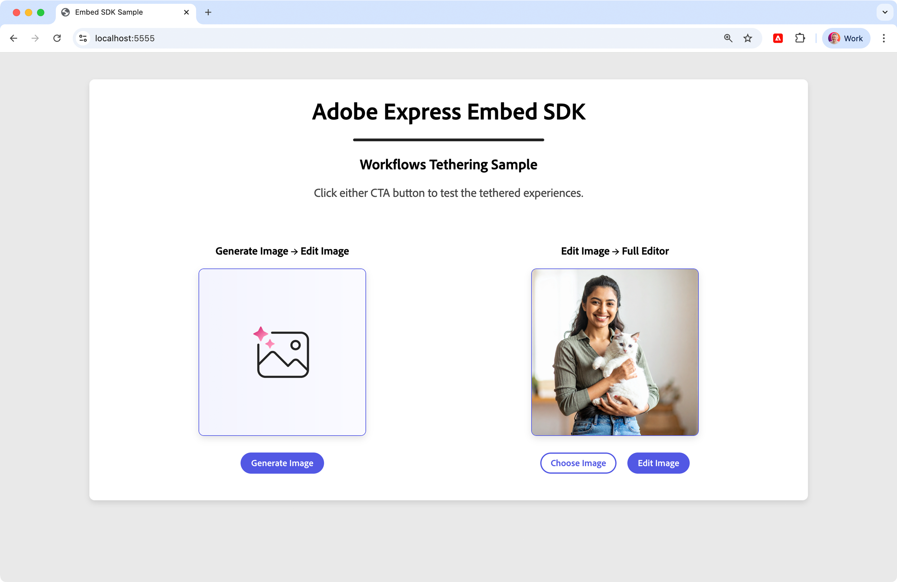
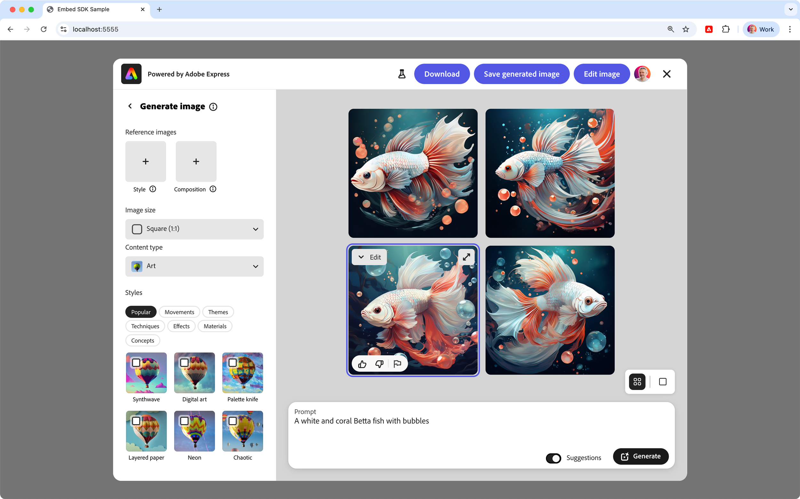
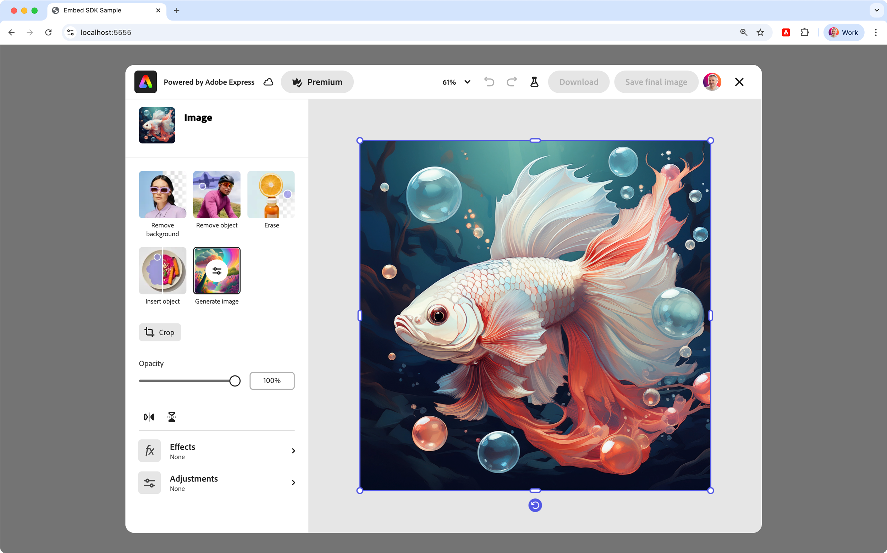
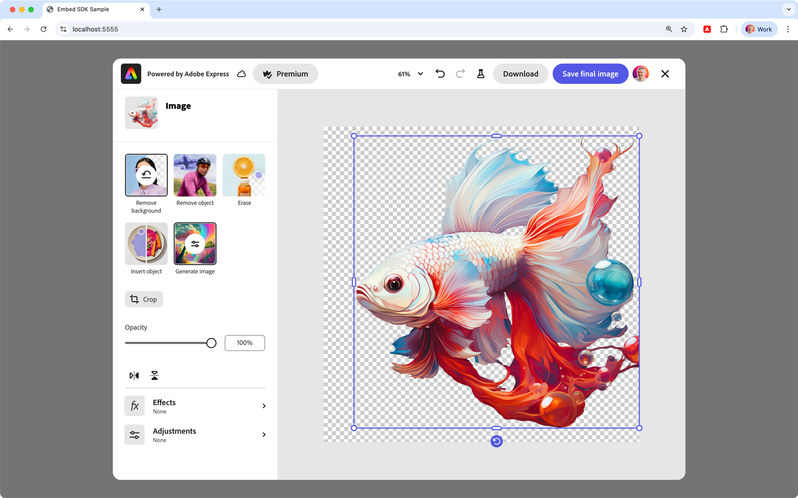
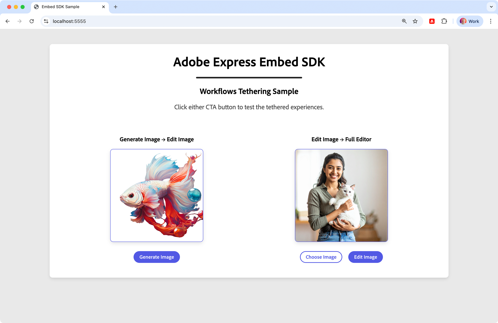
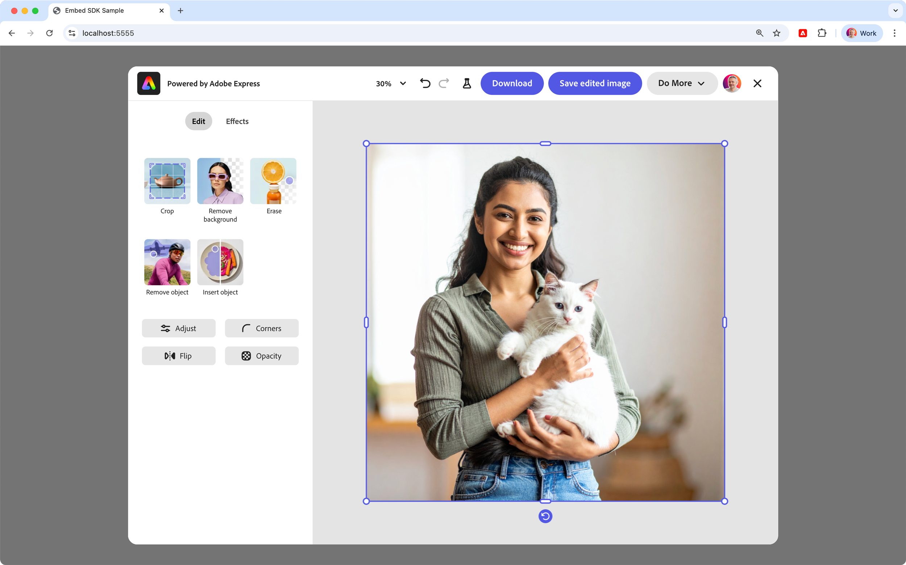
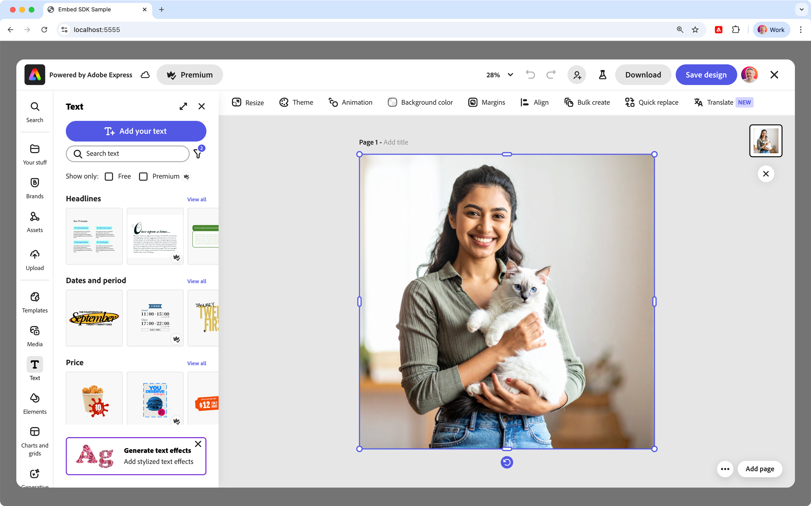
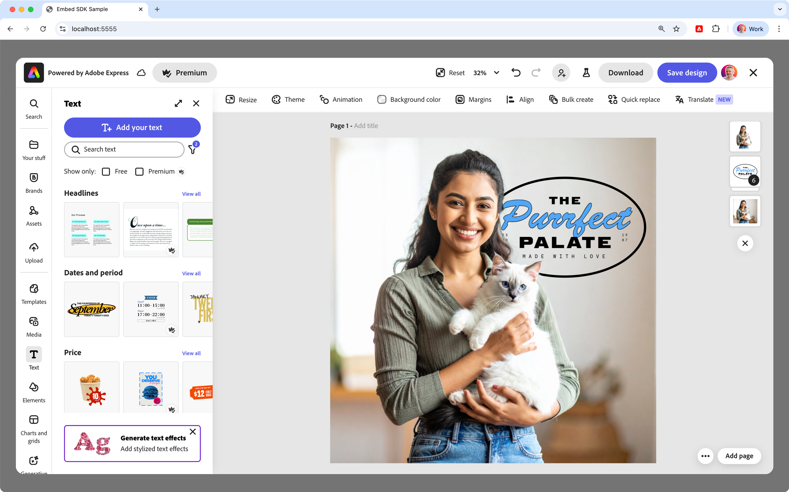
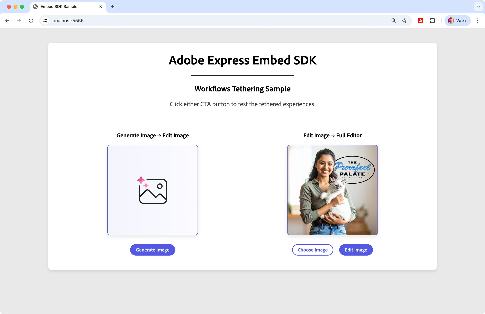
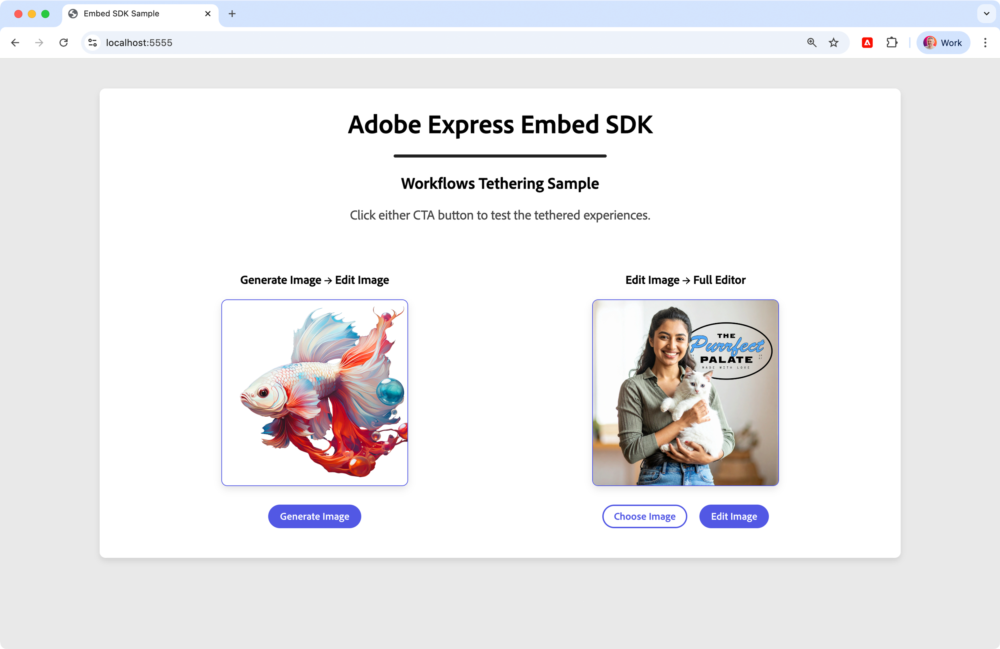

---
keywords:
  - Adobe Express
  - Embed SDK
  - SDK v4
  - CCEverywhere
  - Workflow Tethering
  - Generate Image
  - Edit Image
  - Full Editor
  - Tutorial
  - Advanced
  - Module workflow
  - onPublish callback
  - onIntentChange callback
  - Intent handling
title: Embed SDK Workflow Tethering tutorial
description: Advanced guide for implementing workflow tethering between Generate Image, Edit Image, and Full Editor modules using modular architecture
contributors:
  - https://github.com/undavide
---

# Embed SDK Workflow Tethering tutorial

Learn how to combine multiple modules to create a more complex workflow with the Adobe Express Embed SDK.

## Introduction

Welcome! This advanced hands-on tutorial will walk you through implementing workflow tethering that seamlessly connects the Generate Image, Edit Image, and Full Editor modules.

By the end of this tutorial, you'll have built a complete workflow tethering system where users can generate images, edit them with basic tools, and seamlessly transition to the full Adobe Express editor for advanced editing capabilities.

### What you'll learn

By completing this tutorial, you'll gain practical skills in:

- Implementing **workflow tethering** between multiple Adobe Express modules
- Building a **modular architecture** for complex SDK integrations
- Managing **intent transitions** and **export configurations**
- Creating **reusable workflow components**

### What you'll build

You'll build a web application that demonstrates two key workflow tethering patterns:

1. **Generate Image → Edit Image**: Users generate images and seamlessly transition to basic editing
2. **Edit Image → Full Editor**: Users performing basic edits can access advanced editing capabilities



## Prerequisites

<!-- Inline Alert -->
<InlineAlert variant="warning" slots="text1, text2" />

This is an **advanced tutorial** that builds upon foundational concepts. Before starting, ensure you have read:

- **[Workflow Tethering guide](../concepts/tethering.md)**: Comprehensive guide to understanding workflow tethering.
- **[Edit Image tutorial](./edit-image.md)**: Understanding of Edit Image module implementation.
- **[Generate Image tutorial](./generate-image.md)**: Knowledge of Generate Image module.

Additionally, make sure you have:

- An **Adobe account** and **API credentials** from the Adobe Developer Console
- Basic knowledge of **HTML, CSS, and JavaScript**
- Understanding of [**ES6 modules**](https://developer.mozilla.org/en-US/docs/Web/JavaScript/Guide/Modules) and [**async**](https://developer.mozilla.org/en-US/docs/Web/JavaScript/Reference/Statements/async_function)/[**await**](https://developer.mozilla.org/en-US/docs/Web/JavaScript/Reference/Operators/await) patterns
- **Node.js** installed on your development machine (v20.19.0 or higher)
- A **text editor or IDE** of your choice

## 1. Set up the project

### 1.1 Clone the sample

Clone the [Embed SDK Workflow Tethering sample](https://github.com/AdobeDocs/embed-sdk-samples/tree/main/code-samples/tutorials/embed-sdk-workflow-tethering) from GitHub and navigate to the project directory.

```bash
git clone https://github.com/AdobeDocs/embed-sdk-samples.git
cd embed-sdk-samples/code-samples/tutorials/embed-sdk-workflow-tethering
```

The project features a **modular architecture** with this structure:

```txt
.
├── package.json                📦 Project configuration
├── vite.config.js              🔧 Build configuration
└── src
    ├── main.js                 🎯 Main orchestration
    ├── utils/
    │   └── shared.js           🔧 Common utilities & state management
    ├── config/
    │   ├── exportConfigs.js    📋 All export button configurations
    │   └── appConfigs.js       ⚙️ App configuration factory
    ├── workflows/
    │   ├── generateToEdit.js   🖼️ Generate Image → Edit Image workflow
    │   └── editToFullEditor.js ✨ Edit Image → Full Editor workflow
    ├── index.html              🌐 UI container
    └── style.css               🎨 CSS styles
```

### 1.2 Set up the API key

Locate the `src/.env` file and replace the placeholder string in the `VITE_API_KEY` with your Embed SDK API Key:

```bash
VITE_API_KEY="your-api-key-here!"
```

<!-- Inline Alert -->
<InlineAlert variant="info" slots="text1" />

📖 Instructions on how to obtain an API Key can be found on the [Quickstart Guide](../quickstart/index.md#step-1-get-an-api-key). Make sure your API Key is set to allow the `localhost:5555` [domain and port](../quickstart/index.md#edit-the-list-of-allowed-domains).

### 1.3 Install dependencies and run

Install the dependencies and start the development server:

```bash
npm install
npm run start
```

The web application will be served at `localhost:5555` on a secure HTTPS connection. Open your browser and navigate to this address to see the workflow tethering in action.

<!--  -->

<!-- Inline Alert -->
<InlineAlert variant="error" slots="header, text1" />

Error: "Adobe Express is not available"

In case you get a popup when trying to launch the Adobe Express integration with the following message: _"You do not have access to this service. Contact your IT administrator to gain access"_, please check to have entered the **correct API Key** in the `src/.env` file as described [here](#12-set-up-the-api-key).

## 2. Understanding the modular architecture

Compared to the two previous tutorials, we're going to use a **modular architecture** that separates concerns and makes complex workflow tethering manageable and maintainable.

### 2.1 Architecture overview

We have organized the code into focused modules:

- **`main.js`**: UI event coordination and SDK initialization
- **`utils/shared.js`**: State management and common utilities
- **`config/`**: Configuration objects and export button definitions
- **`workflows/`**: Workflow-specific logic and transition handling

The `main.js` module is the orchestrator of the application.

<CodeBlock slots="heading, code" repeat="1" languages="main.js"/>

#### main.js

```javascript
// 👇 Image management utilities and state
import { cacheDefaultImageBlob, handleFileSelection, setCurrentWorkflow } from "./utils/shared.js";
// 👇 Button configurations for different workflow starts
import { startGenImageExportConfig, startEditImageExportConfig } from "./config/exportConfigs.js";
// 👇 Workflow-specific configurations
import { createGenerateImageAppConfig, createEditImageAppConfig } from "./config/appConfigs.js";
```

It initializes the Adobe Express SDK, sets up UI event listeners (button clicks, file selection), and coordinates workflow launches. All the rest is delegated to the specialized modules.

### 2.2 State management strategy

The `utils/shared.js` module serves as the **single source of truth** for application state:

<CodeBlock slots="heading, code" repeat="1" languages="utils/shared.js"/>

#### utils/shared.js

```javascript
// Global state management
// Tracks which workflow initiated the session
export let currentWorkflow = null;
// Caches the image blob for efficient SDK usage
export let currentImageBlob = null;

export function setCurrentWorkflow(workflow) {
  currentWorkflow = workflow
}

export function resetWorkflow() {
  currentWorkflow = null;
}

export function setCurrentImageBlob(blob) {
  currentImageBlob = blob;
}

// DOM element references
export const generateImage = document.getElementById("image1");
export const expressImage = document.getElementById("image2");

// Cache the default image as a blob for efficient SDK usage
export async function cacheDefaultImageBlob() { /* ... */ }

// Handle file selection from file input
export function handleFileSelection(event) { /* ... */ }

// Base callback configurations used across workflows
export const baseCallbacks = {
  // Reset workflow tracking on cancel
  onCancel: () => { resetWorkflow() },
  onError: (err) => {
    console.error("Error!", err.toString());
  },
};

// Update an image element and cache the blob for future use
export async function updateImageAndCache(
  imageElement,
  imageData,
  updateCache = false
) { /* ... */ }
```

## 3. Export configurations and user journeys

One of the most critical aspects of workflow tethering is providing users with **contextually appropriate export options** at each stage of their journey. These will define the buttons that allow users to either save the image, download it, or continue the experience in the next workflow.

### 3.1 The four export configuration stages

This sample application defines **four distinct export configurations** that correspond to different stages in the user's workflow:

<CodeBlock slots="heading, code" repeat="1" languages="config/exportConfigs.js"/>

#### config/exportConfigs.js

```javascript
// 1. Starting with the Generate Image workflow...
export const startGenImageExportConfig = [
  { id: "download", label: "Download", /* ... */ },
  { id: "save-generated-image", label: "Save generated image", /* ... */ },
  // 👇 Enables transition
  { id: "open-edit-image", label: "Edit image", /* ... */ },
];

// ... and ending with the Edit Image workflow
export const endEditImageExportConfig = [
  { id: "download", label: "Download", /* ... */ },
  { id: "save-final-image", label: "Save final image", /* ... */ },
];

// 2. Starting with the Edit Image workflow...
export const startEditImageExportConfig = [
  { id: "download", label: "Download", /* ... */ },
  { id: "save-edited-image", label: "Save edited image", /* ... */ },
  // 👇 Enables options
  { type: "continue-editing", label: "Do More", /* ... */ },
];

// ... and ending with the Full Editor workflow
export const endFullEditorExportConfig = [
  { id: "download", label: "Download", /* ... */ },
  { id: "save-full-editor-result", label: "Save design", /* ... */ },
];
```

Each configuration is designed for its specific context:

- **Start configurations**: Include transition options ("Edit image" and "Do More" buttons)
- **End configurations**: Focus on completion actions (download, save)

Please note, **each workflow can only define its own export configurations**. In order to define export configurations for the tethered workflow (the next one), you would need to pass the new export configuration via the `onIntentChange` callback—as we'll see in [Section 4.1.2](#412-handling-the-transition).

## 4. Workflow tethering patterns

The application demonstrates **two tethering patterns**, each implemented as a dedicated module. Let's dive into each one in detail.

### 4.1 Generate Image → Edit Image workflow

The `workflows/generateToEdit.js` module handles the transition from the Generate Image to the Edit Image experience.

#### 4.1.1 Initial workflow launch

When users click "Generate Image", the system uses the **full-featured configuration**.



<CodeBlock slots="heading, code" repeat="1" languages="main.js"/>

#### main.js

```javascript
//... other imports...
import { startGenImageExportConfig    } from "./config/exportConfigs.js";
import { createGenerateImageAppConfig } from "./config/appConfigs.js";

//... Import and initialize the SDK...

// Create the Generate Image workflow appConfig using the factory function
const generateImageAppConfig = createGenerateImageAppConfig();

// Click handler for the Generate Image button
document.getElementById("generateBtn").onclick = async () => {

  // Set the current workflow to "generate"
  setCurrentWorkflow("generate");

  module.createImageFromText(
    generateImageAppConfig,    // the appConfig
    startGenImageExportConfig  // the exportConfig
  );
};
```

In `main.js`, the export configuration object `startGenImageExportConfig` is imported from `config/exportConfigs.js`—as we've seen in [Section 3.1](#31-the-four-export-configuration-stages).

The initial application configuration object `generateImageAppConfig` is created with the `createGenerateImageAppConfig()` factory function, imported from `config/appConfigs.js`. This function returns a workflow-specific configuration object for the Generate Image workflow.

<CodeBlock slots="heading, code" repeat="3" languages="config/appConfigs.js, workflows/generateToEdit.js, utils/shared.js"/>

#### config/appConfigs.js

```javascript
import { baseCallbacks } from "../utils/shared.js";
import {
  createGenerateToEditTransition,
  createGenerateImageWorkflowConfig,
} from "../workflows/generateToEdit.js";

// Intent change handler factory
// Manages transitions between different workflow modules
export function createIntentChangeHandler() {
  return (oldIntent, newIntent) => {
    console.log("Intent transition:", oldIntent, "→", newIntent);

    // Generate Image → Edit Image transition
    if (oldIntent === "create-image-from-text") {
      return createGenerateToEditTransition();
    }

    return undefined;
  };
}

// Create the app configuration for Generate Image workflow
export function createGenerateImageAppConfig() {
  const intentChangeHandler = createIntentChangeHandler();
  return createGenerateImageWorkflowConfig(baseCallbacks, intentChangeHandler);
}
```

#### workflows/generateToEdit.js

```javascript
import { endEditImageExportConfig } from "../config/exportConfigs.js";

// ...

export function createGenerateImageWorkflowConfig(
    baseCallbacks, onIntentChangeHandler
  ) {
  return {
    appVersion: "2",
    featureConfig: {
      "community-wall": true,
      "fast-mode": false,
      "custom-models": false,
    },
    thumbnailOptions: ["rich-preview", "edit-dropdown"],
    editDropdownOptions: [
      { option: "add-effects" },
      { option: "remove-background" },
      // ... more options
    ],
    callbacks: {
      ...baseCallbacks,
      onPublish: handleGenerateImagePublish,
      onIntentChange: onIntentChangeHandler,
    },
  };
}
```

#### utils/shared.js

```javascript
export let currentWorkflow = null; // 'generate' or 'edit'
export function resetWorkflow() { currentWorkflow = null }

// ... other shared utilities...

// Base callback configurations used across workflows
export const baseCallbacks = {
  onCancel: () => {
    // Reset workflow tracking on cancel
    resetWorkflow();
  },
  onError: (err) => {
    console.error("Error!", err.toString());
  },
};
```

The `generateImageAppConfig` object creation follows a dependency chain across these multiple files:

- **`config/appConfigs.js`**: the `createGenerateImageAppConfig()` factory function orchestrates the configuration creation:

  - `createIntentChangeHandler()` is executed to create the [`onIntentChange()`](../../v4/shared/src/types/callbacks-types/type-aliases/intent-change-callback.md) handler for workflow transitions. Internally, this function calls `createGenerateToEditTransition()` imported from `workflows/generateToEdit.js`, and returns the export configuration for the Edit Image workflow that is tethered to, i.e., follows after, Generate Image.
  - It passes both the `baseCallbacks` from `utils/shared.js` and the `intentChangeHandler` to `createGenerateImageWorkflowConfig()` from `workflows/generateToEdit.js`, which returns the complete configuration object for the Generate Image workflow.

- **`utils/shared.js`**: Provides the foundational `baseCallbacks` object containing the `onCancel` and `onError` callbacks, shared across all workflows.

- **`workflows/generateToEdit.js`**: The `createGenerateImageWorkflowConfig()` function builds the complete configuration object by:
  - Setting Generate Image-specific properties (`appVersion`, `featureConfig`, `thumbnailOptions`, `editDropdownOptions`).
  - Merging the `baseCallbacks` with workflow-specific callbacks like `onPublish` and `onIntentChange`.
  - The `onIntentChange` callback uses the intent change handler to detect transitions between workflows and pass the appropriate export configuration for the tethered workflow.

#### 4.1.2 Handling the transition

When users click the "Edit image" button in the Generate Image interface to move to the Edit Image experience, the **intent change mechanism** activates



<CodeBlock slots="heading, code" repeat="2" languages="config/appConfigs.js, workflows/generateToEdit.js"/>

#### config/appConfigs.js

```javascript
export function createIntentChangeHandler() {
  return (oldIntent, newIntent) => {
    console.log("Intent transition:", oldIntent, "→", newIntent);

    // Generate Image → Edit Image transition
    if (oldIntent === "create-image-from-text") {  // 👈
      return createGenerateToEditTransition();     // 👈
    }                                              // 👈

    return undefined;
  };
}
```

#### workflows/generateToEdit.js

```javascript
import { endEditImageExportConfig } from "../config/exportConfigs.js";

// Creates the workflow transition configuration for Generate Image → Edit Image
// This is returned by onIntentChange when transitioning to the Edit Image
export function createGenerateToEditTransition() {
  return {
    exportConfig: endEditImageExportConfig, // 👈 Different buttons!
  };
}
```

<InlineAlert variant="info" slots="text1" />

The `createIntentChangeHandler()` function is used to create the [`onIntentChange()`](../../v4/shared/src/types/callbacks-types/type-aliases/intent-change-callback.md) handler for workflow transitions; it returns an object of type [`IntentChangeConfig`](../../v4/shared/src/types/callbacks-types/interfaces/intent-change-config.md), which contains the appropriate `exportConfig` for the Edit Image workflow that follows after Generate Image.

The user is now able to perform Image Editing routines, such as Removing Background, Adding Effects, and more.



#### 4.1.3 State synchronization

The publish callback ensures **proper state management**, and the image is updated with the generated content.



<CodeBlock slots="heading, code" repeat="1" languages="workflows/generateToEdit.js"/>

#### workflows/generateToEdit.js

```javascript
// ...
export async function handleGenerateImagePublish(intent, publishParams) {
  // Update the left image (image1) with generated content
  generateImage.src = publishParams.asset[0].data;
  console.log("Updated generateImage (image1) with generated content");

  // Reset workflow tracking
  resetWorkflow();
}
```

### 4.2 Edit Image → Full Editor workflow

The `workflows/editToFullEditor.js` module manages the transition from the Edit Image to Full Editor Experience.

#### 4.2.1 Initial workflow launch

When users click "Edit Image", the Edit Image workflow starts with a minimal export configuration.



<CodeBlock slots="heading, code" repeat="1" languages="main.js"/>

#### main.js

```javascript
//... other imports...
import { startEditImageExportConfig } from "./config/exportConfigs.js";
import { createEditImageAppConfig   } from "./config/appConfigs.js";

//... Import and initialize the SDK...

// Create the Edit Image workflow appConfig using the factory function
const editImageAppConfig = createEditImageAppConfig();

// Click handler for the Edit Image button
document.getElementById("editBtn").onclick = async () => {
  // Set workflow tracking
  setCurrentWorkflow("edit");

  const docConfig = {
    asset: {
      type: "image",
      name: "Demo Image",
      dataType: "blob",
      data: currentImageBlob, // Use cached blob (default or user-selected)
    },
  };

  module.editImage(docConfig, editImageAppConfig, startEditImageExportConfig);
};
```

Similarly to the Generate Image workflow, the export configuration object `startEditImageExportConfig` is imported from `config/exportConfigs.js`—as we've seen in [Section 3.1](#31-the-four-export-configuration-stages).

<CodeBlock slots="heading, code" repeat="3" languages="config/appConfigs.js, workflows/editToFullEditor.js, utils/shared.js"/>

#### config/appConfigs.js

```javascript
import { baseCallbacks } from "../utils/shared.js";
import {
  createEditToFullEditorTransition,
  createEditImageWorkflowConfig,
} from "../workflows/editToFullEditor.js";

// Intent change handler factory
// Manages transitions between different workflow modules
export function createIntentChangeHandler() {
  return (oldIntent, newIntent) => {
    console.log("Intent transition:", oldIntent, "→", newIntent);

    // Edit Image → Full Editor transition
    if (oldIntent === "edit-image-v2") {
      return createEditToFullEditorTransition();
    }

    return undefined;
  };
}

// Create the app configuration for Edit Image workflow
export function createEditImageAppConfig() {
  const intentChangeHandler = createIntentChangeHandler();
  return createEditImageWorkflowConfig(baseCallbacks, intentChangeHandler);
}
```

#### workflows/editToFullEditor.js

```javascript
import { endEditImageExportConfig } from "../config/exportConfigs.js";

// ...

export function createEditImageWorkflowConfig(
  baseCallbacks,
  onIntentChangeHandler
) {
  return {
    appVersion: "2",
    callbacks: {
      ...baseCallbacks,
      onPublish: handleEditImagePublish,
      onIntentChange: onIntentChangeHandler,
    },
  };
}
```

#### utils/shared.js

```javascript
export let currentWorkflow = null; // 'generate' or 'edit'
export function resetWorkflow() { currentWorkflow = null }

// ... other shared utilities...

// Base callback configurations used across workflows
export const baseCallbacks = {
  onCancel: () => {
    // Reset workflow tracking on cancel
    resetWorkflow();
  },
  onError: (err) => {
    console.error("Error!", err.toString());
  },
};
```

The `editImageAppConfig` object creation follows a dependency chain across these multiple files:

- **`config/appConfigs.js`**: the `createEditImageAppConfig()` factory function orchestrates the configuration creation:

  - `createIntentChangeHandler()` is executed to create the `onIntentChange()` handler for workflow transitions. Internally, this function calls `createEditToFullEditorTransition()` imported from `workflows/editToFullEditor.js`, and returns the export configuration for the Full Editor workflow that is tethered to, i.e., follows after, Edit Image.
  - It passes both the `baseCallbacks` from `utils/shared.js` and the `intentChangeHandler` to `createEditImageWorkflowConfig()` from `workflows/editToFullEditor.js`, which returns the complete configuration object for the Edit Image workflow.

- **`utils/shared.js`**: Provides the foundational `baseCallbacks` object containing the `onCancel` and `onError` callbacks, shared across all workflows.

- **`workflows/editToFullEditor.js`**: The `createEditImageWorkflowConfig()` function builds the complete configuration object by:
  - Setting the Edit Image `appVersion`.
  - Merging the `baseCallbacks` with workflow-specific callbacks like `onPublish` and `onIntentChange`.
  - The `onIntentChange` callback uses the intent change handler to detect transitions between workflows and pass the appropriate export configuration for the tethered workflow.

#### 4.2.2 Handling the transition

When users click the "Do more" button in the Edit Image interface to move to the Full Editor experience, the **intent change mechanism** activates.



<CodeBlock slots="heading, code" repeat="2" languages="config/appConfigs.js, workflows/editToFullEditor.js"/>

#### config/appConfigs.js

```javascript
export function createIntentChangeHandler() {
  return (oldIntent, newIntent) => {
    console.log("Intent transition:", oldIntent, "→", newIntent);

    // Edit Image → Full Editor transition
    if (oldIntent === "edit-image-v2") {          // 👈
      return createEditToFullEditorTransition();  // 👈
    }                                             // 👈

    return undefined;
  };
}
```

#### workflows/editToFullEditor.js

```javascript
import { endFullEditorExportConfig } from "../config/exportConfigs.js";

// Creates the workflow transition configuration for Edit Image → Full Editor
// This is returned by onIntentChange when transitioning to the Full Editor
export function createEditToFullEditorTransition() {
  return {
    appConfig: {
      appVersion: "2",
      callbacks: {
        ...baseCallbacks,
        onPublish: handleFullEditorPublish, // 👈 Different callback!
      },
    },
    exportConfig: endFullEditorExportConfig, // 👈 Full Editor export options
  };
}
```

The user is now able to use the entire set of features available in Adobe Express, such as Adding Text or shapes.



#### 4.2.3 Dual state management

This workflow manages **two different publish scenarios**:

<CodeBlock slots="heading, code" repeat="1" languages="workflows/editToFullEditor.js"/>

#### workflows/editToFullEditor.js

```javascript
// workflows/editToFullEditor.js

// Publish callback for Edit Image workflow
// Updates the edited image and maintains blob cache
export async function handleEditImagePublish(intent, publishParams) {
  console.log("Edit workflow - intent:", intent);
  console.log("Edit workflow - publishParams:", publishParams);

  // Update the right image (image2) with edited content
  await updateImageAndCache(expressImage, publishParams.asset[0].data, true);
  console.log("Updated expressImage (image2) with edited content");

  // Reset workflow tracking
  resetWorkflow();
}

// Publish callback for Full Editor workflow
// Handles the final result from the Full Editor
export async function handleFullEditorPublish(intent, publishParams) {
  console.log("Full editor workflow - intent:", intent);
  console.log("Full editor workflow - publishParams:", publishParams);

  // Save back to image2 (expressImage) - same logic as regular edit workflow
  await updateImageAndCache(expressImage, publishParams.asset[0].data, true);
  console.log("Updated expressImage (image2) with full editor content");
}
```

This ensures that the image is updated with either the content from the Edit Image workflow or the Full Editor workflow.



## 5. End-to-end user journeys

Let's trace through the complete user journeys to understand how all the pieces work together.

### 5.1 Generate Image → Edit Image → Save

- The user selects "Generate Image"

  - `main.js` sets `currentWorkflow = "generate"`
  - SDK launches with `generateImageAppConfig` + `startGenImageExportConfig`

- The user generates image

  - `handleGenerateImagePublish()` updates `generateImage.src`
  - Workflow state resets

- The user selects "Edit image" in the Generate Image experience

  - `onIntentChange()` detects `"create-image-from-text"` as the old intent
  - `createGenerateToEditTransition()` returns `endEditImageExportConfig`
  - SDK transitions to Edit Image with different export buttons

- The user edits and clicks "Save final image"

  - `handleEditImagePublish()` would be called
  - Image updates and workflow completes

<InlineAlert variant="warning" slots="header, text1" />

Tethering to Edit Image v1

Currently, Generate Image transitions only support Edit Image v1. Support for v2 is coming soon. More information about the current limitations can be found in the [Workflow Tethering guide](../concepts/tethering.md#caveats).

### 5.2 Edit Image → Full Editor → Save

- The user selects "Edit Image" (direct entry)

  - `main.js` sets `currentWorkflow = "edit"`
  - SDK launches with `editImageAppConfig` + `startEditImageExportConfig`

- The user selects "Do More" → "Add text" (or other advanced option)

  - `onIntentChange()` detects `"edit-image-v2"` as the old intent
  - `createEditToFullEditorTransition()` returns `endFullEditorExportConfig`
  - SDK launches the Full Editor with different export buttons

- The user performs advanced editing and clicks "Save design"

  - `handleFullEditorPublish()` updates `expressImage.src`
  - `currentImageBlob` cache updates for future edits
  - Workflow completes with advanced editing applied

<!--  -->

## Troubleshooting

### Common issues

| Issue                                   | Solution                                                                                                      |
| --------------------------------------- | ------------------------------------------------------------------------------------------------------------- |
| Error: "Adobe Express is not available" | Check to have entered the correct API Key in the `src/.env` file as described [here](#12-set-up-the-api-key). |

## Complete working example

The complete implementation demonstrates all the concepts covered in this tutorial.

<CodeBlock slots="heading, code" repeat="7" languages="index.html, main.js, utils/shared.js, config/exportConfigs.js, config/appConfigs.js, workflows/generateToEdit.js, workflows/editToFullEditor.js"/>

#### index.html

```html
<!doctype html>
<html lang="en">

<head>
  <meta charset="UTF-8" />
  <meta name="viewport" content="width=device-width, initial-scale=1.0" />
  <title>Embed SDK Sample</title>
</head>

<body>
  <sp-theme scale="medium" color="light" system="express">
    <div class="container">
      <header>
        <h1>Adobe Express Embed SDK</h1>
        <sp-divider size="l"></sp-divider>
        <h2>Workflows Tethering Sample</h2>
        <p>
          Click either CTA button to test the tethered experiences.
        </p>
      </header>

      <main class="two-column-layout">
        <div class="column">
          <h3>Generate Image → Edit Image</h3>
          
          <sp-button-group>
            <sp-button id="generateBtn">Generate Image</sp-button>
          </sp-button-group>
          <input type="file" id="fileInput1" accept="image/*" style="display: none;" />
        </div>
        <div class="column">
          <h3>Edit Image → Full Editor</h3>
          
          <sp-button-group>
            <sp-button id="uploadBtn" treatment="outline">Choose Image</sp-button>
            <sp-button id="editBtn">Edit Image</sp-button>
          </sp-button-group>
          <input type="file" id="fileInput" accept="image/*" style="display: none;" />
        </div>
      </main>
    </div>
  </sp-theme>

  <script type="module" src="./main.js"></script>
</body>
</html>
```

#### main.js

```javascript
// Import theme and typography styles from Spectrum Web Components
import "@spectrum-web-components/styles/typography.css";
import "@spectrum-web-components/theme/express/theme-light.js";
import "@spectrum-web-components/theme/express/scale-medium.js";
import "@spectrum-web-components/theme/sp-theme.js";

// Import Spectrum Web Components
import "@spectrum-web-components/button/sp-button.js";
import "@spectrum-web-components/button-group/sp-button-group.js";
import "@spectrum-web-components/divider/sp-divider.js";
import "./style.css";

// Import our modular components
import {
  cacheDefaultImageBlob,
  handleFileSelection,
  setCurrentWorkflow,
  currentImageBlob,
} from "./utils/shared.js";
import {
  startGenImageExportConfig,
  startEditImageExportConfig,
} from "./config/exportConfigs.js";
import {
  createGenerateImageAppConfig,
  createEditImageAppConfig,
} from "./config/appConfigs.js";

// Import the Adobe Express Embed SDK
await import("https://cc-embed.adobe.com/sdk/v4/CCEverywhere.js");
console.log("CCEverywhere loaded", window.CCEverywhere);

// Parameters for initializing the Adobe Express Embed SDK
const hostInfo = {
  clientId: import.meta.env.VITE_API_KEY,
  appName: "Embed SDK Sample",
};

// Optional parameters - enable delayed login for Generate Image functionality
const configParams = {
  loginMode: "delayed",
};

// Initialize the Adobe Express Embed SDK
const { module } = await window.CCEverywhere.initialize(hostInfo, configParams);

// Initialize the application
await cacheDefaultImageBlob();

// Create workflow configurations
const generateImageAppConfig = createGenerateImageAppConfig();
const editImageAppConfig = createEditImageAppConfig();

// ============================================================================
// UI Event Handlers
// ============================================================================

// Click handler for the Choose Image button
document.getElementById("uploadBtn").onclick = () => {
  document.getElementById("fileInput").click();
};

// Handle file selection
document.getElementById("fileInput").onchange = handleFileSelection;

// Click handler for the Edit Image button
document.getElementById("editBtn").onclick = async () => {
  // Set workflow tracking
  setCurrentWorkflow("edit");

  const docConfig = {
    asset: {
      type: "image",
      name: "Demo Image",
      dataType: "blob",
      data: currentImageBlob, // Use cached blob (default or user-selected)
    },
    // intent: "add-effects", // Optional: specify a particular editing intent
  };

  module.editImage(docConfig, editImageAppConfig, startEditImageExportConfig);
};

// Click handler for the Generate Image button
document.getElementById("generateBtn").onclick = async () => {
  // Set workflow tracking
  setCurrentWorkflow("generate");

  module.createImageFromText(generateImageAppConfig, startGenImageExportConfig);
};
```

#### utils/shared.js

```javascript
// Global state management
export let currentWorkflow = null; // 'generate' or 'edit'
export let currentImageBlob = null;

export function setCurrentWorkflow(workflow) {
  currentWorkflow = workflow;
}

export function resetWorkflow() {
  currentWorkflow = null;
}

export function setCurrentImageBlob(blob) {
  currentImageBlob = blob;
}

// DOM element references
export const generateImage = document.getElementById("image1");
export const expressImage = document.getElementById("image2");

/**
 * Cache the default image as a blob for efficient SDK usage
 */
export async function cacheDefaultImageBlob() {
  const response = await fetch(expressImage.src);
  currentImageBlob = await response.blob();
}

/**
 * Handle file selection from file input
 * @param {Event} event - The file input change event
 */
export function handleFileSelection(event) {
  const file = event.target.files[0];
  if (file && file.type.startsWith("image/")) {
    // Dual data flow: cache the File (which is a Blob) for SDK, convert to data URL for display
    currentImageBlob = file; // File objects are Blobs - perfect for SDK usage

    // Convert to data URL for immediate display in the  element
    const reader = new FileReader();
    reader.onload = (e) => {
      expressImage.src = e.target.result; // Base64 encoded image data
    };
    reader.readAsDataURL(file);
  }
}

/**
 * Base callback configurations used across workflows
 */
export const baseCallbacks = {
  onCancel: () => {
    // Reset workflow tracking on cancel
    resetWorkflow();
  },
  onError: (err) => {
    console.error("Error!", err.toString());
  },
};

/**
 * Update an image element and cache the blob for future use
 * @param {HTMLImageElement} imageElement - The image element to update
 * @param {string} imageData - The image data URL
 * @param {boolean} updateCache - Whether to update the global blob cache
 */
export async function updateImageAndCache(
  imageElement,
  imageData,
  updateCache = false
) {
  imageElement.src = imageData;

  if (updateCache) {
    const response = await fetch(imageData);
    currentImageBlob = await response.blob();
  }
}
```

#### config/exportConfigs.js

```javascript
// When starting Generate Image workflow
export const startGenImageExportConfig = [
  {
    id: "download",
    label: "Download",
    action: { target: "download" },
    style: { uiType: "button" },
  },
  {
    id: "save-generated-image",
    label: "Save generated image",
    action: { target: "publish" },
    style: { uiType: "button" },
  },
  {
    id: "open-edit-image",
    label: "Edit image",
    action: { target: "image-module" },
    style: { uiType: "button" },
  },
];

// When starting Edit Image workflow
export const startEditImageExportConfig = [
  {
    id: "download",
    label: "Download",
    action: { target: "download" },
    style: { uiType: "button" },
  },
  {
    id: "save-edited-image",
    label: "Save edited image",
    action: { target: "publish" },
    style: { uiType: "button" },
  },
  {
    type: "continue-editing",
    label: "Do More",
    style: { uiType: "button", variant: "secondary", treatment: "fill" },
    options: [
      {
        id: "exportOption1",
        style: { uiType: "dropdown" },
        action: { target: "express", intent: "add-text" },
      },
      {
        id: "exportOption2",
        style: { uiType: "dropdown" },
        action: { target: "express", intent: "add-images" },
      },
      {
        id: "exportOption3",
        style: { uiType: "dropdown" },
        action: { target: "express", intent: "add-icons-and-shapes" },
      },
    ],
  },
];

// When ending Edit Image workflow (after basic edits)
export const endEditImageExportConfig = [
  {
    id: "download",
    label: "Download",
    action: { target: "download" },
    style: { uiType: "button" },
  },
  {
    id: "save-final-image",
    label: "Save final image",
    action: { target: "publish" },
    style: { uiType: "button" },
  },
];

// When ending Full Editor workflow (after advanced edits)
export const endFullEditorExportConfig = [
  {
    id: "download",
    label: "Download",
    action: { target: "download" },
    style: { uiType: "button" },
  },
  {
    id: "save-full-editor-result",
    label: "Save design",
    action: { target: "publish" },
    style: { uiType: "button" },
  },
];
```

#### config/appConfigs.js

```javascript
/**
 * App configuration factory
 * Creates workflow-specific app configurations for the Adobe Express Embed SDK
 */

import { baseCallbacks } from "../utils/shared.js";
import {
  createGenerateToEditTransition,
  createGenerateImageWorkflowConfig,
} from "../workflows/generateToEdit.js";
import {
  createEditToFullEditorTransition,
  createEditImageWorkflowConfig,
} from "../workflows/editToFullEditor.js";

/**
 * Intent change handler factory
 * Manages transitions between different workflow modules
 */
export function createIntentChangeHandler() {
  return (oldIntent, newIntent) => {
    console.log("Intent transition:", oldIntent, "→", newIntent);

    // Generate Image → Edit Image transition
    if (oldIntent === "create-image-from-text") {
      return createGenerateToEditTransition();
    }

    // Edit Image → Full Editor transition
    if (oldIntent === "edit-image-v2") {
      return createEditToFullEditorTransition();
    }

    return undefined;
  };
}

/**
 * Create the app configuration for Generate Image workflow
 */
export function createGenerateImageAppConfig() {
  const intentChangeHandler = createIntentChangeHandler();
  return createGenerateImageWorkflowConfig(baseCallbacks, intentChangeHandler);
}

/**
 * Create the app configuration for Edit Image workflow
 */
export function createEditImageAppConfig() {
  const intentChangeHandler = createIntentChangeHandler();
  return createEditImageWorkflowConfig(baseCallbacks, intentChangeHandler);
}
```

#### workflows/generateToEdit.js

```javascript
/**
 * Generate Image to Edit Image Workflow
 * Handles the transition from Generate Image workflow to Edit Image workflow
 */

import { generateImage, resetWorkflow } from "../utils/shared.js";
import { endEditImageExportConfig } from "../config/exportConfigs.js";

/**
 * Publish callback for Generate Image workflow
 * Updates the generated image and resets workflow state
 */
export async function handleGenerateImagePublish(intent, publishParams) {
  console.log("Generate workflow - intent:", intent);
  console.log("Generate workflow - publishParams:", publishParams);

  // Update the left image (image1) with generated content
  generateImage.src = publishParams.asset[0].data;
  console.log("Updated generateImage (image1) with generated content");

  // Reset workflow tracking
  resetWorkflow();
}

/**
 * Creates the workflow transition configuration for Generate Image → Edit Image
 * This is returned by onIntentChange when transitioning from generate to edit
 */
export function createGenerateToEditTransition() {
  return {
    exportConfig: endEditImageExportConfig,
  };
}

/**
 * Complete workflow configuration for Generate Image
 * Includes all features needed for the generate image workflow
 */
export function createGenerateImageWorkflowConfig(
  baseCallbacks,
  onIntentChangeHandler
) {
  return {
    appVersion: "2",
    featureConfig: {
      "community-wall": true,
      "fast-mode": false,
      "custom-models": false,
    },
    thumbnailOptions: ["rich-preview", "edit-dropdown"],
    editDropdownOptions: [
      { option: "add-effects" },
      { option: "remove-background" },
      { option: "apply-adjustment" },
      { option: "insert-object" },
      { option: "remove-object" },
    ],
    callbacks: {
      ...baseCallbacks,
      onPublish: handleGenerateImagePublish,
      onIntentChange: onIntentChangeHandler,
    },
  };
}
```

#### workflows/editToFullEditor.js

```javascript
/**
 * Edit Image to Full Editor Workflow
 * Handles the transition from Edit Image workflow to Full Editor workflow
 */

import {
  expressImage,
  resetWorkflow,
  updateImageAndCache,
  baseCallbacks,
} from "../utils/shared.js";
import { endFullEditorExportConfig } from "../config/exportConfigs.js";

/**
 * Publish callback for Edit Image workflow
 * Updates the edited image and maintains blob cache
 */
export async function handleEditImagePublish(intent, publishParams) {
  console.log("Edit workflow - intent:", intent);
  console.log("Edit workflow - publishParams:", publishParams);

  // Update the right image (image2) with edited content
  await updateImageAndCache(expressImage, publishParams.asset[0].data, true);
  console.log("Updated expressImage (image2) with edited content");

  // Reset workflow tracking
  resetWorkflow();
}

/**
 * Publish callback for Full Editor workflow (nested)
 * Handles the final result from the Full Editor
 */
export async function handleFullEditorPublish(intent, publishParams) {
  console.log("Full editor workflow - intent:", intent);
  console.log("Full editor workflow - publishParams:", publishParams);

  // Save back to image2 (expressImage) - same logic as regular edit workflow
  await updateImageAndCache(expressImage, publishParams.asset[0].data, true);
  console.log("Updated expressImage (image2) with full editor content");
}

/**
 * Creates the workflow transition configuration for Edit Image → Full Editor
 * This is returned by onIntentChange when transitioning from edit to full editor
 */
export function createEditToFullEditorTransition() {
  return {
    appConfig: {
      appVersion: "2",
      callbacks: {
        ...baseCallbacks,
        onPublish: handleFullEditorPublish,
      },
    },
    exportConfig: endFullEditorExportConfig,
  };
}

/**
 * Complete workflow configuration for Edit Image
 * Minimal configuration - just the essentials for editing
 */
export function createEditImageWorkflowConfig(
  baseCallbacks,
  onIntentChangeHandler
) {
  return {
    appVersion: "2",
    callbacks: {
      ...baseCallbacks,
      onPublish: handleEditImagePublish,
      onIntentChange: onIntentChangeHandler,
    },
  };
}
```

## Next steps

Congratulations! You've completed the advanced Workflow Tethering tutorial and built a sophisticated, modular architecture for complex Adobe Express integrations. You can now try to add new workflow transitions using the established patterns.

## Need help?

Need help or have questions? Join our [Community Forum](https://community.adobe.com/t5/adobe-express-developers/ct-p/ct-adobe-express-developers) to get help and connect with other developers working with advanced Adobe Express Embed SDK integrations.

## Related resources

- **[Workflow Tethering guide](../concepts/tethering.md)**: Comprehensive guide to understanding workflow tethering.
- **[Edit Image tutorial](./edit-image.md)**: Foundation for understanding basic image editing workflows.
- **[Generate Image tutorial](./generate-image.md)**: Essential knowledge for image generation workflows.
- **[API Reference](../../v4/index.md)**: Complete SDK documentation
- **[Adobe Express Embed SDK Overview](../index.md)**: High-level introduction
- **[Demo Application](https://demo.expressembed.com/)**: Interactive demo showcasing SDK capabilities
- **[Sample Applications](https://github.com/AdobeDocs/embed-sdk-samples/tree/main/code-samples/tutorials)**: Working code examples and tutorials
- **[Changelog](../changelog/index.md)**: Latest updates and improvements
