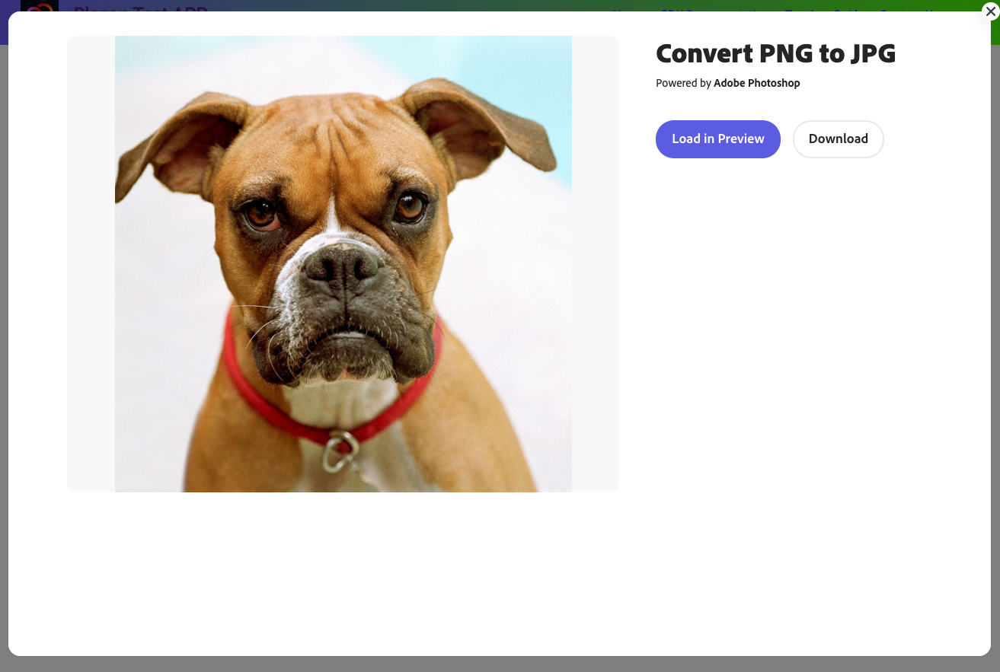

# Quick Actions Reference


## openQuickAction()
This method launches an iframe to perform a Quick Action.

```js
openQuickAction(QuickActionParams) 
```

### QuickActionParams
`openQuickAction()` takes an object `QuickActionParams` with 4 properties. 

| Property | Type | Description
| :-- | :--| :--
| id | [QuickActionId](#quickactionid) | ID for associated Quick Action
| inputParams | [QuickActionInputParams](#quickactioninputparams) | Asset to load (image only), and export button options
| modalParams | [ModalParams](../shared_types/index.md#modalparams) | Specify CCX editor modal dimensions
| outputParams | [CCXOutputParams](../shared_types/index.md#ccxoutputparams) | Specify output type and file type of created project
| callbacks | [Callbacks](../shared_types/index.md#callbacks) | onCancel, onPublish, onError, onLoad, onLoadStart, onPublishStart
Besides **id** and **inputParams.exportOptions**, the rest are optional fields. 


### QuickActionId
Allows you to select a Image or Video Quick Action.

| Quick Action | QuickActionId | Type
| :-- | :-- | :--
| Crop Image | 'image-crop' | Image
| Convert to JPG | 'convert-to-jpg' | Image
| Convert to PNG | 'convert-to-png' | Image
| Resize Image | 'image-resize' | Image
| Remove Background | 'remove-background' | Image
| Change Speed | 'change-speed' | Video
| Convert to GIF | 'convert-to-gif' | Video
| Convert to MP4 | 'convert-to-mp4' | Video
| Crop Video | 'crop-video' | Video
| Merge Video | 'merge-video' | Video
| Resize Video | 'resize-video' | Video
| Reverse Video | 'reverse-video' | Video
| Trim Video | 'trim-video' | Video


### QuickActionInputParams

Allows you to specify the asset and export buttons you want to perform a Quick Action with. 

| Property | Type | Description 
| :-- | :--| :--
| asset | [Asset](#asset) | Image you want to load into QA modal
| exportOptions | [ExportOption](#export-option) | Customize export buttons 

**exportOptions** is required to be defined with at least an empty array.

### Example
```js
ccEverywhere.openQuickAction(
    {
        id: 'image-resize',
        inputParams:{
            exportOptions: []
        }
    }
)
```

## ExportOption
Allows you to define export buttons for a Quick Action. 
Must be specified with at least an empty array. When specified with an empty array, a "Download" button will still be generated for the user once the Quick Action is completed.

| Property | Value | Description
| :-- | :--|:--
| [target](#target) | 'Editor'/'Download' | Determines what type of export 
|variant | 'cta'/'primary'/'secondary' | Defines the [style](https://spectrum.adobe.com/page/button/) of a button
|optionType| 'button' | Determines type of export option 
| buttonType | 'native' | Type of export button (Always 'native')
|[label](#label) string | Overwrite default label name

### target
  * target = 'Editor' - exports asset to a [CCX editor component](../ccx_editor/index.md) for further customization
  * target = 'Download' - downloads asset to user's machine
### label
  * target = 'Editor' => label defaults to "Customize"
  * target = 'Download' => label displays "Download"

### Example
```js
const exportOptions = [
    {
        // Customize in CCX editor
        target: 'Editor',
        variant: 'cta',
        optionType: 'button',
        buttonType: 'native'
    },
    {
        target: 'Download',
        variant: 'primary',
        optionType: 'button',
        buttonType: 'native'
    }
];
```


